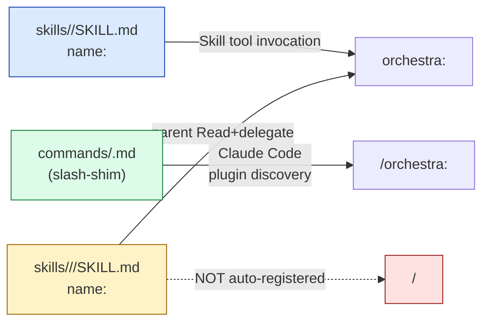

# ADR-002: Orchestra skill naming convention + slash-surface mechanism

> **Doc ID:** ADR-002-skill-naming-convention
> **Date:** 2026-05-12
> **DRI:** Hassan Mohiddin
> **Status:** Approved
> **OKR Alignment:** v2.0.1 onboarding-hotfix — orchestra slash surface must be consistent + collision-safe for consumers on day-1 install.

## Context

Orchestra v1.0 through v2.0.0 shipped 4 user-facing skills (`commit`, `spec-review`, `design-docs`, `init`) without an explicit naming convention. Each skill author picked their own form for the SKILL.md `name:` field. By v2.0.0 the surface had drifted into 3 inconsistent shapes:

1. `name: commit`, `name: spec-review`, `name: design-docs` — bare names. Author intent: rely on Claude Code's plugin auto-namespacing to produce `/orchestra:<name>` slashes.
2. `name: orchestra-init` — hyphen-baked prefix. Author intent: explicit `orchestra-` prefix to avoid `/init` collision with Claude Code's built-in.
3. Sub-skill `skills/design-docs/init/SKILL.md` with `name: design-docs-init` — semantically intended as internal-composition only (parent skill `Read`-and-delegate pattern), but the `name:` field invited interpretation as a user-facing slash.

`commands/spec-review.md` (a `commands/<name>.md` slash-shim file) existed as the only slash-shim in the repo. BUG-013 r1 was filed 2026-05-11 after a user-observed inconsistency in Claude Code's slash autocomplete: `/orchestra:spec-review` surfaced namespaced, but `/commit`, `/design-docs`, and `/orchestra-init` surfaced bare or hyphen-baked.

Through BUG-013 r1-r3 the team's mental model was: "Claude Code auto-namespaces bare skill `name:` fields under the plugin prefix to produce `/orchestra:<name>`". BUG-013 r4 discovery (2026-05-12) corrected this: **the auto-namespace assumption was wrong**. Claude Code's plugin slash autocomplete comes from `commands/<name>.md` shim files only; SKILL.md `name:` field surfaces literally (as a slash for skill invocation, but visible in autocomplete only if no shim exists). This means:

- `/orchestra:spec-review` surfaced namespaced because `commands/spec-review.md` shim existed
- `/commit`, `/design-docs` surfaced bare because no shims existed and `name:` fields were literal bare strings
- `/orchestra-init` surfaced literal-hyphen because no shim AND `name: orchestra-init` was the literal string

Three problems compounded:

1. **Slash-surface inconsistency.** Consumers using orchestra had to learn 4 different slash shapes, which broke autocomplete-driven discovery.
2. **Cross-plugin collision risk.** Bare `/commit` and `/design-docs` are common slash names that other Claude Code plugins (or Claude Code itself) might claim. `/init` is a Claude Code built-in slash for initializing CLAUDE.md — bare `name: init` on the orchestra init skill would collide directly.
3. **Discoverability + documentation drift.** No project-canon source recorded the convention. BUG-013 surfaced the decision in `.claude/CLAUDE.md § Slash command naming convention (HARD RULE)`, but a workflow-rule file is not the recorded-architecture spine — future authors reading only Design Docs or ADRs would not encounter the rule.

v2.0.1 ships the slash-shim fix for the 3 missing slashes (`commands/init.md`, `commands/commit.md`, `commands/design-docs.md`) alongside the BUG-013 closure. This ADR records the convention formally so future skill authors get a single canon-spine anchor.

## Decision

> **Orchestra slash commands surface via `commands/<name>.md` shim files. SKILL.md `name:` fields are bare (no `orchestra-` prefix, no `:` or `/` characters). Sub-skills under `skills/<plugin>/<subskill>/SKILL.md` are NOT auto-registered as separate user-facing slashes; they are decorative documentation invoked by the parent skill via `Read`-and-delegate pattern.**

### Detailed rules

1. **Slash autocomplete surface.** Every user-facing `/orchestra:<name>` slash MUST have a corresponding `commands/<name>.md` shim file at the plugin root. The shim's basename becomes the slash name; Claude Code plugin discovery namespaces it under the plugin automatically (because shims live under the plugin's `commands/` directory).
2. **Skill name field format.** Every `skills/<name>/SKILL.md` frontmatter `name:` MUST be the bare skill name (matching `^[a-z][a-z0-9-]*$`). Forbidden:
   - Plugin prefix in name (e.g., `name: orchestra-init`)
   - Colon or slash in name (e.g., `name: design-docs:init`, `name: design-docs/init`)
   - Mixed case or uppercase
3. **Sub-skill names.** Sub-skills at `skills/<parent>/<subskill>/SKILL.md` use bare names. They are NOT auto-registered as separate `/orchestra:<subskill>` slashes (verified empirically — Claude Code's plugin discovery is one-level deep). Parent skills invoke sub-skills by reading the sub-skill SKILL.md and delegating per body.
4. **Mechanical enforcement.** `cli.lint --skill-names` (planned for v2.0.1+) walks `skills/**/SKILL.md`, parses each frontmatter, and fails on any violation of rules 2-3. Wired into the `--pre-commit` hook.
5. **Discipline backstop.** Skill authors invoking spec-review on new SKILL.md files must verify against this ADR + `.claude/CLAUDE.md § Slash command naming convention (HARD RULE)`.

### Adding a new orchestra skill (procedure)

1. Create `skills/<name>/SKILL.md` with bare `name: <name>` in frontmatter.
2. Create `commands/<name>.md` shim with `description:` frontmatter + body that invokes the skill (mirror `commands/spec-review.md`).
3. Run `cli.lint --skill-names` to verify naming compliance.
4. Reload plugin (`/reload-plugins`); verify slash `/orchestra:<name>` appears in autocomplete.

## Consequences

### Positive

- Single canon-spine anchor for the naming convention. Future skill authors find ADR-002 in `docs/adr/DECISIONS.md` index.
- Consumers see consistent `/orchestra:<name>` slash autocomplete across all skills (no more bare `/commit` collision with other plugins, no more `/orchestra-init` hyphen anomaly, no `/init` collision with Claude Code built-in).
- Sub-skill composition pattern (Read+delegate) is explicit; future agents won't reinvent the wheel.
- `cli.lint --skill-names` mechanical enforcement catches drift at commit time. Discipline-only enforcement was the BUG-013 r2 adversarial Critical that this decision addresses.

### Negative

- Every new orchestra skill requires TWO files: SKILL.md + commands shim. Slightly heavier than single-file-per-skill.
- Pre-existing skills not following the convention require migration. v2.0.0 ship had 1 skill (`init`) with `name: orchestra-init` + 1 sub-skill (`design-docs/init`) with `name: design-docs-init`. Both renamed at v2.0.1 (commit `1bbc0d0`).
- Claude Code's plugin discovery behavior is an undocumented host-runtime detail. If a future Claude Code version adds recursive sub-skill discovery, the "one-level-deep" invariant breaks and sub-skills auto-register. **Mitigation:** monitor Claude Code release notes; rename sub-skills to a defensive form (e.g., `name: init-internal`) if recursive discovery lands. See BUG-013 r3 §Risks #2 for the watchpoint.

### Neutral / commitments

- Orchestra owns the convention. Future ADRs supersede this one only via explicit `Supersedes:` reference + Status: Superseded on this doc.
- `commands/<name>.md` shim file format follows `commands/spec-review.md` template: frontmatter with `description:` (+ optional `arguments:` for parameterized shims) + body that explains what the skill does + invokes via `Invoke skill orchestra:<name>`.

## Alternatives Briefly Rejected

### Alternative 1: Single-file skills (no commands/ shims)

Use SKILL.md `name:` field as the sole slash source, relying on Claude Code to auto-namespace. **Rejected** because:
- Empirical observation in BUG-013 r4 confirmed Claude Code does NOT auto-namespace; bare `name:` surfaces literally as bare slash, colliding with other plugins / Claude Code built-ins.
- v1.x history showed inconsistent skill author choices; mechanism-by-convention failed to enforce uniformity.

### Alternative 2: Hyphen-baked names (`name: orchestra-<x>`)

Keep the `name: orchestra-init` shape and require all skills to do the same. **Rejected** because:
- Cosmetic; surfaces as `/orchestra-init` (hyphen) in autocomplete, not `/orchestra:init` (colon) — inconsistent with `commands/spec-review.md` shim's `/orchestra:spec-review` form.
- Cross-plugin collision risk: if another plugin uses bare `orchestra-` prefix, the hyphen-baked form is no defense.

### Alternative 3: Make sub-skills user-facing slashes

Allow `skills/<parent>/<subskill>/SKILL.md` to surface as `/orchestra:<parent>-<subskill>` or `/orchestra:<parent>:<subskill>` slashes. **Rejected** because:
- Leaks internal composition (sub-skill is an implementation detail of the parent skill flow).
- Increases the slash surface area without clear consumer value — users don't typically need to invoke `design-docs:init` directly; they invoke `design-docs`, which auto-routes through `init` on first-time detection.
- The one-level-deep discovery invariant of Claude Code's current plugin loader makes this non-trivial to implement uniformly.

## Related Documents

- `docs/bugs/BUG-013-slash-command-naming-inconsistency.md` — the BUG that surfaced the convention need (r1 2026-05-11; closed Fix Applied 2026-05-12 in v2.0.1 ship)
- `.claude/CLAUDE.md § Slash command naming convention (HARD RULE)` — workflow-layer codification (lines 111-124); this ADR is the canon-spine anchor it points to
- `commands/spec-review.md` — first slash-shim file in the repo; reference template for new shims
- `commands/init.md`, `commands/commit.md`, `commands/design-docs.md` — slash-shim files added at v2.0.1 (commit `039943a`) to close BUG-013
- `skills/init/SKILL.md`, `skills/design-docs/init/SKILL.md` — files renamed at v2.0.1 (commit `1bbc0d0`) to bare `name: init`
- `docs/design/controlled-vocabulary.md` — controlled vocabulary canon (does NOT currently include §skill_name_grammar; this ADR records the grammar independently)

## Changelog

| Date | Change |
|---|---|
| 2026-05-12 | ADR filed Status: Approved. Captures decision retroactively (decision already shipped in v2.0.1 ship 2026-05-12). Promotes BUG-013 fix from CLAUDE.md HARD RULE convention to canon-spine anchor. `cli.lint --skill-names` mechanical enforcement check tracked separately (v2.0.2+). |
