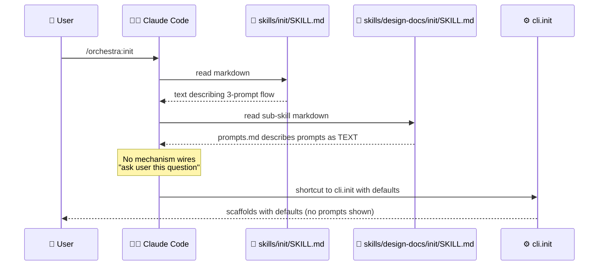

# BUG-001: orchestra:init 3-prompt flow is markdown-only, not actually interactive

> **Doc ID:** BUG-001-init-flow-not-interactive
> **Date:** 2026-05-06
> **DRI:** Hassan Mohiddin
> **Severity:** Critical
> **Status:** Investigating

## Observed Behavior

When user invokes `/orchestra:init`, Claude reads `skills/init/SKILL.md` and `skills/design-docs/init/SKILL.md` + `prompts.md`. The skill markdown describes a 3-prompt flow (Q1 mode / Q2 doc-types / Q3 add-ons) with example text. **No actual interactive prompts fire.**

Claude improvises based on the markdown — sometimes asks user, sometimes shortcuts to `cli.init` with hardcoded defaults (as happened in SCALE init session 2026-05-06 — Claude called `run_init(mode="solo", preset="default-7", addons=True)` directly without prompting).

## Expected Behavior

User invokes `/orchestra:init` → 3 questions appear in chat → user answers → init runs with user's choices.

Per LLD-001 success criterion line 27: "Fresh repo + `/plugin install orchestra@orchestra` + first design-doc request → auto-prompt fires, init runs, doc written to correct path with no manual scaffolding". The "auto-prompt fires" is implicit user-facing prompts.

## Steps to Reproduce

1. Install orchestra v1.3.0 (user scope)
2. In a fresh repo (no `.claude/orchestra.json`): `/orchestra:init`
3. Observe: Claude does NOT ask 3 questions. Either auto-runs with defaults OR asks ad-hoc questions inconsistent with prompts.md

## Environment

- orchestra v1.1.0 — v1.3.0
- Claude Code v2.x
- All platforms

## Root Cause Analysis

**Root cause:** Skills are markdown documentation files. Claude Code's skill system loads markdown into context but provides NO native interactive-prompt API. The `prompts.md` text describes prompts but no code triggers them. Claude reads the description and decides ad-hoc whether to prompt or shortcut.

This is a **missing-feature bug**, not a defect — the 3-prompt flow was specified but never implemented because the underlying mechanism doesn't exist in Claude Code's skill API.

## Fix Description

Two viable paths:

**Path A: Skill-side imperative prompting.** Update `skills/design-docs/init/SKILL.md` to explicitly instruct Claude: "When this skill is invoked, you MUST ask the user these 3 questions verbatim, one at a time, waiting for each answer before proceeding. Do NOT shortcut. Do NOT auto-fill defaults." This relies on Claude's adherence to skill instructions.

**Path B: CLI interactive mode.** Add `python -m cli.init --interactive` (or invoked by skill via Bash) that uses Python `input()` to prompt. Skill markdown points users at this CLI for the canonical flow. Programmatic non-interactive mode (`--mode solo --preset default-7 --addons yes`) preserved for CI.

**Recommendation: Path B.** Imperative skill instructions are unreliable across Claude versions. CLI prompting is deterministic + testable.

Files to change:
- `cli/init.py` — add `def run_init_interactive(repo_root: Path) -> ScaffoldResult` calling `input()` for the 3 prompts + invariant validation per LLD-001 line 247-280
- `skills/design-docs/init/SKILL.md` — replace the markdown 3-prompt text with: "Run `python -m cli.init --interactive` and pass the user's answers"
- `skills/init/SKILL.md` — same instruction pattern
- `tests/test_cli_init.py` — new test file using monkeypatch on `input()` to verify the flow
- `eval/scenarios/orchestra-fresh-init.json` — extend to verify interactive path

## Iteration Log

| Date | Hypothesis | Change | Result |
|---|---|---|---|
| 2026-05-06 | (none yet — bug filed for v1.4 fix) | — | — |

## Regression Prevention

Test: monkeypatch `builtins.input` in `tests/test_cli_init_interactive.py` to feed scripted answers; assert `run_init_interactive()` produces correct config + scaffolds. Eval: scenario invokes CLI with stdin input, verifies prompts appear in stdout in correct order.

## Related Documents

- LLD-001: `docs/features/001-design-docs-init.md` — original spec promised 3-prompt flow
- LLD-002: `docs/features/002-v1.2-migration-viewer-commit-msg.md`
- Philosophy: `docs/design/orchestra-philosophy.md`

## Changelog

| Date | Change |
|---|---|
| 2026-05-06 | Filed during SCALE orchestra:init audit. Status: Investigating. Target fix: v1.4. |
