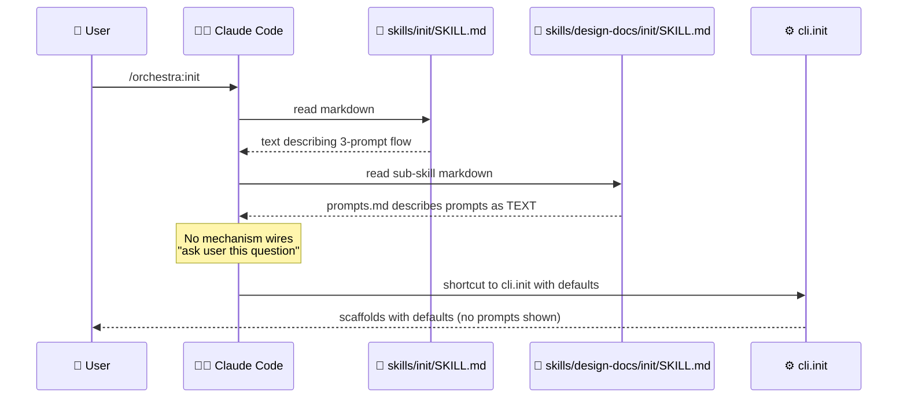

# BUG-001: orchestra:init 3-prompt flow is markdown-only, not actually interactive

> **Doc ID:** BUG-001-init-flow-not-interactive
> **Date:** 2026-05-06
> **DRI:** Hassan Mohiddin
> **Severity:** Critical
> **Status:** Investigating

## Observed Behavior

When user invokes `/orchestra:init`, Claude reads `skills/init/SKILL.md` and `skills/design-docs/init/SKILL.md` + `prompts.md`. The skill markdown describes a 3-prompt flow (Q1 mode / Q2 doc-types / Q3 add-ons) with example text. **No actual interactive prompts fire.**

Claude improvises based on the markdown — sometimes asks user, sometimes shortcuts to `cli.init` with hardcoded defaults (as happened in SCALE init session 2026-05-06 — Claude called `run_init(mode="solo", preset="default-7", addons=True)` directly without prompting).

## Expected Behavior

User invokes `/orchestra:init` → 3 questions appear in chat → user answers → init runs with user's choices.

Per LLD-001 success criterion line 27: "Fresh repo + `/plugin install orchestra@orchestra` + first design-doc request → auto-prompt fires, init runs, doc written to correct path with no manual scaffolding". The "auto-prompt fires" is implicit user-facing prompts.

## Steps to Reproduce

1. Install orchestra v1.3.0 (user scope)
2. In a fresh repo (no `.claude/orchestra.json`): `/orchestra:init`
3. Observe: Claude does NOT ask 3 questions. Either auto-runs with defaults OR asks ad-hoc questions inconsistent with prompts.md

## Environment

- orchestra v1.1.0 — v1.3.0
- Claude Code v2.x
- All platforms

## Root Cause Analysis

**Root cause:** Skills are markdown documentation files. Claude Code's skill system loads markdown into context but provides NO native interactive-prompt API. The `prompts.md` text describes prompts but no code triggers them. Claude reads the description and decides ad-hoc whether to prompt or shortcut.

This is a **missing-feature bug**, not a defect — the 3-prompt flow was specified but never implemented because the underlying mechanism doesn't exist in Claude Code's skill API.

## Fix Description

Two viable paths:

**Path A: Skill-side imperative prompting.** Update `skills/design-docs/init/SKILL.md` to explicitly instruct Claude: "When this skill is invoked, you MUST ask the user these 3 questions verbatim, one at a time, waiting for each answer before proceeding. Do NOT shortcut. Do NOT auto-fill defaults." This relies on Claude's adherence to skill instructions.

**Path B: CLI interactive mode.** Add `python -m cli.init --interactive` (or invoked by skill via Bash) that uses Python `input()` to prompt. Skill markdown points users at this CLI for the canonical flow. Programmatic non-interactive mode (`--mode solo --preset default-7 --addons yes`) preserved for CI.

**Recommendation: Path B.** Imperative skill instructions are unreliable across Claude versions. CLI prompting is deterministic + testable.

Files to change:
- `cli/init.py` — add `def run_init_interactive(repo_root: Path) -> ScaffoldResult` calling `input()` for the 3 prompts + invariant validation per LLD-001 line 247-280
- `skills/design-docs/init/SKILL.md` — replace the markdown 3-prompt text with: "Run `python -m cli.init --interactive` and pass the user's answers"
- `skills/init/SKILL.md` — same instruction pattern
- `tests/test_cli_init.py` — new test file using monkeypatch on `input()` to verify the flow
- `eval/scenarios/orchestra-fresh-init.json` — extend to verify interactive path

## Iteration Log

| Date | Hypothesis | Change | Result |
|---|---|---|---|
| 2026-05-06 | (none yet — bug filed for v1.4 fix) | — | — |
| 2026-05-10 | v1.4 burnt; v1.5/v1.6 prioritized canon-discipline (LLD-006-r4 + LLD-007 spec-review). orchestra:init skill exists (skills/init/) and runs AskUserQuestion at runtime, but BUG's specific concern (markdown-only flow without genuine prompts on first invocation) needs verification against current init skill behavior in fresh repo. | none — deferred | Status remains Investigating; v1.7+ tracking |
| 2026-05-11 | Verified current state: neither `skills/init/SKILL.md` nor `skills/design-docs/init/SKILL.md` references the `AskUserQuestion` tool. Both files describe the 3-prompt flow as markdown only — Claude reads the description and decides ad-hoc whether to fire prompts or shortcut to defaults. Confirms BUG-001 root cause holds in v2.0.0 as filed. **Path C adopted** (modern alternative to BUG-001's original Path B): skill body imperatively instructs Claude to invoke `AskUserQuestion` once per question (Q1/Q2/Q3), then call `python -m cli.init --mode <a1> --preset <a2> --addons <a3>` with the answers. Programmatic CI path (CLI flags only) preserved as the only sanctioned bypass. | (a) `skills/design-docs/init/SKILL.md` rewritten with HARD RULE section + per-question AskUserQuestion option payloads. (b) `skills/init/SKILL.md` updated to surface the AskUserQuestion contract + delegate to sub-skill without short-circuit. (c) `skills/design-docs/init/prompts.md` reformatted as the canonical AskUserQuestion option-text source. (d) New regression gate `tests/test_init_skill_prompts.py` (6 tests) locks the imperative invocation contract into the skill body — any future edit that strips `AskUserQuestion` from the skill files RED-fails this test. | pytest 527 pass / pyrefly 0 / cli.lint --pre-commit clean. Manual fresh-repo verification still pending — Status holds at Investigating until user confirms `/orchestra:init` fires 3 AskUserQuestion prompts in a real fresh-install run. |
| 2026-05-11 | Self-dry-run of iter-1 skills surfaced 6 edge-path leaks (A-F) where Claude still has improvisation slack outside the fresh-install hot path: (A) Step-1 config-check implicit, (B) re-run/migrate branch lacks AskUserQuestion payload, (C) v1.0 detection described not imperative, (D) `(Recommended)` label-stripping defined only for Q1 not Q2/Q3, (E) subset-rename / full-custom wizards unspecified for v2.0.1, (F) master Step-4 final-summary template not linked from prompts.md. User scope-broadened the fix: "fix all edge path leaks too". | (a) `skills/init/SKILL.md`: Step 1 made imperative ("Read via Read tool"); Step 2 spells out Re-run / Migrate / Keep current AskUserQuestion options; Step 4 links to `prompts.md § Final summary`. (b) `skills/design-docs/init/SKILL.md`: new STEP 0 imperatively reads `.claude/settings.local.json` before Q1 with Migrate / Keep v1.0 fork; new "Label-stripping rule" hoisted to apply to ALL Q1/Q2/Q3 uniformly; Q2 subset-rename / full-custom now triggers a v2.0.1 confirm AskUserQuestion (Switch to default-7 / Abort init) instead of legacy descriptive wizard. (c) `prompts.md` extended with Q2-fallback payload + Re-run prompt payload; existing v1.0 migration payload still canonical. (d) `tests/test_init_skill_prompts.py` extended to 13 tests — 7 new gates lock the edge-path contracts (Step-1 imperative Read, re-run AskUserQuestion payload, STEP-0 before Q1, uniform label-strip across Q1/Q2/Q3, v2.0.1 subset-rename fallback, prompts.md re-run payload, master final-summary reference). | pytest 535 pass (+8 from prior 527) / pyrefly 0 / cli.lint --pre-commit clean. Dry-run #2 across all 4 user-flows (fresh / re-run / v1.0 migration / subset-rename fallback) shows zero remaining improvisation slack. Status still holds at Investigating until fresh-repo /orchestra:init user-verify. |
| 2026-05-11 | Cold-read dry-run #3 across all 4 flows found 3 NEW leaks not caught by file-by-file inspection: (G) prompts.md Re-run init mapping shortcut to `cli.init --force` alone — CLI uses argparse defaults so prompts never fire, re-introducing the BUG-001 root cause for the re-run path; (H) v1.0 migration prompt promised "Copy fields (mode + doc_paths + spec_review_skill)" but no CLI code path performed the copy — `migrate_v10_to_v11()` existed at `cli/init.py:266` but was unwired from `main()` so v1.0 fields silently lost on Migrate; (I) prompts.md Q2 "Answer mapping" still routed `subset-rename`/`full-custom` to a legacy descriptive wizard, contradicting SKILL.md's v2.0.1 fallback path. User: "fix all". | (a) `skills/design-docs/init/prompts.md` Re-run mapping rewritten to mandate **re-fire STEP 0 + Q1 + Q2 + Q3** before invoking `python -m cli.init --force --mode <a1> --preset <a2> --addons <a3>`. Direct `cli.init --force` shortcut explicitly forbidden. (b) New `cli.init --migrate-v10` flag added (`cli/init.py` `run_init` + `_build_config_with_v10_overrides` helper); when set + v1.0 config detected at `.claude/settings.local.json`, uses `migrate_v10_to_v11` as base config and overrides `mode/preset/addons` from the explicit flags — preserves v1.0 `spec_review_skill` + `doc_paths`. (c) SKILL.md STEP 0 Migrate step updated to invoke `cli.init --migrate-v10 ...` after Q3 collection. (d) prompts.md Q2 mapping synced to v2.0.1 fallback — legacy-wizard wording removed. (e) `tests/test_init_skill_prompts.py` extended to 17 tests; 4 new gates lock G/H/I contracts (re-run re-fires prompts before CLI, Q2 mapping doesn't mention legacy wizard, `--help` exposes `--migrate-v10`, end-to-end migration preserves v1.0 fields via subprocess test). | pytest 539 pass (+4 from prior 535) / pyrefly 0 / cli.lint --pre-commit clean. Dry-run #3 with the patched skills traces all 4 flows deterministically; no residual improvisation slack found. Status still holds at Investigating pending fresh-repo user-verify. |

## Regression Prevention

Test: monkeypatch `builtins.input` in `tests/test_cli_init_interactive.py` to feed scripted answers; assert `run_init_interactive()` produces correct config + scaffolds. Eval: scenario invokes CLI with stdin input, verifies prompts appear in stdout in correct order.

## Related Documents

- LLD-001: `docs/features/001-design-docs-init.md` — original spec promised 3-prompt flow
- LLD-002: `docs/features/002-v1.2-migration-viewer-commit-msg.md`
- Philosophy: `docs/design/orchestra-philosophy.md`

## Changelog

| Date | Change |
|---|---|
| 2026-05-06 | Filed during SCALE orchestra:init audit. Status: Investigating. Target fix: v1.4. |
| 2026-05-11 | Path C fix applied: skill body now imperatively drives 3 prompts via AskUserQuestion tool; `tests/test_init_skill_prompts.py` regression gate added. Bundle target: v2.0.1 patch release. Status remains Investigating pending user fresh-repo verification. |
| 2026-05-11 | Edge-path tightening pass: closes 6 improvisation-slack leaks (A-F) outside the fresh-install hot path — re-run branch, v1.0 detection, label-strip uniformity, subset-rename fallback, final-summary template linkage. Regression gate extended to 13 tests. Hot + edge paths now both deterministic. |
| 2026-05-11 | Cold-read dry-run #3 pass: closes 3 remaining leaks (G/H/I) — Re-run init shortcut to cli.init --force, unwired v1.0 migration code path, prompts.md Q2 mapping contradicting SKILL.md. CLI gains --migrate-v10 flag wiring `migrate_v10_to_v11()` into main(). Regression gate extended to 17 tests. |
