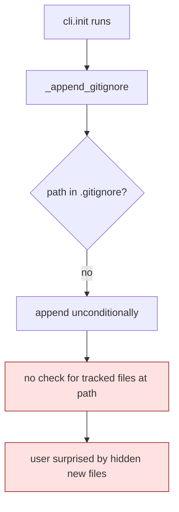

# BUG-002: cli.init silently gitignores paths with already-tracked files

> **Doc ID:** BUG-002-gitignore-affects-tracked-files
> **Date:** 2026-05-06
> **DRI:** Hassan Mohiddin
> **Severity:** High
> **Status:** Investigating

## Observed Behavior

`cli.init` appends 3 patterns to `.gitignore`:
- `.claude/orchestra.local.json`
- `docs/investigations/`
- `.eval-workspace/`

When run in SCALE (existing repo), `docs/investigations/` already had 2 tracked files (`README.md` + `skill-orchestration-problems.md`). After init, those files remained tracked (gitignore doesn't untrack), but **any new files added to that dir would silently NOT be tracked**. User has no warning.

## Expected Behavior

Before appending a path to `.gitignore`, check if any files at that path are already tracked. If yes:
- Warn user: "docs/investigations/ has 2 tracked files. Adding to .gitignore will prevent NEW files from being tracked. Existing files remain. Proceed? [y/n]"
- Or: skip that entry and let user decide manually
- Or: offer `git update-index --skip-worktree` alternative for safer pattern

## Steps to Reproduce

1. Repo with `docs/investigations/foo.md` already committed
2. `python -m cli.init`
3. `.gitignore` gets `docs/investigations/` appended silently
4. User adds `docs/investigations/bar.md` later
5. `git status` shows nothing — file invisible

## Environment

- orchestra v1.1.0 — v1.3.0
- Any repo with pre-existing `docs/investigations/` content

## Root Cause Analysis



**Root cause:** `cli/init.py` `_append_gitignore()` (line 385+) never invokes `git ls-files` to check tracked content at the patterns it adds. Append is purely string-based.

## Fix Description

Add tracked-file check before append:

```python
def _check_tracked_in_path(repo_root: Path, path_pattern: str) -> list[str]:
    """Return tracked files matching path_pattern (empty if none or not git repo)."""
    try:
        result = subprocess.run(
            ["git", "ls-files", path_pattern.rstrip("/")],
            cwd=repo_root, capture_output=True, text=True, check=False,
        )
        return [line for line in result.stdout.splitlines() if line]
    except (FileNotFoundError, subprocess.CalledProcessError):
        return []


def _append_gitignore(root: Path, result: ScaffoldResult, force: bool) -> None:
    ...
    for entry in GITIGNORE_ENTRIES:
        if entry not in existing:
            tracked = _check_tracked_in_path(root, entry)
            if tracked and not force:
                result.warnings.append(
                    f".gitignore append SKIPPED for {entry!r}: "
                    f"{len(tracked)} tracked files found "
                    f"(would silently hide new files). Use --force to override."
                )
                continue
            new_lines.append(entry)
    ...
```

Add `warnings` field to `ScaffoldResult`. Surface warnings in CLI output.

Files:
- `cli/init.py` — add `_check_tracked_in_path()` + extend `_append_gitignore()` + extend `ScaffoldResult` dataclass with `warnings: list[str]`
- `tests/test_cli_init_bucket1.py` — new test fixture: pre-commit a file in `docs/investigations/`, run init, assert path NOT in .gitignore + warning present
- README.md — note the safer-default behavior

## Iteration Log

| Date | Hypothesis | Change | Result |
|---|---|---|---|
| 2026-05-06 | (none yet — bug filed for v1.4 fix) | — | — |
| 2026-05-10 | v1.4 burnt; deferred to v1.7+. Fix: cli.init must `git ls-files --error-unmatch <path>` before appending to .gitignore; if tracked, warn + skip. | none — deferred | Status remains Investigating; v1.7+ |

## Regression Prevention

Integration test in `tests/test_cli_init_bucket1.py`:
- `test_gitignore_skips_when_path_has_tracked_files` — pre-commit file → run init → assert `docs/investigations/` NOT appended + warning surfaced
- `test_gitignore_force_appends_anyway` — `--force` flag overrides safety check

## Related Documents

- LLD-001: `docs/features/001-design-docs-init.md` — original `_append_gitignore()` design
- BUG-007: similar safety-default pattern (mkdocs.yml YAML strict mode)

## Changelog

| Date | Change |
|---|---|
| 2026-05-06 | Filed during SCALE orchestra:init audit. SCALE's `docs/investigations/` had 2 tracked files when init silently added the path. Status: Investigating. Target fix: v1.4. |
