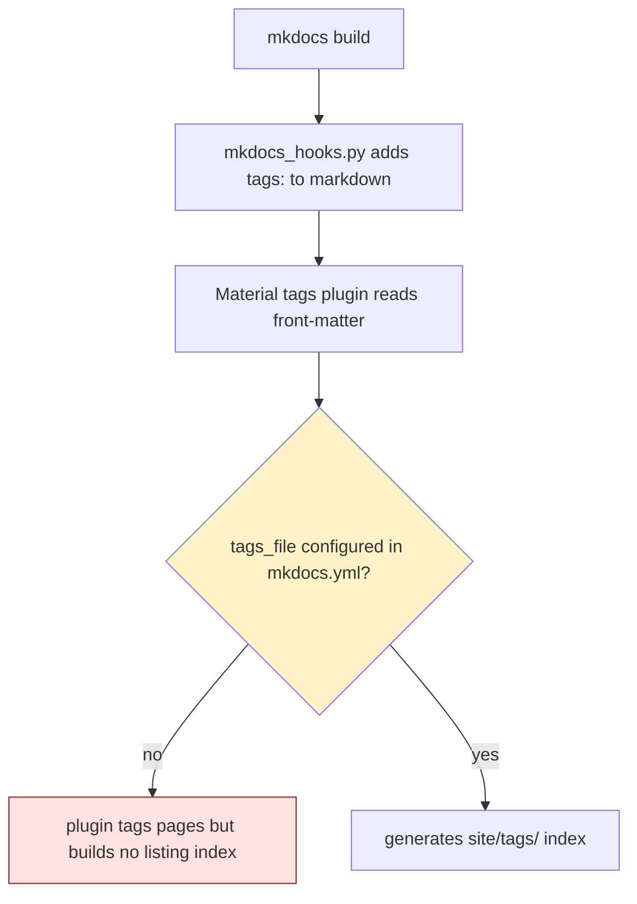

# BUG-003: MkDocs tags plugin enabled but tags_file not configured — no /tags/ page generated

> **Doc ID:** BUG-003-mkdocs-tags-page-missing
> **Date:** 2026-05-06
> **DRI:** Hassan Mohiddin
> **Severity:** High
> **Status:** Investigating

## Observed Behavior

After `python -m cli.viewer install-mkdocs` + `pip install -r requirements-docs.txt` + `mkdocs build`:

- mermaid blocks render correctly ✓
- doc nav shows all types ✓
- **`site/tags/` directory is NOT generated** ❌
- mkdocs_hooks.py runs (status tags injected into markdown front-matter) but the tags-listing page never materializes

Result: status filter (Verified / Implemented / Draft) — a v1.3 success-criterion deliverable — does not work.

## Expected Behavior

After `mkdocs build`, `site/tags/` exists with:
- `site/tags/index.html` listing all tags
- One page per tag listing docs with that status
- Sidebar link "Tags" navigates here

LLD-003 line 27: "Status filter enabled via mkdocs material theme tags (each doc has front-matter `tags: [Status]`)" — claim is satisfied at the data-injection level (hook adds tags), but not the rendering level (no listing page).

## Steps to Reproduce

1. Fresh repo with `docs/features/001-foo.md` containing `> **Status:** Verified` metadata block
2. `python -m cli.viewer install-mkdocs`
3. `pip install -r requirements-docs.txt`
4. `mkdocs build`
5. `ls site/tags/` → `No such file or directory`

Verified in SCALE 2026-05-06.

## Environment

- orchestra v1.3.0
- mkdocs 1.6.1 + mkdocs-material 9.7.6 + mkdocs-mermaid2-plugin 1.2.3

## Root Cause Analysis



**Root cause:** Material's `tags` plugin (per [docs](https://squidfunk.github.io/mkdocs-material/setup/setting-up-tags/)) requires explicit `tags_file:` config + a `tags.md` placeholder file with `[TAGS]` token. orchestra's mkdocs.yml template enables the plugin but skips both.

Verified by inspecting `cli/templates/mkdocs.yml`:
```yaml
plugins:
  - tags  # ← plugin enabled but no `tags_file:` directive
```

No `cli/templates/tags.md` ships either.

## Fix Description

Two file changes + nav addition:

1. **`cli/templates/mkdocs.yml`** — change `- tags` to:
```yaml
- tags:
    tags_file: tags.md
```

2. **NEW `cli/templates/tags.md`**:
```markdown
# Tags

Browse docs by status tag.

[TAGS]
```

3. **mkdocs.yml nav** — add row:
```yaml
nav:
  - Home: index.md
  - Tags: tags.md       # NEW
  - Standards: STANDARDS.md
  ...
```

4. **`cli/viewer.py` `MKDOCS_INSTALL_FILES`** — add `("tags.md", "tags.md")` (relative to docs_dir, write to `docs/tags.md`).

5. Update `install_mkdocs` to write the new file. Update install count from 4 → 5 in tests + LLD references.

## Iteration Log

| Date | Hypothesis | Change | Result |
|---|---|---|---|
| 2026-05-06 | (none yet — bug filed for v1.4 fix) | — | — |

## Regression Prevention

- Add test `test_install_mkdocs_includes_tags_file` — assert `docs/tags.md` exists after install
- Eval scenario `mkdocs-build` extension: assert `site/tags/` dir exists after `mkdocs build`

## Related Documents

- LLD-003: `docs/features/003-v1.3-doc-browser-mkdocs.md` lines 25-28, 145-148 (mkdocs_hooks.py tag synthesis)
- mkdocs-material tags docs: https://squidfunk.github.io/mkdocs-material/setup/setting-up-tags/

## Changelog

| Date | Change |
|---|---|
| 2026-05-06 | Filed during SCALE mkdocs build audit. Status: Investigating. Target fix: v1.4. |
