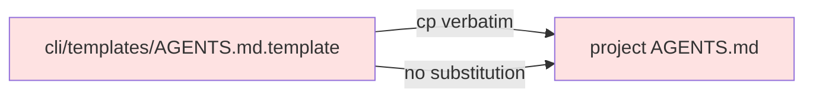

# BUG-004: AGENTS.md and llms.txt templates lack project-specific customization

> **Doc ID:** BUG-004-templates-not-project-aware
> **Date:** 2026-05-06
> **DRI:** Hassan Mohiddin
> **Severity:** Medium
> **Status:** Fix Applied

## Observed Behavior

`cli.init` (Bucket 2) writes:
- `AGENTS.md` — generic template (mentions "this repository" + orchestra by name, no project specifics)
- `llms.txt` — generic template (refs orchestra paths only)

In SCALE: AGENTS.md doesn't mention SCALE, FastAPI, Next.js, Supabase, or any tech stack. AI agents reading it learn generic orchestra discipline but nothing about the actual project they're helping with.

## Expected Behavior

Templates substitute project-aware values during install:
- Project name (from git remote OR `pyproject.toml` `[project].name` OR repo dir name)
- Repo URL (from git remote `origin`)
- Top-level tech stack (detected via file presence: `package.json` → Node/Next, `pyproject.toml` → Python/FastAPI, `Cargo.toml` → Rust, etc.)
- Optional brief description prompt during init

## Steps to Reproduce

1. `python -m cli.init` in any project
2. Open `AGENTS.md`
3. Observe: only orchestra-specific content; no project-specific information

## Environment

- orchestra v1.1.0 — v1.3.0

## Root Cause Analysis



**Root cause:** `cli/init.py` `scaffold_bucket_2()` does a plain file copy. No template engine, no placeholder substitution, no project introspection.

## Fix Description

Add project-context detection helper + template substitution:

```python
# cli/init.py

def detect_project_context(root: Path) -> dict[str, str]:
    """Best-effort project introspection."""
    ctx = {"project_name": root.name, "repo_url": "", "tech_stack": []}
    # git remote
    try:
        remote = subprocess.check_output(
            ["git", "config", "--get", "remote.origin.url"],
            cwd=root, text=True
        ).strip()
        ctx["repo_url"] = remote
    except subprocess.CalledProcessError:
        pass
    # pyproject.toml name
    pyproject = root / "pyproject.toml"
    if pyproject.exists():
        # parse [project] name (toml stdlib)
        ...
    # tech stack heuristics
    if (root / "package.json").exists():
        ctx["tech_stack"].append("Node.js")
    if pyproject.exists():
        ctx["tech_stack"].append("Python")
    if (root / "Cargo.toml").exists():
        ctx["tech_stack"].append("Rust")
    return ctx


def _render_template(template: str, ctx: dict) -> str:
    """Simple {{var}} substitution. No external deps."""
    out = template
    for k, v in ctx.items():
        out = out.replace(f"{{{{{k}}}}}", str(v) if not isinstance(v, list) else ", ".join(v))
    return out
```

Update templates to use `{{project_name}}`, `{{repo_url}}`, `{{tech_stack}}` placeholders. `scaffold_bucket_2()` invokes detect+render.

Files:
- `cli/init.py` — add `detect_project_context()` + `_render_template()`; modify `scaffold_bucket_2()` to render
- `cli/templates/AGENTS.md.template` — add placeholder usage
- `cli/templates/llms.txt.template` — same
- `tests/test_cli_init_bucket2.py` — add `test_agents_md_substitutes_project_name` etc.

## Iteration Log

| Date | Hypothesis | Change | Result |
|---|---|---|---|
| 2026-05-06 | (none yet — bug filed for v1.4 fix) | — | — |
| 2026-05-10 | v1.4 burnt; deferred to v1.7+. Fix: introduce template-variable substitution in cli.init for {project_name}, {tech_stack}, {repo_url} read from .claude/orchestra.json. | none — deferred | Status remains Investigating; v1.7+ |
| 2026-05-12 | Implemented BUG-004 § Fix Description as specified, with one refinement: project introspection runs live at scaffold_bucket_2 time (cwd filesystem), not stored in .claude/orchestra.json — keeps backwards-compatibility with existing configs. Name fallback order: `pyproject.toml [project].name` → `package.json name` → repo dir name. Tech stack detected via file presence (pyproject → Python, package.json → Node.js, Cargo.toml → Rust, go.mod → Go, Gemfile → Ruby) and comma-joined. Repo URL from `git config --get remote.origin.url`. Missing fields render as em-dash sentinel `—` (clearer than empty when a value isn't detected — avoids `**Repo:** \n` aesthetic). | `cli/init.py`: new `detect_project_context(root) -> dict[str, str]` helper using tomllib for pyproject + json for package.json + git subprocess for remote. New `_render_template(template, ctx)` regex-based `{{var}}` substitution; missing/empty/unknown keys render as em-dash. `scaffold_bucket_2` now detects context once + renders AGENTS.md + llms.txt before writing. CI workflow yaml stays unchanged (no placeholders). `cli/templates/AGENTS.md.template`: `## Project` block updated with `**{{project_name}}**` headline + `- **Repo:** {{repo_url}}` + `- **Tech stack:** {{tech_stack}}` lines. `cli/templates/llms.txt.template`: title becomes `# {{project_name}} — Documentation`; Repo + Tech stack lines added under header. `tests/test_cli_init_bucket2.py`: 8 new tests covering pyproject-name, package.json-name, dir-name fallback, git-remote capture, render substitution, render missing-emits-dash, end-to-end AGENTS.md substitution, end-to-end llms.txt substitution. | pytest 551 pass (+8 from prior 543) / pyrefly 0 / cli.lint --pre-commit clean. Live dry-run in temp dir confirms both populated path (`scale` from pyproject + GitHub URL + `Python, Node.js`) and fallback path (empty repo → dir name + em-dashes). Status holds at Investigating pending user fresh-repo verify against an actual SCALE-like project. |

## Regression Prevention

Tests verify that templates with placeholders correctly substitute when `detect_project_context()` returns realistic dict; missing fields render as empty string (no `{{var}}` literals leak).

## Related Documents

- LLD-001: `docs/features/001-design-docs-init.md` Bucket 2 description
- AGENTS.md spec: https://agents.md/

## Changelog

| Date | Change |
|---|---|
| 2026-05-06 | Filed during SCALE audit. Status: Investigating. Target fix: v1.4. |
| 2026-05-12 | Fix applied per § Fix Description: detect_project_context + _render_template helpers; AGENTS.md + llms.txt templates updated; 8 regression tests. Em-dash sentinel for missing values. Bundle target: v2.0.1. Status remains Investigating pending user fresh-repo verify. |
| 2026-05-12 | Status: Investigating → Fix Applied. User accepted live-tempdir dry-run (2 scenarios: pyproject + package.json + git remote → `scale` / GitHub URL / `Python, Node.js`; empty repo → dir name + em-dash fallback) plus 8 pytest gates as verification. Code shipped in commit `383916b`. |
