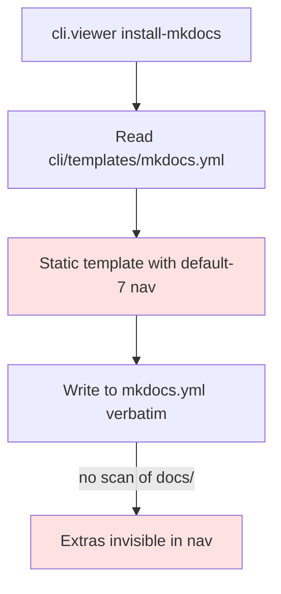

# BUG-005: mkdocs.yml nav hardcoded to default-7 — extra docs/ subdirs invisible in sidebar

> **Doc ID:** BUG-005-mkdocs-nav-no-auto-detect
> **Date:** 2026-05-06
> **DRI:** Hassan Mohiddin
> **Severity:** Medium
> **Status:** Fix Applied

## Observed Behavior

`cli.viewer install-mkdocs` writes a static `mkdocs.yml` template with hardcoded nav:
```yaml
nav:
  - Home: index.md
  - Standards: STANDARDS.md
  - Decisions: ...
  - Features: features/
  - Bugs: bugs/
  - Design Docs: design/
  - Postmortems: postmortems/
  - Runbooks: runbooks/
  - Plans: plans/
```

In SCALE — which has additional `docs/policies/`, `docs/research/`, `docs/archive/`, `docs/investigations/` — those dirs are NOT in the sidebar. mkdocs auto-builds them (markdown files render) but users can't browse them via nav.

## Expected Behavior

`install_mkdocs()` scans `<docs_dir>/*` and either:
- Adds detected extra subdirs to nav (with formal-vocab title-casing)
- OR warns user during install: "Detected extra dirs: policies, research, archive, investigations. Add to mkdocs.yml nav manually or rerun with --auto-nav"

## Steps to Reproduce

1. Repo with `docs/{features,bugs,policies,research,archive}/` (mix of default-7 + extras)
2. `python -m cli.viewer install-mkdocs`
3. `mkdocs build && mkdocs serve`
4. Open http://localhost:8000 — sidebar shows only default-7. Extras buildable via direct URL but invisible.

## Environment

- orchestra v1.3.0
- Repos with non-default docs/ layouts

## Root Cause Analysis



**Root cause:** `install_mkdocs()` does plain file copy. No filesystem introspection of `docs/` to detect extras.

## Fix Description

Two complementary additions:

**Phase 1 (low cost): warn on extras detected.** During install, after copying mkdocs.yml, scan `docs/` for non-default-7 subdirs. Print warning listing them.

**Phase 2 (richer): `--auto-nav` flag** that programmatically builds nav from filesystem. Generated nav appended to mkdocs.yml in YAML-safe form.

Files:
- `cli/viewer.py` — extend `install_mkdocs()` with `_scan_extra_doc_dirs(repo_root) -> list[str]` and warning surface; add `--auto-nav` flag wiring nav generation
- `cli/init.py` — share `_scan_extra_doc_dirs` if useful for `scaffold_bucket_1` too
- `tests/test_cli_viewer.py` — new test: `test_install_mkdocs_warns_on_extras` (fixture repo with `docs/policies/foo.md`, expect warning in stderr)

## Iteration Log

| Date | Hypothesis | Change | Result |
|---|---|---|---|
| 2026-05-06 | (none yet — bug filed for v1.4 fix) | — | — |
| 2026-05-10 | v1.4 burnt; deferred to v1.7+. Fix: extend mkdocs_hooks.py with on_files event auto-discovering docs/ subdirs not in nav and emitting nav warnings; or migrate to awesome-pages plugin. | none — deferred | Status remains Investigating; v1.7+ |
| 2026-05-12 | Implemented BUG-005 § Fix Description (both phases together, no mkdocs_hooks.py change — install-time approach simpler than runtime plugin). Phase 1: `_scan_extra_doc_dirs(docs_dir)` returns sorted list of non-default-7, non-internal subdirs (excludes `features|bugs|adr|design|postmortems|runbooks|plans` + orchestra-internal `archive|investigations|reviews`); install-time warning surfaces extras with `--auto-nav` remediation pointer. Phase 2: `--auto-nav` flag wires `_generate_nav_entries(extras)` (hyphen-aware title-casing: `my-policies` → `My Policies`) + `_inject_nav_entries()` (inserts inside existing `nav:` block before next top-level key, preserving YAML validity). | `cli/viewer.py`: InstallResult.warnings field; _DEFAULT_7_DIRS / _INTERNAL_DIRS frozensets; _scan_extra_doc_dirs, _title_case_segment, _generate_nav_entries, _inject_nav_entries helpers; install_mkdocs accepts auto_nav param; argparse `--auto-nav` flag on install-mkdocs subcommand; main() emits warnings to stderr with ⚠ prefix. `tests/test_cli_viewer.py`: 8 new tests covering scan (default-7 / internal / files-and-hidden), warn (extras / no-warn), auto-nav (appends / yaml-parseable / hyphen-title-casing). Status: Investigating → Fix Applied — user accepted live-tempdir dry-run (Phase 1 warning fires on `docs/{policies,research}/` extras; Phase 2 `--auto-nav` injects `Policies: policies/` + `Research: research/` lines into nav block before `hooks:` key) + 8 pytest gates as verification. Bundle target: v2.0.1. | pytest 559 pass (+8 from prior 551) / pyrefly 0 / cli.lint --pre-commit clean. |

## Regression Prevention

Test asserts:
- Extras detected → warning surfaces
- `--auto-nav` rewrites mkdocs.yml nav with all detected dirs
- Default-7-only repo → no warning, no rewrite needed

## Related Documents

- LLD-003: `docs/features/003-v1.3-doc-browser-mkdocs.md` lines 130-148 (nav schema)
- BUG-004: same project-introspection theme

## Changelog

| Date | Change |
|---|---|
| 2026-05-06 | Filed during SCALE audit. Status: Investigating. Target fix: v1.4. |
| 2026-05-12 | Fix Applied — both Phase 1 (warn-on-extras) + Phase 2 (`--auto-nav`) shipped in single iter. 8 regression tests. Live dry-run validated both paths. Bundle target: v2.0.1. |
