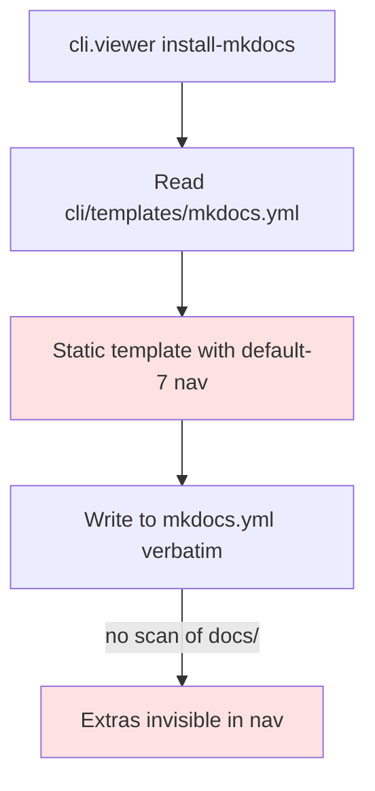

# BUG-005: mkdocs.yml nav hardcoded to default-7 — extra docs/ subdirs invisible in sidebar

> **Doc ID:** BUG-005-mkdocs-nav-no-auto-detect
> **Date:** 2026-05-06
> **DRI:** Hassan Mohiddin
> **Severity:** Medium
> **Status:** Investigating

## Observed Behavior

`cli.viewer install-mkdocs` writes a static `mkdocs.yml` template with hardcoded nav:
```yaml
nav:
  - Home: index.md
  - Standards: STANDARDS.md
  - Decisions: ...
  - Features: features/
  - Bugs: bugs/
  - Design Docs: design/
  - Postmortems: postmortems/
  - Runbooks: runbooks/
  - Plans: plans/
```

In SCALE — which has additional `docs/policies/`, `docs/research/`, `docs/archive/`, `docs/investigations/` — those dirs are NOT in the sidebar. mkdocs auto-builds them (markdown files render) but users can't browse them via nav.

## Expected Behavior

`install_mkdocs()` scans `<docs_dir>/*` and either:
- Adds detected extra subdirs to nav (with formal-vocab title-casing)
- OR warns user during install: "Detected extra dirs: policies, research, archive, investigations. Add to mkdocs.yml nav manually or rerun with --auto-nav"

## Steps to Reproduce

1. Repo with `docs/{features,bugs,policies,research,archive}/` (mix of default-7 + extras)
2. `python -m cli.viewer install-mkdocs`
3. `mkdocs build && mkdocs serve`
4. Open http://localhost:8000 — sidebar shows only default-7. Extras buildable via direct URL but invisible.

## Environment

- orchestra v1.3.0
- Repos with non-default docs/ layouts

## Root Cause Analysis



**Root cause:** `install_mkdocs()` does plain file copy. No filesystem introspection of `docs/` to detect extras.

## Fix Description

Two complementary additions:

**Phase 1 (low cost): warn on extras detected.** During install, after copying mkdocs.yml, scan `docs/` for non-default-7 subdirs. Print warning listing them.

**Phase 2 (richer): `--auto-nav` flag** that programmatically builds nav from filesystem. Generated nav appended to mkdocs.yml in YAML-safe form.

Files:
- `cli/viewer.py` — extend `install_mkdocs()` with `_scan_extra_doc_dirs(repo_root) -> list[str]` and warning surface; add `--auto-nav` flag wiring nav generation
- `cli/init.py` — share `_scan_extra_doc_dirs` if useful for `scaffold_bucket_1` too
- `tests/test_cli_viewer.py` — new test: `test_install_mkdocs_warns_on_extras` (fixture repo with `docs/policies/foo.md`, expect warning in stderr)

## Iteration Log

| Date | Hypothesis | Change | Result |
|---|---|---|---|
| 2026-05-06 | (none yet — bug filed for v1.4 fix) | — | — |

## Regression Prevention

Test asserts:
- Extras detected → warning surfaces
- `--auto-nav` rewrites mkdocs.yml nav with all detected dirs
- Default-7-only repo → no warning, no rewrite needed

## Related Documents

- LLD-003: `docs/features/003-v1.3-doc-browser-mkdocs.md` lines 130-148 (nav schema)
- BUG-004: same project-introspection theme

## Changelog

| Date | Change |
|---|---|
| 2026-05-06 | Filed during SCALE audit. Status: Investigating. Target fix: v1.4. |
