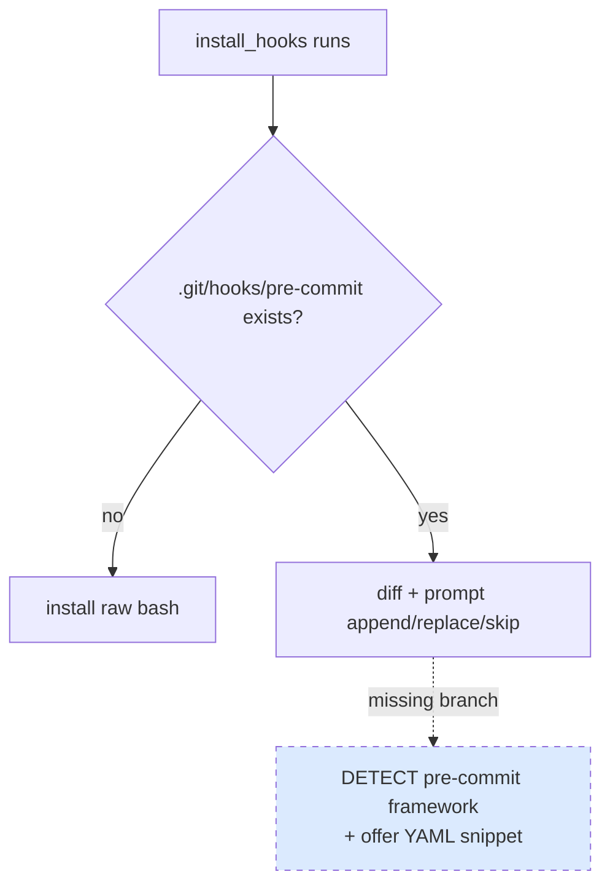

# BUG-006: install_hooks doesn't detect pre-commit.com framework — would corrupt user's hook setup

> **Doc ID:** BUG-006-install-hooks-precommit-framework
> **Date:** 2026-05-06
> **DRI:** Hassan Mohiddin
> **Severity:** Low
> **Status:** Investigating

## Observed Behavior

`cli.install_hooks` writes raw bash to `.git/hooks/pre-commit`. If the repo already uses [pre-commit.com](https://pre-commit.com) framework, the existing hook is a generated bash file invoking `pre-commit hook-impl --config=.pre-commit-config.yaml`. Replacing it (`--force`) breaks the entire framework. Appending creates double-runs.

In SCALE, pre-commit framework was already in use. orchestra hook install was correctly skipped manually, but the plugin gave no early warning.

## Expected Behavior

Detect `.pre-commit-config.yaml` at repo root before installing raw hook. If present:
- Print: "pre-commit.com framework detected. Recommended: add orchestra lint to your `.pre-commit-config.yaml` instead. Snippet shown below. Skip raw hook install."
- Provide ready-to-paste YAML snippet
- Optionally `--force-raw` to install bash hook anyway (advanced users)

## Steps to Reproduce

1. Repo with existing `.pre-commit-config.yaml` and `.git/hooks/pre-commit` generated by `pre-commit install`
2. `python -m cli.install_hooks`
3. Plugin offers append/replace/skip — but the safest path (integrate into framework) is not offered

## Environment

- orchestra v1.1.0 — v1.3.0
- Any repo using pre-commit.com framework (extremely common in OSS)

## Root Cause Analysis



**Root cause:** `cli/install_hooks.py` `install_one_hook()` checks file existence + content equality, but never inspects whether the existing hook is from the pre-commit.com framework.

## Fix Description

Add framework detection:

```python
PRECOMMIT_CONFIG = ".pre-commit-config.yaml"

def _is_precommit_framework(repo_root: Path) -> bool:
    return (repo_root / PRECOMMIT_CONFIG).exists()


PRECOMMIT_SNIPPET = """\
# Add to .pre-commit-config.yaml repos: list:
- repo: local
  hooks:
    - id: orchestra-lint
      name: orchestra lint (Refs: + metadata + status)
      entry: python -m cli.lint --pre-commit
      language: system
      pass_filenames: false
      stages: [pre-commit]
"""


def install_one_hook(repo_root: Path, hook_name: str, force: bool = False, ...) -> int:
    if hook_name == "pre-commit" and _is_precommit_framework(repo_root) and not force:
        print("pre-commit.com framework detected.")
        print("Add orchestra to your existing config instead:")
        print()
        print(PRECOMMIT_SNIPPET)
        print("Then run: pre-commit install")
        return 0  # treated as success — user has guidance
    ...  # existing logic
```

Files:
- `cli/install_hooks.py` — add framework detection + snippet emit
- `cli/templates/precommit-yaml-snippet.txt` — externalize snippet for future updates
- `tests/test_cli_install_hooks.py` — `test_detects_precommit_framework`, `test_emits_yaml_snippet`, `test_force_raw_overrides_detection`

## Iteration Log

| Date | Hypothesis | Change | Result |
|---|---|---|---|
| 2026-05-06 | (none yet — bug filed for v1.4 fix) | — | — |
| 2026-05-10 | v1.4 burnt; deferred to v1.7+. Fix: cli.install_hooks must detect `.pre-commit-config.yaml` presence; if found, emit warning + offer to add orchestra hook as a `local` repo entry instead of overwriting `.git/hooks/pre-commit`. Related to BUG-010 (orchestra repo's own hook install) — fix unifies framework-detection logic. | none — deferred | Status remains Investigating; v1.7+ |

## Regression Prevention

Tests verify:
- `.pre-commit-config.yaml` present → snippet emitted, no hook overwrite
- Absent → existing v1.1 path (raw bash install)
- `--force` flag bypasses detection (escape hatch)

## Related Documents

- LLD-002: `docs/features/002-v1.2-migration-viewer-commit-msg.md` Hook installer design
- pre-commit.com docs: https://pre-commit.com

## Changelog

| Date | Change |
|---|---|
| 2026-05-06 | Filed during SCALE audit. Plugin tried to install hook in SCALE; would have broken pre-commit framework if accepted. Status: Investigating. Target fix: v1.4. |
