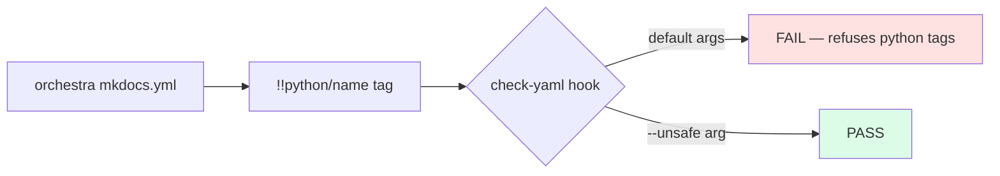

# BUG-007: mkdocs.yml uses YAML python-tag that breaks strict YAML validators (check-yaml)

> **Doc ID:** BUG-007-mkdocs-yaml-python-tag-strict-validators
> **Date:** 2026-05-06
> **DRI:** Hassan Mohiddin
> **Severity:** Medium
> **Status:** Fix Applied

## Observed Behavior

`cli/templates/mkdocs.yml` contains:
```yaml
markdown_extensions:
  - pymdownx.superfences:
      custom_fences:
        - name: mermaid
          class: mermaid
          format: !!python/name:mermaid2.fence_mermaid_custom
```

The `!!python/name:` YAML tag is required by `mkdocs-mermaid2-plugin` to wire the custom fence handler. But strict YAML validators (e.g. pre-commit `check-yaml` hook from `pre-commit/pre-commit-hooks`) reject it without `--unsafe` flag:

```
could not determine a constructor for the tag 'tag:yaml.org,2002:python/name:mermaid2.fence_mermaid_custom'
  in "mkdocs.yml", line 43, column 19
```

Caught when committing SCALE init artifacts 2026-05-06.

## Expected Behavior

orchestra-shipped mkdocs.yml should either:
- Use a non-python-tag fence config (if mkdocs-mermaid2-plugin supports it)
- OR document the `--unsafe` requirement prominently in README + post-install message
- OR ship a project `.pre-commit-config.yaml` snippet pre-configured with `--unsafe`

## Steps to Reproduce

1. Repo using strict pre-commit `check-yaml` hook (default args)
2. `python -m cli.viewer install-mkdocs`
3. `git add mkdocs.yml && git commit`
4. Hook fails with the python-tag error
5. User must investigate + add `--unsafe` or skip the hook

## Environment

- orchestra v1.3.0
- pre-commit-hooks `check-yaml` (any version)
- mkdocs-mermaid2-plugin >=1.x

## Root Cause Analysis



**Root cause:** mkdocs-mermaid2-plugin's documented config relies on YAML python-tags for fence wiring. Strict YAML validators (PyYAML's safe loader) refuse python-tags by default for security reasons (arbitrary Python attribute resolution). orchestra ships the documented config without alerting users to the validator conflict.

## Fix Description

Three fixes (recommend all three):

**1. Post-install message warning** in `cli.viewer install_mkdocs()`:
```python
if (repo_root / ".pre-commit-config.yaml").exists():
    print("NOTE: Your repo uses pre-commit. The mkdocs.yml uses a YAML python-tag")
    print("  required by mkdocs-mermaid2-plugin. Update your check-yaml hook:")
    print("    args: [--unsafe]")
    print("  Otherwise commits will fail with a python-tag error.")
```

**2. README addition** documenting the `--unsafe` requirement.

**3. Optional template `.pre-commit-config.yaml` patch** — `cli/templates/precommit-yaml-patch.txt` showing the exact addition.

Files:
- `cli/viewer.py` — post-install detection + message
- `README.md` — Tier 3 section addendum
- `cli/templates/precommit-yaml-patch.txt` — NEW template

## Iteration Log

| Date | Hypothesis | Change | Result |
|---|---|---|---|
| 2026-05-06 | (none yet — bug filed for v1.4 fix) | — | — |
| 2026-05-10 | Python-tag is required by mkdocs-mermaid2-plugin (no non-tag alternative); inform users at install-time + provide patch template. | `cli/viewer.py` `install_mkdocs()` emits post-install warning when `.pre-commit-config.yaml` present, citing `--unsafe` requirement and template path; new `cli/templates/precommit-yaml-patch.txt`; `README.md` Tier 3 section gains `--unsafe` note. | Status: Investigating → Fix Applied. No automated test added — install warning is observational. |

## Regression Prevention

- Test `test_install_mkdocs_warns_on_precommit_config` — fixture repo with `.pre-commit-config.yaml` → warning in stdout
- Documentation regression: README must contain "--unsafe" string in Tier 3 section

## Related Documents

- LLD-003: `docs/features/003-v1.3-doc-browser-mkdocs.md` Tier 3 design
- mkdocs-mermaid2-plugin: https://github.com/fralau/mkdocs-mermaid2-plugin
- BUG-006: related framework-detection theme

## Changelog

| Date | Change |
|---|---|
| 2026-05-06 | Filed during SCALE init commit attempt. SCALE pre-commit `check-yaml` rejected mkdocs.yml until `--unsafe` arg added to `.pre-commit-config.yaml`. Status: Investigating. Target fix: v1.4. |
