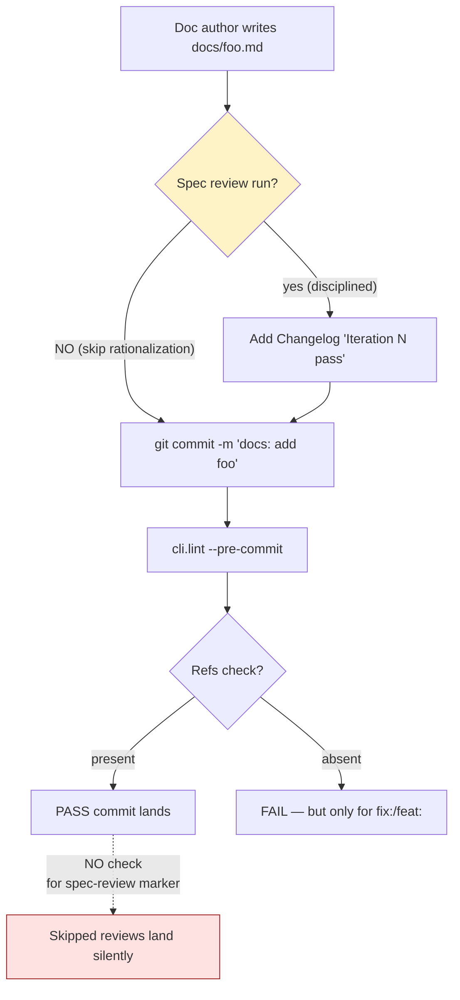

# BUG-008: Gate 3 spec review has no enforcement — humans/agents skip it under load

> **Doc ID:** BUG-008-spec-review-gate3-no-enforcement
> **Date:** 2026-05-06
> **DRI:** Hassan Mohiddin
> **Severity:** Critical
> **Status:** Investigating

## Observed Behavior

orchestra philosophy + STANDARDS.md mandate Gate 3 (spec review) on every doc before commit. Yet across 2026-05-06 session 2, the operating Claude agent skipped Gate 3 **twice**:

1. **v1.2 implementation plan** committed without spec review. User caught it. Retroactive review found 2/4 gates failing (Completeness — Task 1 stale state; Consistency — mild LLD-overlap in Task 1+2 What sections). 7 fixes applied + iteration 2 passed 4/4.
2. **State-of-orchestra handoff doc** (this directory) committed without spec review. User caught it again. Retroactive review found 4/4 pass + 1 minor inaccuracy (phantom test file row).

Pattern: doc → commit → user catches missing review → retroactive review → fixes. Two-strike pattern in single session.

## Expected Behavior

Gate 3 fires automatically on every doc commit. If the doc lacks a "Iteration N spec review — X/4 gates pass" Changelog entry, the commit fails with:

```
error: docs/plans/X.md committed without spec review.
       Add Changelog entry: "Iteration N spec review — X/4 gates pass" or run review now.
       Override: --no-verify (NOT recommended).
```

User does not need to remember. Claude does not need to remember. The commit hook enforces.

## Steps to Reproduce

1. Create a new `docs/**.md` file (any type — Feature LLD, Bug Report, Plan, Status snapshot)
2. Write content
3. `git add` + `git commit -m "docs: add x"`
4. Currently: commit succeeds even without spec-review marker
5. Expected: commit fails with the error above

Reproducible end-to-end in any orchestra-managed repo.

## Environment

- orchestra v1.0.0 — v1.3.0 (all versions affected)
- Both manual and AI-driven workflows
- Especially severe under: long sessions, fatigue, time pressure, "this doc is small / different / a snapshot" rationalization

## Root Cause Analysis



**Root cause:** Discipline is enforced for `fix:`/`feat:` commits via Refs:-line check (`cli.lint --pre-commit`), but **Gate 3 spec review on `docs:` commits is enforced by HUMAN MEMORY ONLY**. There is no automated check that a doc was reviewed before commit.

**Why human memory fails (4 contributing factors observed in 2026-05-06 session):**

1. **Subtype rationalization.** "This isn't a Feature LLD — it's a status snapshot / handoff / changelog update — Gate 3 doesn't apply." Wrong (STANDARDS.md says ANY doc), but the rationalization is sticky.
2. **Long-session fatigue.** Spec review takes 2-5 min per doc. Many docs in one session. Skipping feels like a tiny shortcut. Cumulative effect: discipline degrades over time.
3. **Speed pressure.** When user asks "compact + start fresh" or similar, agent prioritizes throughput over ceremony.
4. **No tooling cue.** Refs:-line check fails commit visibly. Spec review absence fails silently. Asymmetry.

This bug compounds with BUG-001 (no real interactive prompts) — both stem from "discipline by markdown, not by code."

## Fix Description

**Phase 1 (v1.4 ship): cli.lint enforcement.**

Extend `cli/lint.py` `lint_doc()` to check for spec-review marker in Changelog:

```python
SPEC_REVIEW_MARKER_RE = re.compile(
    r"\|\s*\d{4}-\d{2}-\d{2}\s*\|.*?Iteration\s+\d+\s+spec\s+review\s+[—-]\s+(\d)/4\s+gates?\s+pass",
    re.IGNORECASE,
)

def lint_doc(path: Path) -> list[Finding]:
    findings = ...  # existing logic
    text = path.read_text()
    # New check: if doc has Changelog section, must contain ≥1 spec-review entry
    if "## Changelog" in text:
        matches = SPEC_REVIEW_MARKER_RE.findall(text)
        if not matches:
            findings.append(Finding(
                "error", str(path),
                "Changelog has no 'Iteration N spec review — X/4 gates pass' entry. "
                "Run spec review before commit. See orchestra docs/bugs/BUG-008.",
            ))
    return findings
```

Apply only to `docs/**/*.md` (not skill markdown, not README, not CHANGELOG.md). Allow `--no-spec-review` flag for emergencies. Document escape hatch.

**Phase 2 (post-v1.4): commit-msg hook addition.** Hook scans staged docs for marker. Belt-and-suspenders with cli.lint.

**Phase 3 (v1.5+): skill-level reinforcement.** Update `orchestra:design-docs` SKILL.md with explicit instruction: "Before EVERY commit that touches `docs/**/*.md`, you MUST run spec review and add the Changelog marker. No exceptions for 'small' updates, status snapshots, handoff docs, or changelog-only edits. The lint will block your commit otherwise — but trust discipline first, lint is the safety net."

**Files to change in v1.4:**

- `cli/lint.py` — new SPEC_REVIEW_MARKER_RE + check in `lint_doc()` + escape-hatch flag
- `tests/test_cli_lint_spec_review.py` — NEW — test marker present, absent, malformed, escape-hatch
- `eval/scenarios/spec-review-marker-enforced.json` — NEW — write a doc without marker, run lint, expect fail
- `skills/design-docs/SKILL.md` — add explicit Gate 3 instruction (Phase 3)
- `docs/STANDARDS.md` — document the marker convention as canonical (Changelog must include "Iteration N spec review — X/4 gates pass")
- `README.md` — document the escape-hatch flag

## Iteration Log

| Date | Hypothesis | Change | Result |
|---|---|---|---|
| 2026-05-06 | (none yet — bug filed for v1.4 fix) | — | — |

## Regression Prevention

The fix IS the regression prevention. Once `cli.lint` enforces the marker, the only way to skip Gate 3 is `--no-spec-review` (logged + visible). Memory failure is no longer sufficient cause for skipping.

Tests:
- `test_lint_doc_fails_without_spec_review_marker` — new doc without "Iteration N spec review" → lint error
- `test_lint_doc_passes_with_marker` — marker present → no error
- `test_lint_doc_passes_with_skip_flag` — `--no-spec-review` overrides
- `test_marker_regex_matches_canonical_format` — valid: "Iteration 2 spec review — 4/4 gates pass"
- `test_marker_regex_rejects_malformed` — invalid: "review done", "spec checked", etc.

Manual smoke: after v1.4 ships, future Claude sessions should hit the lint error on attempted skip and self-correct. Track via "BUG-008 self-corrected commit" log entries.

## Related Documents

- LLD-001: `docs/features/001-design-docs-init.md` — `cli.lint --pre-commit` original spec
- BUG-001: `docs/bugs/BUG-001-init-flow-not-interactive.md` — sibling "discipline by markdown not code" pattern
- philosophy: `docs/design/orchestra-philosophy.md` Section 3 (Solution Architecture) — discipline is product
- STANDARDS.md "Spec Review Rule" section
- documentation-gate.md (SCALE) Gate 3

## Changelog

| Date | Change |
|---|---|
| 2026-05-06 | Filed during 2026-05-06 session 2 after Gate 3 was skipped TWICE (v1.2 plan + this doc's parent handoff). User identified the pattern, requested root cause + bug filing. Status: Investigating. Severity: Critical (compounds with BUG-001 to make discipline-by-markdown the deepest plugin defect class). Target fix: v1.4. |
| 2026-05-06 | Iteration 1 spec review — 4/4 gates pass. Meta-test passed: BUG-008 itself reviewed before commit, demonstrating the discipline it documents. |
