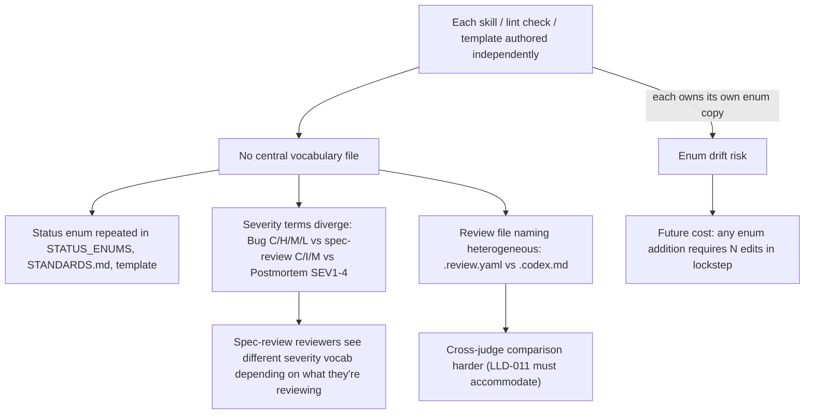

# BUG-016 — Scattered Controlled Vocabulary + Naming Conventions Lack a Single Canon

> **Doc ID:** BUG-016-scattered-vocabulary-no-canon
> **Date:** 2026-05-11
> **Status:** Investigating
> **Severity:** Medium
> **DRI:** Hassan
> **Iteration:** 1

---

## Observed Behavior

Orchestra has multiple controlled vocabularies (status enums, severity enums, verdict enums, doc-type names, file-naming conventions) that are **defined and enforced in multiple disconnected locations**, with at least one outright inconsistency between locations.

Concrete examples of the scatter:

| Vocabulary | Definitions found in | Notes |
|---|---|---|
| Status enum per doc-type — **definitions** | `cli/lint.py:62-72` (`STATUS_ENUMS`), `docs/STANDARDS.md:67-104` (per-type sections), `cli/templates/standards-default-7.md:46-107` | Three+ sources of truth; drift risk. |
| Status enum per doc-type — **consumers/parsers** | `cli/templates/mkdocs_hooks.py:15` (regex extracts `Status:` from metadata block) | Reads enum values; not a definition. Listed here so migration audits the read paths too. |
| Canon-frozen statuses subset | `cli/lint.py:75-77` (`CANON_FROZEN_STATUSES`), `cli/templates/standards-default-7.md:167`, `docs/STANDARDS.md` (implicit) | Used by L1, L2, L3 lint paths. |
| Refs:-eligible prefixes | `cli/lint.py:81-84` (`REFS_ELIGIBLE_PREFIXES`), `docs/STANDARDS.md` (table form) | Two sources. |
| Allowed attestation path prefixes | `cli/lint.py:90-94` (`ALLOWED_ATTESTATION_PATH_PREFIXES`) | Single source today, but conceptually overlaps with Refs:-eligible. |
| Severity enum — Bug Reports | `docs/STANDARDS.md:57` (`Critical \| High \| Medium \| Low`), `cli/templates/standards-default-7.md:39` | Two sources, but consistent. |
| Severity enum — spec-review findings | `skills/spec-review/attestation-schema-v1.0.json` (`Critical \| Important \| Minor`), `skills/spec-review/prompt-template.md:64-67` | **Different terms** vs Bug-Report severity. |
| Severity enum — Postmortem | `cli/templates/standards-default-7.md:42` (`SEV1-4`) | Yet another term family. |
| Severity enum — Runbook | `cli/templates/standards-default-7.md:43` (`P1-P3`) | Yet another. |
| Verdict enum | `skills/spec-review/attestation-schema-v1.0.json` (`pass \| conditional_pass \| fail`) | Single source; will be re-used by v2 sub-judges per LLD-011. |
| Doc-type enum | `cli/lint.py:62-72` keys, `docs/STANDARDS.md:13-25` table, `skills/spec-review/attestation-schema-v1.0.json:14` regex | Three sources. |
| Required-sections per doc-type | `docs/STANDARDS.md:115-222`, `cli/templates/standards-default-7.md` (mirror), `skills/spec-review/references/4-gate-rubric.md` (implicit reference) | Two+ sources. |
| Review-doc filename conventions | `docs/reviews/<doc-id>-rN.review.yaml` (orchestra, hard-coded in `cli/spec_review.py:108-109`), `docs/reviews/<doc-id>-rN.codex.md` (codex, observed on disk; no canon) | No canon. Heterogeneous extensions/suffixes. |
| Lifecycle terminal states | `Superseded`, `Rejected`, `Archived` — all appear in `STATUS_ENUMS` per doc-type but semantics not formalized | Per-type semantics scattered across `STANDARDS.md` lifecycle sections + `cli/templates/standards-default-7.md:184-186`. |

---

## Expected Behavior

A **single canonical vocabulary** exists for each enum and naming convention. Every code path and every doc references that canon directly. No enum is defined in two places. Drift is impossible because there is only one source.

Specifically:

1. One YAML/JSON canon file (e.g. `docs/design/controlled-vocabulary.md` with embedded canonical tables, OR `docs/vocabulary/canon.yaml` for machine readability) defines:
   - `status_enum_per_doc_type` (replaces `cli/lint.py § STATUS_ENUMS`)
   - `canon_frozen_statuses` (replaces `cli/lint.py § CANON_FROZEN_STATUSES`)
   - `refs_eligible_prefixes`
   - `allowed_attestation_path_prefixes`
   - `severity_enums` (one entry per consumer: Bug, Postmortem, Runbook, spec-review-finding) — but the **per-consumer values are explicitly reconciled** so reviewers don't see Critical/Important/Minor in one place and Critical/High/Medium/Low in another for the same conceptual axis.
   - `verdict_enum`
   - `doc_type_enum`
   - `required_sections_per_doc_type`
   - `review_doc_filename_conventions` (per peer-judge format)
2. `cli/lint.py` loads enums from canon at import time (no inline `set` literals).
3. `cli/templates/standards-default-7.md` is **generated from canon**, not hand-maintained.
4. `docs/STANDARDS.md` is either the canon itself OR explicitly delegates to the canon.
5. A new lint check (L5 or extension to L1) verifies that every doc's metadata uses values present in the canon — strict enum match, no heuristics.

---

## Steps to Reproduce

Run from the repo root. All commands use `rg` (ripgrep) for recursive, portable regex matching — basic `grep` without `-r` fails on directory arguments and lacks portable `\s` handling.

```bash
# 1. Find all status enum definitions and parser/consumers
rg -n "STATUS_ENUMS|Investigating|Root Cause Found|Fix Applied" \
    cli/ docs/STANDARDS.md cli/templates/

# 2. Find severity term inconsistency (Bug uses High/Medium/Low; spec-review uses Important/Minor)
rg -n "Critical\s*[|,]\s*(High|Important)" docs/ cli/ skills/

# 3. Observe review-file naming heterogeneity
ls docs/reviews/
# → Mix of .review.yaml (orchestra), .codex.md (codex), no enforced suffix canon
```

Each command surfaces the same vocabulary defined in 2+ places. Verified against the repo state at 2026-05-11 commit `dea9f1e`.

---

## Environment

- **Branch:** main
- **Component:** cross-cutting — `cli/lint.py`, `cli/templates/`, `docs/STANDARDS.md`, `skills/spec-review/`, `skills/design-docs/`
- **Trigger:** discussed during LLD-011 (spec-review v2) grilling session; surfaced as a blocker for tight PDSA enum validation. PDSA can ship without canon (heuristic checks); upgrades to strict enum match when canon lands.

---

## Root Cause Analysis



Root cause: orchestra grew skill-by-skill; each skill owned its own copy of the vocabularies it needed, plus `STANDARDS.md` accumulated a parallel human-readable copy, plus templates accumulated a third copy. No commit or design pass ever enforced "one canon, one location."

This is a textbook **Design-Doc-decay-by-accumulation** pattern. Not introduced by any single feature; emerged from the absence of a vocabulary-canon design decision.

---

## Fix Description

**Out of scope for this BUG.** This BUG-016 catalogues the defect and pins context. Fix design happens in a dedicated Design Doc effort (parallel session — see handoff at `docs/HANDOFF-BUG-016.md`).

High-level fix direction (subject to that session's grill):

1. Decide canon location and format: Design Doc (`docs/design/controlled-vocabulary.md`) vs new directory (`docs/vocabulary/canon.yaml`) vs `STANDARDS.md` upgrade.
2. Migrate `cli/lint.py § STATUS_ENUMS`, `CANON_FROZEN_STATUSES`, `REFS_ELIGIBLE_PREFIXES`, `ALLOWED_ATTESTATION_PATH_PREFIXES` to load from canon.
3. Migrate templates to be canon-generated (or canon-referencing).
4. Reconcile severity term families across Bug / Postmortem / Runbook / spec-review (or formally accept that they are different axes and document why).
5. Settle review-doc filename convention.
6. Add L5 lint check: every doc's metadata enum values appear in canon.
7. Update LLD-011 LLD to reference canon for PDSA strict-enum-match upgrade.

---

## Iteration Log

| Iteration | Date | Hypothesis | Change | Observed result | User verified? |
|---|---|---|---|---|---|
| 1 | 2026-05-11 | — | BUG filed during LLD-011 grill | Doc created; handoff written | Pending |

---

## Regression Prevention

After fix:

- L5 lint check (new): strict enum match against canon for every doc's metadata block.
- L1 / L2 / L3 lint checks load enums from canon (no inline copies).
- Template-generation pipeline (or test): `cli/templates/standards-default-7.md` regenerated from canon on every release; CI test confirms generated output matches committed file.
- Spec-review v2 PDSA strict-enum-match upgrade (one-line change per check) lands when canon ships.

---

## Related Documents

- BUG-014 — L4 doc-id-burn rejects bare-name design supersession (related: filename grammar inconsistency).
- LLD-011 — `docs/features/011-spec-review-v2.md` (in design, parallel grilling 2026-05-11) — orchestra:spec-reviewer v2 (multi-sub-judge + PDSA). PDSA ships with heuristic checks; tightens when this BUG closes.
- `cli/lint.py:62-94` — current scattered enums.
- `docs/STANDARDS.md` — current human-readable copy.
- `cli/templates/standards-default-7.md` — current template copy.
- `skills/spec-review/attestation-schema-v1.0.json` — current spec-review severity / verdict.
- `docs/HANDOFF-BUG-016.md` — handoff for parallel design session.

---

## Changelog

| Date | Entry |
|---|---|
| 2026-05-11 | BUG filed during LLD-011 (spec-review v2) grilling session. Surfaced as orthogonal concern: LLD-011's PDSA Phase 2 ships with heuristic enum checks; upgrades to strict match when BUG-016 canon lands. Status: Investigating. |
