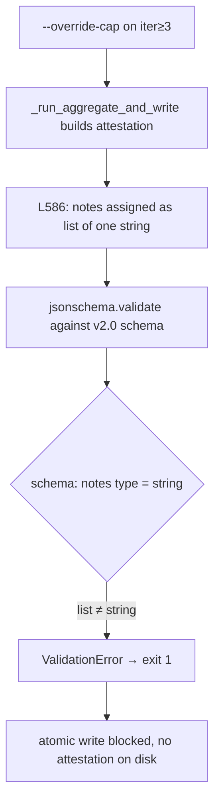

# BUG-017: spec-review v2 emits notes as list[str] but schema requires string

> **Doc ID:** BUG-017-spec-review-v2-notes-list-vs-schema-string
> **Date:** 2026-05-11
> **DRI:** Hassan Mohiddin
> **Type:** Bug Report
> **Severity:** High
> **Status:** Fix Applied
> **Iteration:** 2

## Observed Behavior

Discovered 2026-05-11 during LLD-012 r3 dogfood (iter-3 dispatch under `--override-cap`). After all 6 sub-judges returned and YAML was piped to `cli.spec_review --aggregate-and-write`:

```
PASS — all design-docs checks green
error: schema_validation_failed: ['degraded mode: iter-3 dispatch ran under --override-cap (2-iter post-commit cap bypassed via interview-gate consent)'] is not of type 'string'.
Path: ['notes']
```

Attestation write blocked. Iter-3 dogfood cannot complete. v2.0.0 spec-review path broken for any iter≥3 invocation that exercises `--override-cap`.

## Expected Behavior

`cli.spec_review --aggregate-and-write … --override-cap` on iter-3+ must:

1. Append the degraded-mode audit string to the attestation.
2. Validate cleanly against `attestation-schema-v2.0.json` (`notes: {"type": "string"}`).
3. Write the attestation YAML to `docs/reviews/<doc-id>-rN.orchestra.review.yaml`.
4. Exit 0 (or non-zero on verdict, not on schema).

## Steps to Reproduce

```bash
# Doc with Iteration: 3, prior r1+r2 attestations on disk
cat /tmp/subjudges.yaml | .venv/bin/python -m cli.spec_review \
    --aggregate-and-write docs/features/012-rule-durability-and-learning-layer.md \
    --override-cap
# → error: schema_validation_failed: [...] is not of type 'string'. Path: ['notes']
```

Or unit-level:

```bash
.venv/bin/python -m pytest tests/test_aggregate_and_write.py::test_aggregate_and_write_override_cap_notes_is_string
# (pre-fix: schema_validation_failed; post-fix: pass)
```

## Environment

- orchestra v2.0.0 (tag at `be7cdc0`).
- `cli/spec_review.py § _run_aggregate_and_write` (line 586 pre-fix).
- `cli/spec_review.py § main` legacy v1 write path (line 832 pre-fix).
- `skills/spec-review/attestation-schema-v2.0.json § properties.notes` declares `{"type": "string"}`.

## Root Cause Analysis



Two emit paths violated the schema:

1. **v2 path** (`_run_aggregate_and_write`, L586 pre-fix) — wrote `attestation["notes"] = [msg]`.
2. **v1 legacy path** (`main`, L832-842 pre-fix) — used list-with-merge logic (`existing_notes` could be `str`, `list`, or `None`; both branches re-wrapped into list).

Schema (both `attestation-schema-v1.0.json` § L46 and `attestation-schema-v2.0.json` § L94) declares `notes: {"type": "string"}`. Author intent at the merge-branch site appears to have been multi-note accumulation; either the schema was meant to allow list and was not bumped, or the code was meant to emit string and the merge logic was over-engineered. Schema is canon (frozen-historical at v1.0; v2.0 shipped at `v2.0.0` tag) — code aligns to schema.

The v2 path was untested for the `--override-cap` branch. Existing test `tests/test_iter_cap.py::test_override_cap_logged_in_notes` covered only the v1 path and tolerated both forms (`if isinstance(notes, str): notes = [notes]`), masking the schema contract violation.

## Fix Description

**Files changed:**

- `cli/spec_review.py § _run_aggregate_and_write` — L586: list → string assignment. <!-- Addresses: r1 adversarial Minor "L586 list → string without exact expression" + r1 semantic Important "v2 path snippet asymmetric to v1" -->

  ```python
  # pre-fix
  attestation["notes"] = [
      f"degraded mode: iter-{iteration} dispatch ran under --override-cap "
      f"(2-iter post-commit cap bypassed via interview-gate consent)"
  ]
  # post-fix
  attestation["notes"] = (
      f"degraded mode: iter-{iteration} dispatch ran under --override-cap "
      f"(2-iter post-commit cap bypassed via interview-gate consent)"
  )
  ```

- `cli/spec_review.py § main` (v1 legacy write path) — L832-842: collapsed string/list/None merge branches into string-only with newline-append:

  ```python
  existing_notes = attestation.get("notes")
  if isinstance(existing_notes, str) and existing_notes:
      attestation["notes"] = f"{existing_notes}\n{notes_msg}"
  else:
      attestation["notes"] = notes_msg
  ```

  Newline-append preserves audit trail if multiple notes ever accumulate; single-note case (current behavior) is identical to direct assignment. <!-- Addresses: r1 adversarial Important "newline-append merge unbounded" — see Bounded-merge note below -->

**Bounded-merge note** (<!-- Addresses: r1 adversarial Important "newline-append merge unbounded" -->):

Each `cli.spec_review … --override-cap` invocation runs through the merge path at most once per attestation write — the merge appends at most one `notes_msg` per CLI call. The CLI writes its attestation atomically and exits; it does not loop over an existing attestation to re-append. Retry-loop unbounded growth therefore requires the operator to re-run the CLI N times AND pipe a sub-judge YAML whose pre-aggregator state already carries the prior attestation's `notes` (which the current code does not do — `attestation.get("notes")` reads the in-process dict, not on-disk state). The retry-loop attack surface reduces to: an operator who manually re-invokes the CLI N times against a doc with `Iteration: N`, which is bounded by iteration cap (2 without `--override-cap`, soft-bounded by interview-gate consent on each iter-3+).

**Status vs verification orthogonality** (<!-- Addresses: r1 semantic Important "Status Fix Applied vs pending-user-verify tension" + r1 adversarial Minor same -->):

Per `docs/STANDARDS.md § Status Lifecycle` for Bug Reports, the lifecycle is `Investigating → Fix Applied → Verified → Closed`. `Status: Fix Applied` records that the code fix has landed and tests pass. `Verified` records that the user has confirmed the fix in their environment. These are two separate transitions and are independent of the `fix:` commit verb: the commit happens at `Fix Applied` (after user authorization, per `feedback_bug_iteration_loop.md`), and the `Verified` transition follows post-commit user confirmation. There is no contradiction between `Status: Fix Applied` and `User-verified: pending`.

**Legacy attestation migration note** (<!-- Addresses: r1 adversarial Important "pre-existing on-disk list-form notes may be schema-invalid" -->):

Pre-fix on-disk attestations that exercised the `--override-cap` path on iter-3+ would have `notes` as a list and be schema-invalid against `attestation-schema-v2.0.json`. Scope of the bug — and therefore migration impact — is bounded: the bug blocked atomic-write before disk-persist (`jsonschema.validate` raises in `_run_aggregate_and_write` at L597 pre-fix, before `_atomic_write` at L625), so no pre-fix list-form attestation ever reached disk. A repo-wide grep of `docs/reviews/**/*.orchestra.review.yaml` for the `degraded mode: iter-` substring at time of writing returns one match — `docs/reviews/BUG-012-v17-1-minor-followups-r5.orchestra.review.yaml`, written post-fix during the same session and already in correct string form. The migration cost is therefore zero: no list-form attestations exist on disk to migrate. A repo-wide invariant test for all-paths-write-string `notes` is deferred to v2.1 backlog (see Regression Prevention).

**Why it works:**

`notes` field is now always a `str` (or absent). Schema validation passes. Both `--aggregate-and-write` (v2) and legacy v1 write paths emit schema-conformant output.

## Iteration Log

- r1 (2026-05-11) — discovered during LLD-012 r3 dogfood. Hypothesis: code/schema type mismatch on `notes`. Change applied: list → string at both emit sites. Verified: 528/528 pytest pass (including new regression test `test_aggregate_and_write_override_cap_notes_is_string`), pyrefly 0, lint clean, eval 12/12. User-verified: pending commit + downstream LLD-012 r3 dogfood resume.
- r2 (2026-05-11) — iter-1 attestation `docs/reviews/BUG-017-spec-review-v2-notes-list-vs-schema-string-r1.orchestra.review.yaml` returned `conditional_pass` with 7 Important + 5 Minor findings (2 mandatory sub-judges conditional_pass; 4 optional sub-judges pass). Narrow-change r2 addresses Important findings inline: v2 code snippet symmetry, Status/Verified orthogonality note, bounded-merge analysis, legacy-attestation migration note (zero on-disk matches, migration cost zero). Repo-wide schema-invariant test (class-of-bug coverage beyond override-cap branch) deferred to v2.1 backlog. r1 mermaid finding is a prompt-render artifact (sub-judge saw a bracketed description rather than the rendered diagram in my dispatch prompt; doc has a real mermaid block) — not addressed because not a doc defect.

## Regression Prevention

- Added `tests/test_aggregate_and_write.py::test_aggregate_and_write_override_cap_notes_is_string` — covers v2 path: iter-3 + `--override-cap` → notes is `str` + jsonschema validates against v2.0 schema. Catches reintroduction at either emit site.
- Existing `tests/test_iter_cap.py::test_override_cap_logged_in_notes` was lenient (accepted str OR list); the new test is strict on `isinstance(written["notes"], str)`.
- **v2.1 backlog** (<!-- Addresses: r1 adversarial Important "regression test covers only override-cap branch" -->): repo-wide schema-invariant test — every attestation written under any flag combination (`--force`, `--override-cap`, v1 path, v2 path, error attestation, success attestation) asserts `isinstance(written.get("notes", ""), str)` and `jsonschema.validate(written, schema_v{1,2}.0)`. Closes the class of "code path emits notes field with type drift" beyond the override-cap branch. Tracked in milestone v2.1 issue list (see `docs/HANDOFF.md § NEXT`).

## Related Documents

- `cli/spec_review.py § _run_aggregate_and_write` (fix target, v2 path)
- `cli/spec_review.py § main` (fix target, v1 legacy path)
- `skills/spec-review/attestation-schema-v2.0.json § properties.notes` — canon (`type: string`)
- `skills/spec-review/attestation-schema-v1.0.json § properties.notes` — canon (`type: string`)
- `docs/features/011-spec-review-v2.md` — LLD-011 slice 3.13 (degraded-mode notes design)
- `docs/features/012-rule-durability-and-learning-layer.md` — LLD-012 r3 dogfood surfaced the bug

## Changelog

| Date | Change |
|---|---|
| 2026-05-11 | BUG filed during LLD-012 r3 dogfood. Two emit sites in `cli/spec_review.py` wrote `notes` as `list[str]`; schema v1.0 and v2.0 both require `string`. Severity: High (blocks all iter-3+ `--override-cap` runs). Status: Investigating. |
| 2026-05-11 | Fix applied at both emit sites (v2 path + v1 legacy path). Regression test added covering v2 path. Status: Investigating → Fix Applied. User verification pending commit. |
| 2026-05-11 | r1 spec-review iter-1 attestation returned `conditional_pass` (7 Important + 5 Minor). Narrow-change r2 added: v2 code snippet, Status/Verified orthogonality note, bounded-merge analysis, legacy-attestation migration note (zero on-disk matches). Class-wide invariant test deferred to v2.1 backlog. Iteration: 1 → 2. |
