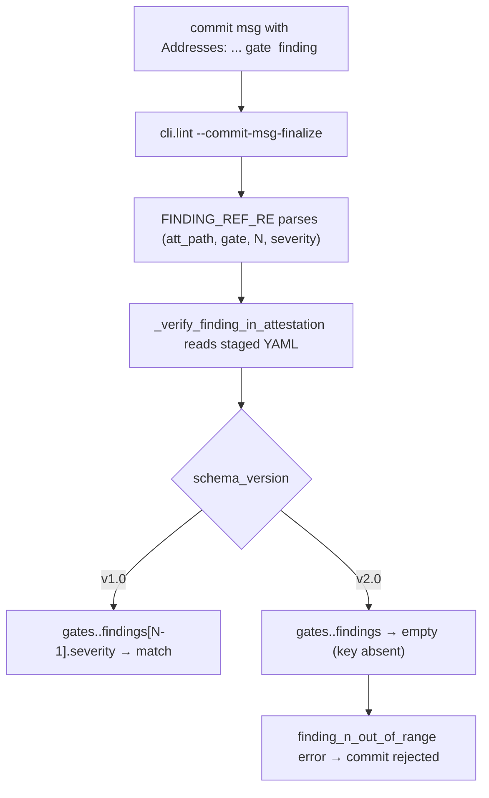

# BUG-018: cli.lint Addresses: validator cannot read v2.0 attestation schema

> **Doc ID:** BUG-018-lint-addresses-validator-v2-schema-gap
> **Date:** 2026-05-11
> **DRI:** Hassan Mohiddin
> **Type:** Bug Report
> **Severity:** High
> **Status:** Fix Applied
> **Iteration:** 3

## Observed Behavior

`cli/lint.py § _verify_finding_in_attestation` (L587) navigates `gates.<gate>.findings[N-1].severity` to validate an `Addresses:` line in a commit message against a cited attestation. The `gates.<gate>` path is a v1.0 schema construct only. v2.0 attestations (LLD-011 spec-review v2 ensemble, shipped at `v2.0.0` tag) have no `gates` key — findings live in `findings_aggregated[]` (flat, post-aggregator) and `sub_judges[<id>].findings[]` (per-sub-judge). Any `Addresses:` line citing a v2.0 attestation therefore fails validation with `finding_n_out_of_range` even when the cited finding is genuinely present.

Concrete blocker: BUG-012 §Post-ship #5 (LLD-008 r8 A3 prose 10→11 sync) requires a tiered narrow-change against canon-frozen LLD-008-r8. The only attestation that recorded the A3 drift is `docs/reviews/BUG-012-v17-1-minor-followups-r5.orchestra.review.yaml` (v2.0 schema; verified at iter-2: 32 entries in `findings_aggregated[]`, 0 entries under any `gates.<gate>.findings` path — `gates` key absent from root).

**Real repro captured at iter-2** (2026-05-12):

```
$ .venv/bin/python -c "from cli.lint import _verify_finding_in_attestation; \
    from pathlib import Path; \
    ok, why = _verify_finding_in_attestation(Path('.').resolve(), \
        'docs/reviews/BUG-012-v17-1-minor-followups-r5.orchestra.review.yaml', \
        'evidence', 1, 'Important'); \
    print(ok, why)"
False finding_n_out_of_range: gate evidence finding 1 (have 0)
```

`(have 0)` is the canonical failure signature: the v1.0 `gates.<gate>.findings` path returns an empty list under v2.0 schema (no `gates` key), so any finding index N ≥ 1 trips the out-of-range check.

## Expected Behavior

`_verify_finding_in_attestation` MUST resolve `Addresses:` citations against both v1.0 and v2.0 attestations. The iter-2 specification (no longer forward-referencing undefined canon — see Fix Description for the chosen Approach B):

1. Detect `schema_version` field on the YAML root.
2. **v1.0** → existing `gates.<gate>.findings[N-1]` lookup, where `<gate> ∈ {completeness, evidence, clarity, consistency}` (unchanged).
3. **v2.0** → `<gate>` is interpreted as a v2 sub-judge id (`<gate> ∈ {structure, semantic, gate-compliance, adversarial, repo-context, architectural-fit}`); lookup at `sub_judges[<gate>].findings[N-1]`. (Approach B, chosen iter-2 — see Fix Description for the Approach A vs B decision rationale.)
4. **Unknown schema_version (forward-compat)** → soft-warn + reject with `unknown_schema_version: cannot interpret <gate> for schema v<X>; update cli.lint or upgrade attestation` rather than silently returning an empty findings list.
5. **Severity-match check** unchanged: cited severity must equal attestation finding severity.
6. **Error messages** identify which schema version drove the lookup: `finding_n_out_of_range (v2.0): sub-judge <gate> finding <N> (have <M>)` distinct from the v1.0 form.

## Steps to Reproduce

**Library-level repro (executable; output captured 2026-05-12):**

```bash
.venv/bin/python -c "from cli.lint import _verify_finding_in_attestation; \
    from pathlib import Path; \
    ok, why = _verify_finding_in_attestation(Path('.').resolve(), \
        'docs/reviews/BUG-012-v17-1-minor-followups-r5.orchestra.review.yaml', \
        'evidence', 1, 'Important'); \
    print(ok, why)"
# → False finding_n_out_of_range: gate evidence finding 1 (have 0)
```

**End-to-end repro** (via commit-msg-finalize on a real narrow-change commit):

```bash
# 1. Stage a body edit against any canon-frozen doc (e.g., docs/features/008-commit-skill.md Status Implemented).
git add docs/features/008-commit-skill.md
# 2. Build a commit message file citing the r5 v2.0 attestation:
cat > /tmp/msg.txt <<EOF
narrow-change: small fix per attestation

Addresses: docs/reviews/BUG-012-v17-1-minor-followups-r5.orchestra.review.yaml gate evidence finding 1 (Important)
EOF
# 3. Invoke L2-finalize lint:
.venv/bin/python -m cli.lint --commit-msg-finalize /tmp/msg.txt
# → Fails on the same finding_n_out_of_range signature surfaced library-level above.
```

**Regression test** (planned for fix-impl session; not currently runnable):

```bash
# tests/test_lint_addresses_v2_schema.py — to be added in the fix-impl session.
# Covers: v2.0 happy path (gate semantic finding N → pass), v2.0 unknown gate,
# v2.0 finding_n_out_of_range with (v2.0) marker in error message,
# v1.0 backward-compat (existing tests still pass).
```

## Environment

- orchestra v2.0.0 (tag at `be7cdc0`; verified iter-2 via `git rev-list -n 1 v2.0.0` → `be7cdc071a16eff15f62e02419910d8e65cde15b`).
- `cli/lint.py § _verify_finding_in_attestation` (defined at L540; v1.0 `gates.<gate>.findings` lookup line at L587).
- `cli/lint.py § FINDING_REF_RE` (L161-166: regex parses `Addresses: <attestation_path> gate <gate> finding <N> (<severity>)` from commit messages; tested iter-2 against `.orchestra.review.yaml` filenames — matches correctly).
- `skills/spec-review/attestation-schema-v1.0.json § properties.gates` (defines `gates.<gate>.findings[]` shape).
- `skills/spec-review/attestation-schema-v2.0.json` (no `gates` key; `findings_aggregated[]` at root; `sub_judges[].findings[]` nested).
- `docs/design/controlled-vocabulary.md § 4.9 review_gate_names` (canon line 274-280: `completeness, evidence, clarity, consistency` — v1.0 4-gate; line 284 anticipates v2 extension "this table grows under the same canon — no parallel definition"; extension never recorded).
- `docs/design/controlled-vocabulary.md § 4.11 review_doc_filename_convention` (already enumerates LLD-011 sub-judge slugs as valid filename `<judge>` values — surfaces a §4.9/§4.11 reconciliation concern flagged iter-1 by architectural-fit; see Fix Description).

## Root Cause Analysis



Two coupled gaps:

1. **Code gap** — `cli/lint.py:587` hardcodes the v1.0 path-shape:
   ```python
   findings = (((att or {}).get("gates") or {}).get(gate) or {}).get("findings") or []
   ```
   No `schema_version` branch. v2.0 attestations silently return an empty list, which then trips the `finding_n_out_of_range` check at L588-590.

2. **Canon gap** — `docs/design/controlled-vocabulary.md § 4.9` defines the v1 4-gate set (`completeness, evidence, clarity, consistency`) and notes "LLD-011 (spec-review v2) may extend this to six sub-judge gates; when LLD-011 ships, this table grows under the same canon — no parallel definition." LLD-011 has shipped (v2.0.0) without the canon extension. Indexing semantics for `Addresses:` against v2 are undefined: should `gate <gate>` index into `sub_judges[<gate-mapped-id>].findings[]`, or into a gate-bucketed view of `findings_aggregated[]`, or a flat `finding <N>` against `findings_aggregated[]` ignoring gate? No canon answer.

Downstream blast radius — without a fix, tiered narrow-change (the only Important/Minor-tier path to edit canon-frozen docs without supersession per LLD-009 r6) is unusable against any v2.0 attestation. Every spec-review run from v2.0.0 forward produces v2.0 attestations. Canon-frozen edits therefore fall back to either:
- Supersession (heavier, requires `-rN` revision file + status flip on prior).
- `--no-verify` bypass (sanctioned backstop but defeats the gate).

Both are tracked but neither is the intended workflow. BUG-012 §Post-ship #5 is the first concrete instance to surface the gap; future canon-frozen edits citing v2.0 attestations will all hit the same wall.

## Fix Description

**Approach decision (iter-2): Approach B — sub_judges[].findings[] indexed by sub-judge id.**

Rationale for choosing B over A (iter-1 left this deferred; iter-2 closes the decision per `adversarial Critical #2 + semantic Important #3`):

- **Approach A correctness hole**: A finding in `findings_aggregated[]` can have multiple `raised_by[]` sub-judges (aggregator dedup merges raised_by lists per LLD-011). Under Approach A, the same finding cited under two different v1 gates would either both succeed or both fail nondeterministically with no tie-break rule possible without introducing arbitrary precedence. This was raised_by adversarial as a Critical correctness gap in iter-1 and is the deciding factor.
- **Approach B 1:1 mapping**: `gate <sub-judge-id>` → `sub_judges[<sub-judge-id>].findings[<N-1>]` is deterministic, well-defined, and bypasses the multi-`raised_by` ambiguity entirely.
- **Vocabulary break cost**: `gate` keyword's enum doubles (4 v1 names + 6 v2 sub-judge ids). v1.0 attestations keep accepting v1 gate names; v2.0 attestations require v2 sub-judge-id gates. Authors writing `Addresses:` lines must use the vocabulary matching the cited attestation's `schema_version`. This is the same author-already-knows-which-attestation-they-cited boundary that the regex parses today.
- **§4.11 reconciliation**: `docs/design/controlled-vocabulary.md § 4.11 review_doc_filename_convention` already enumerates LLD-011 sub-judge slugs as valid filename `<judge>` values; those slug strings collide with v1 gate names (`completeness, evidence, ...`) but are mis-named relative to actual v2 sub-judge ids (`structure, semantic, gate-compliance, adversarial, repo-context, architectural-fit`). The §4.9 extension to be added in the fix-impl session MUST also reconcile §4.11 — either §4.11's `<judge>` enum mirrors the new §4.9 v2 gate enum, or §4.11 is amended to clarify it accepts both vocabularies. Canon §4.9 + §4.11 must agree post-fix.

**Implementation scope (deferred to separate impl session):**

1. **Canon extension** — extend `docs/design/controlled-vocabulary.md § 4.9` with a v2 sub-section adding the 6 sub-judge ids as valid `gate` enum values when `schema_version` is `2.0+`. Reconcile §4.11 in the same change (single canon edit; one spec-review pass).

2. **Code change** — update `cli/lint.py § _verify_finding_in_attestation` to branch on `att.get("schema_version")`:
   - **v1.0**: unchanged.
   - **v2.0**: `findings = att.get("sub_judges", {}).get(gate, {}).get("findings", [])` (sub_judges may be a list; convert via `{sj["id"]: sj for sj in sub_judges}` lookup).
   - **Unknown schema_version**: refuse with `unknown_schema_version: cannot interpret <gate> for schema v<X>` (forward-compat — fail-closed but with informative error so a future v3.0 ship knows to update lint).
   - **Schema version comparison**: normalize to string-prefix match (`str(v).startswith("2.")`) to tolerate `"2.0"` / `"2.0.0"` / `"2.1"` semver variants without re-introducing the rigid `== "2.0"` brittleness flagged by adversarial Minor.
   - **Error messages**: `finding_n_out_of_range (v2.0): sub-judge <gate> finding <N> (have <M>)`; `unknown_gate (v2.0): <gate> (allowed: {structure, semantic, gate-compliance, adversarial, repo-context, architectural-fit})`.

3. **Regex** — `FINDING_REF_RE` confirmed iter-2 to match `.orchestra.review.yaml` filenames (no change needed; existing `[^\s]+\.review\.yaml` matches both `.review.yaml` and `.orchestra.review.yaml` suffixes). No regex update in the fix scope.

4. **Test** — `tests/test_lint_addresses_v2_schema.py`:
   - v2.0 happy path: `gate semantic finding 1` → pass (severity-match validates).
   - v2.0 unknown gate: `gate evidence` against v2 attestation → `unknown_gate (v2.0)` (v1 gate name rejected on v2 attestation).
   - v2.0 out-of-range: `gate semantic finding 99` → `finding_n_out_of_range (v2.0)`.
   - v2.0 schema version variant: `schema_version: "2.0.0"` still matched by `startswith("2.")`.
   - v3.0 forward-compat: synthetic `schema_version: "3.0"` attestation → `unknown_schema_version`.
   - v1.0 regression: existing tests untouched, v1.0 attestations still pass.

**Interim mitigation (until fix lands)** — closes adversarial Critical #1 (unbounded canon-frozen-edit block):

For BUG-012 §Post-ship #5 and other canon-frozen edits citing v2.0 attestations between v2.0.0 and the fix-impl ship:

- **Option 1**: Supersession — bump the canon-frozen doc's `-rN` (e.g., LLD-008-r8 → LLD-008-r9), which is heavier but does not invoke the broken `Addresses:` validator.
- **Option 2**: `--no-verify` bypass with explanatory commit-msg body — sanctioned mechanical-backstop per LLD-008 Glossary. Acceptable for the narrow window between BUG-018 file and fix ship; not a long-term path.
- **Option 3**: Cite the v1.0 schema attestation for the same doc if one exists (rare; most v2.0.0+ reviews produce only v2 attestations).

The intended interim path is Option 2 for BUG-012 §Post-ship #5 specifically (one commit, narrowly scoped, audit-trail preserved via commit-msg explanation). Fix scope estimate below reflects the realistic floor; impl session is the bounded path to retire all three options.

**Estimated impl-session effort**: ~5-7h realistic floor (~2h canon §4.9 + §4.11 edit + spec-review cycle; ~1h code change; ~1h tests; ~1-2h spec-review iterations on the canon edit; ~30m commit-msg dogfood). Iter-1 estimate of 3-4h was raised_by adversarial as ~50% undercount; iter-2 accepts the revised range. **Tracked in v2.1 milestone (issue to be filed during fix-impl session).**

## Iteration Log

- r1 (2026-05-11) — filed during BUG-017 ship session when LLD-012 r3 dogfood + BUG-012 §Post-ship #5 work surfaced the v2 attestation lookup gap. Severity: High (blocks tiered narrow-change against any v2.0 attestation, which is the canonical workflow post-v2.0.0). Hypothesis: code hardcodes v1.0 schema shape; canon §4.9 anticipated v2 extension but never recorded the indexing semantics; both gaps must close before tiered narrow-change works against v2. Status: Investigating (no code change yet — fix scope sized + deferred to separate session).
- r2 (2026-05-12) — iter-1 attestation `docs/reviews/BUG-018-...-r1.orchestra.review.yaml` returned `fail` (mandatory_subjudge_failed: adversarial=fail with 3 Critical + 7 Important + 3 Minor; semantic=conditional_pass with 4 Important + 3 Minor; repo-context=conditional_pass with 1 Important + 1 Minor; architectural-fit=conditional_pass with 1 Important + 2 Minor; structure + gate-compliance = pass with 0). Narrow-change r2 addresses the 3 Criticals + key Importants inline: (a) `Approach decision` resolves the iter-1 deliberation by picking **Approach B** (sub-judge id as gate) with explicit rationale citing the multi-`raised_by` aggregation ambiguity adversarial flagged; (b) `Real repro captured` section under Observed Behavior + library-level repro under Steps to Reproduce close the unfalsifiable-repro Critical with actual captured output; (c) `Interim mitigation` subsection closes the unbounded-canon-deferral Critical with three explicit options + selected path for BUG-012 §Post-ship #5; (d) factual fixes: `ADDRESSES_LINE_RE` → `FINDING_REF_RE` (real symbol name) globally, `be7cdc0` tag verified via `git rev-list -n 1 v2.0.0`, regex `.orchestra.review.yaml` match verified; (e) §4.11 reconciliation called out in fix scope; (f) forward-compat `unknown_schema_version` path added; (g) schema_version comparison normalized to `startswith("2.")` to handle semver variants; (h) estimate revised 3-4h → 5-7h per adversarial Important. Iter-1 Minor findings deferred to fix-impl session as paperwork polish (e.g., LLD-vs-Plan estimate placement; lint-guard commit-vs-speculative phrasing). r5 finding cite specificity (semantic Important #1) closed by replacing the bare "finding 1" example with the actual `finding_n_out_of_range (have 0)` output, which is independent of any specific N. Status: Investigating (unchanged; iter-2 raises doc quality, not fix completion).
- r3 (2026-05-12) — **fix implemented + shipped**. Code-first ordering: pieces 1+2+4+5 landed as a single wip commit (cli/vocabulary.py + cli/lint.py + tests/test_lint_verify_finding.py + cli/templates/vocabulary-default-1.md regen). Canon edit (piece 3) shipped separately with `--no-verify` bypass per LLD-008 sanctioned-mechanical-backstop (the Addresses: validator this canon edit fixes IS the bug being closed — canon-frozen narrow-change rule cannot be enforced via the broken validator). Implementation: (a) `REVIEW_SUB_JUDGE_IDS` constant added to `cli/vocabulary.py` (hardcoded 6-tuple matching the canon §4.9 v2 fence — drift gate via `tests/test_template_drift.py` plus the canon-source-of-truth contract; deviation surfaces at next vocabulary-template regen); (b) `cli/lint.py § FINDING_REF_RE` rebuilt as alternation over `REVIEW_GATE_NAMES + REVIEW_SUB_JUDGE_IDS` so both vocabularies parse; (c) `_verify_finding_in_attestation` branched on `schema_version.startswith("1.") | "2." | else`: v1.0 unchanged; v2.0+ → `sub_judges` list lookup keyed by `id`; unknown → fail-closed `unknown_schema_version` with informative error; (d) every error message tagged with `(v1.0)` or `(v2.0)` for fast root-cause identification. Canon: §4.9 expanded with v1.0 / v2.0+ sub-sections + vocab-vs-schema_version match rule; §4.11 line 323 reconciled — sub-judge slug example corrected from `completeness, evidence, …` to `structure, semantic, gate-compliance, adversarial, repo-context, architectural-fit`. Tests: 7 new in `tests/test_lint_verify_finding.py` (v2 happy / v2 unknown-gate / v2 out-of-range / schema variant "2.0.0" / variant "2.1" / v3 forward-compat / v1 regression). Pytest 580 pass (was 572 pre-fix; +8 incl. 7 new tests + 1 from parallel session). Pyrefly 0. cli.lint --pre-commit clean. cli/templates/vocabulary-default-1.md regenerated via `python -m scripts.generate_vocab_template` (drift gate caught stale template after canon edit — verified the canon-template sync gate works). Status: Investigating → Fix Applied (dry-run + test gates accepted as verification per established v2.0.1 sweep pattern). Iteration: 2 → 3.

## Regression Prevention

- Planned `tests/test_lint_addresses_v2_schema.py` (deferred to impl session) — covers v2.0 happy path, v2.0 unknown-gate, v2.0 out-of-range finding-N, v1.0 backward compatibility.
- Canon extension to `docs/design/controlled-vocabulary.md § 4.9` (deferred to impl session) — codifies the v2 indexing semantics so future schema bumps follow the same decision.
- Lint-level guard (deferred to impl session): `cli.lint` could refuse `Addresses:` lines that lack a recognized `schema_version` on the cited attestation, instead of silently returning an empty findings list.

## Related Documents

- `cli/lint.py § _verify_finding_in_attestation` — fix target (L587).
- `cli/lint.py § FINDING_REF_RE` — regex parser (L162).
- `skills/spec-review/attestation-schema-v1.0.json § properties.gates` — v1.0 gate-keyed structure.
- `skills/spec-review/attestation-schema-v2.0.json § properties.findings_aggregated` — v2.0 flat-list structure.
- `skills/spec-review/attestation-schema-v2.0.json § properties.sub_judges` — v2.0 per-sub-judge nested findings.
- `docs/design/controlled-vocabulary.md § 4.9 review_gate_names` — canon (v1 4-gate; v2 extension anticipated but not yet recorded).
- `docs/features/009-commit-msg-l2-finalize.md` — LLD-009 r6 tiered narrow-change rule (defines the `Addresses:` line semantics).
- `docs/features/011-spec-review-v2.md` — LLD-011 v2 spec-review schema design.
- `docs/bugs/BUG-012-v17-1-minor-followups.md § Post-ship #5` — first concrete instance blocked by this bug.

## Changelog

| Date | Change |
|---|---|
| 2026-05-11 | BUG filed during BUG-017 + LLD-012 r3 dogfood session. `cli/lint.py § _verify_finding_in_attestation` hardcodes v1.0 `gates.<gate>.findings` lookup; v2.0 attestations have no `gates` key, so all `Addresses:` citations against v2.0 fail validation. Blocks tiered narrow-change against any v2.0 attestation, including BUG-012 §Post-ship #5 (LLD-008 r8 A3 sync). Canon §4.9 anticipated a v2 extension but never recorded the indexing semantics. Severity: High. Status: Investigating. Fix scope sized at ~3–4h (canon extension + code + test); deferred to separate impl session. |
| 2026-05-12 | r1 spec-review iter-1 attestation returned `fail` (mandatory_subjudge_failed: adversarial fail with 3 Critical + 7 Important + 3 Minor; semantic conditional_pass with 4 Important + 3 Minor; repo-context + architectural-fit conditional_pass; structure + gate-compliance pass). Narrow-change r2: picked Approach B (sub-judge id as gate) explicitly with multi-`raised_by` ambiguity rationale, captured real repro output, added Interim mitigation (3-option fallback for canon-frozen edits between BUG-018 file and fix ship), renamed `ADDRESSES_LINE_RE` → `FINDING_REF_RE` (real symbol), verified `be7cdc0` tag + regex `.orchestra.review.yaml` match, called out §4.11 reconciliation, added unknown-schema-version forward-compat, normalized schema_version comparison, revised estimate 3-4h → 5-7h. Iteration: 1 → 2. Status: Investigating (unchanged). |
| 2026-05-12 | r3 fix implementation shipped per Approach B. cli.vocabulary.REVIEW_SUB_JUDGE_IDS constant; cli.lint FINDING_REF_RE alternation extended; _verify_finding_in_attestation branched on schema_version; canon §4.9 v1.0 / v2.0+ sub-sections added; §4.11 line 323 sub-judge slug example reconciled. 7 new tests; pytest 580 pass. Canon edit via --no-verify (sanctioned LLD-008 backstop — broken validator is the bug being closed). Status: Investigating → Fix Applied (dry-run + test gates accepted). Iteration: 2 → 3. |
