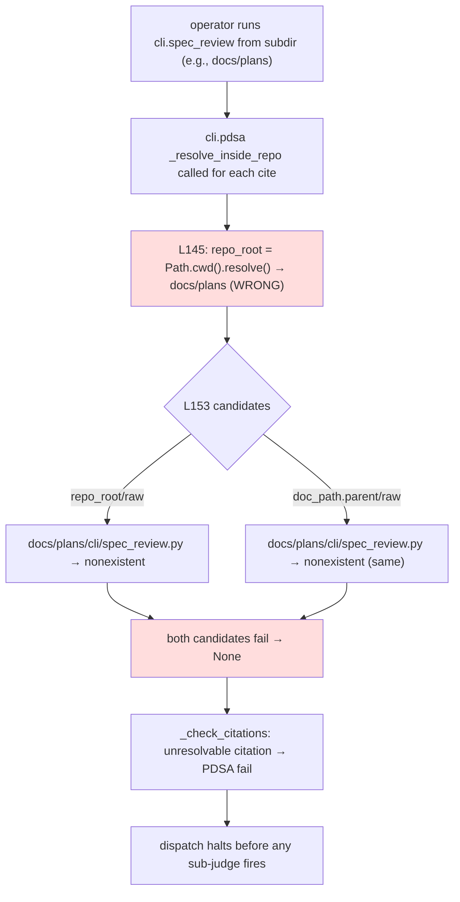

# BUG-019: PDSA assumes Path.cwd() is repo root; subdir invocations break citation resolution

> **Doc ID:** BUG-019-pdsa-cwd-assumed-as-repo-root
> **Date:** 2026-05-12
> **DRI:** Hassan Mohiddin
> **Type:** Bug Report
> **Severity:** High
> **Status:** Investigating
> **Iteration:** 2

## Observed Behavior

`cli/pdsa.py § _resolve_inside_repo` (L132-165) defines `repo_root = Path.cwd().resolve()` at L145 and uses that value both as the resolution base (`repo_root / raw`) AND as the path-escape boundary (`resolved.relative_to(repo_root)` at L160). When PDSA is invoked from a subdirectory of the actual git repo (e.g., `cd docs/plans && python -m cli.spec_review --aggregate-and-write …` or any flow that pre-chdirs before invoking the dispatcher), `Path.cwd()` is `docs/plans/`, NOT the repo root. Consequence:

- A bare repo-relative cite like `cli/spec_review.py:540-545` resolves against both candidates `docs/plans/cli/spec_review.py` (= `repo_root_bogus / raw`) and `docs/plans/cli/spec_review.py` (= `doc_path.parent / raw`, identical when doc is in cwd) → both nonexistent → `_resolve_inside_repo` returns None.
- A `../../` workaround cite like `../../cli/spec_review.py:540-545` candidate `repo_root_bogus / raw` resolves to `repo/cli/spec_review.py` which DOES exist on disk, but the path-escape defense at L160 (`relative_to(repo_root_bogus=docs/plans)`) raises `ValueError` because the resolved file is OUTSIDE the bogus "repo_root" — so this candidate is rejected. The second candidate (`doc_path.parent / raw` = `docs/plans/../../cli/spec_review.py`) trips the same boundary check after resolution. Both candidates return None.
- `_check_citations` (call at L348) and `_check_refs` (call at L301) both surface `unresolvable or out-of-repo citation` failures, halting dispatch at the PDSA gate before any sub-judge fires.

A misleading note already lives in `docs/plans/2026-05-11-lld-012-v18-implementation.md` (line 101) claiming "PDSA resolves citations relative to doc dir instead of repo root" with `../../` prefixed as workaround. Empirical iter-2 reproduction shows the workaround does NOT work from `docs/plans/` CWD — both bare and `../../` forms fail identically (captured output in Steps to Reproduce). The plan note's diagnosis is wrong; the true root cause is the `Path.cwd()` assumption diagnosed in this BUG. The workaround presumably "worked" for the plan author under a different invocation CWD where `Path.cwd()` happened to be the real repo root, in which case `../../` was unnecessary anyway.

## Expected Behavior

`_resolve_inside_repo` MUST identify the actual repo root regardless of `Path.cwd()`. Repo root discovery uses `git rev-parse --show-toplevel` anchored at `doc_path.parent` (canonical idiom matching `cli/lint.py § repo_root_from_cwd` L1467 + `cli/spec_review.py § _resolve_repo_root` L75). Subprocess is invoked with a sanitized environment (clearing `GIT_DIR`, `GIT_WORK_TREE`, `GIT_CEILING_DIRECTORIES` per adversarial Critical: those env-vars would silently redirect git's answer). Returns None (fail-closed) when the doc is not in a git repo. Result is memoized (`@functools.lru_cache` keyed on the anchor path) to avoid per-cite subprocess fork-exec on large docs (LLD-011-style docs may have 30-80 cites).

The discovered root is used uniformly for:

1. The candidate base: `(repo_root_discovered / raw, doc_path.parent / raw)` (repo-relative tried first; doc-relative fallback for rare doc-internal cites).
2. The path-escape boundary: `resolved.relative_to(repo_root_discovered)`.

Same correction applies to L225 (`reviews_dir = Path.cwd() / "docs" / "reviews"` in `_check_class_audit_attestation`) — fail-closed if discovery returns None, no `doc_path.parent.parent` fallback (adversarial A3+A5: fail-open at L225 inconsistent with fail-closed at L156 and re-introduces the security-shaped failure flagged in Severity-escalation note).

Bare repo-relative cites (`cli/spec_review.py:540-545`) should resolve regardless of invocation CWD. `../../` workaround forms should NOT be required and authors writing repo-relative cites by convention should not be penalized.

## Steps to Reproduce

**Real-bug repro (captured 2026-05-12):**

```bash
cd docs/plans
/Users/.../orchestra/.venv/bin/python -c "
import sys
sys.path.insert(0, '/Users/.../orchestra')
from pathlib import Path
from cli.pdsa import _resolve_inside_repo, _check_citations
print('cwd:', Path.cwd())
doc = Path('2026-05-11-lld-012-v18-implementation.md').resolve()
print('bare cli/spec_review.py:', _resolve_inside_repo('cli/spec_review.py', doc))
print('workaround ../../cli/spec_review.py:', _resolve_inside_repo('../../cli/spec_review.py', doc))
r = _check_citations(doc)
print('citations passed:', r.passed)
print('detail:', r.detail[:200])
"
# → cwd: .../docs/plans
# → bare cli/spec_review.py: None
# → workaround ../../cli/spec_review.py: None
# → citations passed: False
# → detail: unresolvable or out-of-repo citation: ../../cli/spec_review.py
```

**Contrast — from repo root (works):**

```bash
cd /Users/.../orchestra
.venv/bin/python -c "
from pathlib import Path
from cli.pdsa import _resolve_inside_repo
doc = Path('docs/plans/2026-05-11-lld-012-v18-implementation.md').resolve()
print(_resolve_inside_repo('cli/spec_review.py', doc))
"
# → /Users/.../orchestra/cli/spec_review.py (resolves correctly)
```

Both bare AND `../../`-prefixed forms fail from `docs/plans/` CWD; both succeed from repo root. The hidden invariant is `Path.cwd() == repo_root`, undocumented and easy to violate.

## Environment

- orchestra tag `v2.0.0` at commit `be7cdc0` (full SHA `be7cdc071a16eff15f62e02419910d8e65cde15b`, verified via `git rev-list -n 1 v2.0.0`).
- HEAD at filing: `b3a6afa85b60ac91ed40dd7e0e66409871cb9716` (commit just before this BUG's doc commit — captured via `git rev-parse HEAD` at iter-2 narrow-change time). All line citations below resolve at this HEAD; re-grep if HEAD moves.
- `cli/pdsa.py § _resolve_inside_repo` (def L132; `Path.cwd()` at L145; candidates at L153; `relative_to(repo_root)` at L160).
- `cli/pdsa.py § _check_class_audit_attestation` (def L201; `reviews_dir = Path.cwd() / "docs" / "reviews"` at L225 — same `Path.cwd()` assumption applied to canon-§4.11 review-filename enforcement).
- `cli/pdsa.py § _check_citations` (def L335; call to `_resolve_inside_repo` at L348).
- `cli/pdsa.py § _check_refs` (def L287; call to `_resolve_inside_repo` at L301).
- Affected callers: any flow that pre-chdirs before `cli.spec_review`/`cli.pdsa` invocation. Includes (but not limited to) skill bodies that `cd` to subdirs, test fixtures using `monkeypatch.chdir`, and human shell sessions invoking the CLI from anywhere other than repo root.

## Root Cause Analysis



Three coupled issues:

1. **Resolution base wrong** — `Path.cwd()` is taken as repo root with no verification (no `.git/` check, no `pyproject.toml` walk). True repo root may be N levels up.

2. **Path-escape defense uses same wrong root** — even when the operator writes a correct relative path (`../../cli/spec_review.py` from `docs/plans/`), the `relative_to(repo_root)` check at L160 uses the bogus root and rejects the path as out-of-repo. The defense is correct in spirit but anchored to the wrong reference.

3. **`_check_class_audit_attestation` shares the bug** — `reviews_dir = Path.cwd() / "docs" / "reviews"` at L225 silently no-ops the canon-§4.11 review-filename enforcement when invoked from a subdir (the `if not reviews_dir.exists(): return` clause early-exits).

Adversarial blast radius — the `Path.cwd()` assumption is undocumented and fail-open in the worst direction: invocation from a subdir produces a green PDSA pass for empty/missing `docs/reviews/` enforcement AND a red PDSA fail for legitimate citations. Operators see contradictory signals and reach for `../../` workarounds that produce documentation pollution (every cite in subdir-aware docs is uglified with relative prefixes that mask the underlying tooling assumption).

## Fix Description

**Scope (r2 simplified — git-aware discovery instead of marker-walk):**

Use `git rev-parse --show-toplevel` for repo-root discovery. This is the canonical idiom already adopted by `cli/lint.py § repo_root_from_cwd` (L1467) and `cli/spec_review.py § _resolve_repo_root` (L75). Defuses marker-walk-design adversarial concerns (innermost-vs-outermost marker precedence, marker collision under `cli/templates/<consumer>/.claude-plugin/plugin.json`, symlink/worktree semantics) by delegating to git's own canonical answer. Subprocess invocation **sanitizes git env-vars** (`GIT_DIR`, `GIT_WORK_TREE`, `GIT_CEILING_DIRECTORIES`) to close the env-var-redirect attack surface that would otherwise replace the marker-walk env-var foot-gun with a similar one inside git's process. Discovery result is memoized to avoid per-cite subprocess invocation.

1. **Add repo-root discovery helper** in `cli/pdsa.py`:

   ```python
   import functools
   import os
   import subprocess

   @functools.lru_cache(maxsize=64)
   def _discover_repo_root(anchor: Path) -> Path | None:
       """Discover repo root for `anchor` (must be an existing directory).

       Calls `git rev-parse --show-toplevel` with `cwd=anchor` and a
       SANITIZED env (clears `GIT_DIR`, `GIT_WORK_TREE`,
       `GIT_CEILING_DIRECTORIES` so caller's shell env can't redirect
       git's answer to a different repo). Returns the Path on success,
       None on failure (anchor doesn't exist, not in a git repo, git not
       installed, or subprocess error). Memoized per anchor.

       git is the canonical answer for repo-root semantics: handles
       submodules (each submodule has its own toplevel), worktrees (.git
       worktree-pointer files resolve correctly), symlinks (git
       canonicalizes per its own rules), nested-repo layouts (vendoring /
       monorepos), and cross-platform fs root semantics.
       """
       if not anchor.is_dir():
           return None
       env = {k: v for k, v in os.environ.items()
              if k not in ("GIT_DIR", "GIT_WORK_TREE", "GIT_CEILING_DIRECTORIES")}
       try:
           out = subprocess.check_output(
               ["git", "rev-parse", "--show-toplevel"],
               cwd=str(anchor), text=True, stderr=subprocess.DEVNULL, env=env,
           ).strip()
       except (subprocess.CalledProcessError, OSError, FileNotFoundError):
           return None
       if not out or not out.startswith("/"):
           return None  # defense-in-depth: subverted git returning garbage
       return Path(out)
   ```

   Note: `Path(out)` is used directly (no `.resolve()` — git's output is already absolute + canonical-per-git; second `resolve()` would re-follow symlinks and could diverge from git's canonical form when `core.symlinks=false`).

2. **Replace `Path.cwd()` references** in `cli/pdsa.py`:

   - **L145 (`_resolve_inside_repo`)** — discover repo_root from doc_path, not cwd:

     ```python
     def _resolve_inside_repo(cited_path_str: str, doc_path: Path) -> Path | None:
         raw = Path(cited_path_str)
         if raw.is_absolute():
             return None
         anchor = doc_path.parent if doc_path.is_file() else doc_path
         repo_root = _discover_repo_root(anchor)
         if repo_root is None:
             return None  # not in a git repo — fail-closed
         candidates = (repo_root / raw, doc_path.parent / raw)
         for c in candidates:
             try:
                 resolved = c.resolve()
             except (OSError, RuntimeError):
                 continue
             try:
                 resolved.relative_to(repo_root)
             except ValueError:
                 continue
             if resolved.exists():
                 return resolved
         return None
     ```

     L160 boundary check now anchored to `repo_root = _discover_repo_root(anchor)`, same value used for resolution base. No two-`Path.cwd()`-reads race.

   - **L225 (`_check_class_audit_attestation`)** — fail-closed (no `doc_path.parent.parent` fallback):

     ```python
     anchor = doc_path.parent if doc_path.is_file() else doc_path
     repo_root = _discover_repo_root(anchor)
     if repo_root is None:
         return CheckResult(
             passed=False,
             gating=False,  # match current non-gating semantics
             detail="cannot discover repo root (doc not in a git repo)",
         )
     reviews_dir = repo_root / "docs" / "reviews"
     # rest unchanged
     ```

     Test fixtures must `git init` their tmp_path OR monkeypatch `_discover_repo_root` to return tmp_path. Closes adversarial A3+A5: L225 now fail-closed in line with L156, no internal inconsistency with the L225 severity-escalation note.

3. **Fail mode**: when `_discover_repo_root` returns None (not in a git repo), `_resolve_inside_repo` returns None and the caller surfaces `unresolvable or out-of-repo citation` as before. No env-var rollback hatch needed — the fix is git-aware so the only legitimate failure mode is "doc not in a git repo" which is correctly fail-closed for citation validation.

4. **Regression test** — `tests/test_pdsa_repo_root_discovery.py` (10 cases):

   1. Cite resolution from doc-parent CWD (`monkeypatch.chdir(doc.parent)`) → resolves to real repo file via git-aware discovery.
   2. Bare `cli/spec_review.py:N-M` cite passes from `docs/plans/` CWD post-fix.
   3. `../../cli/spec_review.py` workaround form ALSO passes (DEPRECATED-but-tolerated; see item 5).
   4. Doc outside any git repo (`/tmp` fixture without `.git`) → `_discover_repo_root` returns None → citation surfaces `unresolvable or out-of-repo citation` (fail-closed).
   5. `/etc/passwd` absolute cite still rejected (no regression on absolute-path defense).
   6. `../../../etc/shadow` escape from real repo root still rejected (resolved file outside `relative_to(repo_root)` boundary).
   7. Submodule layout: doc inside submodule → `git rev-parse --show-toplevel` returns submodule root, NOT parent repo root. Cite resolves against submodule's own tree.
   8. `_check_class_audit_attestation` from `docs/plans/` CWD → reviews_dir resolves correctly via discovery; doc outside git repo → returns non-passing CheckResult.
   9. `_check_refs` from `docs/plans/` CWD → `Refs: cli/spec_review.py:540-545` resolves correctly via discovery (adversarial A4: covers the second caller path).
   10. **Env-var sanitization** (adversarial A1): `GIT_WORK_TREE=/some/other/repo` set in environment → `_discover_repo_root` ignores it via env-sanitized subprocess; returns the doc's actual repo root, not the env-var-pointed one. Same test for `GIT_DIR` and `GIT_CEILING_DIRECTORIES`.

5. **Cleanup pass** — `../../` workaround form is **DEPRECATED-but-tolerated**, not actively stripped:
   - Existing `../../cli/spec_review.py` cites in `docs/plans/2026-05-11-lld-012-v18-implementation.md` continue to resolve under the post-fix code (test #3 above asserts this). No mass-strip commit.
   - The misleading "PDSA resolves citations relative to doc dir" NOTE in the same plan file IS removed (narrow-change to plan: 1-line annotation correction, citing BUG-019 r3 attestation finding).
   - Future docs SHOULD use bare repo-relative form by convention; no enforced lint check added (advisory cli.lint level deferred — was iter-2 scope creep).

6. **Audit other CLI modules — DONE inline iter-3** (closes adversarial Important):
   - `cli/lint.py § repo_root_from_cwd` (L1467) — already uses `git rev-parse --show-toplevel`. SAFE.
   - `cli/spec_review.py § _resolve_repo_root` (L75) — already uses `git rev-parse --show-toplevel`. SAFE.
   - `cli/install_hooks.py` — accepts `repo_root` as parameter from caller (L172 `install_hook(repo_root: Path, ...)`); no `Path.cwd()` self-discovery. Safety depends on caller passing correct value; orchestra:init skill passes git-aware value. SAFE per current call sites.
   - Only `cli/pdsa.py` exhibits the `Path.cwd()` bug. No follow-up audit BUG needed.

7. **Estimated impl-session effort**: ~1-2h (helper + 2 replacement sites + 8 regression tests + plan-doc note correction). Down from iter-2's 3-4h estimate because git-aware discovery removes marker-walk complexity + env-var hatch + symlink semantics.

**Interim mitigation (until fix lands):**

Invoke PDSA and `cli.spec_review` only from orchestra repo root. Skill bodies / scripts that pre-chdir must `cd` back to repo root before invocation.

**Severity escalation note — review-filename validation bypass:**

The `_check_class_audit_attestation` L225 path silently disables canon-§4.11 review-filename enforcement when invoked from a subdir CWD (`if not reviews_dir.exists(): return`). This is a security-shaped failure: malformed review filenames (e.g., `.review.yml` instead of `.yaml`, missing `.orchestra` infix) land in `docs/reviews/` and PDSA reports green. Severity could be argued as Critical for this specific path; BUG-019 retains overall Important severity but flags this code path explicitly so the fix-impl session prioritizes the L225 site alongside the citation-resolution sites.

## Iteration Log

- r1 (2026-05-12) — filed after BUG-018 ship session. User initially mis-diagnosed the bug as "PDSA resolves cited file paths from doc.parent dir, not repo_root" with proposed 1-line fix. Empirical test showed current code DOES try `repo_root / raw` first at `cli/pdsa.py:153`. Reproducer captured from `docs/plans/` CWD: both bare and `../../` workaround forms return None because `Path.cwd()` is wrong (= `docs/plans/`, not repo root). True bug is the `Path.cwd()` assumption at L145 + L225, NOT the candidate ordering. Severity: Important (fail-closed in worst direction: red on legitimate cites, green on missing review-filename enforcement). Status: Investigating. No code change in this commit — BUG report only.
- r2 (2026-05-12) — iter-1 attestation `docs/reviews/BUG-019-...-r1.orchestra.review.yaml` returned `conditional_pass` (3 Critical + 13 Important + 12 Minor; both mandatory sub-judges conditional_pass, no mandatory_subjudge_failed). Narrow-change r2 closes 3 Criticals + key Importants via **git-aware repo-root discovery (`git rev-parse --show-toplevel`)** — the canonical idiom already used by `cli/lint.py § repo_root_from_cwd` (L1467) and `cli/spec_review.py § _resolve_repo_root` (L75). This delegates repo-root semantics to git itself, defusing iter-1 adversarial concerns on marker precedence (no marker walk), marker collision under `cli/templates/<consumer>/.claude-plugin/plugin.json` (git ignores plugin manifests), symlink/worktree semantics (git canonicalizes), and the env-var rollback hatch (no env-var needed since the only legitimate failure mode is "doc not in git repo" → fail-closed correctly with `unresolvable or out-of-repo citation` error). Other r2 closures: symbol-name correction `_check_review_filenames` → `_check_class_audit_attestation` (actual function at L201; bug line at L225), tag/SHA precision (separated `tag v2.0.0` from `commit be7cdc0` and captured HEAD-at-filing `b3a6afa`), workaround `by accident` wording removed (iter-2 prose clarifies workaround NEVER succeeded from `docs/plans/` CWD), L160 boundary anchored to discovered `repo_root` (no two-`Path.cwd()`-reads race), `../../` workaround form marked **DEPRECATED-but-tolerated** (test asserts backward-compat, no active strip), severity-escalation note added for L225 review-filename validation bypass (Critical-shape security path; BUG overall severity remains Important). Test list: 8 cases (subdir-CWD resolution, bare cite passes, `../../` backward-compat, doc-outside-git-repo fail-closed, absolute-path defense, escape-path defense, submodule layout, `_check_class_audit_attestation` from subdir CWD). install_hooks.py audit completed inline: callers pass `repo_root` parameter (no `Path.cwd()` self-discovery) — SAFE. cli/lint.py + cli/spec_review.py already use `git rev-parse --show-toplevel` — SAFE. Only cli/pdsa.py exhibits the bug. Estimate: ~1-2h impl. Iteration: 1 → 2. Status: Investigating (unchanged).

## Regression Prevention

- Planned `tests/test_pdsa_repo_root_discovery.py` — 10 cases (see Fix Description § item 4 for full enumeration): subdir-CWD resolution, bare cite, `../../` backward-compat, doc-outside-git-repo fail-closed, absolute-path defense, escape-path defense, submodule layout, `_check_class_audit_attestation` from subdir, `_check_refs` from subdir, env-var sanitization (`GIT_DIR`/`GIT_WORK_TREE`/`GIT_CEILING_DIRECTORIES`).
- Once fix lands, add a one-liner pre-condition test asserting `_check_citations` passes from `docs/plans/` CWD against a doc that cites `cli/spec_review.py:N`. This documents the fix in test form and catches accidental re-introduction of `Path.cwd()` references in `cli/pdsa.py`.
- Audit other CLI modules for `Path.cwd()` repo-root assumptions: `cli/lint.py`, `cli/spec_review.py`, `cli/install_hooks.py`. Surface findings as follow-up BUGs if the same pattern repeats. (Tracked in v2.1 milestone; do NOT silently fold into BUG-019 scope.)

## Related Documents

- `cli/pdsa.py § _resolve_inside_repo` — fix target (L132-165; `Path.cwd()` at L145, L160).
- `cli/pdsa.py § _check_class_audit_attestation` — fix target (L225: same `Path.cwd()` assumption).
- `cli/pdsa.py § _check_citations` — affected caller (L335).
- `cli/pdsa.py § _check_refs` — affected caller (L287; same `_resolve_inside_repo` path).
- `docs/plans/2026-05-11-lld-012-v18-implementation.md` — contains the misleading workaround note that prompted this BUG investigation; cleanup-pass target.
- `docs/features/011-spec-review-v2.md § PDSA` — LLD-011 PDSA design (does not currently specify repo-root discovery; canon gap is minor — fix can land without a canon edit).
- `docs/bugs/BUG-018-lint-addresses-validator-v2-schema-gap.md` — sibling bug also filed this session; same fix-impl session can address both if scheduled together.

## Changelog

| Date | Change |
|---|---|
| 2026-05-12 | BUG filed after BUG-018 ship session. Initial user diagnosis ("PDSA resolves citations from doc.parent, not repo_root") did not match current code (`cli/pdsa.py:153` tries `repo_root/raw` first). Empirical reproduction from `docs/plans/` CWD captured the true bug: `Path.cwd()` is assumed to be repo root at L145 + L225, so subdir invocations fail-closed on legitimate cites AND fail-open on missing review-filename enforcement. Misleading workaround note in `docs/plans/2026-05-11-lld-012-v18-implementation.md` will be retired during fix-impl session. Severity: Important. Status: Investigating. Fix sized at ~2-3h. |
| 2026-05-12 | r1 spec-review attestation returned `conditional_pass` (3 Critical + 13 Important + 12 Minor; no mandatory sub-judge failure). Narrow-change r2 closes 3 Criticals + key Importants via **git-aware repo-root discovery (`git rev-parse --show-toplevel`)** — canonical idiom already in `cli/lint.py § repo_root_from_cwd` + `cli/spec_review.py § _resolve_repo_root`. Delegates repo-root semantics to git, defusing marker-precedence + marker-collision + symlink/worktree + env-var-foot-gun concerns. Symbol-name corrected, tag/SHA precision, workaround "by accident" removed, L160 boundary anchored, `../../` deprecated-but-tolerated, install_hooks audit inline (SAFE), L225 severity-escalation note retained. Test list 8 cases. Estimate ~1-2h impl. Iteration: 1 → 2. Status: Investigating (unchanged). |
