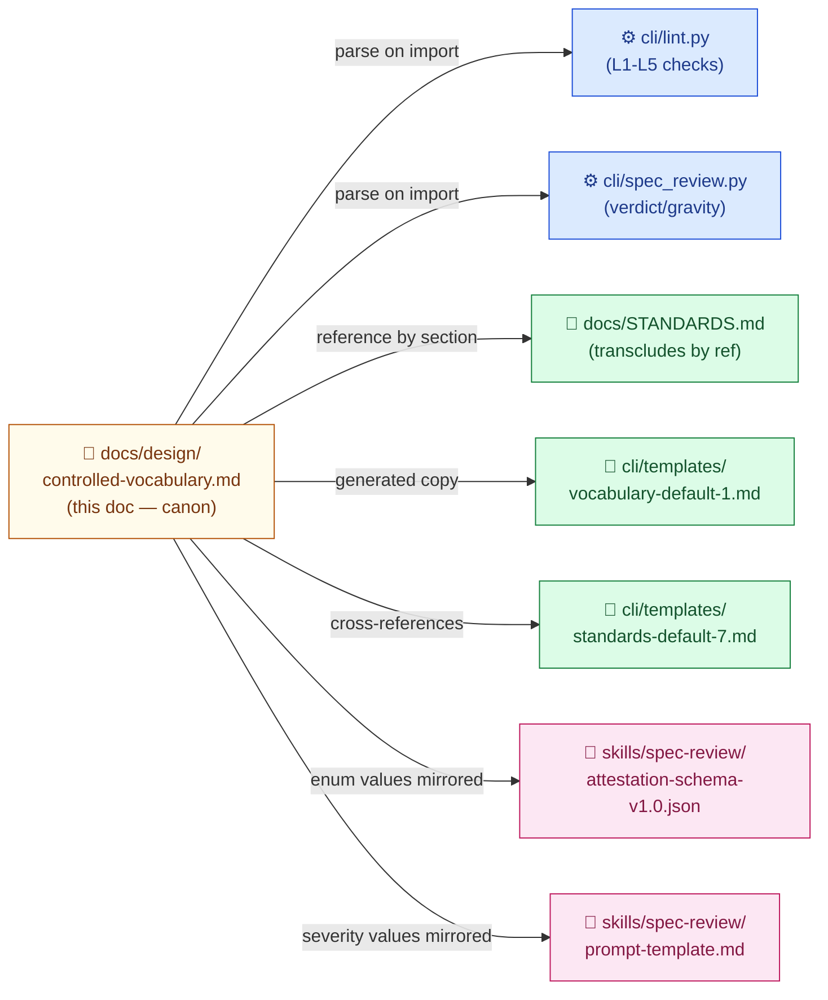
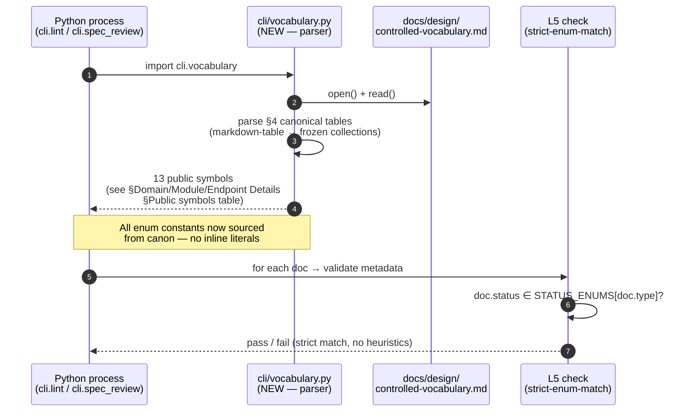
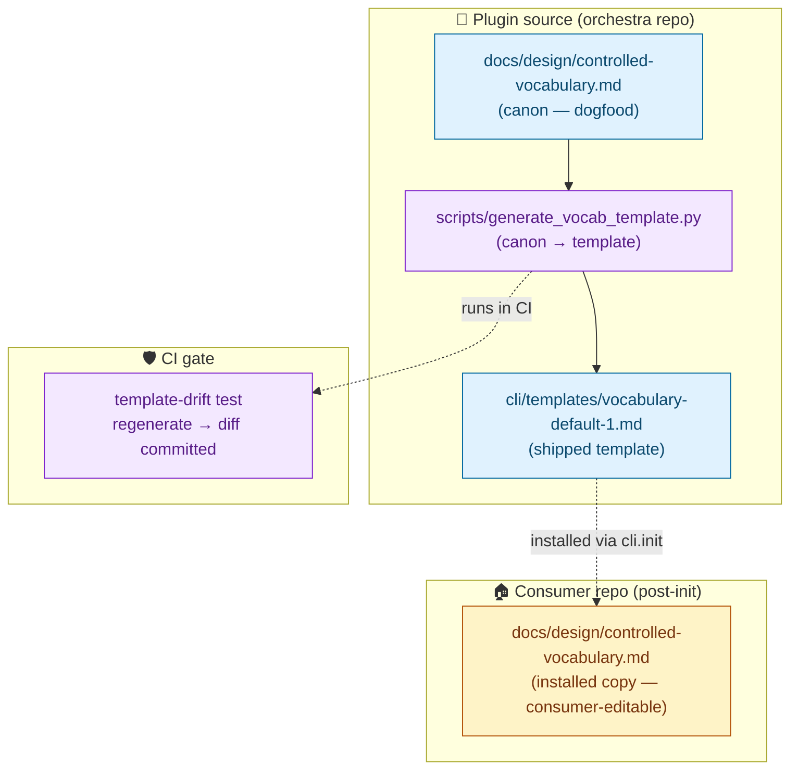

# Orchestra — Controlled Vocabulary Canon

> **Doc ID:** controlled-vocabulary
> **Date:** 2026-05-11
> **DRI:** Hassan Mohiddin
> **Type:** Design Doc (living)
> **Status:** Current
> **Iteration:** 7
> **Last Updated:** 2026-05-11
> **Version:** 1.6

---

## Overview

This Design Doc is the **single canonical source** for every controlled vocabulary and naming convention orchestra defines. Each enum and naming pattern appears here exactly once. Every other location (code, templates, schemas, peer docs) **reads from** or **mirrors** this canon — never re-defines values.

**Why this exists.** `docs/bugs/BUG-016-scattered-vocabulary-no-canon.md § Observed Behavior` catalogues at least 12 vocabularies defined in 2+ disconnected locations (`cli/lint.py § STATUS_ENUMS`, `docs/STANDARDS.md`, `cli/templates/standards-default-7.md`, `skills/spec-review/attestation-schema-v1.0.json`, `skills/spec-review/prompt-template.md`). The enumerated list with citation to every duplicate location lives in BUG-016's table; do not re-list here. Drift had already occurred: spec-review finding severity (`Critical | Important | Minor`) at `skills/spec-review/attestation-schema-v1.0.json:58` silently diverged from Bug Report severity (`Critical | High | Medium | Low`) at `docs/STANDARDS.md:57` for the same conceptual axis. Each future enum edit required N synchronized edits across files with no enforcement. This doc terminates that pattern.

**What this doc IS.**

- The **machine-parseable** canon for every controlled vocabulary in orchestra.
- The **human-readable** explanation of each enum's purpose and why values differ between axes.
- The **contract** that `cli/lint.py`, `cli/templates/`, `skills/spec-review/`, and `skills/design-docs/` consume.

**What this doc is NOT.**

- A doc-shape reference. That stays in `docs/STANDARDS.md` (which **transcludes** specific tables from this doc by reference; it does not re-define enum values).
- A lifecycle/process guide. Status transitions, supersession workflow, and Refs:-line rules live in `docs/STANDARDS.md` and the relevant skill READMEs.
- An ADR. This is a LIVING Design Doc — values evolve as orchestra grows. Each material edit appends to §Changelog.

**Consumer placement.** Sibling to `docs/STANDARDS.md`. Decision recorded in BUG-016 session 2026-05-11 (Hassan, Q1).

**Template placement.** `cli/templates/vocabulary-default-1.md` ships this doc as the canonical template installed into consumer repos. Same versioning scheme as `cli/templates/standards-default-7.md` (filename embeds template version; bumps on incompatible canon change).

---

## Architecture

### Diagram 1 — Canon → Consumers (component view)



Canon is the sole writer of vocabulary values. Every other artifact is a reader or a generated mirror.

### Diagram 2 — Enum load path (data flow on import)



`cli/lint.py § STATUS_ENUMS / CANON_FROZEN_STATUSES / REFS_ELIGIBLE_PREFIXES / WHITELIST_FRONTMATTER_FIELDS / ALLOWED_ATTESTATION_PATH_PREFIXES / REQUIRED_SECTIONS / ALLOWED_GATES` constants (`cli/lint.py:62-130, :137`) are replaced by `from cli.vocabulary import …` at module load. The set literals are removed.

### Diagram 3 — Deployment (canon in plugin source ↔ consumer repo)



Two-tier model: plugin's own `docs/design/controlled-vocabulary.md` is canon for the **orchestra repo itself** (dogfood). The template at `cli/templates/vocabulary-default-1.md` is the **generated** artifact shipped to consumers via `cli.init`. A CI test regenerates the template and diffs the committed file — drift fails CI.

---

## Canonical Tables (§4 — the canon)

All tables below are the **single source of truth**. Citations at the end of each subsection identify every current scattered copy that this canon replaces.

**Source-of-truth rule.** Where this canon and `cli/lint.py` disagree today (notably §4.8 required-sections), the canon is authoritative; lint code is treated as **under-specified** and extension to lint is filed as a follow-up task (see §Migration Tasks in the migration plan at `docs/plans/2026-05-11-vocab-canon-migration.md`). The canon does NOT downgrade to match permissive lint code.

### 4.1 `status_enum_per_doc_type`

Each doc type has a closed set of valid `Status:` metadata values.

| doc_type | values |
|---|---|
| `feature` | `Draft`, `Proposed`, `Approved`, `In Progress`, `Implemented`, `Verified`, `Rejected`, `Superseded` |
| `bug` | `Investigating`, `Root Cause Found`, `In Progress`, `Fix Applied`, `Verified`, `Rejected`, `Superseded` |
| `adr` | `Draft`, `Proposed`, `Approved`, `Implemented`, `Superseded`, `Rejected` |
| `postmortem` | `Draft`, `Reviewed`, `Action Items Tracked`, `Closed`, `Rejected`, `Superseded` |
| `runbook` | `Current`, `Outdated`, `Deprecated`, `Rejected`, `Superseded` |
| `design` | `Current`, `Outdated`, `Deprecated`, `Rejected`, `Superseded` |

**Lifecycle ordering** (informational; enforcement is enum-membership only): see `docs/STANDARDS.md § Status Lifecycle`.

**Replaces:** `cli/lint.py:62-72 (STATUS_ENUMS)`, `docs/STANDARDS.md:67-104 (per-type lifecycle sections)`, `cli/templates/standards-default-7.md:46-107`, `cli/templates/mkdocs_hooks.py:15 (regex consumer — reads but does not define)`.

### 4.2 `canon_frozen_statuses`

Subset of statuses across all doc types where the doc is a **contract surface** — in-place edits are restricted to the narrow-change whitelist (§4.13).

```
Approved, Implemented, Verified, Fix Applied, Current
```

**Replaces:** `cli/lint.py:75-77 (CANON_FROZEN_STATUSES)`, `cli/templates/standards-default-7.md:167`.

### 4.3 `severity_enums` — four distinct named axes

Severity is **not one vocabulary**. It is four conceptually distinct axes that share the word "severity" in everyday English but measure different things. The canon names each axis explicitly and assigns each its own enum. **Forcing unification loses meaning** (decision recorded BUG-016 session 2026-05-11, Hassan Q2).

| axis name | values | what it measures | metadata field that uses it |
|---|---|---|---|
| `bug_severity` | `Critical`, `High`, `Medium`, `Low` | Defect impact on the orchestra plugin's correctness or user workflow | `Severity:` on Bug Reports |
| `finding_gravity` | `Critical`, `Important`, `Minor` | Gravity of a finding raised by spec-review against a doc | `severity` field inside spec-review attestation YAML (see naming note below) |
| `incident_severity` | `SEV1`, `SEV2`, `SEV3`, `SEV4` | Customer-incident scale (page-out, data loss, partial degradation) | `Severity:` on Postmortems |
| `page_priority` | `P1`, `P2`, `P3` | Page-priority on runbook fires | `Severity:` on Runbooks (see naming note below) |

**Page-priority value semantics.**

- `P1` — 24/7 page; primary on-call paged immediately
- `P2` — business-hours page; on-call paged during work hours; ticket escalation outside
- `P3` — ticket only; no page; resolution within next sprint

**Why distinct.** A defect found in a doc draft (`finding_gravity`) and a customer-facing data-loss incident (`incident_severity`) are not the same axis even if both are "Critical" in everyday speech. Conflating them creates false-equivalence in cross-doc references and prompts spec-review LLMs to apply incident-grade severity reasoning to doc nitpicks (or vice versa). Names disambiguate at every consumption point.

**Naming note — `finding_gravity` is an axis label, NOT a schema field rename.** The attestation YAML field at `skills/spec-review/attestation-schema-v1.0.json:58` stays named `severity`. `finding_gravity` is the human-readable axis name used in this canon to disambiguate from `bug_severity` / `incident_severity` / `page_priority`. No schema migration. No code rename. The `severity` field name is preserved for back-compat across all existing attestation YAMLs.

**Naming note — runbook `Severity:` field.** Runbooks use the metadata field name `Severity:` (back-compat with `docs/STANDARDS.md:61` and `cli/templates/standards-default-7.md:43`) but the values are page priorities (`P1` / `P2` / `P3`). L2 lint accepts `Severity: P1|P2|P3` for runbook doc-type; `Priority:` is NOT a recognised metadata field. Future cleanup: rename `Severity:` → `PagePriority:` on runbooks — deferred to a separate ADR (renaming a metadata field is a breaking change affecting every committed runbook).

**Replaces:** `docs/STANDARDS.md:57 (bug severity)`, `docs/STANDARDS.md:60 (postmortem SEV1-4)`, `docs/STANDARDS.md:61 (runbook P1-P3)`, `cli/templates/standards-default-7.md:39-43`, `skills/spec-review/attestation-schema-v1.0.json:58 (severity enum)`, `skills/spec-review/prompt-template.md:64-67`.

### 4.4 `verdict_enum`

Verdicts apply to spec-review attestations — both per-gate verdicts and the overall verdict.

```
pass, conditional_pass, fail
```

**Replaces:** `skills/spec-review/attestation-schema-v1.0.json:40 (overall_verdict)` and `:50 (per-gate verdict)`.

### 4.5 `doc_type_enum`

Closed set of recognised doc types. Used by every lint check and every spec-review path lookup.

```
feature, bug, adr, postmortem, runbook, design, plan, research, investigation, policy
```

**Notes.**
- `plan`, `research`, `investigation`, `policy` are recognised types with metadata + filename rules but their statuses are either implicit (plans live until executed) or trivial (investigations are scratch). They DO appear in §4.8 (required_sections_per_doc_type) and §4.10 (filename_grammar_per_doc_type).
- `investigation` is **not Refs:-eligible** (§4.6) and **not canon-frozen-eligible** (§4.2).

**Lint behavior for unstatused doc types.** When `cli/lint.py § L1` (status validation) encounters a doc of type `plan`, `research`, `investigation`, or `policy`:
- `plan` / `research` / `policy` — status field absent in metadata block: pass. Status field present with any value: pass (no enforcement; these types do not have controlled-status lifecycles).
- `investigation` — type explicitly skipped by L1, L2, L4, L5; no validation. L3 (Refs:-eligibility) explicitly rejects investigation paths (§4.6).

L5 (strict enum match — added with this canon) only fires on types that appear as keys in §4.1 STATUS_ENUMS: `feature`, `bug`, `adr`, `postmortem`, `runbook`, `design`. Other types pass through.

**Replaces:** `cli/lint.py:62-72 (keys of STATUS_ENUMS — implicit)`, `docs/STANDARDS.md:13-25 (table)`, `skills/spec-review/attestation-schema-v1.0.json:14 (doc_subject pattern — implicit)`.

### 4.6 `refs_eligible_prefixes`

The `Refs:` line on any `fix:`/`feat:` commit must point to a path under one of these prefixes. Plans, archive, reviews, investigations are **not** Refs:-eligible (a fix must reference the canonical defect doc, not its plan/review).

```
docs/features/
docs/bugs/
docs/adr/
docs/design/
docs/postmortems/
docs/runbooks/
```

**Replaces:** `cli/lint.py:81-84 (REFS_ELIGIBLE_PREFIXES)`.

### 4.7 `allowed_attestation_path_prefixes`

A spec-review attestation YAML at `docs/reviews/…` MAY reference a target doc under any of these prefixes — and ONLY these. Guards against off-tree attestations.

```
docs/features/
docs/bugs/
docs/adr/
docs/design/
docs/postmortems/
docs/runbooks/
docs/plans/
docs/archive/features/
docs/archive/bugs/
docs/archive/adr/
docs/archive/design/
docs/archive/postmortems/
docs/archive/runbooks/
docs/archive/plans/
```

**Replaces:** `cli/lint.py:90-96 (ALLOWED_ATTESTATION_PATH_PREFIXES)`.

### 4.8 `required_sections_per_doc_type`

Each doc type MUST contain (markdown header-match, case-insensitive substring) the listed sections. L2 lint enforces. **Canon defers to `docs/STANDARDS.md § Required Sections Per Doc Type` (stricter); `cli/lint.py:105-130 § REQUIRED_SECTIONS` is currently under-specified and is filed as a follow-up task to extend (see migration plan §Tasks).**

| doc_type | required_sections |
|---|---|
| `feature` | Problem Statement, Success Criteria, Scope, Design, API Changes (if any), Database Changes (if any), Edge Cases & Error Handling, Security Considerations, Testing Strategy, Related Documents, Changelog |
| `bug` | Observed Behavior, Expected Behavior, Steps to Reproduce, Environment, Root Cause Analysis, Fix Description, Iteration Log, Regression Prevention, Related Documents, Changelog |
| `adr` | Context, Decision, Consequences, Alternatives Briefly Rejected, Related Documents, Changelog |
| `postmortem` | Summary, Impact, Timeline, Root Cause, What Went Well, What Went Wrong, Where We Got Lucky, Action Items, Lessons Learned, Related Documents, Changelog |
| `runbook` | When This Fires, Quick Reference, Diagnosis, Mitigation, Verification, Escalation, Background (optional), Related Documents, Changelog |
| `design` | Overview, Architecture/ER/Deployment Diagrams (≥3), Domain/Module/Endpoint Details, Key Decisions, Changelog |
| `plan` | Header (goal, architecture, tech stack, LLD reference), File Structure, Tasks, Changelog |
| `research` | Metadata, Table of Contents, Findings, Recommendations Summary, Sources |
| `investigation` | (none — scratch; lightweight; no L2 enforcement) |
| `policy` | Policy Statement, Rules / Checklist, Examples or templates (where applicable), Changelog |

**Conditional sections** (marked "if any" / "where applicable"): L2 lint accepts absence when the section truly does not apply. Author judgment; spec-review validates fit during Gate 1.

**Replaces:** `docs/STANDARDS.md:115-222`, `cli/templates/standards-default-7.md` (mirror). **Extends:** `cli/lint.py:105-130 (REQUIRED_SECTIONS)` — lint extension filed as migration task `lint-required-sections-extension`.

### 4.9 `review_gate_names`

Spec-review attests against exactly four named gates. Closed set.

```
completeness, evidence, clarity, consistency
```

**Replaces:** `cli/lint.py:137 (ALLOWED_GATES)`, `skills/spec-review/attestation-schema-v1.0.json` (gate keys, implicit), `skills/spec-review/references/4-gate-rubric.md`.

LLD-011 (spec-review v2) may extend this to six sub-judge gates; when LLD-011 ships, this table grows under the same canon — no parallel definition.

### 4.10 `filename_grammar_per_doc_type`

Filename pattern each doc type MUST match. L1 + L4 lint enforces.

| doc_type | first-iteration pattern | supersession pattern | example |
|---|---|---|---|
| `feature` | `NNN-name.md` | `NNN-name-rN.md` | `008-commit-skill.md`, `008-commit-skill-r8.md` |
| `bug` | `BUG-NNN-name.md` | `BUG-NNN-name-rN.md` | `BUG-014-l4-bare-name.md` |
| `adr` | `ADR-NNN-name.md` | `ADR-NNN-name-rN.md` | `ADR-001-config-location.md` |
| `postmortem` | `POSTMORTEM-YYYY-MM-DD-name.md` | `POSTMORTEM-YYYY-MM-DD-name-rN.md` | `POSTMORTEM-2026-05-06-auth-token-leak.md` |
| `runbook` | `RUNBOOK-name.md` | `RUNBOOK-name-rN.md` | `RUNBOOK-celery-queue-backlog.md` |
| `design` | `name.md` (bare-name; `name` matches `[a-z][a-z0-9-]*`; one-per-component) | `name-rN.md` (same kebab constraint) | `controlled-vocabulary.md`, `orchestra-philosophy-r2.md` |
| `plan` | `YYYY-MM-DD-name.md` | new dated plan (prior plan archived to `docs/archive/plans/`) | `2026-05-11-v17-implementation.md` |
| `research` | `NNN-name.md` | `NNN-name-rN.md` | `001-prediction-engine.md` |
| `investigation` | `name.md` (kebab; lowercase) | (n/a — scratch) | `stale-cache-hypothesis.md` |
| `policy` | `topic-policy.md` | `topic-policy-rN.md` | `migration-policy.md` |

`NNN` = three-digit zero-padded integer. `name` = lowercase kebab matching `[a-z][a-z0-9-]*`. **Investigation filenames** must also match the kebab regex; uppercase or underscore variants (e.g. `Stale_Cache.md`, `StaleCache.md`) are rejected.

**Single-pattern rule.** Each doc type has exactly one first-iteration pattern. No "OR" alternates. Conflicting prior wording in `docs/STANDARDS.md:20-21` (postmortem) and CLAUDE.md filename grammar table (postmortem/runbook NNN-form) is **superseded by this row** — migration plan updates both peer docs.

**Replaces:** `cli/lint.py:99-103 (FIRST_ITERATION_RE, SUPERSESSION_ITERATION_RE, FIRST_ITERATION_BUG_RE, SUPERSESSION_ITERATION_BUG_RE)`, `docs/STANDARDS.md:248-261 (Naming Conventions table)`, LLD-006-r4.

**Known gap.** L4 lint (`cli/lint.py § lint_doc_id_burn`) currently rejects bare-name design supersession (e.g. `controlled-vocabulary-r2.md`). Fix scheduled for v1.7.1 per `docs/bugs/BUG-014-l4-bare-name-design-supersession.md`. Postmortem/runbook regex additions also filed as migration task `lint-filename-regex-extension`.

### 4.11 `review_doc_filename_convention`

Decision recorded BUG-016 session 2026-05-11 (Hassan Q3): **per-judge suffix**, uniform pattern across all peer reviewers.

```
docs/reviews/<doc-id>-r<N>.<judge>.review.<ext>
```

| field | grammar | notes |
|---|---|---|
| `<doc-id>` | the reviewed doc's filename stem (no `.md`) | e.g. `BUG-016-scattered-vocabulary-no-canon` |
| `<N>` | review iteration number (≥1) | starts at 1; increments per re-review |
| `<judge>` | judge slug, lowercase kebab | `orchestra`, `codex`, `cavecrew`, `superpowers`, or LLD-011 sub-judge slug (`completeness`, `evidence`, …) |
| `<ext>` | output format extension | `yaml` (schema-validated attestation) OR `md` (prose review) |

**Examples.**

```
docs/reviews/BUG-016-scattered-vocabulary-no-canon-r1.orchestra.review.yaml
docs/reviews/BUG-016-scattered-vocabulary-no-canon-r1.codex.review.md
docs/reviews/011-spec-review-v2-r3.completeness.review.yaml   # LLD-011 sub-judge example
```

**Current state.** orchestra writes `<doc-id>-rN.review.yaml` (filename built at `cli/spec_review.py § compute_attestation_path` which joins `docs/reviews/` + stem + `-r{N}.review.yaml`). A v2 path with `.orchestra.review.yaml` infix is already wired in `cli/spec_review.py § render_cross_judge_report` (orchestra_path inline) but not the active writer. Codex writes `<doc-id>-rN.codex.md`. Both deviate from the new canon.

**Cite stability note.** Function-name cites (`cli/spec_review.py § <name>`) are used in this canon instead of line-number cites because `cli/spec_review.py` is being actively edited by LLD-011 (v2 spec-review architecture) in parallel; line numbers drift per-edit. Consumers resolve cites via `grep -n "def <name>" cli/spec_review.py` at consumption time.

**Migration / transition rule for existing attestations.** **Rule, not enumeration.** Every `*.review.yaml` file present in `docs/reviews/` at migration slice 6 execution time is renamed in a single `git mv` commit to `<stem>.orchestra.review.yaml` form. No content change. After the rename commit, `cli.spec_review` writes the new convention going forward. Codex prose reviews use `.codex.review.md`.

At LLD iter-6 draft time, `docs/reviews/` contains 45 `*.review.yaml` files spanning multiple LLD iterations (005..010, 012), Bug Reports (BUG-009..016), Postmortems (3), Runbooks (3), dated plans (4), and this canon's own iterations (r1..r5). Migration slice 6 begins with `ls docs/reviews/*.review.yaml` to capture the actual set at execution time — the resulting list is committed alongside the rename commit for audit. No file is left unmigrated; the post-migration steady-state is one filename canon (`<stem>.orchestra.review.yaml`) across all attestations new and old.

**Illustrative examples** (5 most-recent at LLD iter-6 draft time):
- `controlled-vocabulary-r5.review.yaml` → `controlled-vocabulary-r5.orchestra.review.yaml`
- `2026-05-11-vocab-canon-migration-r3.review.yaml` → `2026-05-11-vocab-canon-migration-r3.orchestra.review.yaml`
- `008-commit-skill-r8.review.yaml` → `008-commit-skill-r8.orchestra.review.yaml`
- `BUG-014-l4-bare-name-design-supersession-r1.review.yaml` → `BUG-014-l4-bare-name-design-supersession-r1.orchestra.review.yaml`
- `orchestra-philosophy-r2.review.yaml` → `orchestra-philosophy-r2.orchestra.review.yaml`

(Full 45-file list captured at slice-6-execution time. Cross-reference fix-up in slice 6.2 covers `docs/HANDOFF.md`, `CLAUDE.md`, `.claude/**`, plus body-text references in any doc that names a specific attestation filename — git history is not in scope.)

**Replaces:** `cli/spec_review.py § attestation_path` (orchestra-native filename construction), ad-hoc codex naming (no current canon).

### 4.12 `terminal_state_suffix_conventions`

Three terminal states. Naming pattern when moving to archive.

| state | metadata | filesystem action |
|---|---|---|
| `Superseded` | `Status: Superseded` + `Superseded by: <new-path>` | `git mv <doc> docs/archive/<type>/<same-filename>` (filename retained) |
| `Rejected` | `Status: Rejected` + `Reason: <one-line>` | `git mv <doc> docs/archive/<type>/<same-filename>` (filename retained; doc-id burned for first-iteration only — supersession files exempt) |
| `Archived` | (no explicit status — used for legacy moves that predate the Rejected/Superseded distinction) | `git mv <doc> docs/archive/<type>/<same-filename>` |

**Replaces:** LLD-006-r4 (filename retention rule), `cli/templates/standards-default-7.md:184-186` (terminal-state mention).

### 4.13 `narrow_change_frontmatter_whitelist`

Canon-frozen docs (§4.2) may only have these metadata fields edited in-place. All other edits require supersession.

```
Status, Iteration, Superseded by
```

**Replaces:** `cli/lint.py:87 (WHITELIST_FRONTMATTER_FIELDS)`.

---

## Domain/Module/Endpoint Details

This canon is consumed by exactly one Python module: `cli/vocabulary.py` (NEW — to be created by the migration plan). That module is the **only** parser of this file. No other code reads markdown from this canon.

### Module: `cli/vocabulary.py`

Single-file parser + public-API surface.

**Public symbols** (consumed by `cli/lint.py`, `cli/spec_review.py`, `cli/templates/*` generators):

| symbol | type | sourced from §canon-table |
|---|---|---|
| `STATUS_ENUMS` | `dict[str, frozenset[str]]` | §4.1 |
| `CANON_FROZEN_STATUSES` | `frozenset[str]` | §4.2 |
| `SEVERITY_ENUMS` | `dict[str, tuple[str, ...]]` (keys: `bug_severity`, `finding_gravity`, `incident_severity`, `page_priority`) | §4.3 |
| `VERDICT_ENUM` | `frozenset[str]` | §4.4 |
| `DOC_TYPE_ENUM` | `frozenset[str]` | §4.5 |
| `REFS_ELIGIBLE_PREFIXES` | `tuple[str, ...]` | §4.6 |
| `ALLOWED_ATTESTATION_PATH_PREFIXES` | `tuple[str, ...]` | §4.7 |
| `REQUIRED_SECTIONS` | `dict[str, tuple[str, ...]]` | §4.8 |
| `REVIEW_GATE_NAMES` | `tuple[str, ...]` | §4.9 |
| `FILENAME_GRAMMAR` | `dict[str, dict[str, str]]` (`first_iter`, `supersession` regex strings per doc-type) | §4.10 |
| `REVIEW_DOC_FILENAME_REGEX` | `re.Pattern[str]` | §4.11 |
| `TERMINAL_STATE_SUFFIX` | `dict[str, dict[str, str]]` | §4.12 |
| `WHITELIST_FRONTMATTER_FIELDS` | `frozenset[str]` | §4.13 |

### Parse contract

**Repo-root resolution.** The parser locates the canon at `<repo-root>/docs/design/controlled-vocabulary.md` where `<repo-root>` is found by walking up from `__file__` until a directory containing `.claude-plugin/plugin.json` is found. If not found within 8 levels: `RuntimeError("orchestra repo root not found")`. **Implementation lives in `cli/_shared.py § _repo_root` (NEW, created by migration plan slice 1).** A different repo-root helper exists today at `cli/lint.py § repo_root_from_cwd` that uses `git rev-parse --show-toplevel` — that is a separate algorithm (git-aware), kept for git-driven contexts; the canon parser uses the walk-up algorithm (no git dependency at import time).

**Loading strategy.** **Eager, at module import time.** All constants computed in module-body code on first import; cached in module globals. Parsing failure at import time aborts the Python process with a clear error (no fallback to inline defaults — that would re-create the drift problem this canon solves). Test harness for the parser uses `importlib.reload(cli.vocabulary)` to re-parse after mutating the canon file.

**Parser implementation.** The canon's §4 subsections each have a stable header (e.g. `### 4.1 \`status_enum_per_doc_type\``) and either a markdown table OR a fenced code block. The parser:
1. Locates each subsection by header regex (`^### (4\.\d+)\s+`).
2. Identifies content shape (table-with-header-row OR fenced-code-block-with-comma-separated-values OR fenced-code-block-with-newline-separated-paths).
3. Extracts cells/lines into the typed collection per §Public symbols table above.

**Failure modes.**

| failure | parser behavior |
|---|---|
| §4.X subsection missing | `RuntimeError("vocabulary canon missing required subsection §X.Y")` |
| table malformed (column count mismatch) | `RuntimeError("vocabulary canon §X.Y table malformed at row N: expected K columns, got M")` |
| enum value contains illegal character (e.g. comma inside a value) | `RuntimeError("vocabulary canon §X.Y value 'V' contains illegal character")` |
| section header renumbered (e.g. `### 4.14`) | parser does not auto-discover new sections; new public symbol must be added in module code |
| canon file missing | `RuntimeError("vocabulary canon not found at <abs path>")` |

**No regex-on-prose.** The parser never extracts values from running text. Only from tables (§4.1, §4.3, §4.5, §4.8, §4.10, §4.12) or fenced code blocks (§4.2, §4.4, §4.6, §4.7, §4.9, §4.13). Subsection structure (header → table OR code block → "Replaces:" line) is part of the canon contract and must be preserved.

### Endpoint-like access surface

No HTTP endpoints. `cli/vocabulary.py` is a Python module imported by:
- `cli/lint.py` — L1/L2/L3/L4/L5 checks
- `cli/spec_review.py` — verdict enum, finding gravity enum, attestation path validation
- `scripts/generate_vocab_template.py` (NEW) — regenerates `cli/templates/vocabulary-default-1.md` for CI drift check

No external consumers. The canon file itself is the public surface for humans; the `cli.vocabulary` module is the public surface for code.

---

## Key Decisions

| Decision | Source | Date |
|---|---|---|
| Canon lives at `docs/design/controlled-vocabulary.md` (sibling to STANDARDS.md, not absorbed into it) | BUG-016 session, Hassan Q1 | 2026-05-11 |
| Severity = four distinct named axes, not one unified scale | BUG-016 session, Hassan Q2 | 2026-05-11 |
| Review-doc filename = `<doc-id>-rN.<judge>.review.<ext>` (per-judge suffix; current files renamed) | BUG-016 session, Hassan Q3 | 2026-05-11 |
| §4.8 canon defers to STANDARDS.md (stricter), lint extended to match | BUG-016 iter-2 fix-grill, Hassan | 2026-05-11 |
| `finding_gravity` is an axis LABEL, not a schema field rename — `severity` field name preserved | BUG-016 iter-2 fix-grill, Hassan | 2026-05-11 |
| Filename grammar per doc type — bare-name design supersession is valid | LLD-006-r4 | 2026-04-29 |
| L5 lint check (strict enum match for every doc's metadata) added when canon ships | `docs/bugs/BUG-016-scattered-vocabulary-no-canon.md § Regression Prevention` | 2026-05-11 |
| Spec-review v2 PDSA Phase 2 upgrades from heuristic enum match to strict match when canon ships | LLD-011 (Draft) | 2026-05-11 |
| Postmortem/runbook filename grammar = single-pattern (PREFIX form), no NNN alternate | BUG-016 iter-2 (consistency-gate Critical) | 2026-05-11 |
| Eager parse-at-import; fail-loud on parser error (no fallback to inline defaults) | BUG-016 iter-2 (clarity-gate Important) | 2026-05-11 |

ADRs are not produced for this Design Doc — decisions Q1–Q3 are doc-architecture choices (where to put the file, what to put in it). They are recorded here in §Key Decisions and in the BUG-016 Iteration Log. If a future decision changes any of these (e.g. canon location moves), write an ADR at that point.

---

## Related Documents

- `docs/bugs/BUG-016-scattered-vocabulary-no-canon.md` — defect this canon resolves.
- `docs/features/006-archive-and-supersession-conventions-r4.md` (LLD-006-r4) — filename grammar canon (folded into §4.10).
- `docs/features/011-spec-review-v2.md` (LLD-011) — PDSA Phase 2 will tighten to strict enum match against this canon.
- `docs/bugs/BUG-014-l4-bare-name-design-supersession.md` — L4 lint gap for bare-name design supersession (intended grammar documented in §4.10; lint fix v1.7.1).
- `docs/bugs/BUG-013-slash-command-naming-inconsistency.md` — slash-command naming canon (separate vocabulary; not folded here — slash commands are CLI surface, not doc vocabulary).
- `docs/STANDARDS.md` — doc shape, required sections (cross-reference target; transcludes §4.8 by ref after migration).
- `cli/lint.py:62-130` — current scattered constants that this canon replaces.
- `skills/spec-review/attestation-schema-v1.0.json` — verdict + finding-gravity values that this canon replaces.
- `skills/spec-review/prompt-template.md:64-67` — prompt-side severity copy that this canon replaces.
- `docs/plans/2026-05-11-vocab-canon-migration.md` — migration plan retiring scattered copies (drafted next per BUG-016 task #6).

---

## Changelog

| Date | Iteration | Entry |
|---|---|---|
| 2026-05-11 | 7 | All `cli/spec_review.py` + `cli/lint.py § <function>` cites stripped of line numbers (function-name-only). Driven by plan iter-4 Critical: `cli/spec_review.py` line numbers drifted 3 times during this session (compute_attestation_path 397 → 399 → 423; orchestra_path inline 150 → 152 → 176) due to LLD-011 v2 partial-wiring concurrent edits. New §4.11 Cite-stability note added. Constants ranges (`cli/lint.py:62-130, :137`) retained — slice 2 deletes them entirely so drift is bounded. Version 1.5 → 1.6. |
| 2026-05-11 | 6 | §4.11 reframed from 8-file enumeration to **rule** ("every `*.review.yaml` at slice-6-execution-time is renamed"). Discovered via plan iter-3 spec-review (Critical: docs/reviews/ contains 45 files; only 8 enumerated; slice 6.3 test would fail). Rule-based form replaces enumeration since exhaustive list would be 45 lines and grow per future attestation. Illustrative examples retained (5 most-recent). Version 1.4 → 1.5. |
| 2026-05-11 | 5 | Three deltas: (a) Status flip Draft → Current (canon §4.1 design enum has no Draft; primary justification: enum closure for design type). (b) §Parse contract _repo_root reference corrected — implementation lives at `cli/_shared.py § _repo_root` (NEW), not extracted from `cli/lint.py`. Existing `cli/lint.py:1233 § repo_root_from_cwd` is a separate git-aware algorithm; not the walk-up. (c) Diagram 3 mermaid dotted-edge syntax fixed (added quoted labels for mermaid parser compatibility). Version 1.3 → 1.4. |
| 2026-05-11 | 4 | §4.11 attestation transition list extended to 8 files (r2, r3 added; future-proof rule added explicitly). Triggered by migration-plan iter-1 Critical finding (rename-count mismatch 6 vs 8 across LLD/plan/AC). No other section touched. Version 1.2 → 1.3. |
| 2026-05-11 | 3 | Iter-3 polish: Diagram 2 loader output abstracted to reference §Public symbols table (scope drift fix). Typo "unstaussed" → "unstatused" in §4.5 header. §4.10 design row + plan row pattern cells made explicit (kebab regex inline; plan archive flow). §4.10 Known gap cite upgraded to `cli/lint.py:712`. §4.11 cite upgraded to `cli/spec_review.py:397-401 § compute_attestation_path` + notes the v2 wiring already present at line 150. Migration plan file still pending task #6. Version 1.1 → 1.2. |
| 2026-05-11 | 2 | Iter-2 spec-review fixes applied. Canon source-of-truth rule made explicit: defers to STANDARDS.md (stricter), lint extension filed as migration task. §4.8 expanded to STANDARDS.md required sections for feature/adr/design/plan/policy. New §Domain/Module/Endpoint Details section added (parser module contract, failure modes, eager-load strategy). §4.3 disambiguates `finding_gravity` as axis label not schema rename; adds P2 definition + runbook `Severity:` field rule. §4.5 adds lint behavior for plan/research/investigation/policy types. §4.10 single-pattern rule (postmortem/runbook prefix-only); investigation kebab constraint. §4.11 transition rule for 6 existing attestations (rename to `.orchestra.review.yaml`). §4.13 + Diagram 2 scope reconciled (WHITELIST_FRONTMATTER_FIELDS named). §Key Decisions cite file:line for BUG-016 rationale. Migration-plan placeholder replaced with concrete dated filename. Version 1.0 → 1.1. |
| 2026-05-11 | 1 | Doc created (Status: Draft). Canon location decision (sibling to STANDARDS.md), severity reconciliation (four named axes), review-doc filename canon (per-judge suffix) — recorded as §Key Decisions. 13 canonical tables drafted in §4. Pending: spec-review (Gate 3), migration plan, code migration. DRI: Hassan. |
