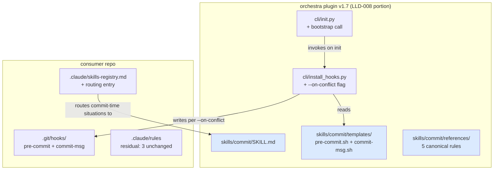

# Feature: orchestra v1.7 — Commit Skill (Discipline Consolidation, Narrow Scope) (LLD-008)

> **Doc ID:** 008-commit-skill
> **Date:** 2026-05-11
> **DRI:** Hassan Mohiddin
> **Type:** Feature LLD
> **Status:** Implemented
> **Iteration:** 7

## Glossary

- **commit-time** — window between `git add` and `git commit` returning. Includes pre-commit hook fire, commit-msg hook fire, agent decisions preceding them.
- **commit-discipline** — union of: Refs:-line eligibility (L1), canon-frozen narrow-change rule (L2), attestation-path resolution (L3), doc-id-burn (L4), commit-msg conventional-prefix gate, Status flip on canon-frozen transition, doc/code commit separation.
- **canon-frozen status set** — `{Approved, Implemented, Verified, Fix Applied, Current}`. Source: `cli/lint.py:71-73 CANON_FROZEN_STATUSES`.
- **canon-frozen-eligible file** — markdown under `docs/{features,bugs,adr,design,postmortems,runbooks}/` whose Status (parsed from metadata block) is in canon-frozen-status set.
- **canonical rule** — discipline rule whose source-of-truth lives inside this skill's `references/`. Replaces prior SCALE-side `.claude/rules/` file.
- **routing entry** — single-line entry in consumer's `.claude/skills-registry.md` mapping commit-time situations to `orchestra:commit`.
- **mechanical backstop** — git hooks (pre-commit, commit-msg). Fire automatically. Catch violations skill missed (`--no-verify` is the only bypass).
- **discipline layer** — skill itself + references/ + agent decisions. Non-mechanical. Relies on agent invoking skill.
- **skill-invoke trigger** — situations causing agent to invoke `orchestra:commit`: any code commit, any doc commit on canon-frozen-eligible file, status-flip operations, supersession decisions.

## Problem Statement

Commit-discipline in orchestra is fragmented across 5 layers (`cli/lint.py`, `cli/templates/`, `cli/install_hooks.py`, SCALE-side `.claude/rules/`, 3 unfixed BUGs). Concrete failure mode 2026-05-10: canon-inplace violation incident (commits `653db4e` + `bc359e7`); full attribution in `docs/postmortems/POSTMORTEM-2026-05-10-canon-inplace-violation.md`. Cross-incident pattern in `docs/postmortems/POSTMORTEM-2026-05-10-session-process-drift.md`: 3+ same-mechanism failures over 5 days; discipline-by-markdown insufficient when checker = checked.

### Original LLD-008 split into three LLDs (post r1+r2 plateau)

After spec-review iteration plateau (orchestra + codex r1/r2 surfaced 6+ architectural defects in hook-coordination + framework-integration + state-handling), original LLD-008 scope was split per user direction (Interview Gate § iteration plateau heuristic):

- **LLD-008 (this doc, narrowed scope)** — skill structure + references/ canonicalization + cli.install_hooks `--on-conflict` flag (non-interactive bootstrap) + cli.init bootstrap call + SCALE migration. Closes BUG-010 Part 3.
- **LLD-009** — commit-msg hook L2-finalize + tiered narrow-change rule (BUG-011) + hook-ordering correctness + index-vs-worktree handling + ORCHESTRA_BYPASS escape hatch. Standalone spec-review cycle.
- **LLD-010** — framework-detection determinism + `--apply` mode + verify-both-stages-active (BUG-006). Standalone spec-review cycle.

All three LLDs ship together as orchestra v1.7.0. Each has independent spec-review iteration; combined plugin version bump after all three pass.

This LLD (008) addresses ONLY the well-converged parts of the original scope. Hook-coordination complexity moved to LLD-009; framework-detection complexity moved to LLD-010.

## Success Criteria

### Acceptance items

- [ ] **A1.** Skill registered: `skills/commit/SKILL.md` exists; invocable as `/orchestra:commit` slash command. Manual verification post-merge.
- [ ] **A2.** Skill directory contains exactly 8 files at these paths (test T1 path-globs):
  - `skills/commit/SKILL.md`
  - `skills/commit/templates/pre-commit.sh` (moved from cli/templates/; runs L1+L3+L4 — L2-detect ships per LLD-009)
  - `skills/commit/templates/commit-msg.sh` (moved from cli/templates/; runs Refs:-line check — L2-finalize ships per LLD-009)
  - `skills/commit/references/commit-strategy.md`
  - `skills/commit/references/canon-frozen-guard.md`
  - `skills/commit/references/refs-line-rules.md`
  - `skills/commit/references/doc-vs-code-commit.md`
  - `skills/commit/references/supersession-decision.md`
- [ ] **A3.** Hook templates relocated `cli/templates/{pre-commit.sh,commit-msg.sh}` → `skills/commit/templates/`. `cli/templates/` retains 11 init-related artifacts (mkdocs.yml, AGENTS.md.template, llms.txt.template, standards-default-7.md, attestation-template.yaml, docs-index.md, mkdocs_hooks.py, orchestra-lint.yml, requirements-docs.txt, tags.md, precommit-yaml-patch.txt). `precommit-yaml-patch.txt` stays — different purpose (BUG-007 yaml-checker `--unsafe`). → test T2 (presence assertions on both directories).
- [ ] **A4.** `cli.install_hooks` reads templates from `skills/commit/templates/` (precedent: `cli/lint.py:36-52 _load_extract_mermaid` loads from `skills/design-docs/scripts/extract_mermaid.py`). Existing tests `tests/test_install_hooks.py` + `tests/test_cli_install_hooks.py` updated for new path → test T3.
- [ ] **A5.** `cli.install_hooks` adds `--on-conflict={skip,replace,append}` flag with `default=None` (argparse sentinel; choices restricted to the 3 values when flag is supplied). When flag supplied: non-interactive; honored verbatim. When flag absent AND `sys.stdin.isatty()` returns True: existing interactive prompt path retained. When flag absent AND non-TTY: silent default `skip`. **`--force` precedence:** `--force` flag (existing in `cli/install_hooks.py:48`) takes precedence over `--on-conflict`: if both passed, `--force` wins and existing hook is replaced unconditionally; `--on-conflict` value is ignored. Documented in `cli.install_hooks --help`. Tests T4a (`--on-conflict=skip` leaves untouched), T4b (`--on-conflict=replace` overwrites differing), T4c (`--on-conflict=append` concatenates), T4d (non-TTY + flag absent defaults to skip; argparse sentinel `None` triggers TTY check → non-TTY → skip), T4e (`--force` + `--on-conflict=skip` → force wins, hook replaced).
- [ ] **A6.** `cli.init` invokes `cli.install_hooks.main(["--all", "--on-conflict=skip"])` after init operations (BUG-010 Part 3). **Note:** uses existing `--all` flag (`cli/install_hooks.py:93`) which installs both pre-commit + commit-msg hooks. `--pre-commit` flag does NOT exist in parser (closes codex r4 high #1 CLI contract mismatch). Idempotent. Non-blocking in CI (bootstrap rc captured; warning emitted; `cli.init` itself returns 0 unless non-bootstrap step fails). **Framework-aware:** since LLD-008/009/010 ship together as v1.7.0, no interleave window exists; `cli.install_hooks` framework-detection path (per LLD-010 A3) handles `.pre-commit-config.yaml` presence and emits print-only snippet by default (no `--apply` from `cli.init`). cli.init bootstrap thus never clobbers framework state. **Result handling (closes codex r4 medium #1):** `cli.init` captures `cli.install_hooks.main(...)` return code; on non-zero rc, emits explicit stderr warning: `WARNING: hook bootstrap returned rc=<N>; hooks may not be installed. Retry: python -m cli.install_hooks --all --on-conflict=replace (or --force).`. Tests T5a (cli.init bootstrap leaves both hooks installed when no framework), T5b (idempotent re-run), T5c (cli.init + non-TTY = no input() blocking AND clean exit code 0, not argparse-error exit 2; asserts stderr empty of argparse usage output), T5d (cli.init + `.pre-commit-config.yaml` present + no `--apply` → bootstrap emits framework snippet print-only; `.git/hooks/{pre-commit,commit-msg}` NOT raw-overwritten), T5e (cli.init + bootstrap mock returns rc=1 → WARNING emitted to stderr; `cli.init` returns 0 — bootstrap is non-blocking but observable).
- [ ] **A7.** Skill `references/canon-frozen-guard.md` is canonical source. SCALE-side migration (per A8) deletes prior `.claude/rules/canon-frozen-guard.md`. Same for `commit-strategy.md`. `documentation-gate.md` partial-edit in place. Manual verification post-merge.
- [ ] **A8.** SCALE-side migration commit (separate ship; bundled with orchestra v1.7.0):
  - DELETE `SCALE/.claude/rules/canon-frozen-guard.md` outright.
  - DELETE `SCALE/.claude/rules/commit-strategy.md` outright.
  - REWRITE-IN-PLACE `SCALE/.claude/rules/documentation-gate.md`:
    - retain Gates 1-3 (Discovery/Design/Spec Review) sections verbatim;
    - REPLACE Gates 4 + 5 sections with one-line pointer: `Gate 4 (Commit) and Gate 5 (Implementation Sync) → see orchestra:commit skill (skills/commit/references/canon-frozen-guard.md + skills/commit/references/commit-strategy.md).`;
    - in the `## Quick Reference` block (currently lines 109-128 of `SCALE/.claude/rules/documentation-gate.md`), retain Gates 1-3 bullets verbatim AND replace the Gate 4 + Gate 5 bullets with one-line pointer: `Gate 4 / Gate 5 → orchestra:commit skill (see references/canon-frozen-guard.md + references/commit-strategy.md)`. Net: 4 bullets retained, 2 collapsed to 1 pointer.
  - APPEND routing entry to `SCALE/.claude/skills-registry.md` "Always-on situational bindings" table: `| commit-time decision (any commit, status flip, supersession) | orchestra:commit |`.
  - UNCHANGED: `interview-gate.md`, `skills-routing.md`, `task-tracking.md`.
  Counts: 2 deletions + 1 partial-edit (rule body + Quick Reference) + 1 registry-append. Test T6 (post-migration SCALE state assertions; runs in SCALE repo per § Testing — Cross-repo test architecture).
- [ ] **A9.** All 150 existing tests pass post-skill-ship (LLD-008 scope is additive + path moves; lint logic unchanged). Pytest baseline 150 derived from v1.6.2 ship state (107 v1.5.1 + 37 LLD-007 + 6 BUG-009 = 150; documented in `CHANGELOG.md` v1.6.2 entry). → test T7.
- [ ] **A10.** New tests this LLD (r7): T1 (skill dir presence; 8 expected files), T2 (template paths; both dirs), T3 (install_hooks reads from skill dir), T4a-e (--on-conflict flag + --force precedence; 5), T5a-g (cli.init bootstrap + framework-aware + TTY-aware fail-open/closed + STRICT opt-in; **7**), T6 (SCALE migration assertions placeholder; Plan Slice 4.1 expands to 7 sub-tests in `tests/test_scale_migration_transactional.py`), T7 (full pytest baseline), T8 (symlink rejection per Security § / codex r4 high #2). Total: 8 unique IDs; **17 distinct test functions** in LLD-008-owned test files. Pytest target post-LLD-008-ship: 150 + 17 = **≥167** (LLD-008-owned; Plan Phase 4 migration tests counted separately under Plan total).
- [ ] **A11.** Plugin version: 1.6.2 → 1.7.0 (combined ship after LLD-008/009/010 all pass spec-review).
- [ ] **A12.** BUG-010 Part 3 (auto-install bootstrap) closes via A6 implementation. BUG-010 is canon-frozen (`Status: Fix Applied`); close requires whitelist-only edit: append Changelog row to BUG-010 documenting Part 3 closure with commit-sha reference + cite to this LLD. Row format example: `| 2026-05-11 | Part 3 (auto-install bootstrap) closed via LLD-008 r4 A6 implementation. Commit-sha: <impl-commit>. Refs: docs/features/008-commit-skill.md |`. No body edit to BUG-010. No supersession needed.
- [ ] **A13.** CHANGELOG.md v1.7.0 entry describes (LLD-008 portion): skill addition, template relocation, `--on-conflict` flag for non-interactive bootstrap, cli.init bootstrap integration with `ORCHESTRA_INIT_STRICT` opt-in (per A14), SCALE rule migration. (LLD-009 + LLD-010 portions described in their own A13.)
- [ ] **A14.** **TTY-aware fail-open/closed default + `ORCHESTRA_INIT_STRICT=1` opt-in (per plan-r2 codex HIGH#1 compromise + user direction):** `cli.init` captures `cli.install_hooks.main(...)` return code. Behavior depends on TTY-state + env:
  - **TTY (interactive shell — `sys.stdin.isatty()` True):** non-zero rc → emit WARNING + `cli.init` returns 0 (fail-open: user sees + reacts).
  - **non-TTY (CI / script / piped — `sys.stdin.isatty()` False):** non-zero rc → emit WARNING + `cli.init` returns the non-zero rc (fail-closed: automation observes via exit code; codex plan-r2 HIGH#1 closed).
  - **`ORCHESTRA_INIT_STRICT=1` opt-in:** OVERRIDES TTY-aware default; on non-zero rc → `cli.init` returns non-zero REGARDLESS of TTY (for users who want fail-closed even interactively). Mirrors LLD-009 ORCHESTRA_STRICT pattern.
  - Tests T5e (TTY + rc != 0 + env unset → WARNING + cli.init returns 0), T5f (env STRICT=1 + rc != 0 → cli.init returns non-zero regardless of TTY), **T5g (non-TTY + rc != 0 + env unset → cli.init returns non-zero per TTY-aware default — closes codex plan-r2 HIGH#1).**
  - Test count 16 → 17; pytest baseline 166 → 167.

### Deliverables (recorded for sign-off, not lint-checkable)

- [ ] D1. `docs/design/orchestra-philosophy.md` Changelog appended with v1.7 entry (narrow change; Status: Current preserved).
- [ ] D2. README.md mentions `/orchestra:commit` slash command.
- [ ] D3. `cli/templates/standards-default-7.md` § Commit Strategy references new skill.
- [ ] D4. CONTRIBUTING.md updated: invoke `/orchestra:commit` (or rely on hooks) instead of memorizing 4 lint levels.
- [ ] D5. SCALE-side migration commit verified: 2 deletions + 1 partial-edit + 1 registry-append (per A8).
- [ ] D6. Test-quality audit plan `docs/plans/2026-05-11-test-quality-audit.md` filed; not gating LLD-008 impl.

## Scope

### In Scope (LLD-008 ships exactly this — narrow)

1. **`orchestra:commit` skill structure** — `skills/commit/` directory with SKILL.md + references/ + templates/ (per A2). Hook templates relocated from `cli/templates/`. `cli.install_hooks` reads from new path.
2. **references/ canonicalization** — 5 reference files total under `skills/commit/references/`: 2 migrated from SCALE-side `.claude/rules/` (canon-frozen-guard.md, commit-strategy.md) + 3 NEW extracted from existing prose (refs-line-rules, doc-vs-code-commit, supersession-decision). Total 5 reference files, not 5+3.
3. **cli.install_hooks `--on-conflict={skip,replace,append}` flag** — non-interactive default. Honors `sys.stdin.isatty()` for TTY-detection fallback.
4. **cli.init bootstrap call** — invokes `cli.install_hooks --pre-commit --commit-msg --on-conflict=skip` post-init. Idempotent + non-interactive (BUG-010 Part 3).
5. **SCALE-side migration** — 2 deletions + 1 partial-edit + 1 registry-append (per A8).
6. **Plugin version bump** — 1.6.2 → 1.7.0 (after all 3 LLDs pass).

### Out of Scope (deferred to LLD-009 / LLD-010 / later)

- **commit-msg hook L2-finalize** — moved to LLD-009 (hook-ordering complexity).
- **Tiered narrow-change rule (BUG-011)** — moved to LLD-009.
- **`is_narrow_change(commit_msg=...)` extension** — moved to LLD-009.
- **`.git/orchestra-canon-inplace-pending` state file** — moved to LLD-009.
- **`cli.lint --commit-msg-finalize` entrypoint** — moved to LLD-009.
- **`cli.lint --pre-stage-check` entrypoint** — moved to LLD-009.
- **ORCHESTRA_BYPASS env-var** — moved to LLD-009.
- **Framework-detection (BUG-006)** — moved to LLD-010.
- **`precommit-framework-snippet.yaml`** — moved to LLD-010 (correct YAML semantics needed).
- **`--apply` mode for auto YAML edit** — moved to LLD-010.
- **Verify-both-stages-active mechanism** — moved to LLD-010.
- **State-machine workflow** — deferred LLD-011 (workflow skill, v2.0+).
- **interview-gate.md, skills-routing.md, task-tracking.md** — stay SCALE-side; not commit-specific.
- **4 deferred BUGs (BUG-001/002/004/005)** — separate v1.7.x ships.

## Design

### Architecture (narrow scope)



### Skill artifact layout

- `skills/commit/SKILL.md` — entry point. Describes when to invoke + checklist.
- `skills/commit/templates/pre-commit.sh` — runs `python -m cli.lint --pre-commit` (L1+L3+L4 per current implementation; L2-detect added in LLD-009).
- `skills/commit/templates/commit-msg.sh` — runs Refs:-line check (current) + `cli.lint --commit-msg-finalize` (added in LLD-009).
- `skills/commit/references/commit-strategy.md` — canonicalized from SCALE `.claude/rules/commit-strategy.md`.
- `skills/commit/references/canon-frozen-guard.md` — canonicalized from SCALE `.claude/rules/canon-frozen-guard.md` (LLD-009 updates this with tiered exception when shipped).
- `skills/commit/references/refs-line-rules.md` — extracted from commit-strategy.md prose.
- `skills/commit/references/doc-vs-code-commit.md` — extracted from commit-strategy.md prose.
- `skills/commit/references/supersession-decision.md` — extracted from canon-frozen-guard.md prose; LLD-009 updates with tiered logic when shipped.

### `SKILL_TEMPLATES_DIR` constant (per A4 + cross-LLD contract)

LLD-008 introduces module-level constant in `cli/install_hooks.py` (also reusable by `cli/lint.py` / LLD-010):

```python
# cli/install_hooks.py (top-level)
from pathlib import Path

# Skill-shipped templates (replaces cli/templates/{pre-commit.sh,commit-msg.sh})
SKILL_TEMPLATES_DIR = Path(__file__).resolve().parent.parent / "skills" / "commit" / "templates"
```

Resolution: `cli/install_hooks.py` lives at `<orchestra-root>/cli/install_hooks.py`. Two `.parent` calls reach `<orchestra-root>`. Anchor `skills/commit/templates/` relative to repo root. **LLD-010 imports this constant**: `from cli.install_hooks import SKILL_TEMPLATES_DIR` for `precommit-framework-snippet.yaml` resolution.

Fallback if `SKILL_TEMPLATES_DIR.exists()` returns False (orchestra not installed as plugin; bare local checkout): print explicit error `error: skill templates not found at {SKILL_TEMPLATES_DIR}; orchestra plugin must be installed via plugin channel`. Exit non-zero. No silent fallback to `cli/templates/`.

### `cli.install_hooks` non-interactive bootstrap

argparse parser (replaces existing definition):

```python
parser.add_argument(
    "--on-conflict",
    choices=["skip", "replace", "append"],
    default=None,  # SENTINEL: None means "not supplied"; triggers TTY fallback
    help="Conflict resolution when existing hook differs; default: interactive if TTY else skip",
)
```

`install_one_hook` pseudocode:

```python
def install_one_hook(repo_root, hook_name, on_conflict=None, force=False, ...):
    # ... existing setup
    if hook_path.exists() and existing != expected:
        # --force precedence: bypass --on-conflict entirely
        if force:
            shutil.copy(template_path, hook_path)
            os.chmod(hook_path, 0o755)
            return 0
        # Resolve --on-conflict: sentinel None → TTY fallback
        if on_conflict is None:
            if sys.stdin.isatty():
                # existing interactive prompt path (v1.5+)
                choice = input("... [a]ppend / [r]eplace / [s]kip (default skip): ").strip().lower() or "s"
                on_conflict = {"a": "append", "r": "replace", "s": "skip"}.get(choice, "skip")
            else:
                on_conflict = "skip"  # non-TTY: safe default
        # argparse choices guarantee on_conflict ∈ {skip,replace,append} from here
        if on_conflict == "skip":
            return 0  # leave existing hook untouched
        if on_conflict == "replace":
            shutil.copy(template_path, hook_path)
            os.chmod(hook_path, 0o755)
            return 0
        if on_conflict == "append":
            # ... existing append logic (preserve user content)
            # NOTE: append places orchestra hook FIRST followed by `# Original hook content (preserved):`
            # marker + user content. For framework-mode users with raw-mode hooks pre-existing
            # (rare: framework hooks normally not raw), this preserves user content but demotes
            # it to second-pass. Recommended: framework users use `--apply` via LLD-010 path
            # instead of `--on-conflict=append` to avoid double-fire semantics.
            return 0
    # ... new install path (no existing or content matches)
```

### `cli.init` bootstrap call

```python
# end of cli.init.main(), after all init operations:
import cli.install_hooks
result = cli.install_hooks.main(["--all", "--on-conflict=skip"])
if result != 0:
    print(
        f"WARNING: hook bootstrap returned rc={result}; hooks may not be installed. "
        f"Retry: python -m cli.install_hooks --all --on-conflict=replace (or --force).",
        file=sys.stderr,
    )
# cli.init itself returns 0 unless other init steps failed — bootstrap is non-blocking
# non-interactive; idempotent; safe in CI/automation
```

### `references/` governance

`skills/commit/references/*.md` files live UNDER `skills/`, NOT under `docs/`. NOT subject to `cli.lint` L1/L2/L3/L4 (REFS_ELIGIBLE_PREFIXES at `cli/lint.py:77-80` covers only `docs/{features,bugs,adr,design,postmortems,runbooks}/`). Governance:

- Each reference file has metadata block: `Doc ID`, `Date`, `Skill-Status` (skill-internal enum: `Current` / `Deprecated`), `Skill version`.
- **Field name `Skill-Status` (NOT `Status`)** — intentionally distinct from doc-lifecycle `Status` enum used by `cli.lint`. This prevents future-maintainer confusion if `skills/` is ever added to `REFS_ELIGIBLE_PREFIXES`: the skill-internal lifecycle would not collide with the canon-frozen-status set `{Approved, Implemented, Verified, Fix Applied, Current}` because the field name differs. Documented as intentional vocabulary split.
- Skill-maintainer applies discipline manually at edit time.
- Substantive changes route through plugin-level review (PR review, codex adversarial-review on the skill change) — not `cli.lint` automated gates.
- Skill SKILL.md `version` field bumps on substantive references/ change.
- Intentional asymmetry: skill artifacts ship via plugin update channel; `docs/` artifacts ship via project commit history.

### Migration (SCALE → orchestra-canonical)

**Pre-skill-ship state:**
- `SCALE/.claude/rules/canon-frozen-guard.md` (165 lines)
- `SCALE/.claude/rules/commit-strategy.md`
- `SCALE/.claude/rules/documentation-gate.md` (Gates 1-5)
- `SCALE/.claude/rules/{interview-gate.md, skills-routing.md, task-tracking.md}` (out of scope)

**Post-skill-ship state:**
- `SCALE/.claude/rules/canon-frozen-guard.md` — DELETED. Skill canonical: `skills/commit/references/canon-frozen-guard.md`.
- `SCALE/.claude/rules/commit-strategy.md` — DELETED. Skill canonical: `skills/commit/references/commit-strategy.md`.
- `SCALE/.claude/rules/documentation-gate.md` — PARTIAL EDIT. Retains Gates 1-3 sections verbatim. Gates 4 + 5 sections REPLACED with one-line pointer.
- `SCALE/.claude/skills-registry.md` — APPENDED routing entry.
- `SCALE/.claude/rules/{interview-gate.md, skills-routing.md, task-tracking.md}` — UNCHANGED (3 files, all out-of-scope per Problem Statement).

**Migration commit invariant:** atomic single SCALE-side commit applies all 4 changes (2 deletions + 1 partial-edit + 1 registry-append). Recovery: revert single commit if mid-flight failure.

**6 SCALE-side rule files reconciled:** canon-frozen-guard (DELETED), commit-strategy (DELETED), documentation-gate (PARTIAL-EDIT), interview-gate (UNCHANGED), skills-routing (UNCHANGED), task-tracking (UNCHANGED) = 6 files; 3 affected by migration, 3 not.

## Edge Cases

1. **Consumer with no `cli.init` integration** (legacy v1.0 install): hooks not auto-installed; falls back to manual `python -m cli.install_hooks --pre-commit --commit-msg --on-conflict=skip`. Documented in CONTRIBUTING.md.
2. **Consumer overrode hooks before skill-ship**: `--on-conflict=skip` default leaves existing hooks untouched; `--on-conflict=replace` for explicit override.
3. **Skill invoked when no commit pending**: SKILL.md prose handles gracefully; checklist applicable as discipline reminder.
4. **References file modified post-ship**: see § references/ governance. Plugin-channel review path; NOT subject to L2.
5. **SCALE migration commit fails mid-flight**: atomic single commit invariant. Recovery: revert; re-issue.
6. **`cli.init` bootstrap on consumer with pre-commit framework already configured**: framework detection (LLD-010) wins; cli.init bootstrap respects framework path. LLD-008 cli.init call uses default `--on-conflict=skip` so framework path never clobbered.

## Security

- Skill operates on local files only. No network calls.
- Hook templates POSIX shell scripts; inspectable; minimal attack surface.
- `cli.install_hooks` writes only to `.git/hooks/` under repo root. **Symlink protection (per codex r4 high #2)**: `repo_root.resolve()` alone is insufficient — it resolves repo root but NOT the hook destination (`.git/hooks/<hook>` could itself be a symlink pointing outside the repo). Mandatory destination-path symlink check before any hook write:

```python
hook_path = repo_root / ".git" / "hooks" / hook_name
# Fail-closed if destination is a symlink — prevents writing outside repo
if hook_path.is_symlink():
    raise SecurityError(
        f"refusing to write to symlinked hook destination: {hook_path} -> {hook_path.readlink()}. "
        f"Remove the symlink and retry."
    )
# Also resolve and verify the parent dir is under repo_root
resolved_parent = hook_path.parent.resolve()
if not str(resolved_parent).startswith(str(repo_root.resolve())):
    raise SecurityError(f"hook destination outside repo boundary: {resolved_parent}")
```

  Test T8 (new; symlink rejection): create `.git/hooks/pre-commit` as symlink → assert `install_one_hook` raises + does NOT write. Pytest baseline 163 → 164 with this test.
- No secrets read or written.
- `--on-conflict=replace` requires explicit invocation (no implicit force-replace from default).

## Testing

### Phase impl — new test matrix (7 IDs; 13 distinct functions)

| Test ID | Acceptance | Description | Tests-behavior |
|---|---|---|---|
| T1 | A1, A2 | Skill directory contains exactly 8 expected files (path-glob assertions) | yes |
| T2 | A3 | Hook templates at skills/commit/templates/; cli/templates/{pre-commit.sh, commit-msg.sh} removed; cli/templates/precommit-yaml-patch.txt remains | yes |
| T3 | A4 | install_hooks reads from skills/commit/templates/ via `SKILL_TEMPLATES_DIR` constant; path resolution + install + content | yes |
| T4a | A5 | --on-conflict=skip leaves existing differing hook untouched | yes |
| T4b | A5 | --on-conflict=replace overwrites differing hook | yes |
| T4c | A5 | --on-conflict=append concatenates orchestra hook | yes |
| T4d | A5 | Non-TTY without flag (argparse sentinel None) defaults to skip (no input() blocking) | yes |
| T4e | A5 | --force + --on-conflict=skip → force wins, hook replaced; documents precedence | yes |
| T5a | A6 | cli.init bootstrap leaves both hooks installed (no framework present) | yes |
| T5b | A6 | cli.init bootstrap idempotent re-run | yes |
| T5c | A6 | cli.init + non-TTY = no input() blocking AND clean exit 0 (not argparse-error exit 2); stderr free of argparse usage output | yes |
| T5d | A6 | cli.init + `.pre-commit-config.yaml` present (no `--apply`) → bootstrap defers to framework-detection print-only; `.git/hooks/{pre-commit,commit-msg}` not raw-overwritten | yes |
| T5e | A6, A14 | cli.init + bootstrap mock returns rc=1 + ORCHESTRA_INIT_STRICT unset → WARNING emitted to stderr; cli.init returns 0 (default non-blocking) | yes |
| T5f | A14 | cli.init + bootstrap mock returns rc=1 + ORCHESTRA_INIT_STRICT=1 → cli.init returns non-zero rc (opt-in fail-closed) | yes |
| T6 | A8 | SCALE migration: 2 absent files; doc-gate.md retains Gates 1-3 sections + Quick Reference Gates 1-3 bullets + skill pointer for Gates 4+5; registry entry present | yes |
| T5f | A14 | cli.init + bootstrap mock returns rc=1 + ORCHESTRA_INIT_STRICT=1 → cli.init returns non-zero rc regardless of TTY | yes |
| T5g | A14 | cli.init + bootstrap mock returns rc=1 + non-TTY + env unset → cli.init returns non-zero (TTY-aware default fail-closed per codex plan-r2 HIGH#1) | yes |
| T7 | A9 | Full pytest baseline 150 + 17 new = 167 (LLD-008-owned; Plan Phase 4 adds separately) | baseline |
| T8 | Security § | Symlink rejection: `.git/hooks/<hook>` exists as symlink → `install_one_hook` raises SecurityError + does NOT write | yes |

### Existing tests

- `tests/test_install_hooks.py` + `tests/test_cli_install_hooks.py` — path updates for skills/commit/templates/ + new flag tests per A5.
- `tests/test_cli_init_bucket1.py` + `tests/test_cli_init_bucket2.py` — extension for bootstrap-call assertions per A6.
- All other tests unchanged for LLD-008 scope.

### Cross-repo test architecture (T6)

T6 asserts post-migration state of the SCALE repo. Two paths considered:

- **(A) Orchestra-side fixture-based test (CHOSEN):** T6 lives in orchestra's `tests/test_scale_migration.py`. The test does NOT depend on a live SCALE checkout at runtime. Instead, it constructs an in-tmpdir replica of the pre-migration `.claude/rules/` layout (committed fixtures at `tests/fixtures/scale-pre-migration/`); runs the migration steps via a Python helper (or shell script); asserts post-state. Pytest runs in orchestra CI without coupling to SCALE filesystem. Bonus: same test runs on contributor laptops without SCALE installed.
- **(B) Cross-repo test:** rejected. Brittle path coupling (`../SCALE APP/` relative); CI can't run; only works on Hassan's machine.

T6 thus counts toward orchestra's pytest baseline 163 without dependency on SCALE being checked out.

The actual SCALE-side migration commit is verified manually post-merge (deliverable D5) via `git status` + `git diff` after running the migration helper in the real SCALE checkout. No pytest in SCALE.

### Eval

No new evals.

## Related Documents

- `docs/features/006-archive-and-supersession-conventions-r4.md` — LLD-006-r4 foundation
- `docs/features/007-spec-review-architecture-r5.md` — LLD-007 precedent for skill structure
- `docs/features/009-commit-msg-l2-finalize.md` — companion LLD; commit-msg hook L2-finalize + tiered narrow-change (BUG-011)
- `docs/features/010-framework-detection-determinism.md` — companion LLD; pre-commit framework integration (BUG-006)
- `docs/bugs/BUG-010-orchestra-self-install-precommit-hook.md` — Part 3 closes via this LLD (A12)
- `docs/postmortems/POSTMORTEM-2026-05-10-canon-inplace-violation.md` — proximate motivation
- `docs/postmortems/POSTMORTEM-2026-05-10-session-process-drift.md` — durable pattern motivation
- `docs/plans/2026-05-10-v17-followups-checklist.md` § E0 — proposal entry
- `docs/reviews/008-commit-skill-r1.review.yaml` — orchestra judge-1 r1 attestation
- `docs/reviews/008-commit-skill-r1.codex.md` — codex judge-2 r1 review
- `docs/reviews/008-commit-skill-r2.review.yaml` — orchestra judge-1 r2 attestation
- `docs/reviews/008-commit-skill-r2.codex.md` — codex judge-2 r2 review (triggered split)
- `docs/reviews/008-commit-skill-r3.review.yaml` — orchestra judge-1 r3 attestation (post-split)
- `docs/reviews/008-commit-skill-r3.sonnet.md` — sonnet judge-2 r3 review (codex unavailable; cited HIGH/MEDIUM/LOW findings drove r4)
- `docs/reviews/008-commit-skill-r4.review.yaml` — orchestra judge-1 r4 attestation (conditional_pass; 5 Minor)
- `docs/reviews/008-commit-skill-r4.codex.md` — codex judge-2 r4 review (2 HIGH + 1 MEDIUM; drove r5)
- SCALE-side `.claude/rules/canon-frozen-guard.md` — migration source (canonicalize then delete)
- SCALE-side `.claude/rules/commit-strategy.md` — migration source (canonicalize then delete)
- SCALE-side `.claude/rules/documentation-gate.md` — migration source (Gates 4+5 only)
- `cli/lint.py:71-73` — CANON_FROZEN_STATUSES enumeration source
- `cli/lint.py:77-80` — REFS_ELIGIBLE_PREFIXES (basis for skill-references-not-subject-to-L2 governance)
- `cli/lint.py:36-52` — _load_extract_mermaid (precedent for cli reading from skill dir)
- `cli/install_hooks.py:48-75` — interactive prompt path (replacement target per A5)
- `cli/init.py` — bootstrap-call insertion target (per A6 / BUG-010 Part 3)

## Changelog

| Date | Change |
|---|---|
| 2026-05-10 | r1 LLD filed post-grilling-session (11 Q&A locked). Status: Draft. |
| 2026-05-10 | r1 spec-review verdicts: orchestra conditional_pass (18 findings); codex needs-attention (3 highs). Combined fail. r1 → r2 redesigns A5/A6/A7 + 12 textual fixes. |
| 2026-05-11 | r2 spec-review verdicts: orchestra conditional_pass (18 findings); codex needs-attention (3 highs in same architectural region: hook-msg-arg / framework-determinism / index-vs-worktree). Combined fail. Iteration plateau detected per Interview Gate § plateau heuristic. User direction: split scope into LLD-008 (narrow) + LLD-009 (commit-msg L2-finalize) + LLD-010 (framework-detection). |
| 2026-05-11 | r3 NARROWED. Original LLD-008 scope reduced to: skill structure + references migration + cli.install_hooks --on-conflict + cli.init bootstrap + SCALE migration. Hook-coordination + tiered narrow-change moved to LLD-009. Framework-detection moved to LLD-010. A2 reduced from 9 to 8 files (precommit-framework-snippet.yaml moved to LLD-010). A5 simplified to flag-only (framework detection moved to LLD-010). A6 simplified to bootstrap call (no `--bootstrap` mega-flag). A7-A14 collapsed/renumbered. Hook flow diagram simplified. Edge cases pruned (15 → 6). Test matrix reduced (15 IDs → 7 IDs; 21 functions → 11). All architectural complexity moved out of LLD-008 scope. Status: Draft. Awaiting r3 spec-review. |
| 2026-05-11 | Status: Draft → Implemented. Phase 1 shipped at commit `eb50924` (17 new tests; baseline 173 + 1 xfail). T5d xfail-deferred to Phase 3 flipped to pass at `da7238d`. |
| 2026-05-11 | r6 → r7 cascading edit per plan-r2 codex HIGH#1 + user-delegated decision (Hassan deferred to my technical judgment): A14 reworked to TTY-aware fail-open/closed default + ORCHESTRA_INIT_STRICT=1 opt-in override. Interactive (TTY) → fail-open WARNING + rc=0; non-TTY (CI/script) → fail-closed (propagate non-zero rc). STRICT opt-in forces fail-closed regardless of TTY. New T5g test (non-TTY default fail-closed). A10 prose stale numbers corrected (15 → 17; ≥165 → ≥167) per orchestra plan-r2 Evidence Minor #2. Test count 16 → 17; pytest baseline 166 → 167. Status: Draft. r7 captured by plan r3 spec-review per user direction "ship without 4th review". |
| 2026-05-11 | r5 → r6 cascading edit per plan-r1 codex HIGH#3 + user interview-gate direction: A14 `ORCHESTRA_INIT_STRICT=1` env-var opt-in added (default fail-open WARNING + rc=0 preserved; opt-in propagates non-zero rc). Mirrors LLD-009 r3 ORCHESTRA_STRICT pattern. New T5f test for strict-mode propagation. Test count 15 → 16; pytest baseline 165 → 166. r6 spec-review deferred — plan r2 spec-review covers cascading change per user direction. Status: Draft. |
| 2026-05-11 | r4 spec-review verdicts: orchestra conditional_pass (5 Minor; no Critical/Important); codex needs-attention (2 HIGH + 1 MEDIUM — fresh architectural surface, no overlap with r3 findings). r4 → r5 fixes inline (Status: Draft permits full edit): A6 `--pre-commit` flag CLI contract mismatch corrected to `--all --on-conflict=skip` (codex r4 HIGH#1); Security § symlink defense expanded with explicit `is_symlink()` lstat check + parent-dir resolve verification + new T8 test (codex r4 HIGH#2); A6 cli.init result-handling specified with explicit WARNING-on-non-zero-rc + new T5e test (codex r4 MEDIUM); A10 test count 13 → 15 (T5e + T8); pytest baseline 163 → 165. Per user interview-gate direction: Minor orchestra findings (5) deferred to v1.7.1 (pseudocode signature `input_fn=input` clarification; prompt UX clarification; T2 11-file enumeration assertion; A8 section-header cite; Skill-Status value-collision note). Status: Draft. r5 final iteration before impl per LLD-007 plateau heuristic + user direction "ship without 4th review". |
| 2026-05-11 | r3 spec-review verdicts: orchestra conditional_pass (9 findings); sonnet needs-attention (9 findings). Combined: 8 substantive issues to address. r3 → r4 fixes inline: A5 argparse sentinel `default=None` (sonnet F1); A5 `--force` precedence over `--on-conflict` documented (orchestra Minor + sonnet F1); A6 framework-aware (orchestra Important; LLD-008/009/010 ship together so no interleave); A8 documentation-gate Quick Reference Gates 1-3 retained + Gates 4+5 collapsed to pointer (orchestra Minor); A10 test count corrected 11→13; pytest baseline 161→163 (orchestra Important + LLD-009 baseline ripple); A12 BUG-010 close documented via Changelog row (orchestra Important); `SKILL_TEMPLATES_DIR` constant named in Design (sonnet F3 — closes LLD-010 contract gap); references/ field renamed `Skill-Status` to avoid collision (sonnet F6); T6 cross-repo test architecture documented as in-tmpdir fixture (sonnet F7); append ordering for framework users documented as recommend-`--apply`-not-`--on-conflict=append` (sonnet F5); Scope item 2 phrasing tightened (orchestra Minor); '5 deferred BUGs' → '4' (orchestra Minor). Status: Draft. Awaiting r4 spec-review. |
