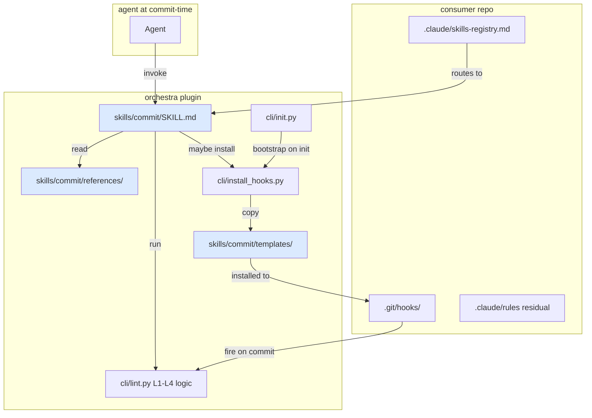

# Feature: orchestra v1.7 — Commit Skill (Discipline Consolidation) (LLD-008)

> **Doc ID:** 008-commit-skill
> **Date:** 2026-05-10
> **DRI:** Hassan Mohiddin
> **Type:** Feature LLD
> **Status:** Draft
> **Iteration:** 1

## Glossary

- **commit-time** — the window between `git add` and `git commit` returning. Includes pre-commit hook fire, commit-msg hook fire, and the agent decisions that precede them (which doc to Refs:, whether canon-frozen edit needs supersession, whether to flip Status).
- **commit-discipline** — the union of: Refs:-line eligibility (L1), canon-frozen narrow-change rule (L2), attestation-path resolution (L3), doc-id-burn (L4), commit-msg conventional-prefix gate, Status flip on canon-frozen transition, doc/code commit separation.
- **canonical rule** — a discipline rule whose source-of-truth lives inside this skill's `references/` directory. Replaces the prior SCALE-side .claude/rules/ file. Consumer projects no longer ship the rule file separately; they invoke the skill instead.
- **routing entry** — single-line entry in consumer's `.claude/skills-registry.md` mapping commit-time situations to `orchestra:commit` skill invocation. The minimal residual surface in consumer .claude/.
- **mechanical backstop** — git hooks (pre-commit, commit-msg) installed by `cli.install_hooks`. Fire automatically; not skill-invoked. Catch violations the skill missed (e.g., `--no-verify` is the only bypass).
- **discipline layer** — the skill itself + references/ + agent decisions made before staging. Non-mechanical. Relies on the agent invoking the skill.
- **skill-invoke trigger** — situations that should cause the agent to invoke `orchestra:commit`: any code commit, any doc commit on canon-frozen-eligible files, status-flip operations, supersession decisions.

## Problem Statement

Commit-discipline in orchestra is currently fragmented across **5 layers** with **drift, gaps, and overlap**:

1. **`cli/lint.py`** — 4 lint levels (L1 Refs eligibility, L2 canon-inplace narrow-change, L3 attestation-path-resolution, L4 doc-id-burn). Pure logic. No discipline-facing prose.
2. **`cli/templates/`** — 2 hook scripts (pre-commit.sh, commit-msg.sh) sit alongside 11 unrelated templates (mkdocs, AGENTS.md, llms.txt, etc.). Confusing taxonomy: hooks are skill artifacts, templates are init artifacts.
3. **`cli/install_hooks.py`** — installs hooks from cli/templates/. Has known gaps: BUG-006 (no pre-commit-framework detection), BUG-010 Part 3 (no auto-install on cli.init bootstrap), BUG-011 (no tiered narrow-change rule).
4. **SCALE-side `.claude/rules/` (6 files)** — canon-frozen-guard, interview-gate, documentation-gate, commit-strategy, skills-routing, task-tracking. All written as agent-discipline rules. Three of them (canon-frozen-guard, commit-strategy, documentation-gate Gates 4+5) are commit-time discipline. The other three (interview-gate, skills-routing, task-tracking) are general/cross-skill. Mixed scope; no clean separation.
5. **3 BUGs unfixed** — BUG-006 (Investigating, v1.7+), BUG-010 (Fix Applied; Part 3 deferred), BUG-011 (Investigating, v1.7+). Each needs separate ship work.

**Concrete failure mode (2026-05-10):** canon-inplace violation incident (commits `653db4e` + `bc359e7`). Three enforcement layers all failed:

1. `cli.lint --commit SHA` runs only L1 retroactively (BUG-009 closed this gap)
2. orchestra repo had no pre-commit hook installed — only `.sample` files (BUG-010 Part 1+2 closed; Part 3 auto-install deferred)
3. Agent missed Interview Gate "silent design decision" trigger despite shipping the rule 4 commits prior — discipline-layer failure

The fragmentation is the root cause. Fixing each layer independently leaves the discipline-layer failure mode (#3) unaddressed: no single artifact says "before any commit, run this checklist." The agent has to reason across 5 disparate artifacts to know what discipline to apply.

**Cross-incident pattern (POSTMORTEM-2026-05-10-session-process-drift):** 3+ same-mechanism failures over 5 days. Discipline-by-markdown insufficient when checker = checked. Mechanical gates close specific gaps; full mitigation requires a single skill that the agent invokes at every commit-time decision point.

## Success Criteria

### Acceptance items (testable)

- [ ] **A1.** Skill registered: `skills/commit/SKILL.md` exists; invocable as `/orchestra:commit` slash command. Manual verification post-merge.
- [ ] **A2.** Skill directory contains: `SKILL.md`, `templates/pre-commit.sh`, `templates/commit-msg.sh`, `references/commit-strategy.md`, `references/canon-frozen-guard.md`, `references/refs-line-rules.md`, `references/doc-vs-code-commit.md`, `references/supersession-decision.md` → test T1
- [ ] **A3.** Hook templates relocated from `cli/templates/pre-commit.sh` + `cli/templates/commit-msg.sh` to `skills/commit/templates/`. `cli/templates/` keeps only init-related artifacts (mkdocs.yml, AGENTS.md.template, llms.txt.template, standards-default-7.md, attestation-template.yaml, docs-index.md, mkdocs_hooks.py, orchestra-lint.yml, requirements-docs.txt, tags.md, precommit-yaml-patch.txt) → test T2 (template-presence assertions)
- [ ] **A4.** `cli.install_hooks` reads templates from `skills/commit/templates/` (precedent: `cli.lint._load_extract_mermaid` loads from `skills/design-docs/scripts/`). Existing tests (`tests/test_install_hooks.py`) updated for new path → test T3
- [ ] **A5.** `cli.install_hooks` detects `.pre-commit-config.yaml` presence (BUG-006 fix); emits YAML snippet + skips raw hook install unless `--force-raw`. New tests T4a (snippet emit), T4b (force-raw bypass), T4c (no-config raw-install fallback)
- [ ] **A6.** `cli.init` invokes `cli.install_hooks --pre-commit --commit-msg` when `.git/hooks/<hook>` missing OR points to outdated content (BUG-010 Part 3). Idempotent → test T5
- [ ] **A7.** `cli.lint.is_narrow_change()` extended with optional `commit_msg` parameter parsing `Addresses: <attestation-path> finding <N> (Minor|Important|Critical)` lines (BUG-011 tiered rule). Critical NEVER bypasses supersession; Minor body edits with proper commit-msg + Changelog row pass; Important uses author judgment (≤3 narrow-change OK; 4+ supersession). Tests T6a-T6e per BUG-011 Phase 1 test plan.
- [ ] **A8.** Skill `references/canon-frozen-guard.md` is canonical source. SCALE-side `.claude/rules/canon-frozen-guard.md` deleted. Same for `commit-strategy.md` and `documentation-gate.md` (Gates 4+5 portion only — Gates 1-3 stay project-side until LLD-011 workflow skill v2.0+). Migration: SCALE `.claude/skills-registry.md` adds routing entry "commit-time situation → `orchestra:commit`" → manual verification + test T7 (skill discoverable + references regen-check)
- [ ] **A9.** `cli.lint --pre-commit` invocation path unchanged (skill is additive; lint logic unchanged in this LLD scope). All 150 existing tests pass post-skill-ship → test T8 (full pytest baseline ≥150)
- [ ] **A10.** New tests (Phase impl): ~5 BUG-006 framework-detection (T4a-c + 2 edge), ~5 BUG-011 tiered narrow-change (T6a-e), ~3 cli.init rule-write integration (T5 + 2 idempotency), ~2 skill discoverability (T1, T2). Pytest target post-ship: ≥165.
- [ ] **A11.** Phase 0 test-quality audit: 150 existing tests categorized in `docs/plans/2026-05-10-test-quality-audit.md`. Each test classified: keep / improve / delete. Audit doc spec-reviewed before LLD-008 implementation begins.
- [ ] **A12.** Plugin version: 1.6.2 → 1.7.0
- [ ] **A13.** BUG-006 closes via this skill ship (Status: Investigating → Fix Applied + Refs: this LLD)
- [ ] **A14.** BUG-011 closes via this skill ship (Status: Investigating → Fix Applied + Refs: this LLD)
- [ ] **A15.** BUG-010 Part 3 (auto-install bootstrap) ships as part of A6; BUG-010 stays Fix Applied (already closed; Part 3 satisfies remaining acceptance item)
- [ ] **A16.** CHANGELOG.md v1.7.0 entry describes: skill addition, template relocation, hook framework-detection, tiered narrow-change, SCALE rule migration

### Deliverables (recorded for sign-off, not lint-checkable)

- [ ] D1. `docs/design/orchestra-philosophy.md` Changelog appended with v1.7 entry (narrow change)
- [ ] D2. README.md mentions `/orchestra:commit` slash command
- [ ] D3. `cli/templates/standards-default-7.md` references the new skill in § Commit Strategy section
- [ ] D4. CONTRIBUTING.md updated: invoke `/orchestra:commit` (or rely on hooks) instead of memorizing 4 lint levels
- [ ] D5. SCALE-side migration commit deletes 3 `.claude/rules/*.md` files; adds 1 `.claude/skills-registry.md` routing entry. Verify in SCALE repo post-ship.

## Scope

### In Scope (v1.7 ships exactly this)

1. **`orchestra:commit` skill** — discipline layer. SKILL.md prose + references/ canonical rules + templates/ hook scripts. Skill is invoked at commit-time decision points (code commit, doc commit on canon-frozen-eligible file, status flip, supersession decision).
2. **Skill artifact layout:**
   - `skills/commit/SKILL.md` — entry point. Describes when to invoke + checklist + dispatch to references/
   - `skills/commit/templates/pre-commit.sh` — moved from cli/templates/
   - `skills/commit/templates/commit-msg.sh` — moved from cli/templates/
   - `skills/commit/references/commit-strategy.md` — conventional prefixes + Refs: rules + bug-iteration override (canonicalized from SCALE)
   - `skills/commit/references/canon-frozen-guard.md` — canon-frozen status set + narrow-change whitelist + supersession workflow + tiered exception (canonicalized from SCALE; updated for BUG-011)
   - `skills/commit/references/refs-line-rules.md` — Refs:-eligibility prefix list + canon-frozen status check + bug-iteration changelog convention
   - `skills/commit/references/doc-vs-code-commit.md` — doc commits use `docs:` prefix; code commits MUST Refs:; status-flip combined with code commit OK
   - `skills/commit/references/supersession-decision.md` — decision tree: edit-type / status / severity → narrow-change vs supersession (encodes BUG-011 tiered rule)
3. **`cli.install_hooks` updates:**
   - Read templates from `skills/commit/templates/` (path change)
   - Detect `.pre-commit-config.yaml` (BUG-006); emit YAML snippet; default skip raw install; `--force-raw` bypass
   - `--bootstrap` flag (or auto-call from cli.init): install both pre-commit + commit-msg if missing
4. **`cli.init` updates:** invoke `cli.install_hooks --bootstrap` after init operations (BUG-010 Part 3). Idempotent.
5. **`cli.lint.is_narrow_change()` extension:** add `commit_msg` parameter; parse `Addresses:` lines; permit Minor body edits with finding-citation + Changelog row; reject Critical bypass. Per BUG-011 Phase 1.
6. **SCALE-side migration:** delete 3 `.claude/rules/*.md` files (canon-frozen-guard, commit-strategy, doc-gate-Gates-4+5 portion of documentation-gate.md). Documentation-gate.md splits: Gates 1-3 stay; Gates 4+5 move to skill. Add 1 routing entry to `.claude/skills-registry.md`.
7. **Phase 0 test-quality audit:** before any impl, audit 150 existing tests for behavior-real vs cargo-cult coverage. Document findings in `docs/plans/2026-05-10-test-quality-audit.md`. Improve / delete flagged tests in skill-impl phase.
8. **Plugin version bump:** 1.6.2 → 1.7.0.

### Out of Scope (explicitly NOT this LLD; deferred)

- **State-machine workflow** — backward-flow primitives, return-to-phase, feedback-loop persistence. Deferred to LLD-011 (workflow skill, v2.0+).
- **Mechanical Interview-Gate runtime hook** — hook-style check replacing markdown rule. Deferred to LLD-011.
- **Cross-skill orchestration** — skill A invoking skill B with shared state. Deferred to LLD-011.
- **Documentation-gate Gates 1-3** (Discovery, Design, Spec Review) — pre-commit phases. Stay SCALE-side until LLD-011.
- **interview-gate.md, skills-routing.md, task-tracking.md** — general agent discipline. Stay SCALE-side; not commit-specific.
- **gates skill (E6 placeholder)** — absorbed into commit + workflow split. No standalone gates skill ships.
- **CI integration** — running `cli.lint --pre-commit` in CI as backstop for `--no-verify` skips. Deferred (track as v1.7.x followup).
- **5 deferred BUGs (001/002/004/005)** — separate v1.7.x ships per § C of `docs/plans/2026-05-10-v17-followups-checklist.md`.

## Design

### Architecture



### Skill invocation flow (agent-perspective)

1. Agent decides: about to commit (any kind).
2. Agent invokes `/orchestra:commit`.
3. Skill SKILL.md prose: presents checklist:
   - What kind of commit? (`docs:` / `feat:` / `fix:` / `refactor:` / `test:` / `chore:`)
   - For `feat:`/`fix:`: which doc to Refs:? Run resolve-refs check (does file exist? is Status canon-frozen?).
   - For doc commits on canon-frozen-eligible files: read `references/canon-frozen-guard.md` decision tree. Narrow-change OR supersession?
   - For status flips: which doc, what status, what triggered? (Implementation done → Implemented; verification done → Verified)
   - For supersession: invoke `references/supersession-decision.md` workflow (archive + -rN.md + Status: Rejected on archived + Supersedes: link).
4. Skill defers mechanical checks to `cli.lint --pre-commit` (already runs in hook).
5. Agent stages + commits.
6. Mechanical hooks fire as backstop.

### Hook flow (mechanical)

```
git commit invoked
  ↓
.git/hooks/pre-commit  →  python -m cli.lint --pre-commit
  ↓                          ↓ runs L1+L2+L3+L4 on staged files
  pass/fail
  ↓ (if pass)
.git/hooks/commit-msg  →  bash check on commit message
  ↓                          ↓ rejects fix:/feat: without Refs: line
  pass/fail
  ↓ (if pass)
commit lands
```

### Migration (SCALE → orchestra-canonical)

**Pre-skill-ship state (current):**
- `SCALE/.claude/rules/canon-frozen-guard.md` (165 lines)
- `SCALE/.claude/rules/commit-strategy.md` (existing)
- `SCALE/.claude/rules/documentation-gate.md` (Gates 1-5)

**Post-skill-ship state:**
- `SCALE/.claude/rules/documentation-gate.md` (Gates 1-3 only — Discovery, Design, Spec Review)
- `SCALE/.claude/skills-registry.md` adds routing entry: "commit-time situation → orchestra:commit"
- canon-frozen-guard.md DELETED
- commit-strategy.md DELETED
- (interview-gate.md, skills-routing.md, task-tracking.md unchanged — out of scope)

**Migration mechanics:** SCALE migration commit ships in same window as orchestra v1.7.0. Two repos, two commits, but logically atomic.

### `references/` design notes

- All 5 reference files written as discipline-facing prose, not API docs. Audience = agent reading at decision time.
- Canonicalization preserves original SCALE-side prose where it's already good (canon-frozen-guard especially). Doesn't rewrite for the sake of rewriting.
- `supersession-decision.md` is NEW — extracted decision tree from canon-frozen-guard + tiered exception from BUG-011.
- `refs-line-rules.md` is NEW — was implicit in commit-strategy; extracted for clarity.

### `templates/` move impact

Tests touching `cli/templates/pre-commit.sh` need path update to `skills/commit/templates/pre-commit.sh`. ~3 test files in current 150 reference the path.

### `cli.install_hooks` framework-detection

```python
PRECOMMIT_CONFIG = ".pre-commit-config.yaml"
PRECOMMIT_SNIPPET_PATH = TEMPLATES_DIR / "precommit-yaml-patch.txt"  # already shipped


def _is_precommit_framework(repo_root: Path) -> bool:
    return (repo_root / PRECOMMIT_CONFIG).exists()


def install_one_hook(repo_root, hook_name, force=False, force_raw=False, ...):
    if hook_name == "pre-commit" and _is_precommit_framework(repo_root) and not force_raw:
        print("pre-commit.com framework detected.")
        print("Add orchestra to your existing config:")
        print(PRECOMMIT_SNIPPET_PATH.read_text())
        print("Then: pre-commit install")
        return 0
    # ... existing path
```

### `cli.init` bootstrap

```python
# end of cli.init.main():
import cli.install_hooks
cli.install_hooks.main(["--all", "--bootstrap"])  # idempotent; new --bootstrap flag = silent if hooks already installed
```

### `cli.lint.is_narrow_change()` tiered extension

Per BUG-011 Phase 1:

```python
FINDING_REF_RE = re.compile(
    r"Addresses:\s+(\S+\.review\.yaml)\s+finding\s+(\d+)\s+\((Minor|Important|Critical)\)"
)


def is_narrow_change(prior_text, new_text, commit_msg=None) -> tuple[bool, str]:
    # Existing whitelist + Changelog-append checks (unchanged)
    ...

    # NEW: Minor-finding narrow-extension
    if commit_msg:
        refs = FINDING_REF_RE.findall(commit_msg)
        if refs:
            for attestation_path, finding_n, severity in refs:
                if severity == "Critical":
                    return (False, f"Critical finding {finding_n} cannot be fixed via narrow-change; supersession required")
                # Verify each ref is Minor severity in cited attestation
                # Verify Changelog row added per finding
                ...
            return (True, "tiered narrow-change permitted by Addresses: lines")

    # Else: existing strict-binary path
    ...
```

## Edge Cases

1. **Consumer with no `cli.init` integration** (legacy v1.0 install): hooks not auto-installed. Falls back to manual `python -m cli.install_hooks`. Documented in CONTRIBUTING.md.
2. **Consumer with pre-commit framework already configured**: BUG-006 detection skips raw install; consumer follows YAML snippet path.
3. **Consumer overrode hooks before skill-ship**: install_hooks idempotent + content-equality check + interactive prompt for differing content (existing v1.5 behavior unchanged).
4. **Skill invoked when no commit pending**: SKILL.md prose handles gracefully — checklist still applicable as discipline reminder; no error path.
5. **Commit-msg hook with non-fix/feat prefix**: passes silently (Refs: not required for `docs:`/`refactor:`/`test:`/`chore:` per existing convention).
6. **Tiered rule with malformed `Addresses:` line**: regex non-match → falls back to strict-binary path; commit rejected per existing L2 rule. No silent acceptance.
7. **Tiered rule with mismatched severity claim**: author writes `(Minor)` but attestation YAML says `Critical`. Verification reads attestation; rejects with `severity_mismatch` error. Anti-gaming.
8. **Skill invoked but agent ignores checklist**: hooks still fire mechanically. Discipline-layer failure only matters if hooks bypassed (`--no-verify`). Multi-layer defense holds.
9. **References file modified post-ship**: each `references/<file>.md` is itself a Design Doc / discipline doc. Edits route through normal canon-frozen workflow (Status: Current, narrow-change vs supersession applies).
10. **SCALE migration commit fails mid-flight** (delete files but registry entry not added): partial state. Recovery: revert delete, re-issue migration as single commit.
11. **`cli.init` bootstrap on consumer that already has framework**: BUG-006 detection wins; bootstrap respects framework; no double-install.
12. **Test-quality audit (Phase 0) finds tests too poor to keep**: if >20% of 150 tests need delete, surface to user before LLD impl proceeds. Iteration plateau risk (per Interview Gate § iteration plateau heuristic).

## Security

- Skill operates on local files only. No network calls.
- Hook templates are POSIX shell scripts; inspectable; minimal attack surface. No untrusted input parsing.
- `cli.install_hooks` writes only to `.git/hooks/` under repo root. No symlink-traversal risk (uses `repo_root.resolve()`).
- `is_narrow_change` tiered extension parses commit messages — but commit messages are author-controlled; severity comes from attestation YAML (signed by spec-review subagent), not author claim.
- No secrets read or written.
- `--force` and `--force-raw` flags require explicit invocation (no implicit force-replace).

## Testing

### Phase 0 — test-quality audit (before impl)

Audit document: `docs/plans/2026-05-10-test-quality-audit.md` (Status: Draft → Approved before impl begins).

**Audit dimensions per test:**
- Tests behavior vs mocks-its-own-mocks
- Test name matches what's verified
- Setup is real (filesystem, git, subprocess) vs stubbed
- Assertion is meaningful (not `assert True`-equivalent)
- Catches a real regression (or could)

**Categorize each of 150 tests:** keep / improve (specify how) / delete (specify why).

**Decision rule:** if delete count > 20% of total, surface to user before impl begins. Otherwise proceed.

### Phase impl — new test matrix

| Test ID | Acceptance | Description |
|---|---|---|
| T1 | A1, A2 | Skill directory exists with all 8 expected files |
| T2 | A3 | Hook templates present at skills/commit/templates/; cli/templates/pre-commit.sh + commit-msg.sh removed |
| T3 | A4 | install_hooks reads from skills/commit/templates/ (assert path, run install, verify content) |
| T4a | A5 | install_hooks emits YAML snippet when .pre-commit-config.yaml present |
| T4b | A5 | install_hooks --force-raw bypasses framework detection |
| T4c | A5 | install_hooks raw-install when no framework config |
| T5 | A6 | cli.init invokes install_hooks --bootstrap; idempotent re-run |
| T6a | A7 | is_narrow_change accepts Minor finding with proper Addresses: + Changelog |
| T6b | A7 | is_narrow_change rejects Critical with Addresses: line (severity bypass attempt) |
| T6c | A7 | is_narrow_change rejects Minor with missing Changelog row |
| T6d | A7 | is_narrow_change rejects Minor with severity-claim mismatch (author claims Minor; attestation says Important) |
| T6e | A7 | is_narrow_change permits Important when total ≤3 with proper Addresses: lines |
| T7 | A8 | SCALE migration assertions: 3 .claude/rules/ files deleted; routing entry present in skills-registry.md |
| T8 | A9, A10 | Full pytest baseline ≥ 150 (existing) + ≥ 15 new = ≥ 165 |

### Existing tests (post-Phase-0 disposition applies)

- `tests/test_lint_*.py` — unchanged (lint logic stays in cli.lint)
- `tests/test_install_hooks.py` — path updates for skills/commit/templates/
- `tests/test_lint_commit_l2.py` — unchanged (BUG-009 fix)
- `tests/test_cli_viewer.py` — unchanged
- `tests/test_spec_review.py` (LLD-007) — unchanged
- Phase 0 audit may delete or improve any of the above; impl honors audit decisions.

### Eval

No new evals (skill is discipline + structural; existing 12 evals cover lint + spec-review + viewer behaviors).

## Related Documents

- `docs/features/006-archive-and-supersession-conventions-r4.md` — LLD-006-r4: canon-frozen + narrow-change + supersession workflow (foundation)
- `docs/features/007-spec-review-architecture-r5.md` — LLD-007-r5: spec-review skill + attestation schema (precedent for skill structure)
- `docs/bugs/BUG-006-install-hooks-precommit-framework.md` — closes via this LLD (A13)
- `docs/bugs/BUG-010-orchestra-self-install-precommit-hook.md` — Part 3 ships via this LLD (A15)
- `docs/bugs/BUG-011-supersession-tier-refinement.md` — closes via this LLD (A14)
- `docs/postmortems/POSTMORTEM-2026-05-10-canon-inplace-violation.md` — proximate motivation (incident lineage)
- `docs/postmortems/POSTMORTEM-2026-05-10-session-process-drift.md` — durable pattern motivation (3+ incidents)
- `docs/runbooks/RUNBOOK-canon-inplace-violation-recovery.md` — operator procedure for supersession-redo (reference for references/supersession-decision.md)
- `docs/plans/2026-05-10-v17-followups-checklist.md` § E0 — proposal entry (this LLD is the ship)
- `docs/plans/2026-05-10-test-quality-audit.md` — Phase 0 audit (companion plan to be filed)
- SCALE-side `.claude/rules/canon-frozen-guard.md` — migration source (canonicalize then delete)
- SCALE-side `.claude/rules/commit-strategy.md` — migration source (canonicalize then delete)
- SCALE-side `.claude/rules/documentation-gate.md` — migration source (Gates 4+5 only; Gates 1-3 stay)
- `cli/lint.py:397-427` — `is_narrow_change` extension target (per BUG-011 Phase 1)
- `cli/install_hooks.py` — framework-detection extension target (per BUG-006 Phase 1)
- `cli/init.py` — bootstrap-call insertion target (per BUG-010 Part 3)

## Changelog

| Date | Change |
|---|---|
| 2026-05-10 | LLD filed post-grilling-session (11 Q&A locked: hybrid runtime / compose with design-docs / templates in skill dir / skill references cli.lint / split rule consolidation / replace canonical / cli.init regenerate or skill-canonical / commit owns commit-time + workflow owns flow + E6 absorbed / BUG-006 + BUG-011 close via skill ship / v1.7.0 / Phase 0 test-quality audit + new behavior tests). Status: Draft. Awaiting spec-review iteration 1. |
