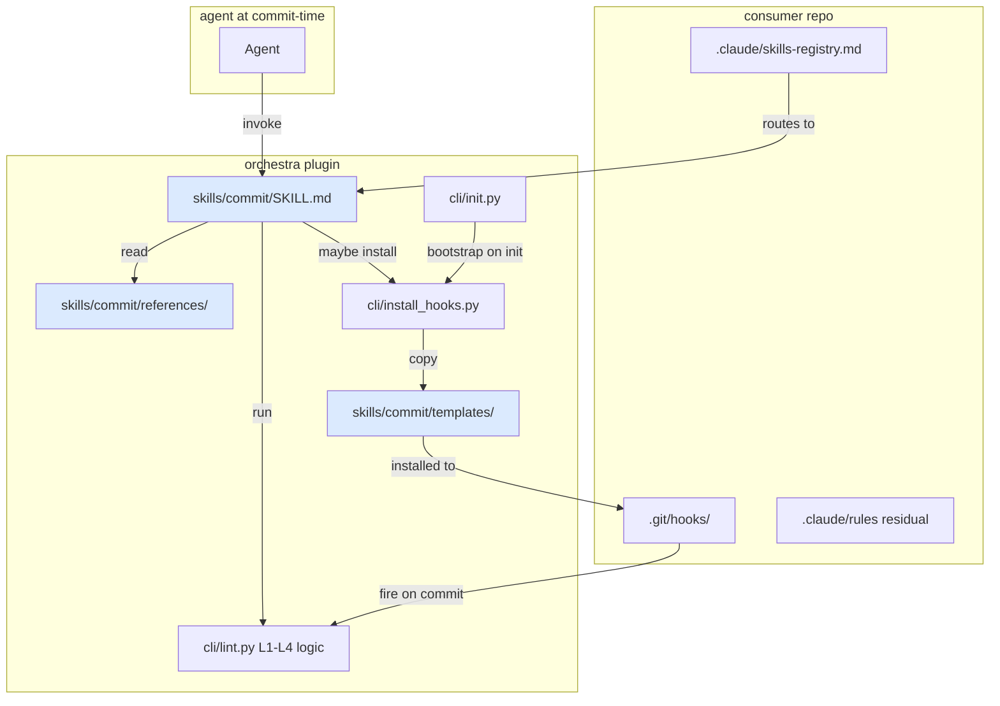

# Feature: orchestra v1.7 — Commit Skill (Discipline Consolidation) (LLD-008)

> **Doc ID:** 008-commit-skill
> **Date:** 2026-05-10
> **DRI:** Hassan Mohiddin
> **Type:** Feature LLD
> **Status:** Draft
> **Iteration:** 2

## Glossary

- **commit-time** — window between `git add` and `git commit` returning. Includes pre-commit hook fire, commit-msg hook fire, and agent decisions that precede them (which doc to Refs:, whether canon-frozen edit needs supersession, whether to flip Status).
- **commit-discipline** — union of: Refs:-line eligibility (L1), canon-frozen narrow-change rule (L2), attestation-path resolution (L3), doc-id-burn (L4), commit-msg conventional-prefix gate, Status flip on canon-frozen transition, doc/code commit separation.
- **canon-frozen status set** — `{Approved, Implemented, Verified, Fix Applied, Current}`. Source: `cli/lint.py:71-73 CANON_FROZEN_STATUSES`. A doc whose Status is in this set is canon-frozen (immutable except for narrow-change whitelist or supersession).
- **canon-frozen-eligible file** — markdown file under `docs/{features,bugs,adr,design,postmortems,runbooks}/` whose Status (parsed from metadata block) is in canon-frozen-status set.
- **canonical rule** — discipline rule whose source-of-truth lives inside this skill's `references/` directory. Replaces prior SCALE-side .claude/rules/ file. Consumer projects no longer ship the rule file separately; they invoke the skill.
- **routing entry** — single-line entry in consumer's `.claude/skills-registry.md` mapping commit-time situations to `orchestra:commit` skill invocation. Minimal residual surface in consumer .claude/.
- **mechanical backstop** — git hooks (pre-commit, commit-msg) installed by `cli.install_hooks`. Fire automatically; not skill-invoked. Catch violations the skill missed (`--no-verify` is the only bypass).
- **discipline layer** — skill itself + references/ + agent decisions made before staging. Non-mechanical. Relies on agent invoking skill.
- **skill-invoke trigger** — situations causing agent to invoke `orchestra:commit`: any code commit, any doc commit on canon-frozen-eligible file, status-flip operations, supersession decisions.
- **L2-detect** (new this LLD) — pre-commit-time canon-inplace detection. Annotates pending violations to `.git/orchestra-canon-inplace-pending` but does NOT block. Replaces strict-binary pre-commit-time L2 enforcement.
- **L2-finalize** (new this LLD) — commit-msg-time canon-inplace enforcement. Reads pending file + commit message. Decides accept/reject based on `Addresses:` lines + Changelog rows + attestation severity (tiered rule per BUG-011). Has commit-msg access; pre-commit does not.

## Problem Statement

Commit-discipline in orchestra is fragmented across **5 layers** with drift, gaps, and overlap:

1. **`cli/lint.py`** — 4 lint levels (L1 Refs eligibility, L2 canon-inplace narrow-change, L3 attestation-path-resolution, L4 doc-id-burn). Pure logic. No discipline-facing prose.
2. **`cli/templates/`** — 2 hook scripts (pre-commit.sh, commit-msg.sh) sit alongside 11 unrelated templates (mkdocs.yml, AGENTS.md.template, llms.txt.template, standards-default-7.md, attestation-template.yaml, docs-index.md, mkdocs_hooks.py, orchestra-lint.yml, requirements-docs.txt, tags.md, precommit-yaml-patch.txt). Confusing taxonomy: hooks are skill artifacts, templates are init artifacts.
3. **`cli/install_hooks.py`** — installs hooks from cli/templates/. Known gaps: BUG-006 (no pre-commit-framework detection), BUG-010 Part 3 (no auto-install on cli.init bootstrap), BUG-011 (no tiered narrow-change rule). Bootstrap path interactive (`input()` at `cli/install_hooks.py:48-75`); blocks in CI/automation.
4. **SCALE-side `.claude/rules/` (6 files)** — `canon-frozen-guard.md`, `interview-gate.md`, `documentation-gate.md`, `commit-strategy.md`, `skills-routing.md`, `task-tracking.md`. Three are commit-time discipline (canon-frozen-guard, commit-strategy, doc-gate Gates 4+5). Three are general/cross-skill (interview-gate, skills-routing, task-tracking — out of scope this LLD). Mixed-scope; no clean separation.
5. **3 BUGs unfixed** — BUG-006 (Investigating, v1.7+), BUG-010 (Fix Applied; Part 3 deferred), BUG-011 (Investigating, v1.7+). Each needs separate ship work.

**Concrete failure mode (2026-05-10):** canon-inplace violation incident (commits `653db4e` + `bc359e7`) — full attribution in `docs/postmortems/POSTMORTEM-2026-05-10-canon-inplace-violation.md`. Three enforcement layers all failed:

1. `cli.lint --commit SHA` runs only L1 retroactively (BUG-009 closed this gap)
2. orchestra repo had no pre-commit hook installed — only `.sample` files (BUG-010 Part 1+2 closed; Part 3 auto-install deferred to this LLD)
3. Agent missed Interview Gate "silent design decision" trigger despite shipping the rule 4 commits prior — discipline-layer failure

Fragmentation is root cause. Fixing each layer independently leaves the discipline-layer failure mode (#3) unaddressed: no single artifact says "before any commit, run this checklist." Agent has to reason across 5 disparate artifacts.

**Cross-incident pattern (POSTMORTEM-2026-05-10-session-process-drift):** 3+ same-mechanism failures over 5 days. Discipline-by-markdown insufficient when checker = checked. Mechanical gates close specific gaps; full mitigation requires single skill agent invokes at every commit-time decision point.

## Success Criteria

### Acceptance items (testable)

- [ ] **A1.** Skill registered: `skills/commit/SKILL.md` exists; invocable as `/orchestra:commit` slash command. Manual verification post-merge.
- [ ] **A2.** Skill directory contains exactly: `SKILL.md`, `templates/pre-commit.sh`, `templates/commit-msg.sh`, `templates/precommit-framework-snippet.yaml` (NEW per A5 redesign), `references/commit-strategy.md`, `references/canon-frozen-guard.md`, `references/refs-line-rules.md`, `references/doc-vs-code-commit.md`, `references/supersession-decision.md` → test T1
- [ ] **A3.** Hook templates relocated `cli/templates/{pre-commit.sh,commit-msg.sh}` → `skills/commit/templates/`. `cli/templates/` retains 11 init-related artifacts (enumerated in Problem Statement § layer 2). `precommit-yaml-patch.txt` stays in `cli/templates/` (BUG-007 yaml-checker `--unsafe` patch — different purpose) → test T2 (template-presence assertions on both directories)
- [ ] **A4.** `cli.install_hooks` reads templates from `skills/commit/templates/` (precedent: `cli/lint.py:36-52 _load_extract_mermaid` loads from `skills/design-docs/scripts/extract_mermaid.py`). Existing tests `tests/test_install_hooks.py` + `tests/test_cli_install_hooks.py` updated for new path → test T3
- [ ] **A5 (codex-r1 high #1 redesign).** `cli.install_hooks` detects `.pre-commit-config.yaml`. When present (NOT absent — orchestra hook still installed if no framework): emits `skills/commit/templates/precommit-framework-snippet.yaml` content (NEW file; wires orchestra-lint AS A `local` repo hook with id `orchestra-lint` running `python -m cli.lint --pre-commit`; ALSO wires `orchestra-commit-msg` running `python -m cli.lint --commit-msg-finalize $1` for L2-finalize per A7). Skips raw `.git/hooks/` install unless `--force-raw`. Snippet is purpose-built for orchestra integration — NOT `precommit-yaml-patch.txt` (which is BUG-007-only). Tests: T4a (correct snippet emitted, references orchestra-lint id), T4b (`--force-raw` bypasses framework detection), T4c (no-config raw-install fallback), T4d (integration test: violating commit rejected in repo with .pre-commit-config.yaml after snippet pasted)
- [ ] **A6 (codex-r1 medium #3 redesign).** `cli.install_hooks` adds `--on-conflict={skip,replace,append}` flag (default `skip`). Non-interactive — no `input()` calls when flag passed. Existing interactive prompt path retained when flag absent + TTY detected; replaced with `skip` default when non-TTY (per `sys.stdin.isatty()`). `cli.init` invokes `python -m cli.install_hooks --all --on-conflict=skip` post-init operations (BUG-010 Part 3). Idempotent. Tests: T5a (flag honored: skip leaves existing hook untouched), T5b (replace overwrites), T5c (append concatenates), T5d (non-TTY without flag defaults to skip), T5e (cli.init bootstrap leaves hooks installed; idempotent re-run)
- [ ] **A7 (codex-r1 high #2 redesign).** Tiered narrow-change exception (BUG-011) implemented at **commit-msg hook** time, NOT pre-commit. Hook flow:
  - **pre-commit** runs `cli.lint --pre-commit`: L1 + L3 + L4 enforce (block on fail). NEW **L2-detect** stage: detects canon-inplace candidates; writes pending list to `.git/orchestra-canon-inplace-pending` (path inside `$GIT_DIR/`); does NOT block.
  - **commit-msg** runs `cli.lint --commit-msg-finalize <msg-file>`: NEW **L2-finalize** stage: reads `.git/orchestra-canon-inplace-pending` + commit message file. If pending list empty → pass. If non-empty AND commit message has matching `Addresses: <attestation-path> finding <N> (Minor|Important|Critical)` lines per pending file + corresponding Changelog rows present in each canon-frozen file diff: tiered-rule decision (Critical → reject; Minor + Changelog row → pass; Important ≤3 with Changelog rows → pass; 4+ Important → reject). Else → reject (strict-binary fallback). On any path: clean up `.git/orchestra-canon-inplace-pending`.
  - `is_narrow_change()` extended with `commit_msg` parameter at `cli/lint.py:397-427` (existing strict-binary signature). Severity comes from cited attestation YAML (signed by spec-review subagent), not author claim — anti-gaming.
  - Tests: T6a (Minor with Addresses: + Changelog → L2-finalize passes), T6b (Critical with Addresses: → L2-finalize rejects), T6c (Minor without Changelog → rejects), T6d (severity-claim mismatch: author Minor; attestation Important → rejects with `severity_mismatch`), T6e (Important ≤3 → passes), T6f (Important 4+ → rejects), T6g (no Addresses: lines, pending non-empty → strict-binary reject), T6h (pending empty → passes regardless of message)
- [ ] **A8.** Skill `references/canon-frozen-guard.md` is canonical source. SCALE-side migration: `.claude/rules/canon-frozen-guard.md` DELETED outright. `.claude/rules/commit-strategy.md` DELETED outright. `.claude/rules/documentation-gate.md` REWRITTEN IN PLACE — Gates 1-3 (Discovery / Design / Spec Review) prose retained verbatim; Gates 4 (Commit Gate) and 5 (Implementation Sync Gate) sections REPLACED with one-line pointer: "Gate 4 (Commit) and Gate 5 (Implementation Sync) → see orchestra:commit skill (`references/canon-frozen-guard.md` + `references/commit-strategy.md`)." `.claude/skills-registry.md` adds routing entry: `commit-time situation → orchestra:commit`. Counts: 2 file deletions + 1 file partial-edit + 1 registry append → test T7 (post-migration SCALE state assertions: 2 absent files, doc-gate.md retains Gates 1-3 sections, registry entry present)
- [ ] **A9.** `cli.lint --pre-commit` invocation path unchanged (skill is additive). All 150 existing tests pass post-skill-ship → test T8 (full pytest baseline ≥150). Pre-existing 150 baseline derives from v1.6.2 ship state (107 v1.5.1 + 37 LLD-007 spec-review tests + 6 BUG-009 retroactive L2 tests = 150; documented in `docs/plans/2026-05-10-state-of-orchestra-handoff.md` and `CHANGELOG.md` v1.6.2 entry; supersedes BUG-011 r1's stale `144 + 5 = 149` calculation, which predated the +6 retroactive-L2 tests).
- [ ] **A10.** New tests Phase impl matrix (15 distinct test IDs counted): T1, T2, T3, T4a, T4b, T4c, T4d (4 BUG-006 framework-detection); T5a, T5b, T5c, T5d, T5e (5 cli.init bootstrap + on-conflict); T6a, T6b, T6c, T6d, T6e, T6f, T6g, T6h (8 BUG-011 tiered narrow-change L2-finalize); T7 (1 SCALE migration); T8 baseline-only. Behavior tests: T1+T2+T3+T4a+T4b+T4c+T4d+T5a+T5b+T5c+T5d+T5e+T6a-h+T7 = 21 distinct test functions. T8 is baseline assertion not behavior. Pytest target post-ship: 150 + 21 = ≥171.
- [ ] **A11.** Test-quality audit Deliverable D6 (downgraded from acceptance gate per orchestra-r1 Minor finding — auditing 150 tests pre-impl is process discipline, not LLD acceptance gate). Audit doc `docs/plans/2026-05-10-test-quality-audit.md` filed as companion plan; categorizes existing 150 tests (keep/improve/delete); spec-reviewed independently. Impl honors audit decisions but is not gated on audit doc verdict (audit can iterate in parallel).
- [ ] **A12.** Plugin version: 1.6.2 → 1.7.0
- [ ] **A13.** BUG-006 closes via this skill ship: Status `Investigating` → `Fix Applied`. Reconcile filename: BUG-006 r1 cites `precommit-yaml-snippet.txt` (stale); actual file `precommit-yaml-patch.txt` exists for BUG-007. New file `skills/commit/templates/precommit-framework-snippet.yaml` per A5 is BUG-006 actual fix target. BUG-006 sub-task: append Changelog entry on closure noting filename history.
- [ ] **A14.** BUG-011 closes via this skill ship: BUG-011 frontmatter currently shows `Status: Investigating` per `docs/bugs/BUG-011-supersession-tier-refinement.md:8`; r1 Changelog entry has internal contradiction (records `Status: Draft → Implemented` despite frontmatter never being Implemented — frontmatter source of truth). Pre-merge of LLD-008 impl: append Changelog entry to BUG-011 reconciling the contradiction (`r1 Changelog entry was incorrect; Status remained Investigating awaiting v1.7+ ship`); flip Status `Investigating` → `Fix Applied` on this LLD's impl ship.
- [ ] **A15.** BUG-010 Part 3 (auto-install bootstrap) ships via A6 implementation. BUG-010 stays `Fix Applied` (already closed; Part 3 was tracked as open sub-task per BUG-010 Iteration Log r1).
- [ ] **A16.** CHANGELOG.md v1.7.0 entry describes: skill addition, template relocation, hook framework-detection redesign, L2-detect/L2-finalize split per hook ordering, `--on-conflict` flag, tiered narrow-change at commit-msg, SCALE rule migration.

### Deliverables (recorded for sign-off, not lint-checkable)

- [ ] D1. `docs/design/orchestra-philosophy.md` Changelog appended with v1.7 entry (narrow change, Status: Current preserved)
- [ ] D2. README.md mentions `/orchestra:commit` slash command
- [ ] D3. `cli/templates/standards-default-7.md` § Commit Strategy references new skill
- [ ] D4. CONTRIBUTING.md updated: invoke `/orchestra:commit` (or rely on hooks) instead of memorizing 4 lint levels
- [ ] D5. SCALE-side migration commit: 2 file deletions (`canon-frozen-guard.md`, `commit-strategy.md`) + 1 partial-edit (`documentation-gate.md`) + 1 registry-entry append (`skills-registry.md`). Verify in SCALE repo post-ship.
- [ ] D6. Test-quality audit plan `docs/plans/2026-05-10-test-quality-audit.md` filed; status not gating LLD-008 impl per A11.

## Scope

### In Scope (v1.7 ships exactly this)

1. **`orchestra:commit` skill** — discipline layer. SKILL.md prose + references/ canonical rules + templates/ hook scripts. Invoked at commit-time decision points (code commit, doc commit on canon-frozen-eligible file, status flip, supersession decision).
2. **Skill artifact layout** (per A2):
   - `skills/commit/SKILL.md` — entry point. Describes when to invoke + checklist + dispatch to references/.
   - `skills/commit/templates/pre-commit.sh` — moved from `cli/templates/`. Runs L1+L3+L4+L2-detect.
   - `skills/commit/templates/commit-msg.sh` — moved from `cli/templates/`. Runs L2-finalize + Refs:-line check.
   - `skills/commit/templates/precommit-framework-snippet.yaml` — NEW. Wires orchestra-lint as `local` repo hook with id `orchestra-lint` (entry `python -m cli.lint --pre-commit`) + `orchestra-commit-msg` (entry `python -m cli.lint --commit-msg-finalize $1`). Emitted by `cli.install_hooks` when `.pre-commit-config.yaml` present.
   - `skills/commit/references/commit-strategy.md` — conventional prefixes + Refs: rules + bug-iteration override (canonicalized from SCALE `.claude/rules/commit-strategy.md`).
   - `skills/commit/references/canon-frozen-guard.md` — canon-frozen status set + narrow-change whitelist + supersession workflow + tiered exception per L2-finalize semantics (canonicalized from SCALE `.claude/rules/canon-frozen-guard.md`; updated for BUG-011 + hook-ordering).
   - `skills/commit/references/refs-line-rules.md` — Refs:-eligibility prefix list + canon-frozen status check + bug-iteration changelog convention.
   - `skills/commit/references/doc-vs-code-commit.md` — doc commits use `docs:` prefix; code commits MUST Refs:; combined doc+code commits acceptable for status-flip + impl in single commit.
   - `skills/commit/references/supersession-decision.md` — decision tree: edit-type / status / severity → narrow-change vs supersession (encodes BUG-011 tiered rule + hook-ordering reality).
3. **`cli.install_hooks` updates** (per A4 + A5 + A6):
   - Read templates from `skills/commit/templates/` (path change).
   - Detect `.pre-commit-config.yaml` (BUG-006); emit `precommit-framework-snippet.yaml` content; default skip raw install; `--force-raw` bypass.
   - `--on-conflict={skip,replace,append}` flag (default `skip` non-interactive; honors `sys.stdin.isatty()` for interactive prompt path when flag absent + TTY detected).
   - `--bootstrap` flag for cli.init invocation; idempotent + non-interactive.
4. **`cli.init` updates** (per A6 / A15): post-init operations invoke `cli.install_hooks --all --on-conflict=skip`. Idempotent; non-blocking in CI.
5. **`cli.lint` updates** (per A7):
   - Existing L2 strict-binary at pre-commit becomes L2-detect (annotate-only; writes `.git/orchestra-canon-inplace-pending`).
   - NEW `cli.lint --commit-msg-finalize <msg-file>` entrypoint: reads pending file + commit message; runs L2-finalize tiered rule.
   - `is_narrow_change()` at `cli/lint.py:397-427` extended with `commit_msg` param + helpers for parsing `Addresses:` lines + reading attestation YAMLs.
6. **SCALE-side migration** (per A8 / D5): 2 file deletions + 1 partial-edit (doc-gate.md retains Gates 1-3, replaces Gates 4+5 sections with skill pointer) + 1 registry-entry append.
7. **Plugin version bump:** 1.6.2 → 1.7.0.

### Out of Scope (explicitly NOT this LLD; deferred)

- **State-machine workflow** — backward-flow primitives, return-to-phase, feedback-loop persistence. Deferred LLD-011 (workflow skill, v2.0+).
- **Mechanical Interview-Gate runtime hook** — hook-style check replacing markdown rule. Deferred LLD-011.
- **Cross-skill orchestration** — skill A invoking skill B with shared state. Deferred LLD-011.
- **Documentation-gate Gates 1-3** (Discovery, Design, Spec Review) — pre-commit phases. Stay SCALE-side until LLD-011.
- **interview-gate.md, skills-routing.md, task-tracking.md** — general agent discipline. Stay SCALE-side; not commit-specific.
- **gates skill (E6 placeholder)** — absorbed into commit + workflow split. No standalone gates skill ships.
- **CI integration** — running `cli.lint --pre-commit` in CI as backstop for `--no-verify` skips. Deferred (track as v1.7.x followup).
- **5 deferred BUGs** — BUG-001, BUG-002, BUG-004, BUG-005 (4 BUGs; r1 stated "5 deferred" in error — corrected per orchestra-r1 Minor finding). Separate v1.7.x ships per § C of `docs/plans/2026-05-10-v17-followups-checklist.md`.
- **prepare-commit-msg hook integration** — alternative venue for L2-finalize. Not chosen (commit-msg adopted per A7).

## Design

### Architecture



### Hook flow (mechanical) — REVISED for hook ordering (codex-r1 high #2)

```
git commit invoked
  ↓
.git/hooks/pre-commit  →  python -m cli.lint --pre-commit
  ↓                          ↓ runs L1 + L3 + L4 (block on fail)
  ↓                          ↓ runs L2-detect (annotate canon-inplace candidates;
  ↓                              writes .git/orchestra-canon-inplace-pending;
  ↓                              does NOT block)
  ↓ pass
git creates commit message (editor or -m flag)
  ↓
.git/hooks/commit-msg  →  python -m cli.lint --commit-msg-finalize $1
  ↓                          ↓ also runs Refs:-line check on fix:/feat:
  ↓                          ↓ runs L2-finalize: reads pending file + msg file;
  ↓                              applies tiered rule (BUG-011) using Addresses: lines
  ↓                              + attestation YAML severity + Changelog row presence;
  ↓                              accept (Minor / Important≤3 + valid) or reject;
  ↓                              cleans up pending file on exit
  ↓ pass
commit lands
```

**Why this design** (codex-r1 high #2): pre-commit runs BEFORE commit message exists. Tiered rule needs commit message (`Addresses:` lines) to evaluate. So L2 splits: detect at pre-commit (no message access; annotate-only); finalize at commit-msg (has message; decides accept/reject). pre-commit no longer false-rejects valid Minor fixes; commit-msg owns the final canon-inplace decision.

### Skill invocation flow (agent-perspective)

1. Agent decides: about to commit (any kind).
2. Agent invokes `/orchestra:commit`.
3. Skill SKILL.md prose presents checklist:
   - What kind of commit? (`docs:` / `feat:` / `fix:` / `refactor:` / `test:` / `chore:`)
   - For `feat:`/`fix:`: which doc to Refs:? Run resolve-refs check (file exists? Status canon-frozen?).
   - For doc commits on canon-frozen-eligible files: read `references/canon-frozen-guard.md` decision tree. Narrow-change OR supersession? If body change: prepare commit message with `Addresses:` lines + ensure Changelog rows added before staging.
   - For status flips: which doc, what status, what triggered? (Implementation done → Implemented; verification done → Verified)
   - For supersession: invoke `references/supersession-decision.md` workflow (archive + -rN.md + Status: Rejected on archived + Supersedes: link).
4. Skill OPTIONALLY runs `cli.lint --doc <path>` inline for early feedback before staging (doc-level check, not hook-level). Hook-level enforcement is the mechanical backstop; skill-time invocation is for fast iteration.
5. Agent stages + commits. Agent writes Addresses: lines into commit message when applicable per checklist.
6. Mechanical hooks fire (pre-commit L1+L3+L4+L2-detect; commit-msg Refs-check + L2-finalize).

### Migration (SCALE → orchestra-canonical)

**Pre-skill-ship state (current):**
- `SCALE/.claude/rules/canon-frozen-guard.md` (165 lines)
- `SCALE/.claude/rules/commit-strategy.md` (existing)
- `SCALE/.claude/rules/documentation-gate.md` (Gates 1-5)
- `SCALE/.claude/rules/{interview-gate.md, skills-routing.md, task-tracking.md}` (out of scope)

**Post-skill-ship state:**
- `SCALE/.claude/rules/canon-frozen-guard.md` — DELETED. Skill canonical source: `skills/commit/references/canon-frozen-guard.md`.
- `SCALE/.claude/rules/commit-strategy.md` — DELETED. Skill canonical source: `skills/commit/references/commit-strategy.md`.
- `SCALE/.claude/rules/documentation-gate.md` — PARTIAL EDIT IN PLACE. Retains Gates 1-3 sections verbatim (Discovery / Design / Spec Review). Gates 4 + 5 sections REPLACED with one-line pointer: `Gate 4 (Commit) and Gate 5 (Implementation Sync) → see orchestra:commit skill (skills/commit/references/canon-frozen-guard.md + skills/commit/references/commit-strategy.md).`
- `SCALE/.claude/skills-registry.md` — ADD routing entry under "Always-on situational bindings" table: `| commit-time decision (any commit, status flip, supersession) | orchestra:commit |`.
- `SCALE/.claude/rules/{interview-gate.md, skills-routing.md, task-tracking.md}` — UNCHANGED.

**Migration count consistency:** 2 deletions + 1 partial-edit + 1 registry-append. (Earlier r1 D5 said "delete 3 files" — corrected. New D5 wording matches this Migration § exactly.)

**Migration mechanics:** SCALE migration commit ships in same window as orchestra v1.7.0. Two repos, two commits, logically atomic.

### `references/` design notes

- Each `references/<file>.md` is discipline-facing prose (not API docs). Audience = agent reading at decision time.
- Canonicalization preserves original SCALE-side prose where good (canon-frozen-guard especially); doesn't rewrite for sake of rewriting.
- `supersession-decision.md` NEW — extracted decision tree from canon-frozen-guard + tiered exception from BUG-011 + hook-ordering reality.
- `refs-line-rules.md` NEW — was implicit in commit-strategy; extracted for clarity.

### `references/` governance (Edge Case 9 reconciliation)

`skills/commit/references/*.md` files live UNDER `skills/`, NOT under `docs/`. They are NOT subject to `cli.lint` L1/L2/L3/L4 enforcement (REFS_ELIGIBLE_PREFIXES at `cli/lint.py:77-80` covers only `docs/{features,bugs,adr,design,postmortems,runbooks}/`). Edits to skill references handled by:

- Each reference file has its own metadata block + Status field for skill-internal tracking.
- Skill-maintainer (DRI: orchestra DRI) applies discipline manually at edit time.
- For substantive changes: edits route through plugin-level review (PR review, codex adversarial-review on the skill change) — not through `cli.lint` automated gates.
- Skill-internal versioning: skill SKILL.md `version` field bumped on substantive references/ change.
- This is intentional asymmetry: skill artifacts ship via plugin update channel; `docs/` artifacts ship via project commit history. Different lifecycle = different governance.

### `templates/` move impact

Tests touching `cli/templates/pre-commit.sh` need path update to `skills/commit/templates/pre-commit.sh`. Affected files: `tests/test_install_hooks.py`, `tests/test_cli_install_hooks.py`, `tests/test_cli_init_bucket1.py`, `tests/test_cli_init_bucket2.py` (per Phase 0 audit; exact assertions depend on test-quality audit findings).

### `cli.install_hooks` framework-detection (revised per A5)

```python
PRECOMMIT_CONFIG = ".pre-commit-config.yaml"
FRAMEWORK_SNIPPET_PATH = SKILL_TEMPLATES_DIR / "precommit-framework-snippet.yaml"


def _is_precommit_framework(repo_root: Path) -> bool:
    return (repo_root / PRECOMMIT_CONFIG).exists()


def install_one_hook(repo_root, hook_name, on_conflict="skip", force_raw=False, ...):
    if hook_name == "pre-commit" and _is_precommit_framework(repo_root) and not force_raw:
        print("pre-commit.com framework detected.")
        print("Add orchestra to your existing config:")
        print(FRAMEWORK_SNIPPET_PATH.read_text())  # NEW snippet — registers orchestra-lint hook
        print("Then: pre-commit install")
        return 0
    # ... existing path with on_conflict resolution
```

`precommit-framework-snippet.yaml` content (registered with framework so framework-managed hook fires orchestra checks):

```yaml
- repo: local
  hooks:
    - id: orchestra-lint
      name: orchestra commit-discipline (L1+L3+L4+L2-detect)
      entry: python -m cli.lint --pre-commit
      language: system
      pass_filenames: false
      stages: [pre-commit]
    - id: orchestra-commit-msg
      name: orchestra commit-msg discipline (L2-finalize + Refs:-line)
      entry: python -m cli.lint --commit-msg-finalize
      language: system
      pass_filenames: false
      stages: [commit-msg]
      args: []
```

(Hook arg `$1` — commit message file — supplied by pre-commit framework automatically for `commit-msg` stage hooks.)

### `cli.install_hooks` non-interactive bootstrap (revised per A6)

```python
def install_one_hook(repo_root, hook_name, on_conflict="skip", force=False, ...):
    if hook_path.exists() and existing != expected:
        if on_conflict == "skip":
            return 0  # leave existing hook untouched
        if on_conflict == "replace":
            shutil.copy(template_path, hook_path)
            return 0
        if on_conflict == "append":
            # ... existing append logic
            return 0
        # on_conflict == "prompt" or absent: existing interactive path (only when TTY)
        if not sys.stdin.isatty():
            on_conflict = "skip"  # safe default for non-TTY (CI, scripts)
            return 0
        # ... existing input() prompt
```

### `cli.init` bootstrap (per BUG-010 Part 3)

```python
# end of cli.init.main(), after init operations:
import cli.install_hooks
result = cli.install_hooks.main(["--all", "--on-conflict=skip"])
# non-interactive; idempotent; safe in CI/automation
```

### `cli.lint.is_narrow_change()` tiered extension (revised per A7 hook-ordering)

```python
FINDING_REF_RE = re.compile(
    r"Addresses:\s+(\S+\.review\.yaml)\s+finding\s+(\d+)\s+\((Minor|Important|Critical)\)"
)


def is_narrow_change(prior_text, new_text, commit_msg=None) -> tuple[bool, str]:
    """v1.7+ tiered: whitelist + Changelog-append + commit-msg-finalize Addresses: lines.

    Called from TWO sites:
      1. lint_staged() at pre-commit: `commit_msg=None`. Acts as L2-detect — returns
         (False, reason) for canon-inplace; lint_staged annotates pending file but
         exits 0 (does NOT block).
      2. lint_commit_msg_finalize() at commit-msg: `commit_msg=<message text>`.
         Acts as L2-finalize. Parses Addresses: lines; verifies against attestation
         YAMLs; returns (True, ...) if tiered rule satisfied, else (False, reason).
    """
    # Existing whitelist + Changelog-append checks (unchanged)
    ...

    # NEW: tiered narrow-extension at commit-msg time only
    if commit_msg is None:
        return (False, "<existing strict-binary reject reason>")  # caller annotates, doesn't block

    refs = FINDING_REF_RE.findall(commit_msg)
    if not refs:
        return (False, "canon-inplace body change without Addresses: lines")

    # Verify each ref against cited attestation
    for attestation_path, finding_n, severity in refs:
        if severity == "Critical":
            return (False, f"Critical finding {finding_n} cannot be fixed via narrow-change; supersession required")
        # Helper: _verify_finding_in_attestation(attestation_path, finding_n, severity)
        # Reads YAML at repo_root/attestation_path; verifies findings[finding_n-1].severity == severity.
        # Mismatch → severity_mismatch reject.
        ok, why = _verify_finding_in_attestation(repo_root, attestation_path, finding_n, severity)
        if not ok:
            return (False, why)

    # Verify Changelog row present per finding
    # Helper: _verify_changelog_row_per_finding(new_text, refs)
    ok, why = _verify_changelog_row_per_finding(new_text, refs)
    if not ok:
        return (False, why)

    # Important threshold: ≤3 narrow-change OK; 4+ supersession
    important_count = sum(1 for _, _, sev in refs if sev == "Important")
    if important_count >= 4:
        return (False, f"{important_count} Important findings exceed narrow-change threshold (3); supersession required")

    return (True, "tiered narrow-change permitted by Addresses: lines + verified attestation severities + Changelog rows")
```

Helpers `_verify_finding_in_attestation` + `_verify_changelog_row_per_finding` are NEW functions in `cli/lint.py` adjacent to `is_narrow_change` (target file:line: `cli/lint.py:~430+`, after existing tiered logic).

`cli.lint --commit-msg-finalize` is new entrypoint:

```python
def lint_commit_msg_finalize(msg_file_path, repo_root):
    pending_file = repo_root / ".git" / "orchestra-canon-inplace-pending"
    if not pending_file.exists():
        return []  # no pending canon-inplace; pass
    pending = pending_file.read_text().splitlines()
    msg = Path(msg_file_path).read_text()
    findings = []
    for staged_path in pending:
        prior_text = subprocess.check_output(["git", "show", f"HEAD:{staged_path}"], ...)
        new_text = (repo_root / staged_path).read_text()
        ok, why = is_narrow_change(prior_text, new_text, commit_msg=msg)
        if not ok:
            findings.append(Finding("error", staged_path, why))
    pending_file.unlink()  # cleanup
    return findings
```

## Edge Cases

1. **Consumer with no `cli.init` integration** (legacy v1.0 install): hooks not auto-installed. Falls back to manual `python -m cli.install_hooks --all --on-conflict=skip`. Documented in CONTRIBUTING.md.
2. **Consumer with pre-commit framework already configured**: BUG-006 detection emits `precommit-framework-snippet.yaml`; consumer pastes into `.pre-commit-config.yaml`; runs `pre-commit install`. Framework manages hook lifecycle; orchestra-lint runs as a `local` hook entry. Integration test T4d verifies real-world behavior.
3. **Consumer overrode hooks before skill-ship**: install_hooks idempotent + content-equality check + `--on-conflict=skip` default leaves existing hooks untouched. `--on-conflict=replace` for explicit override.
4. **Skill invoked when no commit pending**: SKILL.md prose handles gracefully — checklist still applicable as discipline reminder; no error path.
5. **Commit-msg hook with non-fix/feat prefix**: passes Refs: check silently. L2-finalize still runs (canon-inplace possible on `docs:` commits too — Status flips on canon-frozen need narrow-change discipline).
6. **Tiered rule with malformed `Addresses:` line**: regex non-match → falls back to strict-binary path; commit rejected per L2-finalize. No silent acceptance.
7. **Tiered rule with mismatched severity claim**: author writes `(Minor)` but attestation YAML at cited path says `Critical`. `_verify_finding_in_attestation` reads attestation YAML; rejects with `severity_mismatch` error. Anti-gaming mechanism. (Lives in commit-msg-time finalize path, NOT pre-commit; data only available at commit-msg time per hook ordering.)
8. **Skill invoked but agent ignores checklist**: hooks still fire mechanically. Discipline-layer failure only matters if hooks bypassed (`--no-verify`). Multi-layer defense holds.
9. **References file modified post-ship**: `skills/commit/references/<file>.md` is plugin-internal artifact. NOT subject to `cli.lint` L1/L2 (lives outside `docs/`). Governance via skill SKILL.md version + plugin update channel + manual review at edit time. See § "references/ governance" in Design.
10. **SCALE migration commit fails mid-flight** (delete files but registry entry not added): partial state. Recovery: revert delete, re-issue migration as single commit. Migration commit must be atomic (single SCALE-side commit applies all 4 changes: 2 deletions + 1 partial-edit + 1 registry-append).
11. **`cli.init` bootstrap on consumer that already has framework**: BUG-006 detection wins; bootstrap respects framework; emits snippet (informational); does not double-install raw hooks.
12. **Test-quality audit (D6) finds tests too poor to keep**: if >20% of 150 tests need delete, surface to user before LLD impl proceeds. Iteration plateau risk per Interview Gate § iteration plateau heuristic.
13. **`.git/orchestra-canon-inplace-pending` survives across commits** (pre-commit wrote it; commit aborted before commit-msg fired): commit-msg-finalize reads stale pending file from prior aborted commit. Mitigation: pre-commit OVERWRITES (not appends) the pending file at start; commit-msg always cleans up at exit (success or fail). Stale-file detection via mtime check vs current commit time-budget.
14. **Multiple canon-inplace files in single commit**: pending file holds all paths; L2-finalize iterates each + each must have matching Addresses: line. Partial Addresses: coverage → reject.
15. **Author edits pre-commit-rejected file mid-staging**: pending file content stale by commit-msg time. Mitigation: L2-finalize re-runs `is_narrow_change` on each pending file using LIVE working-tree content + LIVE staged content (not pending-file snapshot). Pending file is just the path-list, not state-snapshot.

## Security

- Skill operates on local files only. No network calls.
- Hook templates POSIX shell scripts; inspectable; minimal attack surface. No untrusted input parsing.
- `cli.install_hooks` writes only to `.git/hooks/` under repo root. No symlink-traversal risk (uses `repo_root.resolve()`).
- `is_narrow_change` tiered extension parses commit messages — but commit messages are author-controlled; severity comes from attestation YAML (signed by spec-review subagent), not author claim. Anti-gaming ensured by `_verify_finding_in_attestation` reading actual YAML.
- `.git/orchestra-canon-inplace-pending` is repo-local (under `.git/`); not committed; not exfiltrated. Path-list only (no doc content).
- No secrets read or written.
- `--force`, `--force-raw`, `--on-conflict=replace` flags require explicit invocation (no implicit force-replace).

## Testing

### Phase 0 — test-quality audit (Deliverable D6, parallel to LLD-008 impl)

Audit document `docs/plans/2026-05-10-test-quality-audit.md` (Status: Draft → Approved before merging audit findings into impl).

**Audit dimensions per test:**
- Tests behavior vs mocks-its-own-mocks
- Test name matches what's verified
- Setup is real (filesystem, git, subprocess) vs stubbed
- Assertion is meaningful (not `assert True`-equivalent)
- Catches a real regression (or could)

**Categorize each of 150 tests:** keep / improve (specify how) / delete (specify why).

**Decision rule:** if delete count > 20% of total, surface to user before impl proceeds. Otherwise impl honors audit decisions.

**Independence:** audit is a parallel deliverable; LLD-008 impl is not gated on audit verdict (audit can iterate; impl can ship if audit reveals issues fixable mid-impl).

### Phase impl — new test matrix (15 distinct test IDs; 21 distinct test functions)

| Test ID | Acceptance | Description | Tests-behavior |
|---|---|---|---|
| T1 | A1, A2 | Skill directory contains exactly the 9 expected files | yes |
| T2 | A3 | Hook templates present at skills/commit/templates/; cli/templates/{pre-commit.sh, commit-msg.sh} removed; cli/templates/precommit-yaml-patch.txt remains | yes |
| T3 | A4 | install_hooks reads from skills/commit/templates/ (assert path resolution + run install + verify content) | yes |
| T4a | A5 | install_hooks emits framework snippet content (registers orchestra-lint hook id) when .pre-commit-config.yaml present | yes |
| T4b | A5 | install_hooks --force-raw bypasses framework detection | yes |
| T4c | A5 | install_hooks raw-installs when no framework config | yes |
| T4d | A5 | Integration: violating commit rejected in repo with .pre-commit-config.yaml after framework-snippet pasted + pre-commit install | yes |
| T5a | A6 | --on-conflict=skip leaves existing differing hook untouched | yes |
| T5b | A6 | --on-conflict=replace overwrites differing hook | yes |
| T5c | A6 | --on-conflict=append concatenates orchestra hook to existing | yes |
| T5d | A6 | Non-TTY without flag defaults to skip (no input() blocking) | yes |
| T5e | A6 | cli.init bootstrap leaves both hooks installed; idempotent re-run | yes |
| T6a | A7 | L2-finalize: Minor with Addresses: + Changelog row → passes | yes |
| T6b | A7 | L2-finalize: Critical with Addresses: line → rejects | yes |
| T6c | A7 | L2-finalize: Minor without Changelog row → rejects | yes |
| T6d | A7 | L2-finalize: severity-claim mismatch (author Minor; attestation Important) → rejects with severity_mismatch | yes |
| T6e | A7 | L2-finalize: Important ≤3 with Addresses: + Changelog rows → passes | yes |
| T6f | A7 | L2-finalize: Important ≥4 → rejects (threshold) | yes |
| T6g | A7 | L2-finalize: pending non-empty + no Addresses: lines → strict-binary reject | yes |
| T6h | A7 | L2-finalize: pending empty (no canon-inplace at pre-commit) → passes regardless of msg | yes |
| T7 | A8 | Post-migration SCALE state: 2 absent files (canon-frozen-guard.md, commit-strategy.md), doc-gate.md retains Gates 1-3 sections + skill pointer in Gates 4+5 area, registry entry present | yes |
| T8 | A9 | Full pytest baseline ≥150 (existing) + 21 new = ≥171 | baseline assertion (NOT behavior test) |

### Existing tests (post-Phase-0 disposition applies)

- `tests/test_lint_*.py` — most unchanged (lint logic stays in cli.lint; A7 changes touch lint_staged + new lint_commit_msg_finalize).
- `tests/test_install_hooks.py`, `tests/test_cli_install_hooks.py` — path updates for skills/commit/templates/ + new flag tests per A6.
- `tests/test_lint_commit_l2.py` — unchanged (BUG-009 retroactive L2 is committed-SHA path; orthogonal to L2-detect/finalize split).
- `tests/test_cli_viewer.py` — unchanged.
- `tests/test_spec_review.py` (LLD-007) — unchanged.
- `tests/test_cli_init_bucket1.py`, `tests/test_cli_init_bucket2.py` — extension for bootstrap-call assertions per A6 / A15.
- Phase 0 audit may delete or improve any of the above; impl honors audit decisions when verdict available; otherwise proceeds with current tests + adds new ones.

### Eval

No new evals (skill is discipline + structural; existing 12 evals cover lint + spec-review + viewer behaviors).

## Related Documents

- `docs/features/006-archive-and-supersession-conventions-r4.md` — LLD-006-r4: canon-frozen + narrow-change + supersession workflow (foundation)
- `docs/features/007-spec-review-architecture-r5.md` — LLD-007-r5: spec-review skill + attestation schema (precedent for skill structure)
- `docs/bugs/BUG-006-install-hooks-precommit-framework.md` — closes via this LLD (A13). Note: BUG-006 r1 cites `precommit-yaml-snippet.txt` (stale name); actual file `precommit-yaml-patch.txt` is BUG-007-only; this LLD's `precommit-framework-snippet.yaml` is BUG-006 actual fix target.
- `docs/bugs/BUG-010-orchestra-self-install-precommit-hook.md` — Part 3 ships via this LLD (A15)
- `docs/bugs/BUG-011-supersession-tier-refinement.md` — closes via this LLD (A14). Note: BUG-011 frontmatter Status `Investigating` per `docs/bugs/BUG-011-supersession-tier-refinement.md:8`; r1 Changelog records `Status: Draft → Implemented` (internal contradiction with frontmatter — frontmatter source of truth). LLD-008 impl appends Changelog row reconciling + flips to `Fix Applied` on ship.
- `docs/postmortems/POSTMORTEM-2026-05-10-canon-inplace-violation.md` — proximate motivation (incident lineage; Concrete failure mode in Problem Statement § directly cites this)
- `docs/postmortems/POSTMORTEM-2026-05-10-session-process-drift.md` — durable pattern motivation (3+ incidents)
- `docs/runbooks/RUNBOOK-canon-inplace-violation-recovery.md` — operator procedure for supersession-redo (reference for `references/supersession-decision.md`)
- `docs/plans/2026-05-10-v17-followups-checklist.md` § E0 — proposal entry (this LLD is the ship)
- `docs/plans/2026-05-10-test-quality-audit.md` — Phase 0 audit companion plan (Deliverable D6; not gating LLD impl per A11)
- `docs/reviews/008-commit-skill-r1.review.yaml` — orchestra judge-1 r1 attestation (conditional_pass; 18 findings)
- `docs/reviews/008-commit-skill-r1.codex.md` — codex judge-2 r1 review (needs-attention; 3 findings)
- SCALE-side `.claude/rules/canon-frozen-guard.md` — migration source (canonicalize then delete)
- SCALE-side `.claude/rules/commit-strategy.md` — migration source (canonicalize then delete)
- SCALE-side `.claude/rules/documentation-gate.md` — migration source (Gates 4+5 only; Gates 1-3 stay; partial-edit in place)
- `cli/lint.py:71-73` — `CANON_FROZEN_STATUSES` enumeration (Glossary source)
- `cli/lint.py:77-80` — `REFS_ELIGIBLE_PREFIXES` (governs which paths L1-L4 cover; basis for "skill references not subject to L2" per § references/ governance)
- `cli/lint.py:397-427` — `is_narrow_change` extension target (per A7 + BUG-011 Phase 1)
- `cli/lint.py:36-52` — `_load_extract_mermaid` (precedent for cli importing from skill dir per A4)
- `cli/install_hooks.py:48-75` — interactive prompt path (replacement target per A6)
- `cli/init.py` — bootstrap-call insertion target (per A15 / BUG-010 Part 3)

## Changelog

| Date | Change |
|---|---|
| 2026-05-10 | r1 LLD filed post-grilling-session (11 Q&A locked: hybrid runtime / compose with design-docs / templates in skill dir / skill references cli.lint / split rule consolidation / replace canonical / cli.init regenerate or skill-canonical / commit owns commit-time + workflow owns flow + E6 absorbed / BUG-006 + BUG-011 close via skill ship / v1.7.0 / Phase 0 test-quality audit + new behavior tests). Status: Draft. Awaiting spec-review iteration 1. |
| 2026-05-10 | r1 spec-review verdicts: orchestra judge-1 conditional_pass (18 findings: 0 Critical, 12 Important, 6 Minor — textual / cross-ref / consistency); codex judge-2 needs-attention/no-ship (3 findings: 2 high, 1 medium — architectural). Manual chair combined verdict: fail (codex high findings make impl non-functional as written). Findings addressed inline (Status: Draft permits full edit). Key changes r1 → r2: (a) Glossary enumerates canon-frozen status set + adds L2-detect / L2-finalize terms; (b) A5 redesigned per codex high #1 — new `precommit-framework-snippet.yaml` template wires orchestra-lint as `local` repo hook, not BUG-007 yaml-patch; (c) A6 redesigned per codex medium #3 — `--on-conflict={skip,replace,append}` flag, default skip, non-interactive; (d) A7 redesigned per codex high #2 — tiered rule moved to commit-msg hook (L2-finalize); pre-commit gets new L2-detect (annotate-only). Hook flow diagram revised; cli.lint extension code revised; new entrypoint `--commit-msg-finalize`; (e) A8 enumerates which doc-gate.md prose moves where (partial-edit in place; Gates 1-3 retained; Gates 4+5 replaced with skill pointer); (f) Migration § file-count reconciled (2 delete + 1 partial-edit + 1 registry-append; D5 wording matches); (g) A11 downgraded to D6 Deliverable per orchestra-r1 Minor finding; (h) A9 baseline 150 reconciled vs BUG-011 r1 stale 144+5=149 (107 v1.5.1 + 37 LLD-007 + 6 BUG-009 = 150); (i) A10 test count reconciled (15 distinct IDs; 21 behavior functions; T8 baseline-only); (j) Edge Case 9 references/ governance specified (NOT subject to cli.lint; plugin-channel governance); (k) BUG-006 / BUG-011 status-frontmatter contradictions called out + reconciliation tasks added to A13 / A14; (l) Out-of-Scope deferred-BUG count corrected (4 not 5); (m) Iteration: 1 → 2. Status: Draft. Awaiting spec-review iteration 2. |
