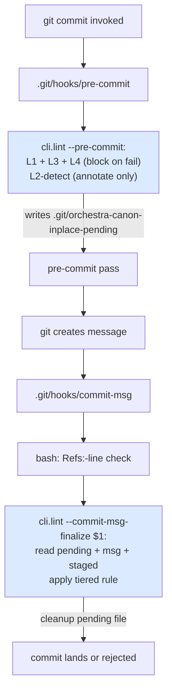

# Feature: orchestra v1.7 — Commit-msg L2-Finalize + Tiered Narrow-Change (LLD-009)

> **Doc ID:** 009-commit-msg-l2-finalize
> **Date:** 2026-05-11
> **DRI:** Hassan Mohiddin
> **Type:** Feature LLD
> **Status:** Draft
> **Iteration:** 1

## Glossary

- **L2-detect** — pre-commit-time canon-inplace detection. Annotates pending violations to `.git/orchestra-canon-inplace-pending` but does NOT block. Replaces strict-binary pre-commit-time L2 enforcement.
- **L2-finalize** — commit-msg-time canon-inplace enforcement. Reads pending file + commit message + staged content. Decides accept/reject based on `Addresses:` lines + Changelog rows + attestation severity (tiered rule per BUG-011).
- **pending file** — `.git/orchestra-canon-inplace-pending`. Format: one line per canon-inplace candidate as `<staged-blob-sha>  <repo-relative-path>` (two-space separator; same as git ls-files-stage column ordering). OVERWRITTEN at every pre-commit run; CLEANED UP at every commit-msg exit.
- **staged-blob-sha** — `git ls-files --stage <path>` column 2 output: 40-hex sha of blob in index. Stable identity for staged content within a commit window.
- **`Addresses:` line** — commit-message line in format `Addresses: docs/reviews/<doc-id>-rN.review.yaml finding <N> (Minor|Important|Critical)`. Path-explicit per Q6 grill answer. Multiple `Addresses:` lines permitted (multi-finding fix).
- **tiered rule (BUG-011)** — severity-based narrow-change permission: Critical NEVER bypasses supersession; Minor body edit + Addresses: + Changelog row passes; Important uses ≤3 narrow-change / ≥4 supersession threshold.
- **stage 0** — git index stage for non-merge commits. `git show :0:path` reads staged content for path under stage 0. Stages 1/2/3 indicate unresolved merge conflict.
- **canon-frozen-status set** — `{Approved, Implemented, Verified, Fix Applied, Current}`. Source: `cli/lint.py:71-73 CANON_FROZEN_STATUSES`.
- **ORCHESTRA_BYPASS** — environment variable (`ORCHESTRA_BYPASS=1`). When set: L2-finalize emits stderr warning + audit log entry (to `.git/orchestra-bypass-audit.log`) + skips enforcement. Documented as last-resort emergency override; commit message expected to include `Bypass:` annotation explaining reason.
- **severity-claim mismatch** — author-supplied severity in `Addresses:` line differs from severity in cited attestation YAML. L2-finalize rejects with `severity_mismatch` error. Anti-gaming primitive.

## Problem Statement

BUG-011 (`docs/bugs/BUG-011-supersession-tier-refinement.md`) documents over-correction of strict-binary narrow-change rule: 12 non-Critical findings on canon-frozen LLD-007 r4 drove ~60KB doc duplication via supersession-redo; tiered rule (Minor / Important / Critical) would have permitted narrow-change body edit + Changelog appends instead.

**Root architectural problem (codex r1 high #2 on prior LLD-008 scope):** tiered rule requires reading commit message (`Addresses:` lines naming attested findings), but L2 enforcement currently runs at pre-commit hook stage. Git hook ordering:

```
git commit
  ↓
.git/hooks/pre-commit          ← message NOT yet exists; L2 cannot read Addresses:
  ↓
[git creates message via editor or -m]
  ↓
.git/hooks/prepare-commit-msg
  ↓
.git/hooks/commit-msg          ← message available HERE; L2 CAN read Addresses:
  ↓
commit lands
```

Pre-commit-time L2 cannot evaluate tiered rule: data unavailable. Either:
- Pre-commit fails strict-binary on canon-inplace → false-rejects valid Minor fixes (current behavior); OR
- Pre-commit weakens to permit canon-inplace → loses primary defense (rejected approach).

Additionally (codex r2 high #3): naive L2 implementation reads working-tree content (`(repo_root / path).read_text()`) instead of staged content (`git show :path`). Common workflow (developer stages then continues editing) → L2 evaluates wrong text → false accept/reject.

**Solution:** split L2 into two stages. L2-detect at pre-commit annotates candidates without blocking. L2-finalize at commit-msg has message + staged content; applies tiered rule with full data.

## Success Criteria

### Acceptance items

- [ ] **A1.** New pre-commit-time stage **L2-detect**: `cli.lint --pre-commit` adds canon-inplace candidate detection. For each staged `.md` file under `REFS_ELIGIBLE_PREFIXES` whose prior HEAD Status ∈ canon-frozen-status set AND `is_narrow_change(prior, new)` returns False: append to `.git/orchestra-canon-inplace-pending` (truncated at start of run). Format: `<staged-blob-sha>  <repo-relative-path>`. Does NOT block. Tests T1a (truncate-on-start), T1b (append per candidate), T1c (correct sha-path format), T1d (does not block when pending non-empty).
- [ ] **A2.** New commit-msg-time entrypoint **`cli.lint --commit-msg-finalize <msg-file>`**: reads pending file + msg file + staged content via `git show :0:<path>`. Per pending entry: re-verify staged-blob-sha matches pending sha (defends against mid-commit staged drift); apply tiered rule using `Addresses:` lines + attestation YAMLs + Changelog row presence. Cleans up pending file at exit. Tests T2a (pending matches sha → proceed), T2b (sha drift → `staged_drift` error), T2c (cleanup on success), T2d (cleanup on fail).
- [ ] **A3.** **Tiered rule logic** in `is_narrow_change(prior_text, new_text, commit_msg=None) -> tuple[bool, str]` at `cli/lint.py` (insertion point: after existing `extract_changelog_and_strip` function at `cli/lint.py:367`; new logic spans approximately 50 lines; MUST be added BEFORE the existing `is_narrow_change` body so that strict-binary path remains the fallback). When `commit_msg` provided AND non-empty: parse `Addresses:` lines via `FINDING_REF_RE`; verify each cited attestation severity via NEW helper `_verify_finding_in_attestation(repo_root, attestation_path, finding_n, claimed_severity)`; verify Changelog row added per finding via NEW helper `_verify_changelog_row_per_finding(new_text, refs)`; apply threshold: Critical → reject; Important ≤3 → pass; Important ≥4 → reject; Minor any-count → pass. Tests T3a-h (one per tier path).
- [ ] **A4.** **Helper `_verify_finding_in_attestation(repo_root, attestation_path, finding_n, claimed_severity)`** at `cli/lint.py` (post `is_narrow_change` extension; expected line range `cli/lint.py:430-470` post-LLD-008 baseline; exact line confirmed at impl time). Reads YAML; gets `gates.<gate>.findings[finding_n-1]` (1-indexed in commit msg; 0-indexed in YAML); compares severity field. Returns `(True, "")` on match; `(False, "severity_mismatch: cited <claimed>; attestation <actual>")` on mismatch. Test T4a (match), T4b (mismatch), T4c (out-of-range finding_n), T4d (missing attestation file).
- [ ] **A5.** **Helper `_verify_changelog_row_per_finding(new_text, refs)`** in same file. For each ref: assert Changelog table contains row whose Change cell mentions attestation path + finding number (regex search; tolerant of formatting). Returns `(True, "")` on all-present; `(False, "missing_changelog_row: <attestation> finding <N>")` on first miss. Tests T5a (all-present), T5b (missing row).
- [ ] **A6.** **`FINDING_REF_RE`** at `cli/lint.py` (top-level constant, near existing regex constants at `cli/lint.py:128-130`): `re.compile(r"^Addresses:\s+(\S+\.review\.yaml)\s+finding\s+(\d+)\s+\((Minor|Important|Critical)\)\s*$", re.MULTILINE)`. Anchored line-start + line-end → exact line match; multiple lines via MULTILINE. Test T6 (regex behavior on representative msg samples).
- [ ] **A7.** **Index-vs-worktree fix (codex r2 high #3):** L2-finalize uses `git show :0:<path>` for staged content; rejects on `git show` error indicating unresolved merge stages 1/2/3 with `unresolved_merge` error. Pseudocode contract:
  ```python
  def _read_staged_content(repo_root: Path, path: str) -> str:
      try:
          return subprocess.check_output(
              ["git", "show", f":0:{path}"],
              cwd=repo_root, text=True, stderr=subprocess.PIPE,
          )
      except subprocess.CalledProcessError as e:
          stderr = e.stderr or ""
          if "exists on disk, but not in" in stderr or "unmerged" in stderr.lower():
              raise UnresolvedMergeError(path)
          raise
  ```
  Tests T7a (staged content read correctly), T7b (worktree-only edit ignored), T7c (unresolved merge → reject with `unresolved_merge`).
- [ ] **A8.** **New SKILL.md prose** at `skills/commit/SKILL.md` (LLD-008 ships this file; LLD-009 prepends content): pre-stage discipline checklist. Agent runs BEFORE `git add`: read prior canon-frozen file Status; if canon-frozen body change planned: draft commit message with `Addresses:` lines per finding; add Changelog row per finding to doc; THEN stage. Optional: run `cli.lint --pre-stage-check <doc-path> --commit-msg-draft <text>` for early feedback. Test T8 (skill markdown contains pre-stage checklist section).
- [ ] **A9.** **`cli.lint --pre-stage-check <doc-path> --commit-msg-draft <text>`** entrypoint: runs L2-finalize logic against working-tree content (since not yet staged) + draft commit message. Returns exit 0 with PASS or exit 1 with finding messages. Author-iteration tool; not hook. Tests T9a (working-tree-clean draft passes), T9b (missing Addresses: → fail), T9c (Critical bypass attempt → fail).
- [ ] **A10.** **`ORCHESTRA_BYPASS=1` env-var emergency override:** L2-finalize at start checks `os.environ.get("ORCHESTRA_BYPASS")`. If `"1"` (exact string match): emit stderr warning `WARNING: ORCHESTRA_BYPASS=1 set; L2-finalize skipped for <commit-sha-prefix>` + append audit log entry to `.git/orchestra-bypass-audit.log` (format: `<ISO-8601-timestamp>  <commit-sha-prefix>  <user@host>  <commit-msg-first-line>`); skip rest of L2-finalize; exit 0. Author expected to add `Bypass: <reason>` annotation in commit message (NOT enforced; advisory). Tests T10a (env-var skips enforcement + writes audit), T10b (audit log line format), T10c (commit otherwise unaffected).
- [ ] **A11.** **CI / no-TTY default fail-closed:** if commit-msg hook fires WITHOUT `<msg-file>` arg (degenerate hook setup): L2-finalize exits non-zero with explicit error `commit-msg arg required for L2-finalize`. No silent fail-open. Test T11.
- [ ] **A12.** **commit-msg.sh shell wrapper update** at `skills/commit/templates/commit-msg.sh` (LLD-008 ships file; LLD-009 updates contents): runs Refs:-line check (existing) + `python -m cli.lint --commit-msg-finalize "$1"` (NEW). Both must pass for commit to proceed. Test T12 (shell template content assertions).
- [ ] **A13.** **pre-commit.sh shell wrapper update** at `skills/commit/templates/pre-commit.sh`: unchanged content; L2-detect runs inside `cli.lint --pre-commit` already (per A1). No template content change. Test T13 (template content unchanged from LLD-008 ship).
- [ ] **A14.** BUG-011 closes via this LLD ship. BUG-011 frontmatter currently `Status: Investigating` (per `docs/bugs/BUG-011-supersession-tier-refinement.md:8`); BUG-011 r1 Changelog records `Status: Draft → Implemented` (internal contradiction; frontmatter source of truth). LLD-009 impl: append BUG-011 Changelog row reconciling — note prior Changelog entry was incorrect; Status remained Investigating; flip to `Fix Applied` on this LLD's impl ship. Since BUG-011 currently Investigating (NOT canon-frozen), full edit permitted; narrow-change discipline does not apply.
- [ ] **A15.** Plugin version: 1.6.2 → 1.7.0 (combined ship after LLD-008 + 009 + 010 all pass).
- [ ] **A16.** Pytest target: LLD-008 baseline (161) + LLD-009 new tests (T1-T13 = ~25 distinct test functions) → ≥186. Combined v1.7.0 target after LLD-010 ships.
- [ ] **A17.** CHANGELOG.md v1.7.0 entry (LLD-009 portion) describes: L2-detect / L2-finalize split, tiered rule (BUG-011 close), pending-file format, ORCHESTRA_BYPASS, pre-stage-check entrypoint, index-vs-worktree fix.

### Deliverables

- [ ] D1. `docs/design/orchestra-philosophy.md` Changelog appended with v1.7 LLD-009 entry.
- [ ] D2. `docs/runbooks/RUNBOOK-canon-inplace-violation-recovery.md` updated to reference tiered rule path (alongside existing supersession path).
- [ ] D3. CONTRIBUTING.md mentions `cli.lint --pre-stage-check` for early-feedback workflow.

## Scope

### In Scope (LLD-009 ships exactly this)

1. **L2-detect at pre-commit** — annotate-only; writes pending file (truncate-then-append per run); does not block.
2. **L2-finalize at commit-msg** — reads pending + msg + staged-content; applies tiered rule; cleans up pending file at exit.
3. **Tiered rule logic** in `is_narrow_change()` extension (BUG-011 fix) — Critical/Important/Minor severity → narrow-change permission.
4. **Helpers** `_verify_finding_in_attestation` + `_verify_changelog_row_per_finding`.
5. **Pending file format** — `<staged-blob-sha>  <path>` per line.
6. **Index-vs-worktree fix** — `git show :0:<path>` for staged content; reject merge-stage commits.
7. **`cli.lint --pre-stage-check`** — author-iteration entrypoint.
8. **`ORCHESTRA_BYPASS`** env-var emergency override.
9. **commit-msg.sh shell wrapper update** to invoke new entrypoint.
10. **SKILL.md pre-stage checklist prose** — agent guidance for drafting Addresses: lines pre-staging.

### Out of Scope (deferred to LLD-008 / LLD-010)

- Skill structure + references migration → LLD-008.
- cli.install_hooks --on-conflict → LLD-008.
- cli.init bootstrap → LLD-008.
- SCALE migration → LLD-008.
- Framework-detection (BUG-006) → LLD-010.
- precommit-framework-snippet.yaml → LLD-010.
- Multi-line bypass validation (Bypass: annotation enforcement) — advisory only this LLD; mechanical enforcement deferred.
- Cross-commit pending-file lifecycle (e.g., `git commit --amend` interactions) — pending file truncated per pre-commit run; amend re-runs pre-commit; should work but not exhaustively tested.

## Design

### Hook flow (revised per codex r1 high #2)



### Pending file format (Q1 grill answer)

Each line: `<40-hex-sha>  <repo-relative-path>` (two-space separator). Mirrors `git ls-files --stage` column 2 + path output. Example:

```
3a8b9d2f1e7c4567890abcdef1234567890abcde  docs/features/007-spec-review-architecture-r5.md
b1c2d3e4f5a6789012345678901234567890abcd  docs/bugs/BUG-005-mkdocs-nav-no-auto-detect.md
```

Pre-commit OVERWRITES at start (truncate). Commit-msg READS + DELETES at exit (success or fail). Aborted commits (commit-msg never fires): pending file persists; next pre-commit overwrites. No cross-commit staleness.

### `is_narrow_change()` tiered extension

```python
FINDING_REF_RE = re.compile(
    r"^Addresses:\s+(\S+\.review\.yaml)\s+finding\s+(\d+)\s+\((Minor|Important|Critical)\)\s*$",
    re.MULTILINE,
)


def is_narrow_change(
    prior_text: str,
    new_text: str,
    commit_msg: str | None = None,
    repo_root: Path | None = None,
) -> tuple[bool, str]:
    """v1.7+ tiered rule (BUG-011) + commit-msg-aware path.

    Existing strict-binary semantics preserved when commit_msg is None
    (pre-commit-time L2-detect path: caller annotates pending file but
    does NOT block).

    When commit_msg provided AND repo_root provided (commit-msg-time
    L2-finalize path): tiered rule per BUG-011 — Critical never bypasses
    supersession; Minor body edit + Addresses: + Changelog row passes;
    Important uses ≤3 / ≥4 threshold.
    """
    # === Step 1: Existing whitelist + Changelog-append checks (unchanged) ===
    # ... existing strict-binary logic; if passes whitelist → return (True, "")

    # === Step 2: New tiered path ===
    if commit_msg is None or repo_root is None:
        # L2-detect path: caller is pre-commit; just report strict-binary verdict
        return (False, "<existing strict-binary reject reason>")

    # L2-finalize path: tiered rule applies
    refs = FINDING_REF_RE.findall(commit_msg)
    if not refs:
        return (False, "canon-inplace body change without Addresses: lines")

    important_count = 0
    for attestation_path, finding_n, severity in refs:
        if severity == "Critical":
            return (False, f"Critical finding {finding_n} cannot be fixed via narrow-change; supersession required")
        ok, why = _verify_finding_in_attestation(repo_root, attestation_path, int(finding_n), severity)
        if not ok:
            return (False, why)
        if severity == "Important":
            important_count += 1

    if important_count >= 4:
        return (False, f"{important_count} Important findings exceed narrow-change threshold (3); supersession required")

    ok, why = _verify_changelog_row_per_finding(new_text, refs)
    if not ok:
        return (False, why)

    return (True, "tiered narrow-change permitted")
```

### `_verify_finding_in_attestation` helper

```python
def _verify_finding_in_attestation(
    repo_root: Path,
    attestation_path: str,
    finding_n: int,
    claimed_severity: str,
) -> tuple[bool, str]:
    """Read attestation YAML; verify findings[finding_n-1].severity == claimed."""
    import yaml
    full = repo_root / attestation_path
    if not full.exists():
        return (False, f"missing_attestation: {attestation_path}")
    try:
        att = yaml.safe_load(full.read_text(encoding="utf-8"))
    except yaml.YAMLError as e:
        return (False, f"attestation_parse_error: {e}")

    # findings field structure is per-gate per LLD-007 schema; flatten
    all_findings: list[dict] = []
    for gate in (att.get("gates") or {}).values():
        all_findings.extend(gate.get("findings") or [])
    if finding_n < 1 or finding_n > len(all_findings):
        return (False, f"finding_n_out_of_range: {finding_n} (have {len(all_findings)})")
    actual = all_findings[finding_n - 1].get("severity", "")
    if actual != claimed_severity:
        return (False, f"severity_mismatch: cited {claimed_severity}; attestation {actual}")
    return (True, "")
```

### `_verify_changelog_row_per_finding` helper

```python
def _verify_changelog_row_per_finding(
    new_text: str,
    refs: list[tuple[str, str, str]],
) -> tuple[bool, str]:
    """Per ref: assert Changelog table has row mentioning attestation path + finding N."""
    rows, _ = extract_changelog_and_strip(new_text)
    for attestation_path, finding_n, severity in refs:
        # Tolerant search: row contains both attestation basename + finding N
        att_basename = Path(attestation_path).name
        finding_marker = f"finding {finding_n}"
        found = any(att_basename in row and finding_marker in row for row in rows)
        if not found:
            return (False, f"missing_changelog_row: {attestation_path} finding {finding_n}")
    return (True, "")
```

### `cli.lint --commit-msg-finalize` entrypoint

```python
def lint_commit_msg_finalize(msg_file_path: str, repo_root: Path) -> int:
    # ORCHESTRA_BYPASS check (A10)
    if os.environ.get("ORCHESTRA_BYPASS") == "1":
        _emit_bypass_warning_and_audit(repo_root, msg_file_path)
        return 0

    pending_file = repo_root / ".git" / "orchestra-canon-inplace-pending"
    if not pending_file.exists():
        return 0  # no canon-inplace candidates; pass

    msg = Path(msg_file_path).read_text(encoding="utf-8")
    findings: list[Finding] = []
    try:
        for line in pending_file.read_text(encoding="utf-8").splitlines():
            if not line.strip():
                continue
            try:
                pending_sha, path = line.split("  ", 1)
            except ValueError:
                findings.append(Finding("error", "pending-file", f"malformed line: {line!r}"))
                continue

            # A2: re-verify staged sha matches pending sha
            current_sha = _get_staged_blob_sha(repo_root, path)
            if current_sha != pending_sha:
                findings.append(Finding(
                    "error", path,
                    f"staged_drift: pending sha {pending_sha[:10]}; current {current_sha[:10]}",
                ))
                continue

            # Read prior + staged content
            try:
                prior_text = subprocess.check_output(
                    ["git", "show", f"HEAD:{path}"],
                    cwd=repo_root, text=True, stderr=subprocess.DEVNULL,
                )
            except subprocess.CalledProcessError:
                prior_text = ""  # new file; should not be in pending but defensive

            try:
                new_text = _read_staged_content(repo_root, path)
            except UnresolvedMergeError:
                findings.append(Finding("error", path, "unresolved_merge: cannot evaluate canon-inplace"))
                continue

            ok, why = is_narrow_change(prior_text, new_text, commit_msg=msg, repo_root=repo_root)
            if not ok:
                findings.append(Finding("error", path, why))
    finally:
        pending_file.unlink()  # always cleanup

    for f in findings:
        print(f.format(), file=sys.stderr)
    return 1 if findings else 0
```

### `cli.lint --pre-stage-check` entrypoint

```python
def lint_pre_stage_check(doc_path: str, commit_msg_draft: str, repo_root: Path) -> int:
    """Author-iteration tool. Runs L2-finalize logic against WORKING-TREE content
    (since not yet staged) + draft commit message. For early feedback before staging.
    """
    full = repo_root / doc_path
    if not full.exists():
        print(f"error: {doc_path} not found", file=sys.stderr)
        return 1
    try:
        prior_text = subprocess.check_output(
            ["git", "show", f"HEAD:{doc_path}"],
            cwd=repo_root, text=True, stderr=subprocess.DEVNULL,
        )
    except subprocess.CalledProcessError:
        prior_text = ""
    new_text = full.read_text(encoding="utf-8")

    prior_status = parse_status(prior_text)
    if prior_status not in CANON_FROZEN_STATUSES:
        print(f"PASS — {doc_path} prior Status {prior_status!r} not canon-frozen; no L2 applies", file=sys.stderr)
        return 0

    ok, why = is_narrow_change(prior_text, new_text, commit_msg=commit_msg_draft, repo_root=repo_root)
    if ok:
        print(f"PASS — {doc_path} draft message satisfies tiered rule", file=sys.stderr)
        return 0
    print(f"FAIL — {doc_path}: {why}", file=sys.stderr)
    return 1
```

### `commit-msg.sh` shell wrapper (per A12)

```bash
#!/usr/bin/env bash
# Orchestra commit-msg hook — Refs:-line check + L2-finalize.
set -euo pipefail

MSG_FILE="$1"
SUBJECT=$(head -n1 "$MSG_FILE")

# Existing Refs:-line check
if echo "$SUBJECT" | grep -qE '^(fix|feat)(\(.*\))?:'; then
    if ! grep -q '^Refs: docs/' "$MSG_FILE"; then
        echo "error: commit subject is fix:/feat: but message body has no 'Refs: docs/...' line." >&2
        exit 1
    fi
fi

# NEW: L2-finalize
PY="${PYTHON:-}"
if [ -z "$PY" ]; then
  if command -v python3 >/dev/null 2>&1; then PY=python3
  elif command -v python >/dev/null 2>&1; then PY=python
  else echo "error: commit-msg hook needs python" >&2; exit 1
  fi
fi
"$PY" -m cli.lint --commit-msg-finalize "$MSG_FILE"
```

### Author UX (per Q5 grill answer + A8 + A9)

Skill SKILL.md prose checklist (pre-stage):

```
Before `git add` on a canon-frozen-eligible doc:

1. Check prior Status: `git show HEAD:<path> | head -20 | grep "Status:"`
2. If Status ∈ {Approved, Implemented, Verified, Fix Applied, Current}:
   a. This is canon-frozen. Body changes require either:
      - Whitelist edit (Status / Iteration / Superseded by + Changelog append) → no Addresses: needed
      - Narrow-change with tiered rule → Addresses: lines + Changelog rows
      - Supersession → archive + -rN.md path (see references/supersession-decision.md)
   b. For tiered narrow-change:
      - Identify finding(s) being addressed: read attestation YAML (e.g., docs/reviews/<doc-id>-rN.review.yaml)
      - Add Changelog row per finding to doc body
      - Draft commit message with `Addresses:` lines per finding
      - Run early-feedback: `python -m cli.lint --pre-stage-check <doc-path> --commit-msg-draft "$(cat msg.txt)"`
      - When PASS: stage doc + commit with prepared message
3. If Status: Draft / Investigating / etc.: full edit permitted; standard discipline only
```

## Edge Cases

1. **Pending file exists at pre-commit start (from prior aborted commit)**: pre-commit TRUNCATES at start. Stale entries discarded. No cross-commit pollution.
2. **Commit-msg fires without msg-file arg** (degenerate hook setup): A11 fail-closed; explicit error.
3. **`git commit --amend`**: pre-commit re-fires; pending overwritten; commit-msg re-fires; finalize re-runs. Same flow as fresh commit. Tested via T2c.
4. **Mid-commit staged drift** (developer runs `git add file` between pre-commit fire and commit-msg fire): A2 staged-blob-sha re-check catches; rejects with `staged_drift`. Tested T2b.
5. **Unresolved merge stages 1/2/3**: A7 rejects with `unresolved_merge` error. Author resolves merge before retry.
6. **`Addresses:` line malformed** (regex non-match): treated as no-Addresses; falls back to strict-binary reject.
7. **Severity claim mismatch**: A4 catches; rejects with `severity_mismatch`. Anti-gaming.
8. **Out-of-range finding_n**: A4 returns `finding_n_out_of_range`. Author miscount → fix + retry.
9. **Missing attestation file at cited path**: A4 returns `missing_attestation`. Author cited stale or non-existent attestation.
10. **Multiple `Addresses:` lines for same attestation, different findings**: each verified independently; all must match.
11. **Multiple `Addresses:` lines spanning multiple attestations** (codex + orchestra both): each verified independently; tiered counter aggregates Important across all attestations.
12. **`ORCHESTRA_BYPASS=1` set without legitimate emergency**: A10 honors; emits warning + audit log entry. Audit log is the deterrent — auditable post-hoc.
13. **Empty pending file at commit-msg time**: pass (A2 guards).
14. **Commit aborted between pre-commit (pending written) and commit-msg fire** (e.g., editor :q!): pending persists until next pre-commit truncates. No L2-finalize fires. No false negatives or positives — commit didn't land.
15. **Concurrent commits in same repo** (rare; git index lock prevents this). Both pre-commits would block on `.git/index.lock`; only one wins. Pending file written by winner; other pre-commit retries. No race.
16. **Worktree not in repo root** (sub-worktree via `git worktree add`): `repo_root` resolved via `git rev-parse --show-toplevel`; `.git/orchestra-canon-inplace-pending` lives under sub-worktree's `.git/worktrees/<name>/`. Tested implicitly via subprocess.cwd patterns.

## Security

- L2-finalize parses commit messages — author-controlled. Severity comes from attestation YAML (signed by spec-review subagent), not author claim. Anti-gaming via A4.
- `.git/orchestra-canon-inplace-pending` repo-local; not committed; not exfiltrated. Path-list + sha only.
- `.git/orchestra-bypass-audit.log` repo-local; not committed; appended-only. Auditable post-hoc.
- ORCHESTRA_BYPASS env-var: explicit invocation; not implicit. Emit + log on use.
- No secrets read or written.
- `git show :0:<path>` runs in subprocess; `path` is from staged file list (developer-staged); no untrusted-input injection (git escapes args).

## Testing

### Phase impl — new test matrix

| Test ID | Acceptance | Description |
|---|---|---|
| T1a | A1 | Pending file truncated at pre-commit start |
| T1b | A1 | Pending file appended per canon-inplace candidate |
| T1c | A1 | Pending entries in `<sha>  <path>` format |
| T1d | A1 | Pre-commit does not block when pending non-empty |
| T2a | A2 | L2-finalize: pending sha matches → proceed to tier check |
| T2b | A2 | L2-finalize: staged sha drift → `staged_drift` error |
| T2c | A2 | L2-finalize cleans up pending file on success |
| T2d | A2 | L2-finalize cleans up pending file on fail |
| T3a | A3 | Tiered: Minor body edit + Addresses: + Changelog → pass |
| T3b | A3 | Tiered: Critical with Addresses: → reject |
| T3c | A3 | Tiered: Important ≤3 + valid → pass |
| T3d | A3 | Tiered: Important ≥4 → reject |
| T3e | A3 | Tiered: Minor without Changelog row → reject |
| T3f | A3 | Tiered: severity-claim mismatch → `severity_mismatch` |
| T3g | A3 | Tiered: no Addresses: lines + canon-inplace → reject (strict-binary fallback) |
| T3h | A3 | Tiered: pending empty → pass regardless of msg |
| T4a | A4 | _verify_finding_in_attestation: severity match |
| T4b | A4 | _verify_finding_in_attestation: severity mismatch |
| T4c | A4 | _verify_finding_in_attestation: out-of-range finding_n |
| T4d | A4 | _verify_finding_in_attestation: missing attestation file |
| T5a | A5 | _verify_changelog_row: all-present |
| T5b | A5 | _verify_changelog_row: missing row |
| T6 | A6 | FINDING_REF_RE regex on representative samples |
| T7a | A7 | _read_staged_content reads stage-0 correctly |
| T7b | A7 | Worktree-only edit ignored when staged differs |
| T7c | A7 | Unresolved merge → `unresolved_merge` error |
| T8 | A8 | SKILL.md prose contains pre-stage checklist section |
| T9a | A9 | --pre-stage-check: working-tree-clean draft passes |
| T9b | A9 | --pre-stage-check: missing Addresses: → fail |
| T9c | A9 | --pre-stage-check: Critical bypass attempt → fail |
| T10a | A10 | ORCHESTRA_BYPASS=1 skips enforcement + writes audit log |
| T10b | A10 | Audit log line format `<ts>  <sha>  <user@host>  <subject>` |
| T10c | A10 | Commit otherwise unaffected by bypass |
| T11 | A11 | commit-msg without msg-file arg → fail-closed |
| T12 | A12 | commit-msg.sh template content assertions |
| T13 | A13 | pre-commit.sh template unchanged from LLD-008 ship |

Total: 36 distinct test functions across 13 test groups.

Pytest target post-LLD-009-ship: 161 (LLD-008 baseline) + 36 (LLD-009) = ≥197.

## Related Documents

- `docs/features/008-commit-skill.md` — companion LLD; skill structure + bootstrap (LLD-009 builds on this)
- `docs/features/010-framework-detection-determinism.md` — companion LLD; framework integration (independent of LLD-009)
- `docs/features/006-archive-and-supersession-conventions-r4.md` — LLD-006-r4: narrow-change foundation
- `docs/features/007-spec-review-architecture-r5.md` — LLD-007-r5: attestation schema (severity field source)
- `docs/bugs/BUG-011-supersession-tier-refinement.md` — closes via this LLD (A14)
- `docs/postmortems/POSTMORTEM-2026-05-10-canon-inplace-violation.md` — incident lineage
- `docs/runbooks/RUNBOOK-canon-inplace-violation-recovery.md` — supersession workflow (companion to tiered rule)
- `docs/reviews/008-commit-skill-r2.codex.md` — codex r2 verdict triggered split + LLD-009 creation
- `cli/lint.py:71-73` — CANON_FROZEN_STATUSES (Glossary source)
- `cli/lint.py:128-130` — existing regex constants (FINDING_REF_RE insertion point)
- `cli/lint.py:367-395` — extract_changelog_and_strip + helpers (insertion point for new tiered logic)
- `cli/lint.py:397-427` — current is_narrow_change (extension target per A3)
- `cli/lint.py:759-807` — current lint_staged (L2 + L4 + L3 invocation; A1 modifies)

## Changelog

| Date | Change |
|---|---|
| 2026-05-11 | r1 LLD filed post-grilling-session (6 Q&A locked: pending format / overwrite-truncate / git show :0:path + reject-merge / fail-closed + ORCHESTRA_BYPASS / pre-stage skill checklist / path-explicit Addresses). Carries forward codex r1 high #2 (hook-ordering) + codex r2 high #1 + #3 (commit-msg arg + index-vs-worktree) fixes from prior LLD-008 r2 attempts. Status: Draft. Awaiting iteration 1 spec-review. |
