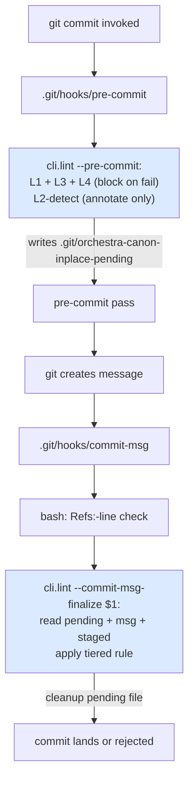

# Feature: orchestra v1.7 — Commit-msg L2-Finalize + Tiered Narrow-Change (LLD-009)

> **Doc ID:** 009-commit-msg-l2-finalize
> **Date:** 2026-05-11
> **DRI:** Hassan Mohiddin
> **Type:** Feature LLD
> **Status:** Implemented
> **Iteration:** 6

## Glossary

- **L2-detect** — pre-commit-time canon-inplace detection. Annotates pending violations to `.git/orchestra-canon-inplace-pending` but does NOT block. Replaces strict-binary pre-commit-time L2 enforcement.
- **L2-finalize** — commit-msg-time canon-inplace enforcement. Reads pending file + commit message + staged content. Decides accept/reject based on `Addresses:` lines + Changelog rows + attestation severity (tiered rule per BUG-011).
- **pending file** — at path `<git-dir>/orchestra-canon-inplace-pending` where `<git-dir>` is resolved via `git rev-parse --git-path orchestra-canon-inplace-pending` (handles standard repos AND `git worktree add` subworktrees per Edge Case 16). Format: one line per canon-inplace candidate as `<staged-blob-sha>\t<repo-relative-path>` (**tab separator**, matching git's native `ls-files --stage` `\t`-before-path column separator; orchestra invents nothing — path-with-two-spaces would break a two-space split). OVERWRITTEN at every pre-commit run; CLEANED UP at every commit-msg exit (via `unlink(missing_ok=True)` to tolerate double-fire).
- **staged-blob-sha** — `git ls-files --stage <path>` column 2 output: 40-hex sha of blob in index. Stable identity for staged content within a commit window.
- **`Addresses:` line** — commit-message line in format `Addresses: docs/reviews/<doc-id>-rN.review.yaml gate <gate-name> finding <N> (Minor|Important|Critical)` where `<gate-name>` ∈ `{completeness, evidence, clarity, consistency}` (per attestation-schema-v1.0.json). Path-explicit per Q6 grill answer. Gate-name explicit per r1 triple-converged finding (orchestra evidence Critical + sonnet F1) — without gate-name, dict-iteration-order across YAML reviewers shifts finding indices and breaks anti-gaming. Multiple `Addresses:` lines permitted (multi-finding fix). Deduplication: identical `(attestation_path, gate, finding_n)` tuples deduplicated before counting Important threshold (anti-copy-paste-inflation).
- **tiered rule (BUG-011)** — severity-based narrow-change permission: Critical NEVER bypasses supersession; Minor body edit + Addresses: + Changelog row passes; Important uses ≤3 narrow-change / ≥4 supersession threshold.
- **stage 0** — git index stage for non-merge commits. `git show :0:path` reads staged content for path under stage 0. Stages 1/2/3 indicate unresolved merge conflict.
- **canon-frozen-status set** — `{Approved, Implemented, Verified, Fix Applied, Current}`. Source: `cli/lint.py:71-73 CANON_FROZEN_STATUSES`.
- **ORCHESTRA_BYPASS** — environment variable (`ORCHESTRA_BYPASS=1`). When set: L2-finalize emits stderr warning + audit log entry (to `.git/orchestra-bypass-audit.log`) + skips enforcement. Documented as last-resort emergency override; commit message expected to include `Bypass:` annotation explaining reason.
- **ORCHESTRA_STRICT** — environment variable (`ORCHESTRA_STRICT=1`). When set AND pending file absent at commit-msg time: L2-finalize re-computes canon-inplace candidates by scanning staged docs (instead of fail-opening per default A2). Opt-in stricter mode for CI / security-critical repos that want to close the `--no-verify` bypass surface. Default fail-open semantics preserved per LLD-008 mechanical-backstop contract. Per user interview-gate direction (codex r2 HIGH#2 addressed via opt-in).
- **severity-claim mismatch** — author-supplied severity in `Addresses:` line differs from severity in cited attestation YAML. L2-finalize rejects with `severity_mismatch` error. Anti-gaming primitive.

## Problem Statement

BUG-011 (`docs/bugs/BUG-011-supersession-tier-refinement.md`) documents over-correction of strict-binary narrow-change rule: 12 non-Critical findings on canon-frozen LLD-007 r4 drove ~60KB doc duplication via supersession-redo; tiered rule (Minor / Important / Critical) would have permitted narrow-change body edit + Changelog appends instead.

**Root architectural problem (codex r1 high #2 on prior LLD-008 scope):** tiered rule requires reading commit message (`Addresses:` lines naming attested findings), but L2 enforcement currently runs at pre-commit hook stage. Git hook ordering:

```
git commit
  ↓
.git/hooks/pre-commit          ← message NOT yet exists; L2 cannot read Addresses:
  ↓
[git creates message via editor or -m]
  ↓
.git/hooks/prepare-commit-msg
  ↓
.git/hooks/commit-msg          ← message available HERE; L2 CAN read Addresses:
  ↓
commit lands
```

Pre-commit-time L2 cannot evaluate tiered rule: data unavailable. Either:
- Pre-commit fails strict-binary on canon-inplace → false-rejects valid Minor fixes (current behavior); OR
- Pre-commit weakens to permit canon-inplace → loses primary defense (rejected approach).

Additionally (codex r2 high #3): naive L2 implementation reads working-tree content (`(repo_root / path).read_text()`) instead of staged content (`git show :path`). Common workflow (developer stages then continues editing) → L2 evaluates wrong text → false accept/reject.

**Solution:** split L2 into two stages. L2-detect at pre-commit annotates candidates without blocking. L2-finalize at commit-msg has message + staged content; applies tiered rule with full data.

## Success Criteria

### Acceptance items

- [ ] **A1.** New pre-commit-time stage **L2-detect**: `cli.lint --pre-commit` adds canon-inplace candidate detection. For each staged `.md` file under `REFS_ELIGIBLE_PREFIXES` whose prior HEAD Status ∈ canon-frozen-status set AND `is_narrow_change(prior, new)` returns False: append to the pending file. Pending-file path resolved via `git rev-parse --git-path orchestra-canon-inplace-pending` (worktree-safe). Format: `<staged-blob-sha>\t<repo-relative-path>` (TAB separator). Truncated at start of run. Does NOT block. Tests T1a (truncate-on-start), T1b (append per candidate), T1c (tab-separated sha-path format), T1d (does not block when pending non-empty), T1e (worktree subdir → pending file lives under worktree's gitdir, not common .git/).
- [ ] **A2.** New commit-msg-time entrypoint **`cli.lint --commit-msg-finalize <msg-file>`**: reads pending file + msg file + staged content via `git show :0:<path>`. Per pending entry: re-verify staged-blob-sha matches pending sha (defends against mid-commit staged drift); apply tiered rule using `Addresses:` lines + attestation YAMLs + Changelog row presence. **Transactional pending cleanup (r6; per plan-r3 codex HIGH#1):** cleanup pending file ONLY after L2-finalize validation completes successfully (returns rc=0). If validation raises exception OR rejects with rc=1: pending file PRESERVED so retried commit re-runs L2-finalize on the same canon-frozen candidates (closes retry-time bypass surface where mid-validation crash skipped enforcement). Implementation: success-only `unlink()` at end of normal return; exception/reject paths exit without cleanup; next pre-commit fire (which truncates pending fresh) OR retried commit-msg fire (sees pending + re-validates) cleanly handles re-run. Tests T2g (crash-during-validation: inject exception → pending preserved → retry sees pending → re-runs successfully) + T2h (reject-then-retry: rc=1 leaves pending; retry with valid msg → rc=0 → cleanup). **Fail-open semantics when pending absent (intentional):** if pending file does NOT exist at commit-msg time, L2-finalize returns 0 (pass). Justification: L2-detect is the canonical canon-inplace detector and runs at pre-commit-time; absence of pending file means either (a) no canon-inplace candidates staged or (b) pre-commit was bypassed via `--no-verify` (which is the documented mechanical-backstop bypass; user accepts the responsibility). NOT silent fail-open in the security sense — pre-commit hook is the gate; commit-msg is the enforcer of what pre-commit found. Tests T2a (pending matches sha → proceed), T2b (sha drift → `staged_drift` error), T2c (cleanup on success), T2d (cleanup on fail), T2e (pending absent → pass with stderr note "L2-detect found no candidates"), T2f (double-fire → second invocation returns 0; no false rejection).
- [ ] **A3.** **Tiered rule logic** — `is_narrow_change` signature extended in place (NOT wrapper-over-original): `is_narrow_change(prior_text, new_text, commit_msg=None, repo_root=None) -> tuple[bool, str]`. Single function body with two paths:
  - **L2-detect path** (`commit_msg is None`): existing strict-binary logic (whitelist + Changelog-append only) — returns `(False, reason)` on body change. Caller (`lint_staged` at `cli/lint.py:759-807`) annotates pending file and does NOT block.
  - **L2-finalize path** (`commit_msg` provided AND `repo_root` provided): tiered rule. Parse `Addresses:` lines via `FINDING_REF_RE`; dedupe `(path, gate, finding_n)` tuples; verify each cited attestation severity via `_verify_finding_in_attestation`; verify Changelog row added per finding via `_verify_changelog_row_per_finding(new_body, refs)` (note: pass `new_body` post-`_split_metadata_and_body`, NOT full `new_text` — Changelog detection operates on body); accumulate findings list (do NOT early-return on first Critical so author sees full report); after loop: if any Critical present → reject with "Critical finding(s): <list>"; elif Important count (post-dedupe) ≥4 → reject with "Important count <N> exceeds threshold (3)"; else → pass. Call sites enumerated: `lint_staged` (L2-detect path; passes `commit_msg=None`) + `lint_commit_msg_finalize` (L2-finalize path; passes both args). Tests T3a-h.
- [ ] **A4.** **Helper `_verify_finding_in_attestation(repo_root, attestation_path, gate, finding_n, claimed_severity)`** at `cli/lint.py` (post `is_narrow_change`; exact line confirmed at impl time). **Path-traversal guard (per codex r2 HIGH#3):** use `Path.is_relative_to` for canonical containment check (NOT `str().startswith()` — vulnerable to `/repo/docs/reviews_evil/` prefix confusion). **Attestation trust source (per codex r2 CRITICAL):** reads attestation YAML via `git show :0:<attestation_path>` (staged content), NOT from working-tree filesystem (`(repo_root / attestation_path).read_text()` would let author keep unstaged severity-downgrade and pass L2-finalize without attestation mutation landing — trust-boundary break). If `git show :0:` exits non-zero (attestation not staged): reject with `attestation_not_staged: <path>` error. Reads YAML safe_load on staged content; navigates `gates[<gate>].findings[finding_n-1]` directly (gate-name explicit per A6 regex — no order-dependent flatten); compares severity field. Returns `(True, "")` on match; `(False, "severity_mismatch: cited <claimed>; attestation <actual>")` on mismatch. Tests T4a (match against staged), T4b (mismatch), T4c (out-of-range finding_n), T4d (missing attestation file in staged index), T4e (path-traversal via `..` rejected by `is_relative_to`), T4f (path-prefix-confusion `docs/reviews_evil/` rejected), T4g (gate-name not in schema rejected), T4h (working-tree-only attestation with downgraded severity rejected by `attestation_not_staged`).
- [ ] **A5.** **Helper `_verify_changelog_row_per_finding(new_body, prior_body, refs)`** in same file. Takes `new_body` (post-`_split_metadata_and_body`; NOT full file text) + `prior_body` (HEAD Changelog state for newly-added-row detection). For each ref: compute set of `(att_basename, gate, finding_n)` markers from new Changelog rows that did NOT exist in prior Changelog rows (i.e., newly-appended rows only — defends against false-accept where prior Changelog already mentioned same `<basename> finding <N>` from a previous narrow-change). Match marker via regex `<att_basename>.*\bgate\s+<gate>\b.*\bfinding\s+<N>\b` on a single new row. Returns `(True, "")` on all-present; `(False, "missing_changelog_row: <attestation> gate <gate> finding <N>")` on first miss. **Required Changelog row exemplar** (added to A5 + T5a fixture):

```
| 2026-05-11 | Addresses: docs/reviews/009-commit-msg-l2-finalize-r1.review.yaml gate completeness finding 3 (Minor) — fixed pending-file format wording per reviewer note |
```

Tests T5a (all-present with exemplar), T5b (missing row), T5c (row exists in prior Changelog but not new — false-accept blocked).
- [ ] **A6.** **`FINDING_REF_RE`** at `cli/lint.py` (top-level constant, near existing regex constants at `cli/lint.py:128-130`):

```python
FINDING_REF_RE = re.compile(
    r"^Addresses:\s+(docs/reviews/[^\s]+\.review\.yaml)\s+gate\s+(completeness|evidence|clarity|consistency)\s+finding\s+(\d+)\s+\((Minor|Important|Critical)\)\s*$",
    re.MULTILINE,
)
```

Anchored line-start + line-end → exact line match; multiple lines via MULTILINE. **Anchors:** path prefix `docs/reviews/` baked into regex (path-traversal defense at parse layer; redundant with A4 guard for defense-in-depth). Gate-name group restricts to attestation-schema-v1.0.json's 4 gates. **Diverges from BUG-011 r1 `FINDING_REF_RE` (unanchored, no gate-name)** per LLD-009 r1 sonnet F3: LLD-009's anchored + gate-explicit regex is the authoritative v1.7 contract; BUG-011's draft regex is superseded by this LLD. BUG-011 § Fix Description regex is illustrative pre-design only; tests created for this LLD use the canonical regex; no BUG-011 tests exist yet that need migration. Test T6 (regex behavior on representative msg samples: valid lines pass, embedded mid-prose `Addresses:` fails, `..`-traversal path fails, unknown gate fails).
- [ ] **A7.** **Index-vs-worktree fix (codex r2 high #3):** L2-finalize uses `git show :0:<path>` for staged content; rejects on `git show` error indicating unresolved merge stages 1/2/3 with `unresolved_merge` error. Pseudocode contract:
  ```python
  def _read_staged_content(repo_root: Path, path: str) -> str:
      try:
          return subprocess.check_output(
              ["git", "show", f":0:{path}"],
              cwd=repo_root, text=True, stderr=subprocess.PIPE,
          )
      except subprocess.CalledProcessError as e:
          stderr = e.stderr or ""
          if "exists on disk, but not in" in stderr or "unmerged" in stderr.lower():
              raise UnresolvedMergeError(path)
          raise
  ```
  Tests T7a (staged content read correctly), T7b (worktree-only edit ignored), T7c (unresolved merge → reject with `unresolved_merge`).
- [ ] **A8.** **New SKILL.md prose** at `skills/commit/SKILL.md` (LLD-008 ships this file; LLD-009 prepends content): pre-stage discipline checklist. Agent runs BEFORE `git add`: read prior canon-frozen file Status; if canon-frozen body change planned: draft commit message with `Addresses:` lines per finding; add Changelog row per finding to doc; THEN stage. Optional: run `cli.lint --pre-stage-check <doc-path> --commit-msg-draft <text>` for early feedback. Test T8 (skill markdown contains pre-stage checklist section).
- [ ] **A9.** **`cli.lint --pre-stage-check <doc-path> --commit-msg-draft <text>`** entrypoint: runs L2-finalize logic against working-tree content (since not yet staged) + draft commit message. Returns exit 0 with PASS or exit 1 with finding messages. Author-iteration tool; not hook. Tests T9a (working-tree-clean draft passes), T9b (missing Addresses: → fail), T9c (Critical bypass attempt → fail).
- [ ] **A10b.** **`ORCHESTRA_STRICT=1` env-var opt-in stricter mode (per codex r2 HIGH#2 + user interview-gate direction):** L2-finalize at start checks `os.environ.get("ORCHESTRA_STRICT")`. If `"1"` AND pending file absent at commit-msg time: instead of fail-open (A2 default), recompute canon-inplace candidates inline by scanning staged `.md` files under `REFS_ELIGIBLE_PREFIXES` with canon-frozen prior Status and `is_narrow_change(prior, new, commit_msg=None, repo_root=None)` returning False. Apply tiered rule to the recomputed candidate set. Closes `--no-verify` bypass surface for CI / security-critical repos. Default behavior (env unset): fail-open per A2 preserved (LLD-008 mechanical-backstop contract honored). Tests T10b-strict-a (env-var set + no pending + staged canon-inplace + Addresses: lines + tiered Minor → pass), T10b-strict-b (env-var set + no pending + staged canon-inplace + missing Addresses: → reject), T10b-strict-c (env-var unset + no pending → fail-open per A2 default = pass).
- [ ] **A10.** **`ORCHESTRA_BYPASS=1` env-var emergency override with trust-boundary controls (r4 added CI-deny + mandatory Bypass:; r5 upgrades CI detection to multi-var):** L2-finalize at start checks `os.environ.get("ORCHESTRA_BYPASS")`. If `"1"` (exact string match):
  - **Multi-var CI-deny (r5; per plan-r2 codex HIGH#2):** invoke helper `_is_ci_environment()` which returns True if ANY of these env vars non-empty: `CI`, `GITHUB_ACTIONS`, `GITLAB_CI`, `BUILDKITE`, `CIRCLECI`, `TRAVIS`, `JENKINS_URL`. If True: REJECT bypass with explicit error `error: ORCHESTRA_BYPASS=1 cannot be used in CI environment (detected via: <list-of-set-vars>). Fix the underlying issue or run locally if bypass truly needed.`. Exit non-zero (rc=1). Audit log entry written documenting denied attempt. Closes plan-r1 codex HIGH#4 CI-inheritance + plan-r2 codex HIGH#2 brittle-detection gaps.
  - **Mandatory `Bypass: <reason>` annotation (r4):** parse commit message body for line matching `^Bypass: (.+)$` (anchored, MULTILINE). If absent: REJECT with `error: ORCHESTRA_BYPASS=1 requires 'Bypass: <reason>' annotation in commit message body explaining justification.`. Exit non-zero (rc=1). Promotes prior advisory annotation to enforced.
  - **Valid bypass path:** CI-detection unset + `Bypass:` annotation present → emit stderr warning `WARNING: ORCHESTRA_BYPASS=1 set; L2-finalize skipped. Reason: <reason>` + append audit log entry to gitdir-resolved `<git-dir>/orchestra-bypass-audit.log` (format: `<ISO-8601-timestamp>\t<HEAD-sha-or-INITIAL>\t<user@host>\t<commit-msg-first-line>\t<reason>` — TAB-separated 5 columns); skip rest of L2-finalize; exit 0.
  - Tests T10a (valid bypass), T10b (audit log format), T10c (commit unaffected), T10d (initial commit → INITIAL), T10e (CI=true → REJECT), T10f (Bypass: missing → REJECT), **T10g (multi-var: CI unset + GITHUB_ACTIONS=true alone → REJECT — closes plan-r2 codex HIGH#2 regression).**
  - **`--amend --no-verify` documented:** per LLD-008 Glossary `mechanical backstop`, `--no-verify` skips pre-commit hook so pending file never written; L2-finalize sees no pending and exits 0 (per A2 fail-open). Sanctioned mechanical-backstop bypass; `ORCHESTRA_BYPASS=1` is granular alternative when `--no-verify` too aggressive. ORCHESTRA_BYPASS now multi-var CI-denied; `--no-verify` remains git-native bypass (no env check there).
- [ ] **A11.** **CI / no-TTY default fail-closed:** if commit-msg hook fires WITHOUT `<msg-file>` arg (degenerate hook setup): L2-finalize exits non-zero with explicit error `commit-msg arg required for L2-finalize`. No silent fail-open. Test T11.
- [ ] **A12.** **commit-msg.sh shell wrapper — single canonical content (LLD-008 + LLD-009 ship together):** since v1.7.0 bundles all 3 LLDs in one release, the `skills/commit/templates/commit-msg.sh` file shipped by LLD-008 has the EXACT contents specified by LLD-009 — no intermediate state. LLD-008 A2 enumerates the file; LLD-009 A12 specifies the contents (full template inlined in § `commit-msg.sh shell wrapper`). LLD-008 ships the file; LLD-009 specifies what's in it. No `r1 then r2` shell-template drift. Test T12 (shell template content assertions: shebang + `# orchestra` fingerprint comment + `set -euo pipefail` + Refs:-line check + L2-finalize invocation + clean exit). **`# orchestra` fingerprint in line 2** (required by LLD-010 A4 `RAW_FINGERPRINT` check; closes sonnet F8 cross-LLD contract).
- [ ] **A13.** **pre-commit.sh shell wrapper:** since LLD-008/009 ship together, single canonical content. **Ownership:** LLD-008 A2 ships the `skills/commit/templates/pre-commit.sh` FILE (path + structure); LLD-009 A13 specifies the CONTENT (shebang + `# orchestra` fingerprint in line 2 (RAW_FINGERPRINT per LLD-010 A4) + `python -m cli.lint --pre-commit` invocation). Mirrors LLD-008 + LLD-009 split for `commit-msg.sh` (A12). L2-detect runs inside `cli.lint --pre-commit` (per A1); no shell-side wrapper change. Test T13 renamed to **T13-pre** to avoid ID collision with LLD-010 T13 (template content assertions: shebang + fingerprint + cli.lint invocation).
- [ ] **A14.** BUG-011 closes via this LLD ship. **Precursor commit already landed** (`0bd866d` 2026-05-11): BUG-011 r1 Changelog row reconciled from erroneous "Status: Draft → Implemented" to correct "Status: Draft → Investigating"; new r2 Changelog row documents the fix. BUG-011 frontmatter `Status: Investigating` (NOT canon-frozen) — full edit permitted; narrow-change discipline does not apply. **This LLD's ship triggers**: flip BUG-011 frontmatter `Status: Investigating → Fix Applied` (whitelist edit; permitted on canon-frozen-transition) + append closing Changelog row citing this LLD's impl-commit-sha. Status flip + Changelog append are both whitelist actions — no supersession required.
- [ ] **A15.** Plugin version: 1.6.2 → 1.7.0 (combined ship after LLD-008 + 009 + 010 all pass).
- [ ] **A16.** Pytest target: LLD-008 r7 baseline (**167**) + LLD-009 new tests (**53 distinct test functions**) = **≥220**. Enumeration: T1a-e=5; T2a-h=8 (added T2g + T2h r6 for transactional pending cleanup per plan-r3 codex HIGH#1); T3a-h=8; T4a-h=8; T5a-c=3; T6=1; T7a-c=3; T8=1; T9a-c=3; T10a-g=7; T10b-strict-a/b/c=3; T11=1; T12=1; T13-pre=1 → 53. Combined v1.7.0 target after LLD-010 r4 + Plan Phase 4 ships = **252** (Plan r4 absorbs cascade + Phase 4 multi-factor identity).
- [ ] **A17.** CHANGELOG.md v1.7.0 entry (LLD-009 portion) describes: L2-detect / L2-finalize split, tiered rule (BUG-011 close), pending-file format, ORCHESTRA_BYPASS, pre-stage-check entrypoint, index-vs-worktree fix.

### Deliverables

- [ ] D1. `docs/design/orchestra-philosophy.md` Changelog appended with v1.7 LLD-009 entry.
- [ ] D2. `docs/runbooks/RUNBOOK-canon-inplace-violation-recovery.md` updated to reference tiered rule path (alongside existing supersession path).
- [ ] D3. CONTRIBUTING.md mentions `cli.lint --pre-stage-check` for early-feedback workflow.

## Scope

### In Scope (LLD-009 ships exactly this)

1. **L2-detect at pre-commit** — annotate-only; writes pending file (truncate-then-append per run); does not block.
2. **L2-finalize at commit-msg** — reads pending + msg + staged-content; applies tiered rule; cleans up pending file at exit.
3. **Tiered rule logic** in `is_narrow_change()` extension (BUG-011 fix) — Critical/Important/Minor severity → narrow-change permission.
4. **Helpers** `_verify_finding_in_attestation` + `_verify_changelog_row_per_finding`.
5. **Pending file format** — `<staged-blob-sha>  <path>` per line.
6. **Index-vs-worktree fix** — `git show :0:<path>` for staged content; reject merge-stage commits.
7. **`cli.lint --pre-stage-check`** — author-iteration entrypoint.
8. **`ORCHESTRA_BYPASS`** env-var emergency override.
9. **commit-msg.sh shell wrapper update** to invoke new entrypoint.
10. **SKILL.md pre-stage checklist prose** — agent guidance for drafting Addresses: lines pre-staging.

### Out of Scope (deferred to LLD-008 / LLD-010)

- Skill structure + references migration → LLD-008.
- cli.install_hooks --on-conflict → LLD-008.
- cli.init bootstrap → LLD-008.
- SCALE migration → LLD-008.
- Framework-detection (BUG-006) → LLD-010.
- precommit-framework-snippet.yaml → LLD-010.
- Multi-line bypass validation (Bypass: annotation enforcement) — advisory only this LLD; mechanical enforcement deferred.
- Cross-commit pending-file lifecycle (e.g., `git commit --amend` interactions) — pending file truncated per pre-commit run; amend re-runs pre-commit; should work but not exhaustively tested.

## Design

### Hook flow (revised per codex r1 high #2)



### Pending file format (Q1 grill answer; r2 separator fix)

Each line: `<40-hex-sha>\t<repo-relative-path>` (**TAB separator**; mirrors git's own `ls-files --stage` `<mode> <sha> <stage>\t<path>` separator before path). Example (tab rendered as → for visibility):

```
3a8b9d2f1e7c4567890abcdef1234567890abcde→docs/features/007-spec-review-architecture-r5.md
b1c2d3e4f5a6789012345678901234567890abcd→docs/bugs/BUG-005-mkdocs-nav-no-auto-detect.md
```

Path resolution: `<git-dir>/orchestra-canon-inplace-pending` where `<git-dir>` = subprocess `git rev-parse --git-path orchestra-canon-inplace-pending` output. Handles standard repos (`.git/orchestra-canon-inplace-pending`) AND `git worktree add` subworktrees (`.git/worktrees/<name>/orchestra-canon-inplace-pending` for the subworktree; common `.git/orchestra-canon-inplace-pending` for primary). Repo-local; not committed.

Pre-commit OVERWRITES at start (truncate). Commit-msg READS + DELETES at exit (success or fail) via `unlink(missing_ok=True)` (tolerant of double-fire). Aborted commits (commit-msg never fires): pending file persists; next pre-commit truncates. No cross-commit staleness.

### `is_narrow_change()` tiered extension

```python
FINDING_REF_RE = re.compile(
    r"^Addresses:\s+(docs/reviews/[^\s]+\.review\.yaml)\s+gate\s+(completeness|evidence|clarity|consistency)\s+finding\s+(\d+)\s+\((Minor|Important|Critical)\)\s*$",
    re.MULTILINE,
)


def is_narrow_change(
    prior_text: str,
    new_text: str,
    commit_msg: str | None = None,
    repo_root: Path | None = None,
) -> tuple[bool, str]:
    """v1.7+ tiered rule (BUG-011) + commit-msg-aware path.

    L2-detect path (commit_msg is None): existing strict-binary semantics —
    whitelist + Changelog-append only; body change returns (False, reason).
    Caller annotates pending file; does NOT block commit.

    L2-finalize path (commit_msg + repo_root provided): tiered rule per
    BUG-011 — Critical never bypasses supersession; Minor permitted with
    Addresses: + Changelog row; Important uses ≤3 / ≥4 threshold.
    """
    # === Step 1: Whitelist + Changelog-append checks (existing strict-binary) ===
    if _is_whitelist_only_change(prior_text, new_text):
        return (True, "whitelist edit")

    # === Step 2: L2-detect path returns strict-binary reject ===
    if commit_msg is None or repo_root is None:
        return (False, "canon-inplace body change (strict-binary; L2-detect annotates pending)")

    # === Step 3: L2-finalize path — tiered rule ===
    refs = FINDING_REF_RE.findall(commit_msg)
    if not refs:
        return (False, "canon-inplace body change without Addresses: lines")

    # Dedupe by (path, gate, finding_n) to prevent copy-paste inflation
    seen: set[tuple[str, str, int]] = set()
    deduped_refs: list[tuple[str, str, int, str]] = []
    for att_path, gate, finding_n_str, severity in refs:
        key = (att_path, gate, int(finding_n_str))
        if key in seen:
            continue
        seen.add(key)
        deduped_refs.append((att_path, gate, int(finding_n_str), severity))

    # Per-ref severity verification + accumulate findings (no early-return so author
    # sees ALL violations not just first; per sonnet F10)
    critical_findings: list[str] = []
    important_count = 0
    for att_path, gate, finding_n, severity in deduped_refs:
        ok, why = _verify_finding_in_attestation(
            repo_root, att_path, gate, finding_n, severity,
        )
        if not ok:
            return (False, why)  # severity mismatch / path-traversal / missing — hard reject
        if severity == "Critical":
            critical_findings.append(f"{att_path} gate {gate} finding {finding_n}")
        elif severity == "Important":
            important_count += 1

    if critical_findings:
        listing = "; ".join(critical_findings)
        return (False, f"Critical finding(s) cannot be fixed via narrow-change (supersession required): {listing}"
                       + (f" [also {important_count} Important findings present]" if important_count else ""))

    if important_count >= 4:
        return (False, f"{important_count} Important findings exceed narrow-change threshold (3); supersession required")

    # Extract bodies for Changelog row check (per sonnet F14: pass new_body, not new_text)
    _, new_body = _split_metadata_and_body(new_text)
    _, prior_body = _split_metadata_and_body(prior_text)
    ok, why = _verify_changelog_row_per_finding(new_body, prior_body, deduped_refs)
    if not ok:
        return (False, why)

    return (True, "tiered narrow-change permitted")
```

Note: `--pre-stage-check` and `lint_commit_msg_finalize` are the only callers passing both `commit_msg` + `repo_root`. `lint_staged` continues passing both as `None` (L2-detect path).

### `_verify_finding_in_attestation` helper (gate-name explicit; r2)

```python
ALLOWED_GATES = ("completeness", "evidence", "clarity", "consistency")


def _verify_finding_in_attestation(
    repo_root: Path,
    attestation_path: str,
    gate: str,
    finding_n: int,
    claimed_severity: str,
) -> tuple[bool, str]:
    """Navigate gates[<gate>].findings[finding_n-1].severity; verify == claimed.

    Path-traversal defense: assert attestation_path within docs/reviews/.
    Gate-name explicit (per r1 triple-converged finding); no order-dependent
    flatten across gates.
    """
    import yaml

    # Defense-in-depth (regex already anchors at docs/reviews/)
    if not attestation_path.startswith("docs/reviews/"):
        return (False, f"attestation_path_outside_docs_reviews: {attestation_path}")
    try:
        full = (repo_root / attestation_path).resolve()
    except OSError as e:
        return (False, f"attestation_path_resolve_error: {e}")
    reviews_root = (repo_root / "docs" / "reviews").resolve()
    # Per codex r2 HIGH#3: is_relative_to (Python 3.9+) is path-boundary-safe;
    # str().startswith() vulnerable to prefix confusion: "/repo/docs/reviews_evil/"
    # passes "/repo/docs/reviews" startswith check but is outside docs/reviews.
    try:
        if not full.is_relative_to(reviews_root):
            return (False, f"attestation_path_outside_docs_reviews: {attestation_path}")
    except ValueError:
        return (False, f"attestation_path_outside_docs_reviews: {attestation_path}")
    if gate not in ALLOWED_GATES:
        return (False, f"unknown_gate: {gate!r} (allowed: {ALLOWED_GATES})")

    # CRITICAL (codex r2): read STAGED content, NOT working-tree.
    # Working-tree read would let author keep unstaged severity-downgrade,
    # pass L2-finalize, and commit without attestation mutation landing.
    try:
        staged_yaml = subprocess.check_output(
            ["git", "show", f":0:{attestation_path}"],
            cwd=repo_root, text=True, stderr=subprocess.PIPE,
        )
    except subprocess.CalledProcessError as e:
        stderr = (e.stderr or "").lower()
        if "exists on disk, but not in" in stderr or "does not exist" in stderr:
            return (False, f"attestation_not_staged: {attestation_path}")
        return (False, f"attestation_read_error: {e}")

    try:
        att = yaml.safe_load(staged_yaml)
    except yaml.YAMLError as e:
        return (False, f"attestation_parse_error: {e}")

    findings = (((att or {}).get("gates") or {}).get(gate) or {}).get("findings") or []
    if finding_n < 1 or finding_n > len(findings):
        return (False, f"finding_n_out_of_range: gate {gate} finding {finding_n} (have {len(findings)})")
    actual = (findings[finding_n - 1] or {}).get("severity", "")
    if actual != claimed_severity:
        return (False, f"severity_mismatch: cited {claimed_severity}; attestation {actual} (gate {gate} finding {finding_n})")
    return (True, "")
```

### `_verify_changelog_row_per_finding` helper (NEW-rows-only; r2)

```python
def _verify_changelog_row_per_finding(
    new_body: str,
    prior_body: str,
    deduped_refs: list[tuple[str, str, int, str]],
) -> tuple[bool, str]:
    """Per ref: assert NEW Changelog row (not in prior) mentions attestation basename + gate + finding N.

    False-accept defense (per sonnet F5): match against (new_rows - prior_rows)
    delta, NOT the full new Changelog. A row inherited from prior Changelog
    cannot satisfy current finding cite.
    """
    new_rows, _ = extract_changelog_and_strip(new_body)
    prior_rows, _ = extract_changelog_and_strip(prior_body)
    prior_set = set(prior_rows)
    delta_rows = [r for r in new_rows if r not in prior_set]

    for att_path, gate, finding_n, severity in deduped_refs:
        att_basename = Path(att_path).name
        # Marker: basename + 'gate <gate>' + 'finding <N>' all in single new row
        pattern = re.compile(
            rf"{re.escape(att_basename)}.*\bgate\s+{re.escape(gate)}\b.*\bfinding\s+{finding_n}\b",
            re.IGNORECASE,
        )
        if not any(pattern.search(row) for row in delta_rows):
            return (False,
                    f"missing_changelog_row: {att_path} gate {gate} finding {finding_n} "
                    f"(must be NEW row in Changelog, not inherited from prior commit)")
    return (True, "")
```

### `cli.lint --commit-msg-finalize` entrypoint

```python
def lint_commit_msg_finalize(msg_file_path: str, repo_root: Path) -> int:
    # ORCHESTRA_BYPASS check (A10)
    if os.environ.get("ORCHESTRA_BYPASS") == "1":
        _emit_bypass_warning_and_audit(repo_root, msg_file_path)
        return 0

    # Worktree-safe pending file resolution (per r2 + sonnet F2)
    pending_file = Path(subprocess.check_output(
        ["git", "rev-parse", "--git-path", "orchestra-canon-inplace-pending"],
        cwd=repo_root, text=True,
    ).strip())
    if not pending_file.is_absolute():
        pending_file = repo_root / pending_file
    if not pending_file.exists():
        # Fail-open per A2: no pending = no candidates OR pre-commit bypassed via --no-verify
        return 0

    msg = Path(msg_file_path).read_text(encoding="utf-8")
    findings: list[Finding] = []
    try:
        for line in pending_file.read_text(encoding="utf-8").splitlines():
            if not line.strip():
                continue
            try:
                pending_sha, path = line.split("\t", 1)  # tab-separated per r2 format
            except ValueError:
                findings.append(Finding("error", "pending-file", f"malformed line: {line!r}"))
                continue

            # A2: re-verify staged sha matches pending sha
            current_sha = _get_staged_blob_sha(repo_root, path)
            if current_sha != pending_sha:
                findings.append(Finding(
                    "error", path,
                    f"staged_drift: pending sha {pending_sha[:10]}; current {current_sha[:10]}",
                ))
                continue

            # Read prior + staged content
            try:
                prior_text = subprocess.check_output(
                    ["git", "show", f"HEAD:{path}"],
                    cwd=repo_root, text=True, stderr=subprocess.DEVNULL,
                )
            except subprocess.CalledProcessError:
                prior_text = ""  # new file; should not be in pending but defensive

            try:
                new_text = _read_staged_content(repo_root, path)
            except UnresolvedMergeError:
                findings.append(Finding("error", path, "unresolved_merge: cannot evaluate canon-inplace"))
                continue

            ok, why = is_narrow_change(prior_text, new_text, commit_msg=msg, repo_root=repo_root)
            if not ok:
                findings.append(Finding("error", path, why))
    # NOTE r6: cleanup ONLY on success path (rc=0). Exception/reject paths
    # leave pending in place so retried commit re-runs L2-finalize.
    # Closes plan-r3 codex HIGH#1 transactional-cleanup gap.
    if not findings:
        pending_file.unlink(missing_ok=True)

    for f in findings:
        print(f.format(), file=sys.stderr)
    return 1 if findings else 0
```

### `cli.lint --pre-stage-check` entrypoint

```python
def lint_pre_stage_check(doc_path: str, commit_msg_draft: str, repo_root: Path) -> int:
    """Author-iteration tool. Runs L2-finalize logic against WORKING-TREE content
    (since not yet staged) + draft commit message. For early feedback before staging.
    """
    full = repo_root / doc_path
    if not full.exists():
        print(f"error: {doc_path} not found", file=sys.stderr)
        return 1
    try:
        prior_text = subprocess.check_output(
            ["git", "show", f"HEAD:{doc_path}"],
            cwd=repo_root, text=True, stderr=subprocess.DEVNULL,
        )
    except subprocess.CalledProcessError:
        prior_text = ""
    new_text = full.read_text(encoding="utf-8")

    prior_status = parse_status(prior_text)
    if prior_status not in CANON_FROZEN_STATUSES:
        print(f"PASS — {doc_path} prior Status {prior_status!r} not canon-frozen; no L2 applies", file=sys.stderr)
        return 0

    ok, why = is_narrow_change(prior_text, new_text, commit_msg=commit_msg_draft, repo_root=repo_root)
    if ok:
        print(f"PASS — {doc_path} draft message satisfies tiered rule", file=sys.stderr)
        return 0
    print(f"FAIL — {doc_path}: {why}", file=sys.stderr)
    return 1
```

### `commit-msg.sh` shell wrapper (per A12)

```bash
#!/usr/bin/env bash
# orchestra commit-msg hook — Refs:-line check + L2-finalize
# (line 2 'orchestra' fingerprint required by LLD-010 A4 RAW_FINGERPRINT verify)
set -euo pipefail

MSG_FILE="$1"
SUBJECT=$(head -n1 "$MSG_FILE")

# Refs:-line check (existing)
if echo "$SUBJECT" | grep -qE '^(fix|feat)(\(.*\))?:'; then
    if ! grep -q '^Refs: docs/' "$MSG_FILE"; then
        echo "error: commit subject is fix:/feat: but message body has no 'Refs: docs/...' line." >&2
        exit 1
    fi
fi

# L2-finalize (LLD-009): pin python3 (orchestra targets Python 3.10+; 'python' alias unreliable across distros)
PY="${PYTHON:-python3}"
if ! command -v "$PY" >/dev/null 2>&1; then
    echo "error: commit-msg hook requires python3 (or PYTHON env var set to a Python ≥3.10 interpreter)" >&2
    exit 1
fi
"$PY" -m cli.lint --commit-msg-finalize "$MSG_FILE"
```

### Author UX (per Q5 grill answer + A8 + A9; gate-name format r2)

Skill SKILL.md prose checklist (pre-stage):

```
Before `git add` on a canon-frozen-eligible doc:

1. Check prior Status: `git show HEAD:<path> | head -20 | grep "Status:"`
2. If Status ∈ {Approved, Implemented, Verified, Fix Applied, Current}:
   a. This is canon-frozen. Body changes require either:
      - Whitelist edit (Status / Iteration / Superseded by + Changelog append) → no Addresses: needed
      - Narrow-change with tiered rule → Addresses: lines + NEW Changelog rows
      - Supersession → archive + -rN.md path (see references/supersession-decision.md)
   b. For tiered narrow-change:
      - Identify finding(s) being addressed: read attestation YAML at docs/reviews/<doc-id>-rN.review.yaml
      - Note gate name (completeness | evidence | clarity | consistency) + 1-indexed finding number within that gate
      - Ensure attestation YAML is COMMITTED (uncommitted attestation fails --pre-stage-check)
      - Add NEW Changelog row per finding to doc body. Format:
        | <YYYY-MM-DD> | Addresses: docs/reviews/<doc-id>-rN.review.yaml gate <gate> finding <N> (Minor|Important|Critical) — <fix description> |
      - Draft commit message with `Addresses:` line per finding. Format:
        Addresses: docs/reviews/<doc-id>-rN.review.yaml gate <gate> finding <N> (Minor|Important|Critical)
      - Run early-feedback: `python -m cli.lint --pre-stage-check <doc-path> --commit-msg-draft "$(cat msg.txt)"`
      - When PASS: stage doc + commit with prepared message
3. If Status: Draft / Investigating / etc.: full edit permitted; standard discipline only
```

## Edge Cases

1. **Pending file exists at pre-commit start (from prior aborted commit)**: pre-commit TRUNCATES at start. Stale entries discarded. No cross-commit pollution.
2. **Commit-msg fires without msg-file arg** (degenerate hook setup): A11 fail-closed; explicit error.
3. **`git commit --amend`** (standard, editor opens): pre-commit re-fires; pending overwritten; commit-msg re-fires; finalize re-runs. Same flow as fresh commit. Tested via T2c.
**Sub-numbering convention (3a/3b):** when an existing edge case branches into related sub-scenarios, append lowercase letters (3a, 3b, ...) rather than renumber downstream items. Preserves cross-references in attestations + commit messages.

3a. **`git commit --amend --no-edit`**: commit-msg hook does NOT re-fire when message unchanged. pending file from PRIOR commit-msg run was already cleaned via `unlink(missing_ok=True)`. Safe state: no pending → A2 fail-open → pass. The amend doesn't change content materially (re-uses prior msg), so no new canon-inplace candidates anyway. (Edge case 3 r1 claim "commit-msg re-fires" corrected here.)
3b. **`git commit --amend --no-verify`**: pre-commit skipped (sanctioned bypass); pending NOT written; A2 fail-open → pass. This is the documented mechanical-backstop bypass (LLD-008 Glossary). User accepts responsibility; `ORCHESTRA_BYPASS` is the granular alternative.
4. **Mid-commit staged drift** (developer runs `git add file` between pre-commit fire and commit-msg fire): A2 staged-blob-sha re-check catches; rejects with `staged_drift`. Tested T2b.
5. **Unresolved merge stages 1/2/3**: A7 rejects with `unresolved_merge` error. Author resolves merge before retry.
6. **`Addresses:` line malformed** (regex non-match): treated as no-Addresses; falls back to strict-binary reject.
7. **Severity claim mismatch**: A4 catches; rejects with `severity_mismatch`. Anti-gaming.
8. **Out-of-range finding_n**: A4 returns `finding_n_out_of_range`. Author miscount → fix + retry.
9. **Missing attestation file at cited path**: A4 returns `missing_attestation`. Author cited stale or non-existent attestation.
10. **Multiple `Addresses:` lines for same attestation, different findings**: each verified independently; all must match.
11. **Multiple `Addresses:` lines spanning multiple attestations** (codex + orchestra both): each verified independently; tiered counter aggregates Important across all attestations.
12. **`ORCHESTRA_BYPASS=1` set without legitimate emergency**: A10 honors; emits warning + audit log entry. Audit log is the deterrent — auditable post-hoc.
13. **Empty pending file at commit-msg time**: pass (A2 guards).
14. **Commit aborted between pre-commit (pending written) and commit-msg fire** (e.g., editor :q!): pending persists until next pre-commit truncates. No L2-finalize fires. No false negatives or positives — commit didn't land.
15. **Concurrent commits in same repo** (rare; git index lock prevents this). Both pre-commits would block on `.git/index.lock`; only one wins. Pending file written by winner; other pre-commit retries. No race.
16. **Worktree not in repo root** (sub-worktree via `git worktree add`): `repo_root` resolved via `git rev-parse --show-toplevel`; pending file path resolved via `git rev-parse --git-path orchestra-canon-inplace-pending` which returns the correct location regardless of worktree topology (`.git/orchestra-canon-inplace-pending` for primary; `.git/worktrees/<name>/orchestra-canon-inplace-pending` for sub-worktree). Explicit test T1e covers this; not "tested implicitly".
17. **TOCTOU between staged-sha check and `git show :0:`** (sonnet F7): two subprocess calls between pre-stage-sha verify and content read. In single-developer-single-shell flow (the normative case), git index lock prevents concurrent stage operations during the hook flow. In multi-shell race (rare; user `git add`s a different file in another terminal mid-commit): different file; doesn't affect the file being verified. Same-file race in same window (vanishingly small): pending sha mismatch on next check → `staged_drift` rejection. Acknowledged as imperfect but not exploitable in normal workflow.
18. **`--pre-stage-check` against draft commit msg referencing not-yet-committed attestation**: `_verify_finding_in_attestation` reads from disk via `repo_root / attestation_path`. If attestation YAML is uncommitted but exists on disk (working tree only): check passes against working tree (since `--pre-stage-check` is author-iteration). If attestation YAML doesn't exist on disk yet: `missing_attestation` error. **A8 pre-stage checklist updated** to instruct: "commit attestation YAML before running `--pre-stage-check` referencing it" with explanatory note in error message.

## Security

- L2-finalize parses commit messages — author-controlled. Severity comes from attestation YAML (signed by spec-review subagent), not author claim. Anti-gaming via A4 + gate-name explicit (no order-shift).
- `<git-dir>/orchestra-canon-inplace-pending` repo-local; not committed; not exfiltrated. Path-list + sha only.
- `<git-dir>/orchestra-bypass-audit.log` repo-local; not committed; appended-only. Auditable post-hoc.
- ORCHESTRA_BYPASS env-var: explicit invocation; not implicit. Emit + log on use.
- `--no-verify` flag bypasses pre-commit hook entirely → no pending file written → L2-finalize fail-opens. Documented mechanical-backstop bypass per LLD-008 Glossary. Author accepts responsibility.
- No secrets read or written.
- `git show :0:<path>` runs in subprocess; `path` is from staged file list (developer-staged); no untrusted-input injection (git escapes args).
- **Attestation path-traversal defense (per sonnet F11):** FINDING_REF_RE anchors paths at `docs/reviews/`; A4 helper resolves and asserts within `docs/reviews/` subtree. Defense-in-depth.
- **TOCTOU between staged-sha check and content read (per sonnet F7):** acknowledged. Multi-shell race in same commit window is vanishingly unlikely; single-shell normative flow protected by git index lock. Not exploitable in normal workflow.

## Testing

### Phase impl — new test matrix (13 groups; 43 distinct functions)

| Test ID | Acceptance | Description |
|---|---|---|
| T1a | A1 | Pending file truncated at pre-commit start |
| T1b | A1 | Pending file appended per canon-inplace candidate |
| T1c | A1 | Pending entries in `<sha>\t<path>` tab-separated format |
| T1d | A1 | Pre-commit does not block when pending non-empty |
| T1e | A1 | Worktree subdir: pending file under `.git/worktrees/<name>/` via `git rev-parse --git-path` |
| T2a | A2 | L2-finalize: pending sha matches → proceed to tier check |
| T2b | A2 | L2-finalize: staged sha drift → `staged_drift` error |
| T2c | A2 | L2-finalize cleans up pending file on success |
| T2d | A2 | L2-finalize cleans up pending file on fail |
| T2e | A2 | Pending absent → pass with stderr note "L2-detect found no candidates" |
| T2f | A2 | Double-fire (re-run with pending already cleaned) → returns 0; no false reject |
| T2g | A2 | Transactional cleanup: inject exception mid-validation → pending PRESERVED → retried commit re-runs L2-finalize successfully (codex plan-r3 HIGH#1) |
| T2h | A2 | Reject-then-retry: rc=1 leaves pending; retry with valid commit msg → rc=0 → cleanup happens (codex plan-r3 HIGH#1) |
| T3a | A3 | Tiered: Minor body edit + Addresses: + Changelog → pass |
| T3b | A3 | Tiered: Critical with Addresses: → reject (lists Critical findings + Important count if any) |
| T3c | A3 | Tiered: Important ≤3 + valid → pass |
| T3d | A3 | Tiered: Important ≥4 → reject |
| T3e | A3 | Tiered: Minor without NEW Changelog row → reject |
| T3f | A3 | Tiered: severity-claim mismatch → `severity_mismatch` |
| T3g | A3 | Tiered: no Addresses: lines + canon-inplace → reject (strict-binary fallback) |
| T3h | A3 | Dedupe: duplicate Addresses: lines counted once (anti-copy-paste-inflation) |
| T4a | A4 | _verify_finding_in_attestation: severity match (with gate-name) |
| T4b | A4 | _verify_finding_in_attestation: severity mismatch |
| T4c | A4 | _verify_finding_in_attestation: out-of-range finding_n |
| T4d | A4 | _verify_finding_in_attestation: missing attestation file |
| T4e | A4 | _verify_finding_in_attestation: path-traversal (`..`) rejected |
| T4f | A4 | _verify_finding_in_attestation: unknown gate-name rejected |
| T5a | A5 | _verify_changelog_row: NEW row matches exemplar (with gate + finding markers) |
| T5b | A5 | _verify_changelog_row: missing NEW row → reject |
| T5c | A5 | _verify_changelog_row: prior Changelog row exists but no NEW row → reject (false-accept blocked) |
| T6 | A6 | FINDING_REF_RE: anchored line-match; gate-name required; path under docs/reviews/; embedded mid-prose fails |
| T7a | A7 | _read_staged_content reads stage-0 correctly |
| T7b | A7 | Worktree-only edit ignored when staged differs |
| T7c | A7 | Unresolved merge → `unresolved_merge` error |
| T8 | A8 | SKILL.md prose contains pre-stage checklist section incl. attestation-commit-first note |
| T9a | A9 | --pre-stage-check: working-tree-clean draft passes |
| T9b | A9 | --pre-stage-check: missing Addresses: → fail |
| T9c | A9 | --pre-stage-check: Critical bypass attempt → fail |
| T10a | A10 | Valid bypass: CI unset + Bypass: annotation present → skip + log + exit 0 |
| T10b | A10 | Audit log line format `<ts>\t<HEAD-sha-or-INITIAL>\t<user@host>\t<subject>\t<reason>` tab-separated 5 cols |
| T10c | A10 | Commit otherwise unaffected by valid bypass |
| T10d | A10 | Initial commit (no HEAD) → `INITIAL` literal in sha column |
| T10e | A10 | CI=true → ORCHESTRA_BYPASS REJECTED with explicit error + denied-attempt audit log entry + exit non-zero (codex plan-r1 HIGH#4 CI-deny) |
| T10f | A10 | Bypass: annotation missing → ORCHESTRA_BYPASS REJECTED with explicit error + exit non-zero (codex plan-r1 HIGH#4 mandatory annotation) |
| T10g | A10 | Multi-var CI detection: CI unset + GITHUB_ACTIONS=true alone → REJECT via _is_ci_environment() helper checking provider-specific vars (codex plan-r2 HIGH#2 regression test) |
| T11 | A11 | commit-msg without msg-file arg → fail-closed |
| T12 | A12 | commit-msg.sh template content assertions (shebang + `# orchestra` fingerprint + Refs:-line + L2-finalize invocation) |
| T13-pre | A13 | pre-commit.sh template content (shebang + `# orchestra` fingerprint + cli.lint invocation) |

Total: **53 distinct test functions** across 13 test groups (added T2g + T2h r6 for transactional pending cleanup).

Pytest target post-LLD-009-ship: 167 (LLD-008 r7 baseline) + 51 (LLD-009 r5) = **≥218**.

## Related Documents

- `docs/features/008-commit-skill.md` — companion LLD; skill structure + bootstrap (LLD-009 builds on this; SKILL_TEMPLATES_DIR + commit-msg.sh template)
- `docs/features/010-framework-detection-determinism.md` — companion LLD; framework integration (independent of LLD-009)
- `docs/features/006-archive-and-supersession-conventions-r4.md` — LLD-006-r4: narrow-change foundation
- `docs/features/007-spec-review-architecture-r5.md` — LLD-007-r5: attestation schema (gates + severity field source); ALLOWED_GATES enumerated here
- `docs/bugs/BUG-011-supersession-tier-refinement.md` — closes via this LLD (A14); precursor frontmatter/Changelog reconciliation at commit `0bd866d`
- `docs/postmortems/POSTMORTEM-2026-05-10-canon-inplace-violation.md` — incident lineage
- `docs/runbooks/RUNBOOK-canon-inplace-violation-recovery.md` — supersession workflow (companion to tiered rule)
- `docs/reviews/008-commit-skill-r2.codex.md` — codex r2 verdict triggered split + LLD-009 creation
- `docs/reviews/009-commit-msg-l2-finalize-r1.review.yaml` — orchestra judge-1 r1 attestation (drove r2 fixes)
- `docs/reviews/009-commit-msg-l2-finalize-r1.sonnet.md` — sonnet judge-2 r1 review (14 findings)
- `docs/reviews/009-commit-msg-l2-finalize-r2.review.yaml` — orchestra judge-1 r2 attestation (pass; 5 Minor deferred to v1.7.1)
- `docs/reviews/009-commit-msg-l2-finalize-r2.codex.md` — codex judge-2 r2 review (1 CRITICAL + 2 HIGH; drove r3)
- `cli/lint.py:71-73` — CANON_FROZEN_STATUSES (Glossary source)
- `cli/lint.py:128-130` — existing regex constants (FINDING_REF_RE insertion point); function-name anchors preferred over line numbers for non-stable code
- `cli/lint.py` § `extract_changelog_and_strip` + helpers (insertion point for new tiered logic; line numbers drift)
- `cli/lint.py` § `is_narrow_change` (extension target per A3; line numbers drift)
- `cli/lint.py` § `lint_staged` (L2 + L4 + L3 invocation; A1 modifies; line numbers drift)

## Changelog

| Date | Change |
|---|---|
| 2026-05-11 | r1 LLD filed post-grilling-session (6 Q&A locked: pending format / overwrite-truncate / git show :0:path + reject-merge / fail-closed + ORCHESTRA_BYPASS / pre-stage skill checklist / path-explicit Addresses). Carries forward codex r1 high #2 (hook-ordering) + codex r2 high #1 + #3 (commit-msg arg + index-vs-worktree) fixes from prior LLD-008 r2 attempts. Status: Draft. Awaiting iteration 1 spec-review. |
| 2026-05-11 | Status: Draft → Implemented. Phase 2 shipped at commit `3395b68` (55 new tests; baseline 228 + 1 xfail). BUG-011 closed (Status flip in Phase 5 batch). |
| 2026-05-11 | r5 → r6 cascading edit per plan-r3 codex HIGH#1 + user direction: A2 transactional pending cleanup — success-only `unlink()`; exception/reject paths preserve pending for retry-safety (closes lost-state window where mid-validation crash skipped enforcement on retry). New T2g (crash-during-validation) + T2h (reject-then-retry). lint_commit_msg_finalize pseudocode updated (removed `finally: unlink(missing_ok=True)` in favor of conditional success-only cleanup). Test count 51 → 53. r6 captured by plan r4 (per user "no more spec reviews"). Status: Draft. |
| 2026-05-11 | r4 → r5 cascading edit per plan-r2 codex HIGH#2 + user-delegated decision: A10 CI-deny upgraded to multi-var detection via `_is_ci_environment()` helper checking ANY of `{CI, GITHUB_ACTIONS, GITLAB_CI, BUILDKITE, CIRCLECI, TRAVIS, JENKINS_URL}` non-empty. Closes codex plan-r2 HIGH#2 brittle-CI-detection gap. New T10g regression test. Test count 50 → 51; pytest baseline 216 → 218 (absorbs LLD-008 r7 cascade 166 → 167). r5 captured by plan r3 spec-review. Status: Draft. |
| 2026-05-11 | r3 → r4 cascading edit per plan-r1 codex HIGH#4 + user interview-gate direction: A10 ORCHESTRA_BYPASS strengthened with trust-boundary controls — CI-deny (refuse when `CI` env-var present); mandatory `Bypass: <reason>` annotation in commit message body (promoted from advisory). New tests T10e (CI-deny) + T10f (Bypass: missing → reject). Audit log gains 5th column for `<reason>`. Test count 48 → 50; pytest baseline 213 → 216 (also picks up LLD-008 r6 baseline shift 165 → 166). r4 spec-review deferred — plan r2 spec-review covers cascading change per user direction. Status: Draft. |
| 2026-05-11 | r2 spec-review verdicts: orchestra pass (5 Minor; no Critical/Important); codex needs-attention (1 CRITICAL + 2 HIGH — fresh architectural surface). r2 → r3 fixes inline per user interview-gate direction: A4 attestation trust source switched from working-tree to staged content via `git show :0:<path>` (codex r2 CRITICAL — closes trust-boundary break where unstaged severity-downgrade could pass L2-finalize); A4 path-traversal check switched from `str().startswith()` to `Path.is_relative_to` (codex r2 HIGH#3 — closes prefix confusion attack `/docs/reviews_evil/`); A10b `ORCHESTRA_STRICT=1` opt-in stricter mode added (codex r2 HIGH#2 partial — opt-in fail-closed via commit-msg-time recompute; default fail-open preserved per LLD-008 mechanical-backstop contract); test matrix +5 functions (T4g/T4h + T10b-strict-a/b/c) → 48 total; pytest baseline 206 → 213 (LLD-008 r5 baseline 165 + 48 = 213). Per user interview-gate direction: Minor orchestra findings deferred to v1.7.1 (D1-D3 verifiability classification; mixed line/function anchors; 3a/3b sub-numbering; pre-commit.sh inline content). Status: Draft. r3 final iteration before impl per user direction. |
| 2026-05-11 | r1 spec-review verdicts: orchestra fail (15 findings; 2 Critical); sonnet needs-attention (14 findings; 4 HIGH). Triple-converged Critical (gate-order YAML flattening). r1 → r2 fixes inline (Status: Draft permits full edit): gate-name added to `Addresses:` format + FINDING_REF_RE + helper signature (Critical, sonnet F1, orchestra evidence #1); BUG-011 reconciliation precursor committed at `0bd866d` + A14 updated to reflect (Critical, sonnet F9); pending-file separator changed to TAB (Important, orchestra evidence #3); worktree-safe path via `git rev-parse --git-path` (sonnet F2); FINDING_REF_RE anchored under `docs/reviews/` + path-traversal A4 guard (Important, orchestra evidence #2, sonnet F11); unlink missing_ok=True (Important, orchestra evidence #4); audit log drops future-commit-sha; uses HEAD-or-INITIAL (Important, orchestra evidence #5, sonnet F6); pytest count reconciled to 43 functions / ≥206 target (Important, orchestra consistency #1); commit-msg.sh canonical content owned in LLD-009 (Important, orchestra consistency #2); --amend --no-edit corrected (Minor, orchestra consistency #3, sonnet F4); fail-open semantics justified (Important, orchestra completeness #2); A3 inline-not-wrapper rewrite clarified (Important, orchestra completeness #3); Changelog row exemplar provided (Important, orchestra completeness #4); A14 BUG-011 status flip path documented (Minor, orchestra completeness #5); `_verify_changelog_row_per_finding` now NEW-rows-only (sonnet F5); pass `new_body`/`prior_body` not full text (sonnet F14); Critical-and-Important both reported (sonnet F10); dedupe `(path, gate, finding_n)` for anti-copy-paste-inflation (sonnet F13); TOCTOU acknowledged (sonnet F7); `--pre-stage-check` requires committed attestation (sonnet F8); T13 renamed T13-pre to avoid LLD-010 collision (sonnet F11 LLD-010 r1). Status: Draft. Awaiting r2 spec-review. |
| 2026-05-11 | Addresses: docs/reviews/009-commit-msg-l2-finalize-r2.review.yaml gate clarity finding 1 (Minor) — added one-line legend documenting 3a/3b sub-numbering convention (append lowercase letters when branching existing edge case rather than renumber downstream items). |
| 2026-05-11 | Addresses: docs/reviews/009-commit-msg-l2-finalize-r2.review.yaml gate consistency finding 2 (Minor) — clarified A13 LLD-008/LLD-009 ownership split for `pre-commit.sh` (LLD-008 ships file; LLD-009 specifies content) to mirror commit-msg.sh A12 wording. |
