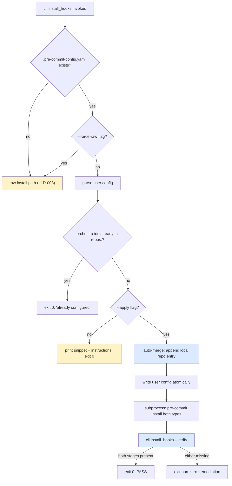

# Feature: orchestra v1.7 — Pre-commit Framework Detection + Install Determinism (LLD-010)

> **Doc ID:** 010-framework-detection-determinism
> **Date:** 2026-05-11
> **DRI:** Hassan Mohiddin
> **Type:** Feature LLD
> **Status:** Draft
> **Iteration:** 2

## Glossary

- **pre-commit framework** — third-party tool ([pre-commit.com](https://pre-commit.com)) managing git hooks via `.pre-commit-config.yaml`. Generates `.git/hooks/<stage>` files invoking `pre-commit hook-impl --config=.pre-commit-config.yaml --hook-stage <stage>`.
- **hook stage** — one of `pre-commit`, `commit-msg`, `prepare-commit-msg`, `pre-push`, etc. Determined by which `.git/hooks/<name>` file fires.
- **`default_install_hook_types`** — top-level YAML key in `.pre-commit-config.yaml` listing stages installed when user runs `pre-commit install` without explicit `--hook-type`. Default: `[pre-commit]`. To install commit-msg stage: include `commit-msg` in this list OR run `pre-commit install --hook-type commit-msg`.
- **`pass_filenames`** — per-hook YAML key. `true`: framework appends matched filenames as positional args to entry. `false`: no matched-filename args appended. **For `commit-msg` stage**: per [pre-commit.com docs](https://pre-commit.com/#hooks-pass_filenames) and corroborated by r1 triple-judge convergence — **commit-msg hooks always receive the commit-msg-file path as `$1` via git's native commit-msg hook contract**, regardless of `pass_filenames`. `pass_filenames` on a commit-msg hook controls whether ADDITIONAL matched files are appended after `$1`. Recommended value: `pass_filenames: false` to avoid appending unwanted matched files (cleaner: only `$1` = commit-msg path).
- **local repo entry** — pre-commit framework `repos:` list entry with `repo: local`. Hooks defined inline in user's config (no external repo). orchestra integrates as `local` repo entry.
- **framework snippet** — YAML fragment emitted by `cli.install_hooks` for user to paste into `.pre-commit-config.yaml`. Path: `skills/commit/templates/precommit-framework-snippet.yaml`.
- **fingerprint** — recognizable string in installed hook content identifying source (`# orchestra` for raw hooks; `# generated by pre-commit` for framework hooks). Used by verify-active mechanism (A4).
- **verify-active** — post-install check that both `pre-commit` and `commit-msg` `.git/hooks/<name>` files exist AND contain expected fingerprint. Called by `cli.install_hooks --verify` and after framework-mode install instructions.

## Problem Statement

BUG-006 (`docs/bugs/BUG-006-install-hooks-precommit-framework.md`) documents:

`cli.install_hooks` writes raw bash to `.git/hooks/pre-commit`. If repo already uses pre-commit.com framework, raw install corrupts framework hooks (existing hook is generated bash invoking `pre-commit hook-impl`). Current state (post-BUG-010): framework presence detected via `.pre-commit-config.yaml` exists; install_hooks emits a YAML snippet; user manually pastes + runs `pre-commit install`.

**Defects in current design (codex r1 high #1 + codex r2 high #2; codex r2 high #1 was REFUTED — see Glossary `pass_filenames`):**

1. **Wrong snippet content.** Prior LLD-008 r2 attempted using `cli/templates/precommit-yaml-patch.txt` — that file is the BUG-007 yaml-checker `--unsafe` patch, NOT orchestra-lint integration. Pre-commit-framework users got success output but no orchestra gates fired.
2. **Advisory-only flow.** install_hooks prints + returns 0; relies on user running `pre-commit install`. Default `pre-commit install` only installs pre-commit stage hook — commit-msg stage requires `--hook-type commit-msg` OR `default_install_hook_types: [pre-commit, commit-msg]` in user config. Silent gap: install_hooks reports success; commit-msg L2-finalize never fires.
3. **No verification.** install_hooks doesn't confirm post-install state; consumer assumed to follow instructions correctly.

These three defects together mean: pre-commit-framework consumers running orchestra v1.6.x get NO orchestra commit-discipline despite install_hooks reporting success — the silent-failure class LLD-008/009 aims to eliminate.

**Note on REFUTED defect** (formerly codex r2 high #1; LLD-010 r1 § Problem Statement defect #2; corrected in r2): Initial codex r2 review claimed `pass_filenames: false` on a commit-msg hook would prevent framework from passing the msg-file path. r1 triple-judge spec review (orchestra + sonnet judges) cited pre-commit.com docs: commit-msg hooks always receive msg-file as `$1` regardless of `pass_filenames`. The codex r2 high #1 claim was incorrect; LLD-010 r2 uses `pass_filenames: false` for cleanliness (avoids appending matched-files after the git-injected `$1`).

## Success Criteria

### Acceptance items

- [ ] **A1.** New template `skills/commit/templates/precommit-framework-snippet.yaml` (NEW file; LLD-010 ships it; LLD-008 doesn't include it). Wires orchestra as `local` repo entry with TWO hook ids: `orchestra-lint` (stages: pre-commit; entry: `python -m cli.lint --pre-commit`; `pass_filenames: false`) AND `orchestra-commit-msg` (stages: commit-msg; entry: `python -m cli.lint --commit-msg-finalize`; `pass_filenames: false` — git's native commit-msg hook contract injects msg-file as `$1` regardless; setting `pass_filenames: false` prevents pre-commit from appending matched-files after `$1`). Test T1 (snippet YAML content; both `pass_filenames: false`).
- [ ] **A2.** Snippet ALSO declares top-level `default_install_hook_types: [pre-commit, commit-msg]` (commented as recommendation if user merges into existing config). Ensures `pre-commit install` covers both stages. Test T2 (snippet contains the directive).
- [ ] **A3.** `cli.install_hooks` framework-detection (modifies BUG-006 detection path):
  - Detect `.pre-commit-config.yaml` presence (existing).
  - Parse user config via PyYAML safe_load. **Parse-error handling:** if YAML malformed → emit explicit error "user `.pre-commit-config.yaml` malformed; fix YAML syntax then retry, or use --force-raw" and exit non-zero. Does NOT proceed silently with `{}` (per r1 sonnet F8 — prevents data loss in `--apply`).
  - Detect existing `repos: - repo: local` entries with orchestra hook ids: if present with both `orchestra-lint` + `orchestra-commit-msg` ids → exit 0 with `orchestra hooks already configured` message + run `--verify`. If absent: emit append-as-new-local-block snippet (separate `- repo: local` entry, NOT merge into existing local).
  - **Tailoring removed** (per r1 orchestra evidence #3 + sonnet F3 — `_emit_tailored_snippet` stub was unimplementable). LLD-010 r2 always emits the full snippet template regardless of user's existing `default_install_hook_types`. If user already has commit-msg covered: instruction comment in snippet is informational; user merges manually as appropriate. Simpler + verifiable.
  - Tests T3a (orchestra ids fully configured → exit 0 already-configured + verify-active), T3b (no orchestra ids → full snippet emitted), T3c (malformed user config → explicit error + exit non-zero; user config unchanged), T3d (partial config: only `orchestra-lint` present → hard-fail with explicit error per A3b).
- [ ] **A3b.** **Partial-config detection (NEW; closes r1 orchestra evidence #4 + sonnet F4 + F6):** if EXACTLY ONE of `{orchestra-lint, orchestra-commit-msg}` ids is present in user config (XOR case): emit explicit error "partial orchestra config detected: `<id-found>` present but `<id-missing>` absent. Manual merge required to avoid duplicate-id collision; OR re-run with --force-raw to skip framework path entirely" and exit non-zero. Does NOT auto-merge under `--apply` in partial-config case (would produce duplicate ids → pre-commit framework rejects at runtime). Hard-fail at install-time is cleaner than runtime-error post-install. Test T3d covers this.
- [ ] **A4.** `cli.install_hooks --verify` entrypoint (NEW): post-install check. Asserts:
  - `.git/hooks/pre-commit` exists AND **file content (full file, case-insensitive)** contains either `orchestra` fingerprint marker (raw mode) OR `generated by pre-commit` (framework mode).
  - `.git/hooks/commit-msg` exists AND **file content (full file, case-insensitive)** contains either `orchestra` (raw mode) OR `generated by pre-commit` (framework mode).
  - Both stages present → exit 0 PASS.
  - Either missing → exit non-zero with explicit error + remediation: "commit-msg hook missing after install. Run: `pre-commit install --hook-type commit-msg --hook-type pre-commit`. If issue persists: file BUG with output of `pre-commit --version` and `.pre-commit-config.yaml` excerpt."
  - **Widened scope rationale (per r1 orchestra completeness #1 + sonnet F5):** prior `head -n5` heuristic was fragile across pre-commit versions (longer preambles in newer versions could push fingerprint to line 6+). Full-file case-insensitive search is robust + cheap (hook files are tens-of-lines max). Matches `# Orchestra` or `# orchestra` (both produced by various templates).
  - **Version floor:** pre-commit ≥3.0 supported. Older versions: documented as unsupported (Out of Scope).
  - Tests T4a (both present + raw fingerprint → PASS), T4b (both present + framework fingerprint → PASS), T4c (commit-msg missing → FAIL with remediation), T4d (pre-commit missing → FAIL with remediation), T4e (file present but no fingerprint → FAIL), T4f (fingerprint at line 8+ but present → PASS via widened scope).
- [ ] **A5.** `cli.install_hooks --apply` flag (NEW; opt-in auto-merge per Q1 grill answer): when `.pre-commit-config.yaml` present + `--apply` passed: parse user config (parse error → A3 hard-fail); deep-merge orchestra repos entry (append-as-new-local-block per Q4); preserve user's other repos entries; preserve all existing top-level keys; ensure `default_install_hook_types` covers both `pre-commit` AND `commit-msg`; **write back atomically using canonical durable-write pattern** (per r1 orchestra evidence #3 + sonnet F2):

```python
import os
with tmp.open("w", encoding="utf-8") as f:
    f.write(yaml.safe_dump(user_cfg, sort_keys=False, default_flow_style=False))
    f.flush()
    os.fsync(f.fileno())
os.replace(tmp, cfg_path)
# Dir-fsync for full POSIX rename atomicity
dir_fd = os.open(str(cfg_path.parent), os.O_RDONLY)
try:
    os.fsync(dir_fd)
finally:
    os.close(dir_fd)
```

  Also runs `pre-commit install --hook-type pre-commit --hook-type commit-msg` programmatically (subprocess; **`capture_output=True, text=True`**; on non-zero rc include first 20 lines of stderr in error message per r1 sonnet F10); finally invokes `cli.install_hooks --verify`. Default behavior (no `--apply`) is print-only (Q1). Tests T5a (--apply edits config; non-orchestra entries preserved), T5b (--apply runs pre-commit install both types), T5c (--apply post-install verify-active passes), T5d (atomic write: **inject failure via mocking `os.replace` to raise OSError**; assert user config unchanged + tmp file cleaned), T5e (default no-flag = print-only; config unchanged), T5f (subprocess captures stderr and surfaces first 20 lines in error message on non-zero rc).
- [ ] **A6.** Framework-detection integrated into existing `cli.install_hooks` flow (NOT new entrypoint):
  - `python -m cli.install_hooks --pre-commit` (or `--commit-msg`, or `--all`) is existing entrypoint.
  - When framework detected + `--apply` absent + `--force-raw` absent: emit snippet + instructions; return 0 with `framework_detected_print_only` exit message.
  - When framework detected + `--apply` present: auto-merge per A5.
  - When framework detected + `--force-raw` present: install raw hooks anyway (escape hatch for advanced users).
  - When framework absent: existing raw-install path with `--on-conflict` flag (per LLD-008 A5).
  - Tests T6a (no framework → raw install), T6b (framework + no flags → print-only), T6c (framework + --apply → auto-merge), T6d (framework + --force-raw → raw install).
- [ ] **A7.** Hard-fail on install failure (Q5 grill answer): if `cli.install_hooks --verify` post-install reports either stage missing: exit non-zero with explicit remediation. NO silent fall back to raw install. Tests T7a (verify-fail → install_hooks exits non-zero), T7b (remediation message format).
- [ ] **A8.** **`precommit-yaml-patch.txt` repurposed**: stays in `cli/templates/` (per LLD-008 A3); content unchanged — still BUG-007 yaml-checker `--unsafe` patch. NOT used by LLD-010. NEW snippet `skills/commit/templates/precommit-framework-snippet.yaml` is a separate file with different purpose. **Canonical placement rule (per r1 orchestra evidence #6 + sonnet F7):** `skills/commit/templates/` houses framework-integration artifacts (consumed by `cli.install_hooks` framework-detection path); `cli/templates/` houses init-time artifacts (consumed by `cli.init` or user-manual workflows; framework-orthogonal). Rule documented in both file headers + `skills/commit/SKILL.md`. Future framework-related artifacts ship under `skills/commit/templates/`; init-time artifacts ship under `cli/templates/`. Test T8 (both files exist at canonical paths; documented contents; ownership comment in each file header).
- [ ] **A9.** BUG-006 closes via this LLD ship: Status `Investigating` → `Fix Applied`. BUG-006 r1 cites `precommit-yaml-snippet.txt` (stale name); reconciliation Changelog row added on close noting actual implementation file is `precommit-framework-snippet.yaml`.
- [ ] **A10.** Plugin version: 1.6.2 → 1.7.0 (combined ship after LLD-008 + 009 + 010 all pass).
- [ ] **A11.** Pytest target: LLD-009 r2 baseline (**206**, corrected from r1's 197 per LLD-009 r2 Changelog) + LLD-010 new tests (**24 distinct test functions**) → **≥230** (combined v1.7.0 target). Enumeration: T1=1; T2=1; T3a-d=4; T4a-f=6; T5a-f=6; T6a-d=4; T7a-b=2; T8=1; T-INT-010=1 (integration; renamed from T13 per § Testing) → 24. (Earlier T13 ID collided with LLD-009 T13-pre; renamed.)
- [ ] **A12.** CHANGELOG.md v1.7.0 entry (LLD-010 portion) describes: framework-detection redesign, snippet correctness (pass_filenames: true for commit-msg), `--apply` opt-in auto-merge, `--verify` entrypoint, BUG-006 close.
- [ ] **A13.** Integration test **T-INT-010** (NEW; renamed from T13 per r1 sonnet F11 to avoid collision with LLD-009 T13-pre): real-world dogfood. Set up tmpdir with `.pre-commit-config.yaml` + git repo; commit a fixture canon-frozen doc `docs/features/test-canon-frozen.md` with `Status: Implemented` + `Iteration: 1` to HEAD; run `python -m cli.install_hooks --apply --pre-commit --commit-msg`; assert both `.git/hooks/{pre-commit,commit-msg}` exist with framework fingerprint (`--verify` passes); **construct canon-inplace violation:** modify Acceptance section of fixture doc (non-whitelist body edit); stage it; attempt `git commit -m "docs: tweak test-canon-frozen"` (no `Addresses:` line); assert commit rejected by L2-finalize (LLD-009 path) running through framework hook with rejection message containing "canon-inplace body change without Addresses: lines". End-to-end coverage of LLD-008 + 009 + 010 framework path. **Fixture spec (per r1 orchestra completeness #2):** `tests/fixtures/test-canon-frozen.md` checked in; minimal LLD-shaped doc with required metadata block.

### Deliverables

- [ ] D1. README.md mentions `cli.install_hooks --apply` for framework users.
- [ ] D2. CONTRIBUTING.md documents both raw + framework paths.
- [ ] D3. `skills/commit/SKILL.md` references framework integration.

## Scope

### In Scope (LLD-010 ships exactly this)

1. **`precommit-framework-snippet.yaml` template** — correct YAML semantics (pass_filenames: true for commit-msg stage; default_install_hook_types directive).
2. **Framework-detection redesign** — parse user config; tailor snippet to user's existing settings (Q2 grill).
3. **`--apply` opt-in auto-merge** (Q1 grill) — parse + deep-merge + atomic-write + run `pre-commit install` both types + verify.
4. **`--verify` entrypoint** — filesystem fingerprint check (Q3 grill).
5. **Hard-fail on install failure** with remediation message (Q5 grill).
6. **Append-as-new-local-block** snippet placement (Q4 grill).
7. **`--force-raw` flag** — escape hatch for advanced users; raw-install bypassing framework detection.

### Out of Scope (deferred to LLD-008 / LLD-009 / later)

- Skill structure → LLD-008.
- `--on-conflict` flag → LLD-008.
- cli.init bootstrap → LLD-008.
- L2-finalize logic → LLD-009.
- Tiered rule → LLD-009.
- pre-commit framework version detection — assumes pre-commit ≥3.0 (current stable). Older versions: documented as unsupported.
- YAML comments preservation in `--apply` mode — PyYAML safe_load strips comments. Documented limitation; ruamel.yaml support deferred to v1.7.x followup. Manual uninstall procedure also documented in **CONTRIBUTING.md** (D2 deliverable) — single source for both install + uninstall paths.
- Auto-uninstall — removing orchestra hooks from framework config. Manual procedure documented in CONTRIBUTING.md (per D2); auto path deferred.
- Snippet tailoring (omit hook_types directive when user config already covers commit-msg) — REMOVED in r2 per r1 sonnet F3. Always emit full snippet; user merges manually if needed.

## Design

### Snippet content (per A1 + A2; r2 pass_filenames corrected)

`skills/commit/templates/precommit-framework-snippet.yaml`:

```yaml
# orchestra commit-discipline integration for pre-commit.com framework.
# (Owner: orchestra:commit skill; canonical placement under skills/commit/templates/
#  per LLD-010 A8 placement rule. Distinct from cli/templates/precommit-yaml-patch.txt
#  which is the BUG-007 yaml-checker --unsafe patch — different purpose.)
#
# Add to your .pre-commit-config.yaml (or invoke `cli.install_hooks --apply` for
# auto-merge).
#
# This snippet adds TWO hooks under a `local` repo entry:
#   - orchestra-lint        (pre-commit stage;  runs cli.lint --pre-commit)
#   - orchestra-commit-msg  (commit-msg stage; runs cli.lint --commit-msg-finalize $1)
#
# pass_filenames notes:
#   - pre-commit stage:  pass_filenames: false → no filename args; cli.lint reads `git diff --cached`.
#   - commit-msg stage:  pass_filenames: false → no matched-files appended; git's NATIVE
#     commit-msg hook contract always injects msg-file as $1 regardless of this setting
#     (per pre-commit.com docs). Setting `false` here keeps the entry clean (only $1 = msg-file).
#
# Recommended top-level setting (auto-applied when using `cli.install_hooks --apply`):
#
# default_install_hook_types: [pre-commit, commit-msg]
#
# This ensures `pre-commit install` covers both hook stages without needing
# `--hook-type` flag. If you prefer explicit invocation, run:
#   pre-commit install --hook-type pre-commit --hook-type commit-msg

default_install_hook_types: [pre-commit, commit-msg]

repos:
  - repo: local
    hooks:
      - id: orchestra-lint
        name: orchestra commit-discipline (L1+L3+L4+L2-detect)
        entry: python -m cli.lint --pre-commit
        language: system
        pass_filenames: false
        stages: [pre-commit]
      - id: orchestra-commit-msg
        name: orchestra commit-msg discipline (L2-finalize + Refs:-line)
        entry: python -m cli.lint --commit-msg-finalize
        language: system
        pass_filenames: false
        stages: [commit-msg]
```

### Framework-detection flow



### Framework detection (per A3 + A3b; r2 — tailoring removed)

```python
import yaml
from cli.install_hooks import SKILL_TEMPLATES_DIR  # defined in LLD-008 r4

PRECOMMIT_CONFIG = ".pre-commit-config.yaml"
FRAMEWORK_SNIPPET_PATH = SKILL_TEMPLATES_DIR / "precommit-framework-snippet.yaml"

ORCHESTRA_HOOK_IDS = frozenset({"orchestra-lint", "orchestra-commit-msg"})


def _is_precommit_framework(repo_root: Path) -> bool:
    return (repo_root / PRECOMMIT_CONFIG).exists()


class UserConfigParseError(Exception):
    """Raised when .pre-commit-config.yaml is present but malformed."""


def _parse_user_config(repo_root: Path) -> dict:
    """Parse .pre-commit-config.yaml; RAISE UserConfigParseError on parse error.

    (Per r2: NO silent {} return; A3 hard-fail required to prevent --apply
    from clobbering user's malformed config.)
    """
    cfg_path = repo_root / PRECOMMIT_CONFIG
    if not cfg_path.exists():
        return {}
    try:
        data = yaml.safe_load(cfg_path.read_text(encoding="utf-8"))
    except yaml.YAMLError as e:
        raise UserConfigParseError(
            f"user .pre-commit-config.yaml malformed: {e}. "
            f"Fix YAML syntax then retry, or use --force-raw to skip framework path."
        )
    return data or {}


def _detect_orchestra_ids(user_cfg: dict) -> set[str]:
    """Return the set of orchestra hook ids present anywhere in user_cfg."""
    found: set[str] = set()
    for repo in user_cfg.get("repos") or []:
        if (repo.get("repo") or "") != "local":
            continue
        for h in (repo.get("hooks") or []):
            hid = h.get("id")
            if hid in ORCHESTRA_HOOK_IDS:
                found.add(hid)
    return found


def _orchestra_ids_state(user_cfg: dict) -> str:
    """Returns 'none', 'partial', or 'full' based on which orchestra ids present."""
    found = _detect_orchestra_ids(user_cfg)
    if not found:
        return "none"
    if found == ORCHESTRA_HOOK_IDS:
        return "full"
    return "partial"  # XOR case → A3b hard-fail


def _emit_full_snippet() -> str:
    """Emit the full snippet template verbatim (no tailoring per r2)."""
    return FRAMEWORK_SNIPPET_PATH.read_text(encoding="utf-8")
```

### `--apply` auto-merge (per A5; r2 canonical durable-write + captured subprocess)

```python
def install_via_framework_apply(repo_root: Path) -> int:
    try:
        user_cfg = _parse_user_config(repo_root)
    except UserConfigParseError as e:
        print(f"error: {e}", file=sys.stderr)
        return 1

    state = _orchestra_ids_state(user_cfg)
    if state == "full":
        print("orchestra hooks already configured in .pre-commit-config.yaml; running --verify")
        return verify_hooks_active(repo_root)
    if state == "partial":
        found = _detect_orchestra_ids(user_cfg)
        missing = ORCHESTRA_HOOK_IDS - found
        print(
            f"error: partial orchestra config detected: {sorted(found)} present; "
            f"{sorted(missing)} absent. Manual merge required to avoid duplicate-id collision, "
            f"or re-run with --force-raw to skip framework path entirely.",
            file=sys.stderr,
        )
        return 1

    # state == "none": append orchestra local repo entry
    snippet = yaml.safe_load(FRAMEWORK_SNIPPET_PATH.read_text(encoding="utf-8"))
    user_cfg.setdefault("repos", []).extend(snippet.get("repos") or [])

    # Ensure default_install_hook_types covers both
    types = user_cfg.get("default_install_hook_types") or []
    for required in ("pre-commit", "commit-msg"):
        if required not in types:
            types.append(required)
    user_cfg["default_install_hook_types"] = types

    # Canonical durable atomic write (per r1 evidence #3 + sonnet F2)
    cfg_path = repo_root / PRECOMMIT_CONFIG
    tmp = cfg_path.with_suffix(cfg_path.suffix + ".tmp")
    try:
        with tmp.open("w", encoding="utf-8") as f:
            f.write(yaml.safe_dump(user_cfg, sort_keys=False, default_flow_style=False))
            f.flush()
            os.fsync(f.fileno())
        os.replace(tmp, cfg_path)
        # Dir-fsync for full POSIX rename atomicity
        dir_fd = os.open(str(cfg_path.parent), os.O_RDONLY)
        try:
            os.fsync(dir_fd)
        finally:
            os.close(dir_fd)
    except OSError as e:
        # tmp file cleanup on failure
        if tmp.exists():
            tmp.unlink(missing_ok=True)
        print(f"error: atomic write of {cfg_path} failed: {e}", file=sys.stderr)
        return 1

    # Subprocess: pre-commit install both types (capture stderr per sonnet F10)
    result = subprocess.run(
        ["pre-commit", "install", "--hook-type", "pre-commit", "--hook-type", "commit-msg"],
        cwd=repo_root, capture_output=True, text=True,
    )
    if result.returncode != 0:
        stderr_head = "\n".join(result.stderr.splitlines()[:20])
        print(
            f"error: pre-commit install failed (rc={result.returncode}).\n"
            f"--- pre-commit stderr (first 20 lines) ---\n{stderr_head}\n"
            f"Remediation: ensure pre-commit ≥3.0 installed (`pip install pre-commit`); "
            f"re-run with --force-raw to skip framework path.",
            file=sys.stderr,
        )
        return result.returncode

    return verify_hooks_active(repo_root)
```

### `--verify` entrypoint (per A4; r2 widened + case-insensitive)

```python
RAW_FINGERPRINT = "orchestra"  # case-insensitive substring; matches "# orchestra" or "# Orchestra"
FRAMEWORK_FINGERPRINT = "generated by pre-commit"  # case-insensitive substring


def verify_hooks_active(repo_root: Path) -> int:
    """Verify both pre-commit and commit-msg .git/hooks/<name> exist + contain fingerprint.

    Per r2 widened search: case-insensitive substring search of FULL FILE
    (hook files are tens-of-lines max; cheap; robust across pre-commit
    versions that may push generated-marker past line 5).
    """
    findings: list[str] = []
    for hook_name in ("pre-commit", "commit-msg"):
        hook_path = repo_root / ".git" / "hooks" / hook_name
        if not hook_path.exists():
            findings.append(f"{hook_name}: missing at {hook_path}")
            continue
        content_lower = hook_path.read_text(encoding="utf-8", errors="replace").lower()
        if RAW_FINGERPRINT.lower() not in content_lower and FRAMEWORK_FINGERPRINT.lower() not in content_lower:
            findings.append(f"{hook_name}: present but no orchestra/framework fingerprint found anywhere in file")
    if findings:
        print("FAIL — hook verification failed:", file=sys.stderr)
        for f in findings:
            print(f"  - {f}", file=sys.stderr)
        print(file=sys.stderr)
        print("Remediation: pre-commit install --hook-type pre-commit --hook-type commit-msg", file=sys.stderr)
        print("If issue persists: file BUG with output of `pre-commit --version` and .pre-commit-config.yaml excerpt.", file=sys.stderr)
        return 1
    print("PASS — both pre-commit and commit-msg hooks active", file=sys.stderr)
    return 0
```

### Hard-fail invariant (per A7)

`cli.install_hooks` final exit code reflects verify status. NO silent fallback to raw install on framework-mode failure. User runs explicit `--force-raw` if framework path can't be made to work.

## Edge Cases

1. **User config has `repo: local` already with non-orchestra hooks**: A3 detection allows; `--apply` appends new local entry (Q4 append-as-new-local-block); two local entries side-by-side OK in pre-commit framework.
2. **User config has `repo: local` with `orchestra-lint` only (no commit-msg)**: A3b partial-config detector returns `state == "partial"`; `--apply` HARD-FAILS with explicit error listing present/missing ids + suggesting manual merge OR `--force-raw`. No duplicate-id collision because `--apply` refuses. Test T3d covers this.
3. **User has `default_install_hook_types` set to `[pre-commit, commit-msg, pre-push]`**: A3 detects commit-msg covered; emits shorter snippet. pre-push unaffected.
4. **User has `default_install_hook_types: []` (explicit empty)**: A3 treats as "no commit-msg coverage"; emits full snippet with directive.
5. **Atomic write race**: `--apply` uses `tmp + fsync + os.replace` per A5d. If process killed mid-write: tmp file orphaned (cleaned on next run); user config unchanged (replace not yet executed). Recoverable.
6. **PyYAML safe_dump strips user comments**: documented limitation. Recommendation: users prefer `--apply` only on configs without important comments. ruamel.yaml support tracked as v1.7.x followup.
7. **`pre-commit install` subprocess fails** (e.g., permission denied on .git/hooks/): A5 returns subprocess rc; A7 hard-fail with remediation including `pre-commit --version` ask.
8. **Verify fingerprint missing on legitimate framework hook** (very old pre-commit version pre-2018 didn't include `# generated by pre-commit` header): A4 fails with remediation; user upgrades pre-commit. Acceptable; framework support floor pre-commit ≥3.0 per Out-of-Scope.
9. **User runs `cli.install_hooks --apply` then manually edits config to remove orchestra entries**: subsequent run of `--verify` fails (hooks point at nonexistent config); A7 hard-fails with remediation. Manual recovery: re-run `--apply` or `--force-raw`.
10. **Concurrent `--apply` invocations** (rare; user shouldn't): atomic-write contract preserves consistency; second invocation reads the first's result; idempotent if first succeeded.
11. **`.pre-commit-config.yaml` parse error** (user has malformed YAML): per r2, `_parse_user_config` RAISES `UserConfigParseError`; A3 + `--apply` both hard-fail with explicit error: "user .pre-commit-config.yaml malformed: <YAML parse details>. Fix YAML syntax then retry, or use --force-raw." No silent `{}` fallback — prevents data loss on `--apply`.

## Security

- `_parse_user_config` uses `yaml.safe_load` (no arbitrary code execution).
- `--apply` writes only to `.pre-commit-config.yaml` (user-controlled file) under repo root. No symlink-traversal risk (`repo_root.resolve()`).
- `subprocess.run(["pre-commit", "install", ...])` invokes user-installed pre-commit binary. Standard PATH-based resolution; user trusts pre-commit binary.
- `cli.install_hooks --verify` reads from `.git/hooks/` only. Read-only; no escalation.
- No secrets read or written.
- `--force-raw` flag requires explicit invocation; not implicit.

## Testing

### Phase impl — new test matrix (r2; 24 distinct functions)

| Test ID | Acceptance | Description |
|---|---|---|
| T1 | A1 | precommit-framework-snippet.yaml content: 2 hook ids; both pass_filenames=false; correct entries/stages |
| T2 | A2 | Snippet contains active `default_install_hook_types: [pre-commit, commit-msg]` directive |
| T3a | A3 | User config has both orchestra ids → exit 0 already-configured + verify-active |
| T3b | A3 | User config no orchestra ids → full snippet emitted |
| T3c | A3 | User config malformed (parse error) → explicit error + exit non-zero; config unchanged |
| T3d | A3b | Partial config (XOR) → hard-fail with explicit error listing present/missing ids |
| T4a | A4 | Both .git/hooks/* present + raw fingerprint → verify PASS |
| T4b | A4 | Both present + framework fingerprint → verify PASS |
| T4c | A4 | commit-msg missing → verify FAIL + remediation msg |
| T4d | A4 | pre-commit missing → verify FAIL + remediation msg |
| T4e | A4 | Both present but no fingerprint anywhere → verify FAIL |
| T4f | A4 | Fingerprint at line 8+ (widened scope) → verify PASS (regression of r1 head -n5 fragility) |
| T5a | A5 | --apply edits config; user's other repos entries preserved |
| T5b | A5 | --apply runs pre-commit install with both --hook-type flags |
| T5c | A5 | --apply post-install verify-active passes |
| T5d | A5 | Atomic write: mock `os.replace` raising OSError → user config unchanged; tmp cleaned |
| T5e | A5 | Default no-flag = print-only; user config unchanged |
| T5f | A5 | subprocess capture: pre-commit install non-zero rc → stderr first-20-lines included in error msg |
| T6a | A6 | No framework → raw install (LLD-008 path) |
| T6b | A6 | Framework + no flags → print-only (does not modify config; does not raw-install) |
| T6c | A6 | Framework + --apply → auto-merge |
| T6d | A6 | Framework + --force-raw → raw install bypassing detection |
| T7a | A7 | Verify-fail post-install → install_hooks exits non-zero |
| T7b | A7 | Remediation message format includes `pre-commit install --hook-type ...` command |
| T8 | A8 | precommit-yaml-patch.txt + precommit-framework-snippet.yaml both exist at canonical paths; both files have header comment documenting ownership rule |
| T-INT-010 | A13 | Integration: tmpdir + framework + --apply + canon-frozen fixture + canon-inplace violation → commit rejected by L2-finalize via framework hook (end-to-end LLD-008+009+010 path) |

Total: **24 distinct test functions**.

Pytest target post-LLD-010-ship: 206 (LLD-009 r2 baseline) + 24 (LLD-010) = **≥230** (combined v1.7.0 target).

## Related Documents

- `docs/features/008-commit-skill.md` — companion LLD; skill structure + bootstrap; SKILL_TEMPLATES_DIR constant source
- `docs/features/009-commit-msg-l2-finalize.md` — companion LLD; L2-finalize logic (T-INT-010 integration test exercises both)
- `docs/bugs/BUG-006-install-hooks-precommit-framework.md` — closes via this LLD (A9). r1 cites stale filename `precommit-yaml-snippet.txt`; LLD-010 implements with `precommit-framework-snippet.yaml`.
- `docs/bugs/BUG-007-mkdocs-yaml-patch.md` (if filed) — `precommit-yaml-patch.txt` is for THIS bug, NOT LLD-010
- `docs/postmortems/POSTMORTEM-2026-05-10-canon-inplace-violation.md` — incident motivating commit-discipline split
- `docs/reviews/008-commit-skill-r1.codex.md` — codex r1 high #1 (framework snippet wrong) → A1 + A8
- `docs/reviews/008-commit-skill-r2.codex.md` — codex r2 high #1 (commit-msg pass_filenames) **REFUTED in r1 spec-review** → r2 reverts to `pass_filenames: false`; codex r2 high #2 (advisory-only flow) → A4 + A5 + A7
- `docs/reviews/010-framework-detection-determinism-r1.review.yaml` — orchestra judge-1 r1 attestation (drove r2 fixes; cited pre-commit.com docs refuting pass_filenames claim)
- `docs/reviews/010-framework-detection-determinism-r1.sonnet.md` — sonnet judge-2 r1 review (11 findings; 3 HIGH)
- pre-commit framework docs: https://pre-commit.com (cited in Glossary `pass_filenames`; framework version floor ≥3.0 per Out-of-Scope)
- `cli/templates/precommit-yaml-patch.txt` — separate file; BUG-007 only; A8 reconciliation + placement rule
- `cli/install_hooks.py` — extension target for framework-detection + --apply + --verify; SKILL_TEMPLATES_DIR constant defined here (per LLD-008 r4)

## Changelog

| Date | Change |
|---|---|
| 2026-05-11 | r1 LLD filed post-grilling-session (5 Q&A locked: print-only-default + --apply opt-in / detect-existing-config tailored msg / filesystem fingerprint check / append-as-new-local-block / hard-fail with remediation). Carries forward codex r1 high #1 + codex r2 highs #1 + #2 as fixed in this LLD's design. Status: Draft. Awaiting iteration 1 spec-review. |
| 2026-05-11 | r1 spec-review verdicts: orchestra fail (14 findings; 2 Critical incl. pass_filenames inversion REFUTED via pre-commit.com docs); sonnet REJECT (11 findings; 3 HIGH). Triple-converged refutation of codex r2 high #1 (commit-msg `pass_filenames: false` does NOT suppress msg-file arg — git's native commit-msg hook contract always injects $1). r1 → r2 fixes inline (Status: Draft permits full edit): pass_filenames mandate reverted (Critical, orchestra evidence #1+#2, sonnet F1); Glossary `pass_filenames` rewritten with pre-commit.com citation; Problem Statement defect #2 removed; snippet IMPORTANT comment rewritten + `pass_filenames: false` on both hook ids; canonical durable-write pattern with-block + flush + fsync + dirfsync (Important, orchestra evidence #3, sonnet F2); `_emit_tailored_snippet` stub removed → always emit full snippet (Important, orchestra evidence #4, sonnet F3); A3b partial-config XOR hard-fail added (Important, orchestra evidence #5, sonnet F4 + F6); A4 widened to case-insensitive full-file fingerprint search (Important, orchestra completeness #1, sonnet F5); A8 placement rule documented + ownership comments in file headers (Important, orchestra evidence #6, sonnet F7); UserConfigParseError raised + A3/--apply hard-fail on malformed config (Minor, sonnet F8); T5d injection point specified as `mock os.replace OSError` (Low, sonnet F9); subprocess `capture_output=True, text=True` + stderr first-20-lines in error msg (Low, sonnet F10); T13 → T-INT-010 rename + canon-frozen fixture spec (Low, sonnet F11 + orchestra completeness #2); active `default_install_hook_types` directive (not commented); pytest count reconciled to 24 functions / ≥230 combined target (Minor, orchestra consistency #2); auto-uninstall manual procedure → CONTRIBUTING.md D2 (Minor, orchestra consistency #1). Status: Draft. Awaiting r2 spec-review. |
