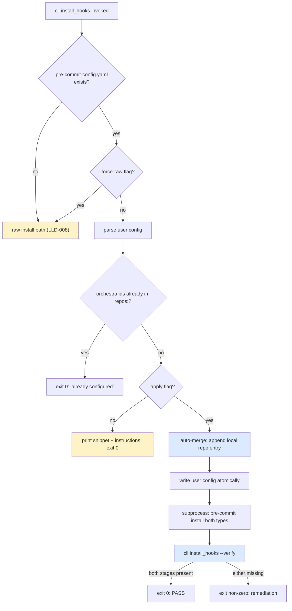

# Feature: orchestra v1.7 — Pre-commit Framework Detection + Install Determinism (LLD-010)

> **Doc ID:** 010-framework-detection-determinism
> **Date:** 2026-05-11
> **DRI:** Hassan Mohiddin
> **Type:** Feature LLD
> **Status:** Draft
> **Iteration:** 1

## Glossary

- **pre-commit framework** — third-party tool ([pre-commit.com](https://pre-commit.com)) managing git hooks via `.pre-commit-config.yaml`. Generates `.git/hooks/<stage>` files invoking `pre-commit hook-impl --config=.pre-commit-config.yaml --hook-stage <stage>`.
- **hook stage** — one of `pre-commit`, `commit-msg`, `prepare-commit-msg`, `pre-push`, etc. Determined by which `.git/hooks/<name>` file fires.
- **`default_install_hook_types`** — top-level YAML key in `.pre-commit-config.yaml` listing stages installed when user runs `pre-commit install` without explicit `--hook-type`. Default: `[pre-commit]`. To install commit-msg stage: include `commit-msg` in this list OR run `pre-commit install --hook-type commit-msg`.
- **`pass_filenames`** — per-hook YAML key. `true`: framework passes matched filenames as positional args to entry. `false`: no filename args. For `commit-msg` stage: when `true`, framework passes commit-msg-file path; when `false`, no positional arg.
- **local repo entry** — pre-commit framework `repos:` list entry with `repo: local`. Hooks defined inline in user's config (no external repo). orchestra integrates as `local` repo entry.
- **framework snippet** — YAML fragment emitted by `cli.install_hooks` for user to paste into `.pre-commit-config.yaml`. Path: `skills/commit/templates/precommit-framework-snippet.yaml`.
- **fingerprint** — recognizable string in installed hook content identifying source (`# orchestra` for raw hooks; `# generated by pre-commit` for framework hooks). Used by verify-active mechanism (A4).
- **verify-active** — post-install check that both `pre-commit` and `commit-msg` `.git/hooks/<name>` files exist AND contain expected fingerprint. Called by `cli.install_hooks --verify` and after framework-mode install instructions.

## Problem Statement

BUG-006 (`docs/bugs/BUG-006-install-hooks-precommit-framework.md`) documents:

`cli.install_hooks` writes raw bash to `.git/hooks/pre-commit`. If repo already uses pre-commit.com framework, raw install corrupts framework hooks (existing hook is generated bash invoking `pre-commit hook-impl`). Current state (post-BUG-010): framework presence detected via `.pre-commit-config.yaml` exists; install_hooks emits a YAML snippet; user manually pastes + runs `pre-commit install`.

**Defects in current design (codex r1 high #1 + codex r2 highs #1 + #2):**

1. **Wrong snippet content.** Prior LLD-008 r2 attempted using `cli/templates/precommit-yaml-patch.txt` — that file is the BUG-007 yaml-checker `--unsafe` patch, NOT orchestra-lint integration. Pre-commit-framework users got success output but no orchestra gates fired.
2. **Snippet pass_filenames wrong for commit-msg stage.** Naive snippet sets `pass_filenames: false` for commit-msg hook → framework does NOT pass msg-file path → `cli.lint --commit-msg-finalize` cannot read message → L2-finalize broken in framework mode.
3. **Advisory-only flow.** install_hooks prints + returns 0; relies on user running `pre-commit install`. Default `pre-commit install` only installs pre-commit stage hook — commit-msg stage requires `--hook-type commit-msg` OR `default_install_hook_types: [pre-commit, commit-msg]` in user config. Silent gap: install_hooks reports success; commit-msg L2-finalize never fires.
4. **No verification.** install_hooks doesn't confirm post-install state; consumer assumed to follow instructions correctly.

These four defects together mean: pre-commit-framework consumers running orchestra v1.6.x get NO orchestra commit-discipline despite install_hooks reporting success — the silent-failure class LLD-008/009 aims to eliminate.

## Success Criteria

### Acceptance items

- [ ] **A1.** New template `skills/commit/templates/precommit-framework-snippet.yaml` (NEW file; LLD-010 ships it; LLD-008 doesn't include it). Wires orchestra as `local` repo entry with TWO hook ids: `orchestra-lint` (stages: pre-commit; entry: `python -m cli.lint --pre-commit`; pass_filenames: false) AND `orchestra-commit-msg` (stages: commit-msg; entry: `python -m cli.lint --commit-msg-finalize`; **pass_filenames: true** — framework passes commit-msg-file as filename arg). Test T1 (snippet YAML content).
- [ ] **A2.** Snippet ALSO declares top-level `default_install_hook_types: [pre-commit, commit-msg]` (commented as recommendation if user merges into existing config). Ensures `pre-commit install` covers both stages. Test T2 (snippet contains the directive).
- [ ] **A3.** `cli.install_hooks` framework-detection (modifies BUG-006 detection path):
  - Detect `.pre-commit-config.yaml` presence (existing).
  - Parse user config via PyYAML safe_load. Detect existing `default_install_hook_types` value (Q2 grill answer): if covers commit-msg → emit shorter snippet (omit hook_types directive). If absent or doesn't cover commit-msg → emit full snippet with directive.
  - Detect existing `repos: - repo: local` entries with orchestra hook ids (Q4 grill answer): if present with both `orchestra-lint` + `orchestra-commit-msg` ids → exit 0 with `orchestra-lint already configured` message. If absent: emit append-as-new-local-block snippet (separate `- repo: local` entry, NOT merge into existing local).
  - Tests T3a (default_install_hook_types covers commit-msg → shorter snippet), T3b (absent → full snippet), T3c (orchestra ids already configured → exit 0 already-configured), T3d (no orchestra ids → emit snippet).
- [ ] **A4.** `cli.install_hooks --verify` entrypoint (NEW): post-install check. Asserts:
  - `.git/hooks/pre-commit` exists AND `head -n5` contains either `# orchestra` (raw mode) OR `# generated by pre-commit` (framework mode).
  - `.git/hooks/commit-msg` exists AND `head -n5` contains either `# orchestra` (raw mode) OR `# generated by pre-commit` (framework mode).
  - Both stages present → exit 0 PASS.
  - Either missing → exit non-zero with explicit error + remediation: "commit-msg hook missing after install. Run: pre-commit install --hook-type commit-msg --hook-type pre-commit. If issue persists: file BUG with output of `pre-commit --version` and `.pre-commit-config.yaml` excerpt."
  - Tests T4a (both present + raw fingerprint → PASS), T4b (both present + framework fingerprint → PASS), T4c (commit-msg missing → FAIL with remediation), T4d (pre-commit missing → FAIL with remediation), T4e (file present but wrong fingerprint → FAIL).
- [ ] **A5.** `cli.install_hooks --apply` flag (NEW; opt-in auto-merge per Q1 grill answer): when `.pre-commit-config.yaml` present + `--apply` passed: parse user config; deep-merge orchestra repos: entry (append-as-new-local-block per Q4); preserve user's other repos: entries; preserve all existing keys; write back atomically (temp + os.replace + fsync); also run `pre-commit install --hook-type pre-commit --hook-type commit-msg` programmatically (subprocess); finally invoke `cli.install_hooks --verify`. Default behavior (no `--apply`) is print-only (Q1). Tests T5a (--apply edits config; non-orchestra entries preserved), T5b (--apply runs pre-commit install both types), T5c (--apply post-install verify-active passes), T5d (--apply atomic write — no partial files on simulated I/O fail), T5e (default no-flag = print-only; config unchanged).
- [ ] **A6.** Framework-detection integrated into existing `cli.install_hooks` flow (NOT new entrypoint):
  - `python -m cli.install_hooks --pre-commit` (or `--commit-msg`, or `--all`) is existing entrypoint.
  - When framework detected + `--apply` absent + `--force-raw` absent: emit snippet + instructions; return 0 with `framework_detected_print_only` exit message.
  - When framework detected + `--apply` present: auto-merge per A5.
  - When framework detected + `--force-raw` present: install raw hooks anyway (escape hatch for advanced users).
  - When framework absent: existing raw-install path with `--on-conflict` flag (per LLD-008 A5).
  - Tests T6a (no framework → raw install), T6b (framework + no flags → print-only), T6c (framework + --apply → auto-merge), T6d (framework + --force-raw → raw install).
- [ ] **A7.** Hard-fail on install failure (Q5 grill answer): if `cli.install_hooks --verify` post-install reports either stage missing: exit non-zero with explicit remediation. NO silent fall back to raw install. Tests T7a (verify-fail → install_hooks exits non-zero), T7b (remediation message format).
- [ ] **A8.** **`precommit-yaml-patch.txt` repurposed**: stays in `cli/templates/` (per LLD-008 A3); content unchanged — still BUG-007 yaml-checker `--unsafe` patch. NOT used by LLD-010. NEW snippet `skills/commit/templates/precommit-framework-snippet.yaml` is a separate file with different purpose. Test T8 (both files exist with documented contents; no cross-reference confusion).
- [ ] **A9.** BUG-006 closes via this LLD ship: Status `Investigating` → `Fix Applied`. BUG-006 r1 cites `precommit-yaml-snippet.txt` (stale name); reconciliation Changelog row added on close noting actual implementation file is `precommit-framework-snippet.yaml`.
- [ ] **A10.** Plugin version: 1.6.2 → 1.7.0 (combined ship after LLD-008 + 009 + 010 all pass).
- [ ] **A11.** Pytest target: LLD-009 baseline (197) + LLD-010 new tests (T1-T8 = ~22 distinct test functions) → ≥219 (combined v1.7.0 target).
- [ ] **A12.** CHANGELOG.md v1.7.0 entry (LLD-010 portion) describes: framework-detection redesign, snippet correctness (pass_filenames: true for commit-msg), `--apply` opt-in auto-merge, `--verify` entrypoint, BUG-006 close.
- [ ] **A13.** Integration test T13 (NEW): real-world dogfood. Set up tmpdir with `.pre-commit-config.yaml` + git repo; run `python -m cli.install_hooks --apply --pre-commit --commit-msg`; verify both `.git/hooks/{pre-commit,commit-msg}` exist with framework fingerprint; stage a canon-inplace violation; attempt `git commit -m "docs: ..."`; assert commit rejected by L2-finalize (LLD-009 path) running through framework hook. End-to-end coverage of LLD-008 + 009 + 010 framework path.

### Deliverables

- [ ] D1. README.md mentions `cli.install_hooks --apply` for framework users.
- [ ] D2. CONTRIBUTING.md documents both raw + framework paths.
- [ ] D3. `skills/commit/SKILL.md` references framework integration.

## Scope

### In Scope (LLD-010 ships exactly this)

1. **`precommit-framework-snippet.yaml` template** — correct YAML semantics (pass_filenames: true for commit-msg stage; default_install_hook_types directive).
2. **Framework-detection redesign** — parse user config; tailor snippet to user's existing settings (Q2 grill).
3. **`--apply` opt-in auto-merge** (Q1 grill) — parse + deep-merge + atomic-write + run `pre-commit install` both types + verify.
4. **`--verify` entrypoint** — filesystem fingerprint check (Q3 grill).
5. **Hard-fail on install failure** with remediation message (Q5 grill).
6. **Append-as-new-local-block** snippet placement (Q4 grill).
7. **`--force-raw` flag** — escape hatch for advanced users; raw-install bypassing framework detection.

### Out of Scope (deferred to LLD-008 / LLD-009 / later)

- Skill structure → LLD-008.
- `--on-conflict` flag → LLD-008.
- cli.init bootstrap → LLD-008.
- L2-finalize logic → LLD-009.
- Tiered rule → LLD-009.
- pre-commit framework version detection — assumes pre-commit ≥3.0 (current stable). Older versions: documented as unsupported.
- YAML comments preservation in `--apply` mode — PyYAML safe_load strips comments. Documented limitation; ruamel.yaml support deferred to v1.7.x followup.
- Auto-uninstall — removing orchestra hooks from framework config. Manual procedure documented; auto path deferred.

## Design

### Snippet content (per A1 + A2)

`skills/commit/templates/precommit-framework-snippet.yaml`:

```yaml
# Orchestra commit-discipline integration for pre-commit.com framework.
# Add to your .pre-commit-config.yaml.
#
# This snippet adds TWO hooks under a `local` repo entry:
#   - orchestra-lint        (pre-commit stage; runs cli.lint --pre-commit)
#   - orchestra-commit-msg  (commit-msg stage; runs cli.lint --commit-msg-finalize $1)
#
# IMPORTANT: pass_filenames: true on orchestra-commit-msg ensures pre-commit
# framework passes the commit-msg-file path as the first positional argument
# to `python -m cli.lint --commit-msg-finalize`. With pass_filenames: false,
# the path is NOT passed and L2-finalize cannot read the commit message.
#
# Recommended top-level setting (uncomment + add to your config root):
#
# default_install_hook_types: [pre-commit, commit-msg]
#
# This ensures `pre-commit install` covers both hook stages without needing
# `--hook-type` flag. If you prefer explicit invocation, run:
#   pre-commit install --hook-type pre-commit --hook-type commit-msg

repos:
  - repo: local
    hooks:
      - id: orchestra-lint
        name: orchestra commit-discipline (L1+L3+L4+L2-detect)
        entry: python -m cli.lint --pre-commit
        language: system
        pass_filenames: false
        stages: [pre-commit]
      - id: orchestra-commit-msg
        name: orchestra commit-msg discipline (L2-finalize + Refs:-line)
        entry: python -m cli.lint --commit-msg-finalize
        language: system
        pass_filenames: true
        stages: [commit-msg]
```

### Framework-detection flow



### Framework detection + tailoring (per A3)

```python
import yaml

PRECOMMIT_CONFIG = ".pre-commit-config.yaml"
FRAMEWORK_SNIPPET_PATH = SKILL_TEMPLATES_DIR / "precommit-framework-snippet.yaml"


def _is_precommit_framework(repo_root: Path) -> bool:
    return (repo_root / PRECOMMIT_CONFIG).exists()


def _parse_user_config(repo_root: Path) -> dict:
    """Parse .pre-commit-config.yaml; return {} on parse error."""
    cfg_path = repo_root / PRECOMMIT_CONFIG
    if not cfg_path.exists():
        return {}
    try:
        return yaml.safe_load(cfg_path.read_text(encoding="utf-8")) or {}
    except yaml.YAMLError:
        return {}


def _orchestra_ids_configured(user_cfg: dict) -> bool:
    """Detect if user already has orchestra-lint + orchestra-commit-msg in any local repo entry."""
    for repo in user_cfg.get("repos") or []:
        if (repo.get("repo") or "") != "local":
            continue
        ids = {h.get("id") for h in (repo.get("hooks") or [])}
        if {"orchestra-lint", "orchestra-commit-msg"}.issubset(ids):
            return True
    return False


def _hook_types_cover_commit_msg(user_cfg: dict) -> bool:
    """Detect if user's default_install_hook_types covers commit-msg."""
    types = user_cfg.get("default_install_hook_types") or []
    return "commit-msg" in types


def _emit_tailored_snippet(user_cfg: dict) -> str:
    """Emit framework snippet, tailored to user's existing config (per A3)."""
    base = FRAMEWORK_SNIPPET_PATH.read_text(encoding="utf-8")
    if _hook_types_cover_commit_msg(user_cfg):
        # User already has default_install_hook_types covering commit-msg;
        # emit shorter snippet without the directive comments.
        # (Implementation: strip lines between marker comments.)
        ...
    return base
```

### `--apply` auto-merge (per A5)

```python
def install_via_framework_apply(repo_root: Path) -> int:
    user_cfg = _parse_user_config(repo_root)
    if _orchestra_ids_configured(user_cfg):
        print("orchestra hooks already configured in .pre-commit-config.yaml")
        return _verify_or_remediate(repo_root)

    # Append orchestra local repo entry (per Q4: append-as-new-local-block)
    snippet = yaml.safe_load(FRAMEWORK_SNIPPET_PATH.read_text(encoding="utf-8"))
    user_cfg.setdefault("repos", []).extend(snippet.get("repos") or [])

    # Ensure default_install_hook_types covers both
    types = user_cfg.get("default_install_hook_types") or []
    for required in ("pre-commit", "commit-msg"):
        if required not in types:
            types.append(required)
    user_cfg["default_install_hook_types"] = types

    # Atomic write (per A5d)
    cfg_path = repo_root / PRECOMMIT_CONFIG
    tmp = cfg_path.with_suffix(cfg_path.suffix + ".tmp")
    tmp.write_text(yaml.safe_dump(user_cfg, sort_keys=False, default_flow_style=False), encoding="utf-8")
    os.fsync(open(tmp).fileno())
    os.replace(tmp, cfg_path)

    # Subprocess: pre-commit install both types
    rc = subprocess.run(
        ["pre-commit", "install", "--hook-type", "pre-commit", "--hook-type", "commit-msg"],
        cwd=repo_root,
    ).returncode
    if rc != 0:
        print(f"error: pre-commit install failed (rc={rc}). Remediation: ...", file=sys.stderr)
        return rc

    return _verify_or_remediate(repo_root)
```

### `--verify` entrypoint (per A4)

```python
RAW_FINGERPRINT = "# orchestra"
FRAMEWORK_FINGERPRINT = "# generated by pre-commit"


def verify_hooks_active(repo_root: Path) -> int:
    """Verify both pre-commit and commit-msg .git/hooks/<name> exist + have expected fingerprint."""
    findings: list[str] = []
    for hook_name in ("pre-commit", "commit-msg"):
        hook_path = repo_root / ".git" / "hooks" / hook_name
        if not hook_path.exists():
            findings.append(f"{hook_name}: missing at {hook_path}")
            continue
        head = "\n".join(hook_path.read_text(encoding="utf-8").splitlines()[:5])
        if RAW_FINGERPRINT not in head and FRAMEWORK_FINGERPRINT not in head:
            findings.append(f"{hook_name}: present but no orchestra/framework fingerprint in first 5 lines")
    if findings:
        print("FAIL — hook verification failed:", file=sys.stderr)
        for f in findings:
            print(f"  - {f}", file=sys.stderr)
        print(file=sys.stderr)
        print("Remediation: pre-commit install --hook-type pre-commit --hook-type commit-msg", file=sys.stderr)
        print("If issue persists: file BUG with output of `pre-commit --version` and .pre-commit-config.yaml excerpt.", file=sys.stderr)
        return 1
    print("PASS — both pre-commit and commit-msg hooks active", file=sys.stderr)
    return 0


def _verify_or_remediate(repo_root: Path) -> int:
    return verify_hooks_active(repo_root)
```

### Hard-fail invariant (per A7)

`cli.install_hooks` final exit code reflects verify status. NO silent fallback to raw install on framework-mode failure. User runs explicit `--force-raw` if framework path can't be made to work.

## Edge Cases

1. **User config has `repo: local` already with non-orchestra hooks**: A3 detection allows; `--apply` appends new local entry (Q4 append-as-new-local-block); two local entries side-by-side OK in pre-commit framework.
2. **User config has `repo: local` with `orchestra-lint` only (no commit-msg)**: A3 detects partial config (`{"orchestra-lint", "orchestra-commit-msg"}.issubset(ids)` returns False); emits snippet to add commit-msg hook. Manual merge by user; `--apply` would create duplicate `orchestra-lint` id (pre-commit framework rejects duplicate ids — would surface error from `pre-commit run`). Mitigation: `--apply` checks for `orchestra-lint` id presence; if present alone: emit error suggesting manual merge.
3. **User has `default_install_hook_types` set to `[pre-commit, commit-msg, pre-push]`**: A3 detects commit-msg covered; emits shorter snippet. pre-push unaffected.
4. **User has `default_install_hook_types: []` (explicit empty)**: A3 treats as "no commit-msg coverage"; emits full snippet with directive.
5. **Atomic write race**: `--apply` uses `tmp + fsync + os.replace` per A5d. If process killed mid-write: tmp file orphaned (cleaned on next run); user config unchanged (replace not yet executed). Recoverable.
6. **PyYAML safe_dump strips user comments**: documented limitation. Recommendation: users prefer `--apply` only on configs without important comments. ruamel.yaml support tracked as v1.7.x followup.
7. **`pre-commit install` subprocess fails** (e.g., permission denied on .git/hooks/): A5 returns subprocess rc; A7 hard-fail with remediation including `pre-commit --version` ask.
8. **Verify fingerprint missing on legitimate framework hook** (very old pre-commit version pre-2018 didn't include `# generated by pre-commit` header): A4 fails with remediation; user upgrades pre-commit. Acceptable; framework support floor pre-commit ≥3.0 per Out-of-Scope.
9. **User runs `cli.install_hooks --apply` then manually edits config to remove orchestra entries**: subsequent run of `--verify` fails (hooks point at nonexistent config); A7 hard-fails with remediation. Manual recovery: re-run `--apply` or `--force-raw`.
10. **Concurrent `--apply` invocations** (rare; user shouldn't): atomic-write contract preserves consistency; second invocation reads the first's result; idempotent if first succeeded.
11. **`.pre-commit-config.yaml` parse error** (user has malformed YAML): `_parse_user_config` returns {}; A3 treats as "no orchestra ids configured"; emits full snippet print-only. `--apply` would write {} ∪ orchestra-only config — destroys user's malformed config (which already broken). Mitigation: `--apply` detects parse-error and refuses with explicit error: "user config malformed; cannot --apply. Fix YAML syntax then retry, or use --force-raw."

## Security

- `_parse_user_config` uses `yaml.safe_load` (no arbitrary code execution).
- `--apply` writes only to `.pre-commit-config.yaml` (user-controlled file) under repo root. No symlink-traversal risk (`repo_root.resolve()`).
- `subprocess.run(["pre-commit", "install", ...])` invokes user-installed pre-commit binary. Standard PATH-based resolution; user trusts pre-commit binary.
- `cli.install_hooks --verify` reads from `.git/hooks/` only. Read-only; no escalation.
- No secrets read or written.
- `--force-raw` flag requires explicit invocation; not implicit.

## Testing

### Phase impl — new test matrix

| Test ID | Acceptance | Description |
|---|---|---|
| T1 | A1 | precommit-framework-snippet.yaml content: 2 hook ids + correct entry/stages/pass_filenames |
| T2 | A2 | Snippet contains default_install_hook_types directive (commented or active) |
| T3a | A3 | User config with default_install_hook_types covering commit-msg → shorter snippet emitted |
| T3b | A3 | User config without commit-msg in directive → full snippet emitted |
| T3c | A3 | User config has both orchestra ids → exit 0 already-configured |
| T3d | A3 | User config no orchestra ids → snippet emitted |
| T4a | A4 | Both .git/hooks/* present + raw fingerprint → verify PASS |
| T4b | A4 | Both present + framework fingerprint → verify PASS |
| T4c | A4 | commit-msg missing → verify FAIL + remediation msg |
| T4d | A4 | pre-commit missing → verify FAIL + remediation msg |
| T4e | A4 | Both present but missing fingerprint → verify FAIL |
| T5a | A5 | --apply edits config; user's other repos: entries preserved |
| T5b | A5 | --apply runs pre-commit install with both --hook-type flags |
| T5c | A5 | --apply post-install verify-active passes |
| T5d | A5 | --apply atomic write: simulated fail leaves user config intact |
| T5e | A5 | Default no-flag = print-only; user config unchanged |
| T6a | A6 | No framework → raw install (LLD-008 path) |
| T6b | A6 | Framework + no flags → print-only |
| T6c | A6 | Framework + --apply → auto-merge |
| T6d | A6 | Framework + --force-raw → raw install bypassing detection |
| T7a | A7 | Verify-fail post-install → install_hooks exits non-zero |
| T7b | A7 | Remediation message format includes pre-commit install command |
| T8 | A8 | precommit-yaml-patch.txt + precommit-framework-snippet.yaml both exist with documented contents |
| T13 | A13 | Integration: tmpdir + framework + --apply + canon-inplace violation → commit rejected (end-to-end LLD-008+009+010 path) |

Total: 22 distinct test functions (T1, T2, T3a-d, T4a-e, T5a-e, T6a-d, T7a-b, T8, T13).

Pytest target post-LLD-010-ship: 197 (LLD-009 baseline) + 22 (LLD-010) = ≥219 (combined v1.7.0 target).

## Related Documents

- `docs/features/008-commit-skill.md` — companion LLD; skill structure + bootstrap
- `docs/features/009-commit-msg-l2-finalize.md` — companion LLD; L2-finalize logic (T13 integration test exercises both)
- `docs/bugs/BUG-006-install-hooks-precommit-framework.md` — closes via this LLD (A9). r1 cites stale filename `precommit-yaml-snippet.txt`; LLD-010 implements with `precommit-framework-snippet.yaml`.
- `docs/bugs/BUG-007-mkdocs-yaml-patch.md` (if filed) — `precommit-yaml-patch.txt` is for THIS bug, NOT LLD-010
- `docs/postmortems/POSTMORTEM-2026-05-10-canon-inplace-violation.md` — incident motivating commit-discipline split
- `docs/reviews/008-commit-skill-r1.codex.md` — codex r1 high #1 (framework snippet wrong) → A1 + A8
- `docs/reviews/008-commit-skill-r2.codex.md` — codex r2 high #1 (commit-msg pass_filenames) → A1 pass_filenames: true; codex r2 high #2 (advisory-only flow) → A4 + A5 + A7
- pre-commit framework docs: https://pre-commit.com (cited in Glossary; framework version floor ≥3.0 per Out-of-Scope)
- `cli/templates/precommit-yaml-patch.txt` — separate file; BUG-007 only; A8 reconciliation
- `cli/install_hooks.py` — extension target for framework-detection + --apply + --verify

## Changelog

| Date | Change |
|---|---|
| 2026-05-11 | r1 LLD filed post-grilling-session (5 Q&A locked: print-only-default + --apply opt-in / detect-existing-config tailored msg / filesystem fingerprint check / append-as-new-local-block / hard-fail with remediation). Carries forward codex r1 high #1 + codex r2 highs #1 + #2 as fixed in this LLD's design. Status: Draft. Awaiting iteration 1 spec-review. |
