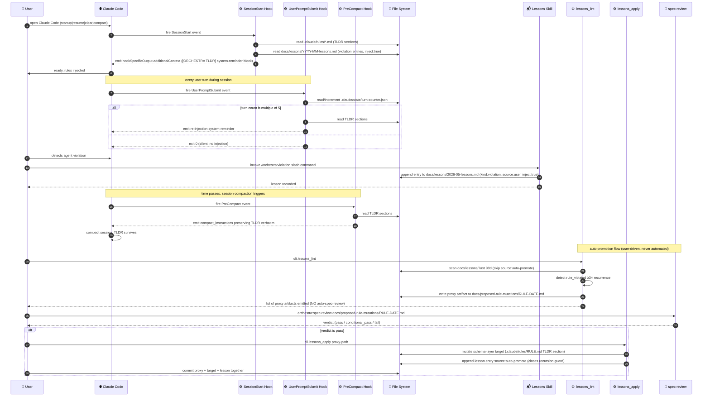

# LLD-012 — Rule Durability and Learning Layer

> **Doc ID:** 012-rule-durability-and-learning-layer
> **Date:** 2026-05-11
> **Status:** Draft
> **DRI:** Hassan Mohiddin
> **Type:** Feature LLD
> **Ship target:** v1.8.0
> **Iteration:** 2

---

## Problem Statement

Rules and disciplines codified in `.claude/CLAUDE.md` and `.claude/rules/*.md` decay during long Claude Code sessions and especially after `/compact` events. The agent skips spec-review before commits, executes without explicit user permission, makes silent design decisions, and otherwise drifts from project conventions even when the rules are present on disk and auto-loaded at session start.

There are two distinct failure modes:

1. **Rule decay (durability problem).** Long sessions and compaction silently drop process-standards while preserving task-state. The agent retains *what* it was doing but loses *how* it was supposed to do it. Confirmed in independent reports: Yajin Zhou's 2026-03-22 post "Why AI Agents Break Rules — A Confession from Claude" (https://yajin.org/blog/2026-03-22-why-ai-agents-break-rules/) extracted three causes from Claude's own self-report: rush-mode under rapid requests, post-compaction process-loss, and probabilistic self-exemption. Anthropic's prompt-caching documentation (https://platform.claude.com/docs/en/build-with-claude/prompt-caching) confirms that "even a single character difference in the system prompt breaks the cache hit," implying mid-session CLAUDE.md edits do not surface until cache rotation. Karpathy's 2026-04-04 llm-wiki gist (https://gist.github.com/karpathy/442a6bf555914893e9891c11519de94f) prescribes that schema-layer files (CLAUDE.md / AGENTS.md) are "what makes the LLM a disciplined wiki maintainer rather than a generic chatbot" — rule content must live where it survives the model's degradation curve, not in turn-by-turn prose.

2. **No feedback loop (learning problem).** When the user detects a runtime violation ("you skipped spec-review again", "you didn't ask before editing"), there is no mechanism for the agent to learn. The correction is lost when the conversation ends or compacts. Same violation recurs across sessions.

Industry-converged solution patterns (verified 2026-05-11 via deep research, reported in `docs/investigations/2026-05-11-workflow-skill-refresh.md`):

- **Hooks-as-law** — PreToolUse + PreCompact + SessionStart yields 60% → 90%+ rule compliance per two independent practitioner reports: "Your CLAUDE.md is a suggestion. Hooks make it law" (https://medium.com/codetodeploy/your-claude-md-is-a-suggestion-hooks-make-it-law-0124c5783b68) and "I wrote 200 lines of rules for Claude Code — it ignored them all" (https://dev.to/minatoplanb/i-wrote-200-lines-of-rules-for-claude-code-it-ignored-them-all-4639). Both reports are practitioner posts (not peer-reviewed studies); the 60→90% figure is the consistent claim across the two but lacks a formal benchmark — treat as practitioner-evidence indicative magnitude, not measured precision.
- **Recursive `<system-reminder>` re-injection** — Claude Code's own internal pattern per the Anthropic "Lessons from building Claude Code — prompt caching is everything" blog (https://claude.com/blog/lessons-from-building-claude-code-prompt-caching-is-everything).
- **Radical rule compression** — 300-line rule files → 5-line nonnegotiables + reference expansion (Yajin "Cut 300 Lines of Rules Down to 3" + dev.to "200 lines" post above).
- **Karpathy's append-only `log.md` for explicit memory artifact** (llm-wiki gist, K2 prescription).
- **Karpathy's periodic `lint` as session ritual** to keep the wiki self-healing (llm-wiki gist, K3 prescription).

orchestra currently ships:
- Auto-loaded rules totalling 556 lines (`wc -l .claude/CLAUDE.md .claude/rules/*.md` as of 2026-05-11: CLAUDE.md 132 + documentation-gate 135 + interview-gate 135 + skills-routing 114 + task-tracking 40 = 556). Skill SKILL.md files add another 537 lines but are NOT auto-loaded — they load on skill invocation, so they don't contribute to baseline session-start context burden.
- Zero Claude Code hooks (verified by `grep -n "SessionStart|PreCompact|PreToolUse" cli/install_hooks.py` returning no matches at HEAD; `cli/install_hooks.py:1-450` covers only git pre-commit and commit-msg; `.claude/settings.json` is absent as confirmed by `find .claude/ -name "*.json"` returning empty).
- No feedback-capture mechanism for user-detected violations.
- No probe asserting rules survive compaction.

This LLD adds the durability layer and the learning layer as a single coherent ship (v1.8) because they share infrastructure (hooks, `<system-reminder>` injection, file storage) and would otherwise duplicate plumbing.

---

## Success Criteria

- [ ] **SC-1.** Every `.claude/rules/*.md` and `.claude/CLAUDE.md` carries a `## TLDR — Nonnegotiables` section of ≤7 imperative bullets at top of file.
- [ ] **SC-2.** `cli.install_claude_hooks` command exists and writes `.claude/settings.json` with `SessionStart` matcher `startup|resume|clear|compact` and `PreCompact` hooks.
- [ ] **SC-3.** SessionStart hook script extracts TLDR sections from rule files + last N lessons (token-budgeted) and emits a `<system-reminder>`-wrapped block via `hookSpecificOutput.additionalContext`.
- [ ] **SC-4.** PreCompact hook emits `compact_instructions` text preserving the TLDR bullets verbatim through compaction summary.
- [ ] **SC-5.** `cli.compaction_probe` test command asserts a deterministic keyword from each TLDR section survives a simulated compacted-summary text. CI gate: failure of any keyword blocks merge.
- [ ] **SC-6.** New `orchestra:lessons` skill provides three slash commands: `/orchestra:teach <free-text>` (fast capture), `/orchestra:violation --rule=<id> --observed=<X> --expected=<Y>` (structured capture), and `/orchestra:lessons-lint` (manual trigger of `cli.lessons_lint`). Each command is declared in `skills/lessons/SKILL.md` frontmatter `commands:` list.
- [ ] **SC-7.** Lessons are appended to `docs/lessons/<YYYY-MM>-lessons.md` with frontmatter + structured entries. Entry `source:` field is enum `{user, auto-promote}` — `user` for entries from `/orchestra:teach` and `/orchestra:violation`; `auto-promote` for marker entries written by `cli.lessons_apply` immediately after it mutates a schema-layer target (recording which lessons drove the mutation, and closing the recursion guard since `lessons_lint` skips `source: auto-promote` entries in its next scan).
- [ ] **SC-8.** `cli.lessons_lint` scans lessons across last 90 days (skipping `source: auto-promote` entries), detects ≥3× recurrence of the same `rule_violated` value, and for each recurring rule writes one **proxy review artifact** to `docs/proposed-rule-mutations/<rule_basename>-<YYYY-MM-DD>.md` containing the proposed TLDR mutation diff + target schema-layer file path. Per Class-B reconciliation: `lessons_lint` **emits proxy artifacts only** — it does NOT auto-trigger spec-review. Running spec-review on the proxy is the user's next step. `cli.spec_review` scope unchanged (`docs/` only).
- [ ] **SC-9.** Auto-promotion never commits without user approval. User runs `orchestra:spec-review` situation on the proxy artifact. On pass verdict, user invokes `cli.lessons_apply <proxy-path>` (user-invoked, never automated) which mutates the schema-layer target file. Both proxy and target are committed together in one user-driven commit.
- [ ] **SC-10.** Hook handlers use **portable interpreter resolution** via `sys.executable` discovered at install time, NOT hardcoded `.venv/bin/python`. Missing interpreter at runtime exits non-zero with stderr — never silently no-ops. `cli.install_claude_hooks --verify` is a CI gate that fails the build when installed hook commands are non-executable.
- [ ] **SC-11.** Lessons injected into `<system-reminder>` system-priority context use **allowlisted structured fields only** (rule_violated, observed, expected — all string-escaped). Free-text `/teach` body is recorded for audit + lint but NEVER injected into system-priority context. Free-text injection requires explicit maintainer approval flow (deferred to v1.9+).
- [ ] **SC-12.** Test coverage: hook install + uninstall + verify; TLDR extraction (incl. all 4 failure modes); lesson append; lesson lint recurrence detection + proxy artifact write (no auto-spec-review trigger); compaction probe keyword assertion; slash command argument validation; **malformed-attestation overwrite refusal** regression (per codex finding #4); **untrusted-lesson injection sanitization** (no free-text body in injection output); **hook runtime fail-loud** (mock missing interpreter → assert non-zero exit + stderr message); **UserPromptSubmit turn-counter** (per SC-14: assert counter increments across mocked turns; assert injection emitted on turns 5/10/15…; assert silent exit on non-Nth turns); **cli.lessons_apply** (refuses without matching passed-spec-review attestation at any iteration; appends `source: auto-promote` marker on successful mutation). All in `tests/`.
- [ ] **SC-13.** Documentation update: `docs/design/orchestra-philosophy-r2.md` gains entry in Changelog noting Karpathy K1/K2/K3/K4/K8 lineage; `.claude/CLAUDE.md` references the new TLDR convention in a 2-3 sentence "## Rule Compression Convention" subsection pointing readers to `.claude/rules/*.md` TLDR sections + `docs/features/012-rule-durability-and-learning-layer.md` for full specification.
- [ ] **SC-14.** `UserPromptSubmit` hook is installed in `.claude/settings.json` (no matcher — fires every user prompt). Hook script (`cli.hooks.user_prompt_reinject`) increments a turn counter persisted at `.claude/state/turn-counter.json`. On every Nth turn (N=5 default, configurable via `ORCHESTRA_REINJECT_EVERY` env var), the hook emits a TLDR `<system-reminder>` injection (subject to the same 500-token budget as SC-3). On non-Nth turns, the hook exits 0 silently. Test asserts: turn-counter increments correctly across mocked turns; injection emitted exactly on turns 5, 10, 15…; no emission on intermediate turns.

---

## Scope

### In Scope

- TLDR compression of `.claude/rules/documentation-gate.md`, `.claude/rules/interview-gate.md`, `.claude/rules/skills-routing.md`, `.claude/rules/task-tracking.md`, and `.claude/CLAUDE.md`
- New CLI: `cli/install_claude_hooks.py`, `cli/compaction_probe.py`, `cli/lessons_lint.py`
- New skill: `skills/lessons/SKILL.md` exposing `/orchestra:teach` + `/orchestra:violation`
- New storage: `docs/lessons/<YYYY-MM>-lessons.md` (append-only, committed)
- New runtime state path: `.claude/state/` for non-durable artifacts (recursion guards, hook locks)
- Project-level `.claude/settings.json` writing with SessionStart + PreCompact hook entries
- `<system-reminder>`-wrapped TLDR injection on session start and post-compaction
- UserPromptSubmit re-injection every 5 user turns (token-budgeted, capped at 500 tokens per turn)
- `cli.compaction_probe` as a CI gate
- Auto-promotion mechanic: scan recurring lessons, draft TLDR mutations, trigger spec-review

### Out of Scope

- **PreToolUse blocking on Edit/Write to code paths.** Deferred to LLD-013 (workflow skill v2.0) because it requires the `brainstorm` primitive from W1 lock to be implemented as a callable skill action. v1.8 ships durability without enforcement; enforcement lands with workflow skill.
- **Skill SKILL.md compression.** Skill files are discovery surfaces for Claude Code's skill matcher — aggressive compression risks broken matching. Defer to a separate pass once we measure baseline match rates.
- **Anthropic Memory tool integration.** Research 2026-05-11 confirmed the API Memory tool (`memory_20250818`) is not callable from plugin code; zero production plugins use it. Claude Code's built-in `MEMORY.md` auto-memory is a separate system that already re-injects from disk after `/compact` for CLAUDE.md only — orchestra's hook is complementary for `.claude/rules/`. No integration work needed in v1.8.
- **Cross-machine lesson sync.** Lessons live in git-committed files; sync via normal git pull/push. Not building a separate sync mechanism.
- **Rush-mode detection (cadence guard).** Identified as a separate failure mode (Yajin RC3) but the mitigation (UserPromptSubmit hook counting cadence) is independent and can ship in v1.9.
- **TLDR compression on `.claude/workflow.md` and `.claude/skills-registry.md`.** Both files are declared schema-layer in the Three-layer file taxonomy table, but TLDR compression on them is deferred to **LLD-013 (workflow skill v2.0)**, which will restructure both files into the fixed-body skill + registry-driven customization shape per investigation note `docs/investigations/2026-05-11-workflow-skill-refresh.md` §W5. Compressing them in v1.8 risks immediate rework in v2.0. v1.8 ships TLDR coverage on `.claude/rules/*.md` + `.claude/CLAUDE.md` only (5 files); the remaining 2 schema-layer files (`workflow.md`, `skills-registry.md`) are covered by hook-based injection at the rule-file layer until LLD-013 ships.

---

## Design

### Architecture overview



### Three-layer file taxonomy (Karpathy K1 mapping)

| Layer | Path | Mutability | Karpathy term |
|---|---|---|---|
| Raw | `docs/{features,bugs,adr,design,postmortems,runbooks,plans,investigations,reviews}/` | Append + supersede via -rN | Raw sources |
| Wiki | `docs/lessons/<YYYY-MM>-lessons.md` (NEW) + `docs/design/*.md` | Append + structured | Wiki (LLM-curated) |
| Schema | `.claude/CLAUDE.md` + `.claude/rules/*.md` + `.claude/workflow.md` + `.claude/skills-registry.md` | Edit (spec-review-gated) | Schema (instructs LLM how to use the wiki) |

State layer (NEW, NOT a Karpathy layer): `.claude/state/` — runtime-only artifacts (recursion locks, hook last-fire timestamps). Excluded from git.

### TLDR section format

Every schema-layer file gains a `## TLDR — Nonnegotiables` section immediately after the H1 title and intro paragraph. Format:

```markdown
## TLDR — Nonnegotiables

- STOP and ASK on ambiguous scope, low context, silent design decision.
- No code change without committed design doc + passed spec review.
- `fix:` commit only after user explicit confirmation.
- Single BUG-NNN spans all iteration attempts; never split.
- Discovery Gate fires on confirmed defect, not suspected — STOP, file BUG-NNN, spec-review, commit.

<!-- Full rule body below this section -->
```

Constraints:
- ≤7 bullets per file (token budget)
- ≤80 chars per bullet (attention weight per Yajin)
- Imperative verb-first ("STOP," "REQUIRE," "NEVER," "ASK")
- No hedging ("usually", "typically", "in most cases")
- Mechanical extractor key: regex `^## TLDR — Nonnegotiables$` ... `^<!-- Full rule body below this section -->$`

**Extractor failure modes (explicit):**
- **Missing close marker** (`<!-- Full rule body below this section -->` absent) → extractor takes content up to end-of-file. Logged as WARN; install proceeds.
- **Multiple `## TLDR — Nonnegotiables` sections** in one file → extractor REJECTS; `cli.install_claude_hooks` exits non-zero with "ambiguous TLDR section in <file>". User must dedupe.
- **Bullet count > 7 or bullet length > 80 chars** → extractor REJECTS install with diagnostic listing offending bullets. Treats this as a discipline violation, not a graceful-degradation case (per Yajin's attention-weight thesis, overflow defeats the purpose).
- **Empty TLDR section** (header present, no bullets) → extractor REJECTS install. Empty TLDR = author forgot to fill; better to fail loud than ship blank.

### Hook architecture (portable-interpreter route per codex finding #3)

**Fail-loud fix:** Hooks do NOT hardcode `.venv/bin/python`. At install time, `cli.install_claude_hooks` discovers the running interpreter via `sys.executable`, validates it, and writes the resolved absolute path into `.claude/settings.json`. At runtime, if the resolved interpreter is missing or not executable, the hook exits non-zero with stderr diagnostic — never silently no-ops. `cli.install_claude_hooks --verify` is a CI gate that fails the build when settings.json points to a non-executable command.

Example settings.json fragment (concrete interpreter path determined at install — `<RESOLVED_PYTHON>` below is replaced at install time, NOT a literal):

```json
{
  "hooks": {
    "SessionStart": [
      {
        "matcher": "startup|resume|clear|compact",
        "hooks": [
          {
            "type": "command",
            "command": "<RESOLVED_PYTHON> -m cli.hooks.session_start_inject"
          }
        ]
      }
    ],
    "PreCompact": [
      {
        "hooks": [
          {
            "type": "command",
            "command": "<RESOLVED_PYTHON> -m cli.hooks.pre_compact_instruct"
          }
        ]
      }
    ],
    "UserPromptSubmit": [
      {
        "hooks": [
          {
            "type": "command",
            "command": "<RESOLVED_PYTHON> -m cli.hooks.user_prompt_reinject"
          }
        ]
      }
    ]
  }
}
```

Hook modules live in `cli/hooks/` (new package):
- `session_start_inject.py` — reads TLDR sections + last 10 **structured violation** lessons (free-text `teach` lessons excluded — see Security §Lessons injection allowlist); emits JSON. On missing interpreter / import error, exits 2 with stderr.
- `pre_compact_instruct.py` — emits `compact_instructions` string preserving TLDR keywords verbatim.
- `user_prompt_reinject.py` — increments turn counter in `.claude/state/turn-counter.json`; if counter % 5 == 0, emits TLDR injection; else exits 0.

All hook output uses `hookSpecificOutput.additionalContext` containing `<system-reminder>...</system-reminder>` wrapped content. The `<system-reminder>` tag is the canonical pattern per the Anthropic "Lessons from building Claude Code — prompt caching is everything" blog (https://claude.com/blog/lessons-from-building-claude-code-prompt-caching-is-everything) which describes Claude Code's own internal use of `<system-reminder>` for stable-prefix preservation under prompt caching. Each Claude Code session in this conversation receives multiple `<system-reminder>` injections from active hooks (e.g., the caveman SessionStart hook) — direct empirical confirmation that the tag survives session ingestion and is interpreted as system-priority context.

Token budget enforcement: total injection capped at 500 tokens per emission, measured via Anthropic's `count_tokens` API (https://platform.claude.com/docs/en/agents-and-tools/token-counting) using the same model the running Claude Code session is configured for (resolved via `claude --print-current-model` at hook execution time; if unavailable, fall back to `claude-opus-4-7` for accounting purposes — the budget is a soft upper bound, not a hard contract with the model). If TLDR + lessons exceed budget, hook falls back to identity + rule-name index only (per 2026-05-07 brainstorm §Round 2 placement table). Compaction probe asserts the count-tokens contract by computing tokens of canonical TLDR + lessons fixture and comparing to the hook's runtime emission.

Re-install required when interpreter location changes: if the user moves or recreates `.venv`, they must re-run `cli.install_claude_hooks` to refresh the resolved interpreter. `--verify` will catch the stale path on next CI run.

### Lessons skill (structured-fields-only injection per codex finding #2)

`skills/lessons/SKILL.md` (new) declares:
- Frontmatter `name: lessons`
- Slash command surface auto-namespaces as `/orchestra:teach` and `/orchestra:violation`

**Two-tier capture, single-tier injection.** Both commands write to the lessons file. ONLY structured `violation` entries are ever injected into system-priority context (per Security §Lessons injection allowlist). Free-text `teach` entries are durable + lintable + queryable, but they NEVER appear in `<system-reminder>` blocks.

`/orchestra:teach <free-text>` — appends a minimal entry. Captured for audit + future maintainer ratification (v1.9+); NOT injected by SessionStart/UserPromptSubmit hooks in v1.8:

```yaml
- id: <uuid>
  ts: 2026-05-11T15:32:00Z
  kind: teach
  rule_violated: null
  body: "<free-text>"
  source: user
  inject: false   # explicit marker; hook respects this
```

`/orchestra:violation --rule=<id> --observed=<X> --expected=<Y>` — appends structured entry; IS injected (subject to token budget):

```yaml
- id: <uuid>
  ts: 2026-05-11T15:32:00Z
  kind: violation
  rule_violated: <id>     # validated against allowlist
  observed: "<X>"         # escaped, max 200 chars
  expected: "<Y>"         # escaped, max 200 chars
  source: user
  inject: true
```

Rule-id allowlist = basenames of `.claude/rules/*.md` minus extension (plus `CLAUDE.md` and `workflow.md`). Unknown rule-id → command exits 2 with helpful error.

**Injection-time enforcement:** `session_start_inject.py` and `user_prompt_reinject.py` filter `kind: violation` AND `inject: true` entries only. They emit ONLY the three structured fields (rule_violated, observed, expected), each HTML-encoded and length-capped, formatted as a fixed template. Free-text body is never present in injection output.

Future v1.9+ ratification path (out of scope): a maintainer-only `/orchestra:ratify-lesson <id>` flips a `teach` entry's `inject: false` → `inject: true` after human review, enabling free-text steering with explicit accountability. Not built in v1.8.

**`source: auto-promote` producer:** Distinct from `/teach` and `/violation` user-driven writes, the `source: auto-promote` lesson kind is written exclusively by `cli.lessons_apply`. After `lessons_apply` mutates a schema-layer target (TLDR section in `.claude/rules/<rule>.md`), it appends one `source: auto-promote` marker entry to the current month's lessons file referencing the proxy artifact and the source lessons that drove the mutation. Schema:

```yaml
- id: <uuid>
  ts: <ISO-8601 UTC>
  kind: promotion-marker
  rule_violated: <rule_id whose TLDR was mutated>
  proxy_artifact: docs/proposed-rule-mutations/<rule>-<date>.md
  source_lesson_ids: [<uuid>, <uuid>, ...]  # the ≥3 violations that drove promotion
  source: auto-promote
  inject: false   # marker entries are never injected
```

This is the producer referenced by the recursion guard in `cli.lessons_lint` (which skips `source: auto-promote` entries to prevent the promote→inject→re-detect loop).

### lessons_lint and auto-promotion (proxy-artifact route per codex finding #1)

**Trust-boundary fix:** `cli.spec_review` scope is unchanged (`<repo_root>/docs/` only). Schema-layer files (`.claude/*`) are reviewed via a **proxy artifact** in `docs/proposed-rule-mutations/`.

`cli.lessons_lint` scan procedure:

1. Read all `docs/lessons/*.md` entries from last 90 days, where `kind in {violation}` (free-text `teach` entries skipped — see Security §Lessons injection allowlist)
2. Group by `rule_violated` (skip `null`)
3. For any rule_id with count ≥ 3:
   - Read corresponding rule file's current TLDR section
   - Draft proposed new bullet from highest-frequency `observed`/`expected` pair. **Tie-break rules:** (a) most-recent lesson wins on count-tie; (b) lexicographic order on `observed` field if recency also ties; (c) if drafted bullet exceeds 80 chars, lessons_lint emits a "needs-author-rewrite" proxy marker instead of an auto-drafted mutation — author must compose the bullet manually. **Merge semantics:** drafted bullet APPENDS to existing TLDR list (no replace), and lessons_lint REFUSES to draft if appending would push count >7 — author must consolidate existing bullets first.
   - Write a **proxy review artifact** to `docs/proposed-rule-mutations/<rule_basename>-<YYYY-MM-DD>.md` containing:
     - Target schema-layer file path (e.g. `.claude/rules/interview-gate.md`)
     - Current TLDR diff
     - Proposed TLDR diff
     - Lesson evidence (count + sample entries with timestamps)
     - Provenance: `auto-promoted-by: cli.lessons_lint`, `generated: <ts>`
   - The proxy artifact is a normal `docs/` doc subject to standard Gate 3 spec-review
4. For each proxy artifact, invoke `orchestra:spec-review` situation on the proxy. spec-review reads ONLY the proxy file (under existing canonical scope) — never reads or mutates the schema-layer target during review.
5. Output: list of drafted proxy artifacts + spec-review verdicts. **`cli.lessons_apply <proxy-path>` is user-invoked, not automated** (no scheduler, no auto-run on spec-review pass). Apply step mutates the schema-layer target only after the user explicitly runs it. Both proxy and target are committed together in one user-driven commit.

Recursion guard: lessons with `source: auto-promote` are skipped in lint scan to prevent infinite-loop. (See Lessons skill § source enum for the producer of `source: auto-promote` entries.)

**Why proxy not direct allowlist:** Extending `cli.spec_review` to consume `.claude/*` would widen the canonical-scope trust boundary set in `cli/spec_review.py:376-394` (the `canonicalize_doc_path` function refuses paths outside `<repo_root>/docs/`). The proxy route preserves that invariant — auto-promotion artifacts live in `docs/proposed-rule-mutations/`, which is within scope by default. Proxy also produces an audit trail per promotion (proxy artifacts retained in `docs/proposed-rule-mutations/`, never deleted). Consistent with LLD-008 r8 §canon-frozen-guard rationale (commit-skill never grants itself elevated scope) and LLD-006-r4 §supersession (changes to canon-frozen schema files require a separate review artifact, not in-place review of the target).

### compaction_probe

`cli.compaction_probe` procedure:

1. Read all TLDR sections from schema layer
2. Extract one deterministic keyword per bullet (first noun ≥4 chars)
3. Construct a synthetic compacted-summary text representative of a 100-turn session
4. Apply Claude API's `compact_20260112` to the summary with the canonical compact_instructions
5. Assert every keyword appears in the compacted output
6. Exit 0 if all survive; exit 1 with failing-keyword list otherwise

CI gate: runs on every PR that modifies `.claude/rules/` or `.claude/CLAUDE.md` or schema-layer files. Failure blocks merge.

---

## API Changes

New CLI surfaces:

| Command | Purpose |
|---|---|
| `python -m cli.install_claude_hooks [--force] [--verify] [--uninstall]` | Write/verify/remove `.claude/settings.json` hook entries. `--uninstall` removes orchestra-installed hook lines without touching other-plugin hooks. |
| `python -m cli.compaction_probe` | Assert TLDR keywords survive compaction (CI gate) |
| `python -m cli.lessons_lint [--since=90d]` | Scan recurring lessons + write proxy artifacts to `docs/proposed-rule-mutations/`. Does NOT auto-trigger spec-review (per SC-8). |
| `python -m cli.lessons_apply <proxy-path>` | User-invoked mutation step. Refuses to mutate target unless a matching passed-spec-review attestation exists at `docs/reviews/<proxy-stem>-rN.review.yaml` for the proxy's current iteration N (iteration-aware lookup — reads `> **Iteration:** N` from proxy doc metadata, defaults to 1 if absent). On success: mutates schema-layer target + appends `source: auto-promote` marker entry to current month's lessons file. |
| `python -m cli.hooks.session_start_inject` | Hook handler (not user-invoked) |
| `python -m cli.hooks.pre_compact_instruct` | Hook handler (not user-invoked) |
| `python -m cli.hooks.user_prompt_reinject` | Hook handler (not user-invoked) |

New slash commands (auto-namespaced via skill plugin manifest):

| Command | Purpose |
|---|---|
| `/orchestra:teach <free-text>` | Fast lesson capture |
| `/orchestra:violation --rule=<id> --observed=<X> --expected=<Y>` | Structured violation capture |
| `/orchestra:lessons-lint` | Manual trigger of `cli.lessons_lint` (alternative to bash) |

No external HTTP/API surface change. No breaking changes to existing CLI.

---

## Database Changes

None. File-based throughout.

---

## Edge Cases & Error Handling

| Case | Handling |
|---|---|
| Token budget exceeded for injection | Fall back to identity + rule-name index only (≤200 tokens). Log to `.claude/state/budget-overflow.log`. |
| Concurrent plugin SessionStart hooks blend | orchestra hook tags injection with `[ORCHESTRA TLDR]` prefix marker as the literal opening line of the `additionalContext` string (BEFORE the `<system-reminder>` wrap). Disambiguation contract: downstream readers (Claude Code itself or other plugins inspecting hook outputs) MAY match on the prefix string `[ORCHESTRA TLDR]` to identify orchestra-originated injections vs other plugins. Marker is documented in `skills/lessons/SKILL.md` as part of the public hook output schema. |
| Claude Code's auto-memory already re-injects CLAUDE.md after `/compact` | orchestra hook emits delta for `.claude/rules/` only when CLAUDE.md re-injection detected via probe. Avoids duplicate work. |
| Auto-promotion infinite-loop (TLDR update → lesson recurrence → update) | `source: auto-promote` lessons skipped by `lessons_lint`. Recursion impossible. |
| Lessons file git merge conflict (two contributors same month) | Append-only at EOF → standard git auto-merge succeeds. If hand-resolve needed, `id` field disambiguates duplicates. |
| Invalid rule-id in `/orchestra:violation --rule=X` | Validate against allowlist (`.claude/rules/*.md` basenames + CLAUDE.md + workflow.md). Exit 2 with "unknown rule: X. Known: [...]" |
| Hook script missing resolved interpreter | Hook command (installed with absolute `<RESOLVED_PYTHON>` via `sys.executable` at install time) fails to find the interpreter → exits **non-zero** with stderr diagnostic. NEVER silently no-ops — silent no-op was the failure mode codex flagged in finding #3. User must re-run `cli.install_claude_hooks` to refresh resolution. `--verify` CI gate fails on stale interpreter paths. |
| Settings.json malformed | `cli.install_claude_hooks` reads, validates as JSON, refuses to write if input malformed. User must hand-fix first. |
| Lesson injection — untrusted system-priority steering | **Free-text `teach` lessons NEVER injected.** Only `kind: violation` entries with `inject: true` flow into `<system-reminder>` blocks, and only via fixed structured-template emitting allowlisted fields (rule_violated, observed, expected) with HTML-encoding + 200-char cap. Closes the trust-boundary break codex flagged in finding #2. |
| Crafted observed/expected fields | Per-field HTML-encode (especially `<`, `>`, `</system-reminder>`) and 200-char hard cap. Fixed template prevents free-form payload injection. |
| compaction_probe false-positive (keyword present coincidentally in summary) | Use 4+ char deterministic keywords that appear nowhere except the TLDR — choose distinctive ones. If unavoidable collision, prefix keyword with `ORCHESTRA-TLDR-` marker. |
| compaction_probe in CI without Anthropic API key | `cli.compaction_probe` REQUIRES `ANTHROPIC_API_KEY` in env. In CI environments without it, probe exits 2 with stderr "ANTHROPIC_API_KEY missing — CI gate cannot run". Workflow gate marks the CI step as required; missing key fails the build (not a graceful skip). Local pre-commit invocations: `--allow-skip` flag exits 0 if key missing (local dev convenience only; CI must NOT pass `--allow-skip`). |
| User runs `/orchestra:teach` in non-orchestra repo | `.claude/orchestra.json` is the orchestra-init marker file: created by `orchestra:init` skill on first-time setup, committed to git, schema-validated at every load. Slash command does: `if not (repo_root / '.claude/orchestra.json').exists(): print('not an orchestra-init'd repo; run /orchestra:init first'); exit(2)`. The file already exists in any repo that has run init; v1.8 does not change its schema. |

---

## Security Considerations

- **Hook execution surface.** Hooks run on every SessionStart and PreCompact event. Risk vector: malicious actor modifies hook command in `.claude/settings.json` to execute arbitrary code on next session start. Mitigation: hook commands are pinned to `<RESOLVED_PYTHON> -m cli.hooks.*` modules (interpreter resolved at install via `sys.executable`); `cli.install_claude_hooks --verify` audits the settings file against expected fingerprint and reports tampering. Future hardening: signed manifest (deferred to v2.0).
- **Lessons injection allowlist (trust-boundary fix for codex finding #2).** Free-text `/teach` lesson bodies are NEVER injected into `<system-reminder>` blocks in v1.8. Only `kind: violation` entries with `inject: true` reach system-priority context, and only via a fixed structured template emitting three allowlisted fields (rule_violated, observed, expected) — each HTML-encoded and 200-char-capped. This blocks the trust-boundary break where anyone with commit access could plant persistent system steering via lesson commits. Free-text `teach` entries remain in the lessons file for audit + lint, but their content cannot reach system context until a maintainer ratification path is built (v1.9+).
- **Path traversal in slash command args.** `/orchestra:violation --rule=../../../etc/passwd` → validate against fixed allowlist of basenames from `.claude/rules/*.md`. No directory components allowed.
- **Auto-promotion writes via proxy artifact (codex finding #1 fix).** Auto-promotion never writes directly to schema-layer files. `cli.lessons_lint` emits a proxy review artifact in `docs/proposed-rule-mutations/` (within existing `cli.spec_review` canonical scope); spec-review runs on the proxy; the schema-layer file is mutated ONLY by a separate user-invoked `cli.lessons_apply` step on spec-review pass. Two-step gate (spec-review + explicit apply) is the user-authorization boundary.
- **Hook fail-loud semantics (codex finding #3 fix).** Hook commands NEVER silently no-op when the resolved interpreter is missing. They exit non-zero with stderr diagnostic. `--verify` CI gate fails the build if installed hook commands are non-executable. Silent disable of the control plane is treated as a security incident, not a graceful degradation.
- **Settings.json scope.** Project-level (`.claude/settings.json` committed to git) is intentional — every contributor and CI inherits hooks. Prevents local-override drift. Acceptable security tradeoff: any contributor with commit access can already change behavior; project settings is the right scope.
- **Compaction probe data exfiltration.** Probe runs against Claude API in CI. No PII or secrets in TLDR text by design (TLDR is rules, not data). Probe text is open-source-eligible.
- **Malformed attestation overwrite (codex finding #4 fix).** `cli.spec_review` overwrite path is fail-closed on unreadable existing v1 attestations: malformed YAML at the target output path causes force-mode refusal with no file mutation. Prevents bypass of v1 freeze protections via malformed-seed attacks. Regression test asserts this in `tests/test_schema_v1_overwrite_failclosed.py`.

---

## Testing Strategy

### Unit tests (`tests/test_*.py`)

- `test_install_claude_hooks.py` — install creates valid settings.json with `<RESOLVED_PYTHON>` from `sys.executable`; uninstall removes; verify detects tampering AND stale interpreter paths; merge preserves non-orchestra hooks
- `test_install_claude_hooks_fail_loud.py` — mock missing interpreter at runtime → assert hook exits non-zero + stderr message (codex finding #3 regression)
- `test_tldr_extractor.py` — regex extracts TLDR section; bullets parsed correctly; missing-section handled
- `test_lesson_append.py` — `/orchestra:teach` appends `kind: teach, inject: false`; `/orchestra:violation` appends `kind: violation, inject: true` AND validates rule-id; observed/expected fields HTML-encoded + capped at 200 chars
- `test_lesson_injection_allowlist.py` — assert SessionStart hook output contains NO free-text `teach` body; assert only structured `violation` fields appear in `<system-reminder>` block (codex finding #2 regression)
- `test_lessons_lint.py` — ≥3× recurrence detected; `source: auto-promote` lessons skipped; **proxy artifact** written to `docs/proposed-rule-mutations/<rule>-<date>.md` (NOT to `.claude/state/`, NOT directly to schema file); lessons_lint exits 0 with list of proxy paths printed to stdout for user to feed into spec-review next step (lessons_lint does NOT auto-trigger spec-review — that's user-invoked per SC-8/9)
- `test_lessons_apply.py` — apply step refuses to mutate schema-layer target without matching passed-spec-review attestation; on pass, writes mutation + commits both files together
- `test_compaction_probe.py` — keywords extracted deterministically; probe assertion logic correct
- `test_schema_v1_overwrite_failclosed.py` — seed malformed v1 attestation at target output path → force-mode refusal + no file mutation (codex finding #4 regression)

### Integration tests (`tests/integration/`)

- `test_hook_emission.py` — invoke hook handlers via subprocess; assert JSON output shape; assert `<system-reminder>` wrapping
- `test_end_to_end_violation.py` — install hooks in throwaway repo → fire SessionStart → `/orchestra:violation` × 3 same rule → fire `cli.lessons_lint` → assert draft written → mock spec-review pass → assert TLDR mutation acceptable

### Compaction probe (CI gate)

- `cli.compaction_probe` runs in CI on every PR touching schema-layer files
- Hard failure (exit ≥ 1) blocks merge
- Quarterly review: extend probe to new rules added

### Manual verification (pre-ship)

- Open Claude Code session → confirm `<system-reminder>` block appears in transcript (or visible via `/session-info`)
- Run `/compact` mid-session → confirm TLDR keywords appear in post-compact context
- Type `/orchestra:teach test lesson` → confirm appended to `docs/lessons/<YYYY-MM>-lessons.md`
- Run `cli.lessons_lint --since=1d` → confirm no false-positive promotions when no recurrence exists

---

## Related Documents

- `docs/design/orchestra-philosophy-r2.md` — three-layer raw/wiki/schema mapping (Karpathy K1: three-layer separation into raw sources / LLM-curated wiki / schema instructing the LLM how to use the wiki). This LLD requires a Changelog entry in that doc explicitly citing Karpathy K1, K2 (auto-maintained `index.md` for navigation + append-only `log.md` for chronological history per wiki — orchestra analog = `docs/HANDOFF.md` plus the new `docs/lessons/` directory), K3 (periodic `lint` as session ritual: agent health-checks the wiki for contradictions, stale claims, orphan pages — orchestra analog = `cli.lessons_lint` + existing `cli.lint`), K4 (schema = sole place LLM behavior is configured — orchestra analog = `.claude/CLAUDE.md` + `.claude/rules/*.md` TLDR sections), and K8 (wiki compiles knowledge once and keeps it current — orchestra analog = TLDR + auto-promote pipeline, not RAG-style rediscovery per session). Same K-number references as SC-13.
- `docs/investigations/2026-05-07-workflow-spec-review-brainstorm.md` — Round 2 research (Lost-in-the-Middle, Context Rot, Cursor "Always Rules"). Substrate for problem statement.
- `docs/investigations/2026-05-11-workflow-skill-refresh.md` — W1-W7 decisions including W6 (this LLD scope) and W7 (lessons + auto-promote scope).
- `docs/features/011-spec-review-v2.md` (in drafting, separate session) — 2-iter cap will eventually emit plateau signal consumed by LLD-013 workflow skill; v1.8 LLD-012 does not directly couple, but lessons captured during plateau events feed back here.
- `docs/features/006-archive-and-supersession-conventions-r4.md` — canon-frozen-guard. Auto-promotion writes to schema-layer files which are canon-frozen-eligible; spec-review-gated commit respects supersession when target file is canon-frozen.
- `.claude/rules/documentation-gate.md`, `interview-gate.md`, `skills-routing.md`, `task-tracking.md`, and `.claude/CLAUDE.md` — TLDR compression targets.

---

## Changelog

| Date | Entry |
|---|---|
| 2026-05-11 | Initial draft. Seeded by `docs/investigations/2026-05-11-workflow-skill-refresh.md` W6+W7 decisions. |
| 2026-05-11 | Codex adversarial review (judge-2). Verdict: needs-attention. 1 Critical + 2 High + 1 Medium. Full artifact: `docs/reviews/012-rule-durability-and-learning-layer-r1.codex.md`. All 4 findings addressed via Option A per user grill: (#1) proxy artifact in `docs/proposed-rule-mutations/` instead of extending `cli.spec_review` scope; (#2) structured-fields-only injection — free-text `teach` never reaches `<system-reminder>`; (#3) portable interpreter resolution via `sys.executable` at install, fail-loud at runtime, `--verify` CI gate; (#4) malformed-attestation overwrite fail-closed + regression test. |
| 2026-05-11 | orchestra spec-review judge-1 iter-1. Attestation: `docs/reviews/012-rule-durability-and-learning-layer-r1.review.yaml`. Verdict: fail. 2 Critical + 14 Important + 4 Minor. All addressed in iter-2 prep via batch-fix-by-class (user grill): Class A — inline citations (URLs added to Problem Statement + Hook architecture; 1093 → 556 line correction; codex artifact link). Class B — SCs authoritative; reconcile Design + API (slash-command count, SC-8 auto vs manual trigger, source enum, --uninstall flag, K-number ref). Class C — inline clarifications (TLDR extractor failure modes, tokenizer, .claude/orchestra.json definition, [ORCHESTRA] marker, compaction_probe offline behavior, tie-break logic). Class D — add SC-14 for UserPromptSubmit cadence + explicit Out-of-Scope row for workflow.md + skills-registry.md (deferred to LLD-013 v2.0). |
| 2026-05-11 | orchestra spec-review judge-1 iter-2. Attestation: `docs/reviews/012-rule-durability-and-learning-layer-r2.review.yaml`. Verdict: fail. 2 Critical + 5 Important + 3 Minor (net 24→10 findings vs iter-1). 2 Critical findings = regressions from Class-B edits not propagated to mermaid + SC-7 + test description. All 8 r2 findings applied inline (no iter-3 spec-review per user decision): (1) stale `cli/spec_review.py:269-287` → `376-394`; (2) mermaid rewrite — removed direct-mutation flow, added proxy + lessons_apply + UserPromptSubmit hook participant; (3) SC-7 producer fix: lessons_lint → lessons_apply; (4) SC-12 expanded with SC-14 turn-counter test + lessons_apply test; (5) test_lessons_lint.py description aligned with SC-8 (no auto-spec-review); (6) defined `source: auto-promote` producer + schema in Lessons skill section; (7) cli.lessons_apply API row updated for iteration-aware attestation lookup (drop hardcoded -r1); (8) Karpathy K2/K4/K8 inline glosses added to Related Documents row. Doc state captures all r2 followups as APPLIED rather than DEFERRED. |
