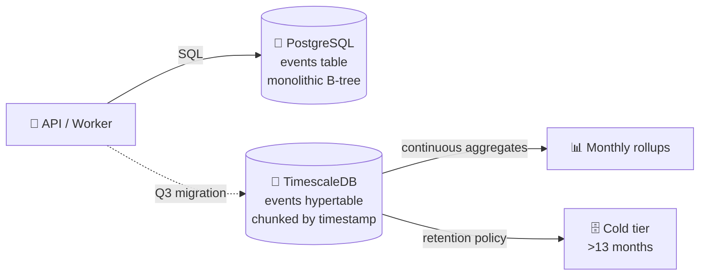

# ADR-001: Migrate Time-Series Event Data from PostgreSQL to TimescaleDB

> **Doc ID:** ADR-001-postgres-to-timescale
> **Date:** 2026-04-20
> **DRI:** Hassan
> **Status:** Approved
> **OKR Alignment:** Sustain query latency and ingestion throughput as event volume scales — supports "10x users without 10x infra" platform objective.

## Context

The `events` table is the hottest table in the system. Two forces converged:

- **Volume.** ~50M event rows/month. B-tree indexes on `(user_id, timestamp)` are now multi-GB. Vacuum windows are stretching beyond maintenance windows.
- **Query pattern.** ~95% of read traffic targets the **last 30 days per user**. The remaining ~5% scans wider windows for rollups. We are paying full-table-index cost to serve a recency-skewed workload.
- **Operational signal.** `pg_stat_statements` shows `events` range-scan p95 climbing month-over-month.
- **Capacity.** Q3 has been carved out for focused infra investment.

This ADR records the decision. Alternatives (native partitioning, Citus, ClickHouse) were weighed and dismissed — see below.

## Decision

> **We will migrate time-series event data from vanilla PostgreSQL to TimescaleDB, modeling the `events` table as a hypertable chunked by `timestamp`, executing the migration in Q3 2026.**

TimescaleDB runs as a Postgres extension, so the existing connection layer keeps speaking SQL with no driver change. The decision is specifically about the storage shape for the events table — not a wholesale move off Postgres.

### Detailed shape

- **Hypertable:** `events` chunked by `timestamp`, default chunk interval 7 days (tuned during migration)
- **Space partitioning:** secondary partition by `user_id` hash for local recency scans
- **Continuous aggregates:** monthly per-user rollups served from materialized continuous aggregates
- **Retention:** keep 13 months hot; older chunks compressed via TimescaleDB native columnar compression
- Row contracts (columns, types, foreign keys, RLS) remain identical — storage-engine swap, not schema redesign

The full migration plan (cutover, dual-write, rollback) belongs in a Q3 Feature LLD that references this ADR.

## Consequences

### Positive

- Recent-window queries (last 30 days per user) hit one or two chunks instead of scanning a multi-GB index
- Ingestion throughput improves: writes target the latest chunk, smaller indexes, less vacuum pressure
- Continuous aggregates remove recurring "recompute monthly rollups" cost
- Native compression for cold chunks reduces storage cost
- Stays inside the Postgres ecosystem — RLS, migrations, ORM all keep working

### Negative

- **Operational surface area grows.** Chunk management, continuous-aggregate refresh policies, compression policies need monitoring. New runbooks required.
- **Hosting constraint.** Some managed-Postgres providers don't expose TimescaleDB. Migration may require self-hosted or alternate-managed Postgres for events.
- **Migration risk.** ~50M rows/month means historical backfill is non-trivial. Staged migration (dual-write → backfill → cutover) consumes most of Q3 bandwidth.
- **Schema evolution friction.** Hypertables constrain certain DDL — future changes to the time-axis column become harder.

### Neutral / commitments

- We commit to operating TimescaleDB (or managed equivalent) as a first-class production datastore with backup, monitoring, on-call coverage
- Cutover targeted Q3 2026; until cutover, vanilla Postgres remains source of truth
- Future event-source ingestion writes into the hypertable directly — no parallel storage paths

## Alternatives Briefly Rejected

| Option | Why rejected |
|--------|--------------|
| Native PostgreSQL declarative partitioning by month | Solves index-size problem but leaves us hand-rolling chunk management, retention, continuous aggregates that TimescaleDB ships built-in. |
| Citus (distributed Postgres) | Optimized for horizontal scale-out, not time-series patterns; adds coordinator/worker complexity unnecessary at current scale. |
| ClickHouse / dedicated OLAP store | Forces second SQL dialect, second driver path, ETL pipeline; loses transactional consistency with the rest of the relational model. |
| Stay on vanilla Postgres + scale vertically | Buys ~6 months at increasing instance cost without addressing vacuum/index-bloat trajectory. Defers the decision rather than resolving it. |

## Related Documents

- Supersedes: none
- Superseded by: none
- Related:
  - `docs/design/database-design.md` — will be updated post-cutover
  - `docs/design/system-architecture.md` — will reflect new storage topology
  - Q3 Feature LLD for the migration itself (`docs/features/NNN-timescaledb-migration.md`)

## Changelog

| Date | Change |
|------|--------|
| 2026-04-20 | Initial record — Status: Approved. Decision made by DRI; recorded after deliberation closed. |
