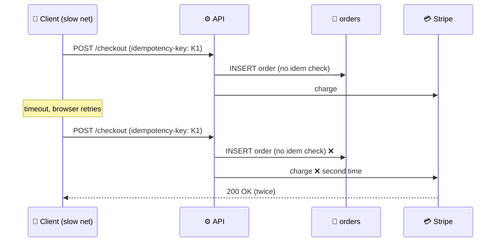

# Bug Report: Checkout Endpoint Double-Charges on Network Retry

> **Doc ID:** BUG-001-checkout-double-charge
> **Date:** 2026-04-15
> **DRI:** Backend on-call
> **Severity:** Critical
> **Status:** Verified

## Observed Behavior

Customers are being charged twice when their browser retries a slow `POST /api/checkout` request. Stripe webhook logs show two `payment_intent.succeeded` events for the same order, separated by 3-12 seconds. ~0.4% of checkouts affected.

## Expected Behavior

Each checkout submission must produce exactly one charge regardless of network retries. Idempotency keys passed by the client must dedupe at the API boundary.

## Steps to Reproduce

1. Throttle Chrome network to "Slow 3G"
2. Submit checkout with cart total > $0
3. Browser sees timeout at 30s, auto-retries the POST
4. Both POSTs reach the server; both create distinct `payment_intent` rows
5. Stripe charges twice

## Environment

- **Branch:** main
- **Component:** `apps/api/routes/checkout.py`
- **Triggered by:** Client-side retry on slow networks; also reproducible via `curl --retry 3`

## Root Cause Analysis

### Root Cause

`apps/api/routes/checkout.py:42` reads the `Idempotency-Key` header but never queries `idempotency_keys` table to check for prior use. The handler creates a new order row + Stripe charge unconditionally. The middleware that was supposed to short-circuit duplicates (`apps/api/middleware/idempotency.py`) was added in 2025-Q4 but never wired into the FastAPI app router.

### Contributing Factors

- No integration test exercising the retry path
- Stripe charges are stamped with the same idempotency key (which is why we see two `payment_intent` rows but no Stripe error) — the idempotency layer was supposed to prevent the second call from reaching Stripe at all

## Fix Description

| File | Change |
|------|--------|
| `apps/api/main.py` | Register `IdempotencyMiddleware` before route handlers |
| `apps/api/middleware/idempotency.py` | Fix race: use `INSERT ... ON CONFLICT DO NOTHING RETURNING id` to atomically claim the key |
| `apps/api/tests/test_checkout.py` | Add `test_double_post_with_same_idem_key_returns_cached_response` |

### Why This Fix Works

The middleware claims the idempotency key in a single SQL transaction before the handler runs. Second request with the same key sees a cached response (200 with original body) and never reaches the charge logic. Race-free under concurrent requests because the unique constraint on `idempotency_keys.key` enforces serialization.

## Iteration Log

| # | Date | Hypothesis | Change | Observed Result | User Verification |
|---|------|------------|--------|-----------------|-------------------|
| 1 | 2026-04-15 | Middleware registered but query bug | Added trace logging | No middleware logs at all → middleware not registered | Confirmed (still broken) |
| 2 | 2026-04-15 | Middleware never registered | Wire `IdempotencyMiddleware` into `apps/api/main.py:23` | Single charge under retry test | **Confirmed resolved by user** |

## Regression Prevention

- **Test added:** `apps/api/tests/test_checkout.py::test_double_post_with_same_idem_key_returns_cached_response`
- **Guard added:** Startup assertion in `apps/api/main.py` — server fails to start if `IdempotencyMiddleware` is not in the middleware stack

## Related Documents

- Feature LLD: `docs/features/008-stripe-checkout.md`
- Design Doc: `docs/design/api-design.md` (middleware chain section updated)
- ADR: `docs/adr/ADR-004-idempotency-strategy.md`

## Changelog

| Date | Change |
|------|--------|
| 2026-04-15 | Initial draft — Status: Investigating |
| 2026-04-15 | Iteration 1 logged — middleware not actually registered |
| 2026-04-15 | Iteration 2 — wire middleware. User confirmed Verified. |
| 2026-04-15 | Status → Verified after green prod canary |
