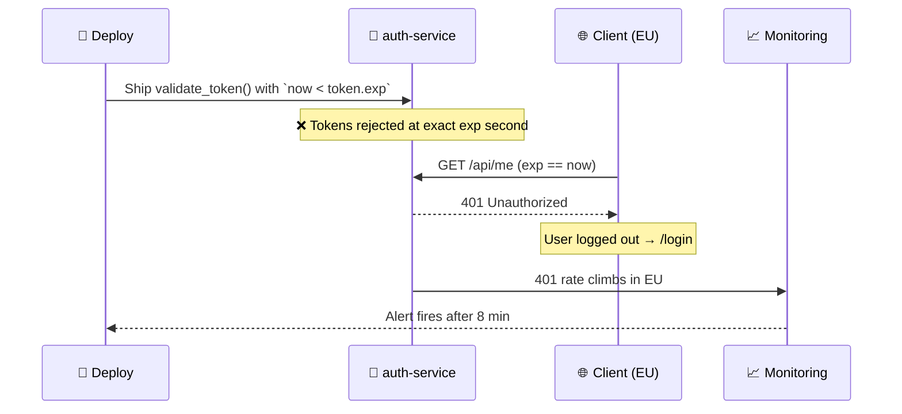

# Postmortem: Auth Token Expiry Off-By-One Logout Storm

> **Doc ID:** POSTMORTEM-2026-04-22-auth-token-expiry-boundary
> **Date:** 2026-04-22
> **DRI:** On-call backend engineer
> **Status:** Closed
> **Severity:** SEV2

Blameless postmortem in the Google SRE tradition. Refers to roles, never names. Goal is learning, not assigning fault.

## Summary

A token-expiry boundary check (`<` instead of `<=`) introduced in the previous night's auth-service deploy caused tokens to be rejected exactly at their `exp` second, logging out ~12% of EU users over 23 minutes. Mitigation was full rollback to the prior auth-service image. Recovery confirmed at 09:23 UTC.

## Impact

- **Users affected:** ~12% of authenticated EU users (~84,000 sessions of ~700,000 EU concurrent)
- **Duration:** Failure 09:00 UTC → mitigation complete 09:23 UTC. Detection delay 8 minutes.
- **Revenue / SLO impact:** ~3.4M token-validation requests returned 401. Auth SLO (99.95% monthly) burned ~14% of remaining error budget. ~$4k revenue impact from incomplete in-session flows.
- **Data integrity:** No data loss. Tokens were rejected, not invalidated server-side. Re-auth restored sessions cleanly.

## Timeline

All times UTC.

| Time | Event |
|------|-------|
| 08:42 | Deploy `v2026.04.21-rc4` started (PR #4821 — refactor of `validate_token()`) |
| 08:56 | Deploy completes across all 6 EU pods. Canary green (canary uses long-lived test tokens). |
| 09:00 | First user tokens minted before deploy reach `exp` second. 401 rate climbs in EU. |
| 09:08 | Datadog monitor `auth.401_rate.eu` fires. On-call paged. |
| 09:09 | On-call ack. Slack `#inc-2026-04-22-auth-401` opened. |
| 09:14 | Second engineer joins. Notes deploy correlation in Datadog change-overlay. |
| 09:17 | Hypothesis confirmed: `validate_token()` change in PR #4821 narrows accepted window. |
| 09:19 | Decision: rollback rather than forward-fix. `kubectl rollout undo` initiated. |
| 09:22 | Rollback complete in EU. 401 rate drops sharply. |
| 09:23 | All-clear. |
| 10:05 | Hotfix PR #4827 opened restoring `<=` and adding boundary unit test. |

## Root Cause

A refactor of `validate_token()` in `apps/api/auth/jwt.py` replaced the inclusive expiry check with an exclusive one. The intended invariant — "valid up to and including `exp`" — was silently inverted by a single character change. All existing tests used token lifetimes well clear of the boundary, so the change passed CI and canary.

### Trigger

Deploy of `auth-service` `v2026.04.21-rc4` containing PR #4821 ("Refactor JWT validation for clarity").

### Underlying cause

- **Boundary semantics not encoded as a test.** RFC 7519 §4.1.4 defines `exp` as "the time on or after which the JWT MUST NOT be accepted". The original `<=` was correct; the refactor "tidied" to `<` without re-deriving the invariant.
- **Canary did not exercise the boundary.** Canary uses 1-hour synthetic tokens that never reach expiry during canary window. Failure mode was structurally invisible to pre-prod.

## What Went Well

- Datadog `auth.401_rate.eu` monitor fired — without it, detection would have come from user reports
- On-call followed runbook: ack <1min, declared incident, opened Slack channel, pulled in second engineer
- `kubectl rollout undo` was a one-command rollback. Previous image was warm in node caches.
- Change-overlay in Datadog made deploy → 401 correlation immediate

## What Went Wrong

- 8-minute detection delay. 401-rate threshold (>2% sustained 3min) too lax for an auth-path metric
- Canary blind spot is structural, not one-off
- PR review missed semantic change. PR framed as "refactor for clarity" with no behavioral-change call-out
- Regional blast radius asymmetry not documented in runbook (EU peak overlap)
- No integration test on token-expiry boundary

## Where We Got Lucky

- **Deploy hit before EU peak (09:00 UTC), not during it.** Peak is 10:00–12:00 UTC. Two hours later → ~3x blast radius.
- **Canary cohort excluded internal admin tokens** (5-minute lifetime). Bug would have surfaced in canary but also logged admins out of deploy console mid-rollout, slowing rollback.
- **Refresh-token endpoint was unaffected** — it short-circuits on signature check before the boundary. If refresh had also been broken, true logout cascade rather than single forced re-login.
- **No password-reset campaigns in flight.** Reset tokens use same validator with 15min lifetime. A live reset email would have invalidated reset links exactly at 15min.
- **Rollback image was in node-local cache.** Fresh registry pull would have added ~90s/pod.
- **Bug was deterministic, not flaky.** A flaky off-by-one would have created intermittent signal we'd have chased as a Redis or LB issue much longer.

## Action Items

| Priority | Action | Owner | Due | Tracking |
|----------|--------|-------|-----|----------|
| P0 | Boundary unit test in `apps/api/auth/tests/test_jwt.py` covering `now == exp`, `now == exp-1ms`, `now == exp+1ms`. Must fail against bad commit. | Backend on-call lead | 2026-04-24 | LIN-2841 |
| P0 | Tighten Datadog `auth.401_rate.*` from "2% sustained 3min" to "1% sustained 60s" with multi-region split. | SRE on-call | 2026-04-25 | LIN-2842 |
| P1 | Short-lived (30s) synthetic token in canary suite that traverses expiry boundary. | Platform team | 2026-05-01 | LIN-2843 |
| P1 | Update `RUNBOOK-auth-401-spike.md` with region-aware deploy timing + "check recent deploys first" step. | On-call lead | 2026-04-30 | LIN-2844 |
| P1 | ADR: auth-path PRs require explicit "behavioral change: yes/no" checkbox. | Backend tech lead | 2026-05-06 | LIN-2845 |
| P2 | Property-based test (Hypothesis) over `validate_token()` covering arbitrary `(now, exp)` pairs vs RFC 7519 §4.1.4 invariant. | Backend team | 2026-05-15 | LIN-2846 |

## Lessons Learned

- **"Refactor for clarity" PRs hide behavior changes.** A one-character change inside a refactor labeled non-behavioral passed review and CI. New rule: behavioral neutrality of refactor PRs in auth/billing/data-integrity paths must be asserted with a test that would fail under pre-refactor and post-refactor producing different outputs at boundary inputs.
- **Canaries that don't exercise the failure mode are theater.** New rule: canary suites for time-bounded systems must include at least one synthetic actor whose lifetime is shorter than the canary window.
- **Auth-path SLOs deserve tighter alert thresholds.** A 401 in auth is a session being destroyed, not "an error rate". New rule: auth alerting in absolute session-loss terms.
- **Boundary semantics belong in a test, not a comment.** Comments don't fail CI.

## Related Documents

- Bug Report: `docs/bugs/BUG-014-auth-token-expiry-boundary.md`
- ADR: `docs/adr/ADR-019-auth-path-pr-review-checklist.md`
- Design Doc: `docs/design/auth-service.md`
- Runbook: `docs/runbooks/RUNBOOK-auth-401-spike.md`

## Changelog

| Date | Change |
|------|--------|
| 2026-04-22 | Initial draft — Status: Draft |
| 2026-04-23 | Reviewed by team. All P0 items in flight. Status → Reviewed |
| 2026-04-26 | P0 items shipped (test + monitor). Status → Action Items Tracked |
| 2026-05-15 | P1 items shipped. P2 in flight, tracked outside this doc. Status → Closed. |
